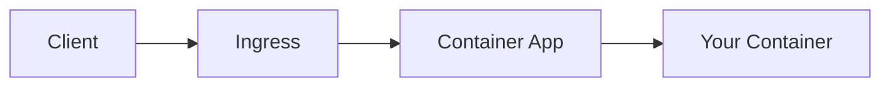

# AGENTS.md

Guidance for AI agents working in this repository.

## Project Overview

**Azure Container Apps Practical Guide** — a unified documentation hub, reference applications, and hands-on troubleshooting labs for deploying and operating containerized applications on Azure Container Apps.

- **Live site**: <https://yeongseon.github.io/azure-container-apps-practical-guide/>
- **Repository**: <https://github.com/yeongseon/azure-container-apps-practical-guide>

## Repository Structure

```text
.
├── .github/
│   └── workflows/              # GitHub Pages deployment
├── apps/
│   ├── dotnet-aspnetcore/      # .NET reference application
│   ├── java-springboot/        # Java reference application
│   ├── nodejs/                 # Node.js reference application
│   └── python/                 # Python reference application
├── docs/
│   ├── assets/                 # Images, icons
│   ├── best-practices/         # Production patterns and anti-patterns
│   ├── javascripts/            # Mermaid zoom JS
│   ├── language-guides/
│   │   ├── python/             # Python (Flask) — 7 tutorials + recipes
│   │   ├── nodejs/             # Node.js (Express) — 7 tutorials + recipes
│   │   ├── java/               # Java (Spring Boot) — 7 tutorials + recipes
│   │   └── dotnet/             # .NET (ASP.NET Core) — 7 tutorials + recipes
│   ├── operations/             # Day-2 operational execution
│   ├── platform/               # Architecture and design decisions
│   ├── reference/              # CLI reference, environment variables, limits
│   ├── start-here/             # Overview, learning paths, repository map
│   ├── stylesheets/            # Custom CSS (mermaid zoom, etc.)
│   └── troubleshooting/        # Full troubleshooting hub
│       ├── architecture-overview.md
│       ├── decision-tree.md
│       ├── evidence-map.md
│       ├── first-10-minutes/   # Checklists by symptom category
│       ├── kql/                # KQL query packs
│       ├── lab-guides/         # Hands-on labs with Expected Evidence
│       ├── methodology/        # Troubleshooting method, detector map
│       └── playbooks/          # Playbooks with real Azure evidence
├── jobs/
│   └── python/                 # Python reference job
├── infra/                      # Shared Bicep modules
├── labs/                       # Lab infrastructure + app source
│   ├── acr-pull-failure/
│   ├── dapr-integration/
│   ├── ingress-target-port-mismatch/
│   ├── managed-identity-key-vault-failure/
│   ├── observability-tracing/
│   ├── probe-and-port-mismatch/
│   ├── revision-failover/
│   ├── revision-provisioning-failure/
│   ├── scale-rule-mismatch/
│   └── traffic-routing-canary/
└── mkdocs.yml                  # MkDocs Material configuration (7-tab nav)
```

## Content Categories

The documentation is organized by intent and lifecycle stage:

- **start-here**: Entry points, high-level overview, learning paths, and guide mapping.
- **platform**: Design decisions and architecture — **WHAT is it and how does it work** (environments, revisions, scaling, networking, jobs, identity, reliability).
- **best-practices**: Practical patterns for production — **HOW should I use the platform** (container design, revision strategy, scaling, networking, identity, reliability, cost, jobs, anti-patterns).
- **language-guides**: Per-language step-by-step tutorials and integration recipes.
- **operations**: Day-2 execution — **HOW to run in production** (deployment, monitoring, alerts, recovery).
- **troubleshooting**: Diagnosis and resolution (first-10-minutes, playbooks, methodology, KQL, labs).
- **reference**: Quick lookup — CLI commands, environment variables, platform limits.

!!! info "Platform vs Best Practices vs Operations"
    - **Platform** = Understand the concepts and architecture.
    - **Best Practices** = Apply practical patterns and avoid common mistakes.
    - **Operations** = Execute day-2 tasks in production.

## Documentation Conventions

### File Naming
- Tutorial: `XX-topic-name.md` (numbered for sequence)
- All others: `topic-name.md` (kebab-case)

### Admonition Indentation Rule

For MkDocs admonitions (`!!!` / `???`), every line in the body must be indented by **4 spaces**.

```markdown
!!! warning "Important"
    This line is correctly indented.

    - List item also inside
```

### Nested List Indentation

All nested list items MUST use **4-space indent** (Python-Markdown standard).

```markdown
# CORRECT (4-space)
1. **Item**
    - Sub item
    - Another sub item
        - Third level

# WRONG (2 or 3 spaces)
1. **Item**
  - Sub item          ← 2 spaces ❌
   - Sub item         ← 3 spaces ❌
```

### Tail Section Naming

Every document ends with these tail sections (in this order):

| Section | Purpose | Content |
|---|---|---|
| `## See Also` | Internal cross-links within this repository | Links to other pages in this guide |
| `## Sources` | External authoritative references | Links to Microsoft Learn (primary) |

- `## See Also` is required on every page.
- `## Sources` is required when external references are cited. Omit if none exist.
- Order is always `## See Also` → `## Sources` (never reversed).
- All content must be based on Microsoft Learn with cited sources.

### Canonical Document Templates

Every document follows one of 7 templates based on its section. Do not invent new structures.

#### Platform docs

```text
# Title
Brief introduction (1-2 sentences)
## Prerequisites (optional — only if hands-on/CLI content)
## Main Content
### Subsections (H3 under Main Content)
#### Sub-subsections (H4 as needed)
## Advanced Topics (optional)
## Language-Specific Details (optional)
## See Also
## Sources (optional)
```

#### Best Practices docs

```text
# Title
Brief introduction
## Prerequisites (optional)
## Why This Matters
## Recommended Practices
## Common Mistakes / Anti-Patterns
## Validation Checklist
## Advanced Topics (optional)
## See Also
## Sources (optional)
```

#### Operations docs

```text
# Title
Brief introduction
## Prerequisites
## When to Use
## Procedure
## Verification
## Rollback / Troubleshooting
## Advanced Topics (optional)
## See Also
## Sources (optional)
```

#### Tutorial docs (Language Guides)

```text
# Title
Brief introduction
## Prerequisites
## What You'll Build
## Steps
## Verification
## Next Steps / Clean Up (optional)
## See Also
## Sources (optional)
```

#### Playbooks

```text
# Title (no intro paragraph — Summary covers it)
## 1. Summary
## 2. Common Misreadings
## 3. Competing Hypotheses
## 4. What to Check First
## 5. Evidence to Collect
## 6. Validation and Disproof by Hypothesis
## 7. Likely Root Cause Patterns
## 8. Immediate Mitigations
## 9. Prevention (optional)
## See Also
## Sources (optional)
```

#### Lab Guides

```text
# Title
Brief introduction
## Lab Metadata (table: difficulty, duration, tier, etc.)
## 1) Background
## 2) Hypothesis
## 3) Runbook
## 4) Experiment Log
## Expected Evidence
## Clean Up
## Related Playbook
## See Also
## Sources
```

#### Reference docs

```text
# Title
Brief introduction
## Prerequisites (optional)
## Topic/Command Groups
## Usage Notes (optional)
## See Also
## Sources (optional)
```

### CLI Command Style

```bash
# ALWAYS use long flags for readability
az containerapp create --resource-group $RG --name $APP_NAME --environment $ENVIRONMENT_NAME

# NEVER use short flags in documentation
az containerapp create -g $RG -n $APP_NAME  # ❌ Don't do this
```

### Variable Naming Convention

| Variable | Description | Example |
|----------|-------------|---------|
| `$RG` | Resource Group | `rg-myapp` |
| `$APP_NAME` | Container App Name | `ca-myapp-abc123` |
| `$ENVIRONMENT_NAME` | Container Apps Environment | `cae-myapp` |
| `$ACR_NAME` | Container Registry | `acrmyapp` |
| `$LOCATION` | Azure Region | `koreacentral` |

### PII Removal (Quality Gate)

**CRITICAL**: All CLI output examples MUST have PII removed.

**Must mask (real Azure identifiers):**

- Subscription IDs: `<subscription-id>`
- Tenant IDs: `<tenant-id>`
- Object IDs: `<object-id>`
- Resource IDs containing real subscription/tenant
- Emails: Remove or mask as `user@example.com`
- Secrets/Tokens: NEVER include

**OK to keep (synthetic example values):**

- Demo correlation IDs: `a1b2c3d4-e5f6-7890-abcd-ef1234567890`
- Example request IDs in logs
- Placeholder domains: `example.com`, `contoso.com`
- Sample app names used consistently in docs

The goal is to prevent leaking **real Azure account information**, not to mask obviously-fake example values that aid readability.

### Mermaid Diagrams

All architectural diagrams use Mermaid. Test with `mkdocs build --strict`.

```markdown

```

## Container Apps Specifics

### Key Concepts

1. **Environment** — Shared boundary for Container Apps (networking, logging)
2. **Container App** — The application itself
3. **Revision** — Immutable snapshot of an app version
4. **Replica** — Instance of a revision (scaled by KEDA)

### Required Application Patterns

1. **PORT binding**: Use `CONTAINER_APP_PORT` or default to 8000
2. **Health probes**: Configure liveness and readiness probes
3. **Graceful shutdown**: Handle SIGTERM for container termination
4. **Structured logging**: JSON format for Log Analytics

### Container Requirements

```dockerfile
# Use Gunicorn for production
FROM python:3.11-slim
WORKDIR /app
COPY requirements.txt .
RUN pip install --no-cache-dir -r requirements.txt
COPY . .
EXPOSE 8000
CMD ["gunicorn", "--bind", "0.0.0.0:8000", "--workers", "4", "--chdir", "src", "app:app"]
```

### Common Issues

1. **Container not starting**: Check health probe configuration
2. **Scale issues**: Verify KEDA scale rules
3. **Networking**: Ingress must be enabled for external access
4. **Secrets**: Use managed identity, not connection strings

## Reference Assets

- **apps/**: Reference applications per language (e.g., `apps/python` for Flask).
- **jobs/**: Reference jobs per language (e.g., `jobs/python`).
- **labs/**: Hands-on troubleshooting labs for simulating and resolving common platform issues.

## Documentation Format Quality Gate

Before committing any documentation changes, verify these format rules:

### 1. Admonition Body Indentation (CRITICAL)

All content inside `!!!` or `???` admonition blocks **must be indented with 4 spaces**. Content without indentation renders as plain text outside the admonition box.

```markdown
# ✅ CORRECT — body indented 4 spaces
!!! warning "Title"
    This content is inside the admonition box.

    - List item also inside
    - Another item inside

# ❌ WRONG — body not indented
!!! warning "Title"
This content renders OUTSIDE the box.
- This list is also outside
```

### 2. Code Fence Balance

Every opening ` ``` ` must have a matching closing ` ``` `. An odd number of fences breaks all subsequent rendering.

```bash
# Quick check — output should be 0 or even numbers only
grep -c '^\s*```' docs/**/*.md
```

### 3. Automated Scan Script

Run this before committing to catch admonition indentation issues:

```python
import os, sys

def scan_docs(repo_path):
    docs_dir = os.path.join(repo_path, 'docs')
    issues = {}
    for root, _, files in os.walk(docs_dir):
        for fname in sorted(files):
            if not fname.endswith('.md'):
                continue
            fpath = os.path.join(root, fname)
            file_issues = []
            in_admonition = False
            in_code = False
            with open(fpath, encoding='utf-8', errors='ignore') as f:
                for i, line in enumerate(f, 1):
                    s = line.rstrip('\n')
                    if s.startswith('```'):
                        in_code = not in_code
                    if in_code:
                        continue
                    if s.startswith('!!!') or s.startswith('???'):
                        in_admonition = True
                        continue
                    if in_admonition:
                        if s == '':
                            pass
                        elif s.startswith('    '):
                            in_admonition = False
                        else:
                            if s.startswith(('-', '*')) or (s and s[0].isalnum()):
                                file_issues.append(f"  L{i}: {s[:80]}")
                            in_admonition = False
            if file_issues:
                issues[os.path.relpath(fpath, repo_path)] = file_issues
    return issues

results = scan_docs('.')
if results:
    for f, errs in results.items():
        print(f"❌ {f}")
        for e in errs:
            print(e)
    sys.exit(1)
else:
    print("✅ All admonition indentation OK")
```

### 4. Final Validation

```bash
# Must pass with zero warnings/errors
mkdocs build --strict
```

## Build & Validate

```bash
# Install MkDocs dependencies
pip install mkdocs-material mkdocs-minify-plugin

# Build documentation (strict mode catches broken links)
mkdocs build --strict

# Local preview
mkdocs serve
```

## Documentation Verification Policy (MANDATORY)

All documentation in this repository follows a **step-by-step learning** approach. Every command, code snippet, and CLI output MUST be verified against real Azure resources before publishing.

### Verification Process

1. **CLI Commands**: Execute every `az` command in the documentation against a live Azure subscription. Confirm the command succeeds and the output matches the documented format.
2. **Code Snippets**: Run all Python/Bicep/YAML code to confirm correctness. Application code must build and pass health checks.
3. **CLI Output Examples**: All example output blocks in documentation MUST come from real execution results with PII removed (see PII Removal rules below).
4. **Cross-Document Consistency**: When a parameter, variable name, port number, or resource name is used across multiple documents, verify they are consistent. If intentionally different (e.g., demo vs production context), add an explicit note explaining the difference.
5. **Infrastructure Templates**: Bicep parameter names, default values, and outputs MUST match the commands in tutorial and operations documents exactly. Run `az deployment group validate` to confirm.

### What Counts as Verified

| Artifact | Verification Method |
|----------|-------------------|
| `az` CLI command | Executed successfully against live Azure subscription |
| Bicep template | `az deployment group validate` + `az deployment group what-if` pass |
| Python code | `python -c "import ..."` or app health check returns HTTP 200 |
| KQL query | Executed in Log Analytics workspace and returns expected schema |
| Docker commands | `docker build` + `docker run` + health endpoint check |
| Example output | Captured from real execution, PII stripped, pasted into docs |

### When to Re-Verify

- Any change to `infra/main.bicep` parameters or outputs → re-verify all tutorials referencing Bicep
- Any change to `app/Dockerfile` or `app/requirements.txt` → re-verify tutorial/01 and reference/python-runtime
- Any change to route definitions in `app/src/routes/` → re-verify endpoint references in all docs
- Azure CLI breaking changes or API version updates → re-verify affected commands

## Git Commit Conventions

```
type: short description

- feat: New feature
- fix: Bug fix
- docs: Documentation changes
- chore: Maintenance tasks
- refactor: Code restructuring
```

## Related Resources

- [Azure Container Apps Documentation](https://learn.microsoft.com/azure/container-apps/)
- [Dapr Documentation](https://docs.dapr.io/)
- [KEDA Documentation](https://keda.sh/)
- [Bicep Documentation](https://learn.microsoft.com/azure/azure-resource-manager/bicep/)

## Tutorial Validation Tracking

Every tutorial document supports **validation frontmatter** that records when and how it was last tested against a real Azure deployment.

### Frontmatter Schema

Add a `validation` block inside the YAML frontmatter (`---` fences) of any tutorial file:

```yaml
---
hide:
  - toc
validation:
  az_cli:
    last_tested: 2026-04-09
    cli_version: "2.83.0"
    result: pass
  bicep:
    last_tested: null
    result: not_tested
---
```

### Agent Rules for Validation

1. **After deploying a tutorial end-to-end**, add or update the `validation` frontmatter with the current date, CLI version, and `result: pass`.
2. **If a tutorial step fails during validation**, set `result: fail` and note the issue.
3. **Never fabricate validation dates.** Only stamp a tutorial after actually executing all steps.
4. **After updating frontmatter**, regenerate the dashboard:
    ```bash
    python3 scripts/generate_validation_status.py
    ```
5. **Include the regenerated dashboard** (`docs/reference/validation-status.md`) in the same commit as the frontmatter change.
6. **Do not manually edit** `docs/reference/validation-status.md` — it is auto-generated.
