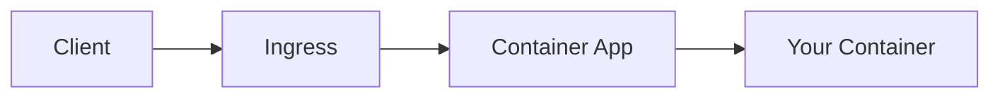

# AGENTS.md

> Knowledge base for AI agents working on this repository.

## Project Overview

**Azure Container Apps Python Guide** — A comprehensive documentation and reference application for running Python/Flask applications on Azure Container Apps.

### Repository Structure

```
├── app/                    # Flask reference application
│   ├── src/                # Application source code
│   │   ├── app.py          # Flask app entry point
│   │   ├── routes/         # API endpoints
│   │   └── middleware/     # Logging, correlation
│   ├── Dockerfile          # Multi-stage build
│   └── requirements.txt
│
├── docs/                   # MkDocs documentation
│   ├── tutorial/           # Step-by-step guides
│   ├── concepts/           # Architectural guides
│   ├── operations/         # Production operation guides
│   ├── recipes/            # Integration guides
│   └── reference/          # Quick-reference docs
│
├── infra/                  # Bicep infrastructure
│   ├── main.bicep          # Main template
│   ├── modules/            # Modular Bicep files
│   ├── deploy.sh           # Basic deployment
│   └── deploy-private.sh   # VNet deployment
│
└── mkdocs.yml              # Documentation configuration
```

## Documentation Conventions

### File Naming
- Tutorial: `XX-topic-name.md` (numbered for sequence)
- All others: `topic-name.md` (kebab-case)

### Document Structure (ALL documents follow this pattern)

```markdown
# Title

Brief introduction (1-2 sentences)

## Prerequisites (if applicable)

## Main Content

### Subsections with code examples

## Advanced Topics

Further reading for deeper understanding.

## See Also

- [Related Doc 1](../category/related-doc.md)
- [Related Doc 2](../category/another-doc.md)
```

### CLI Command Style

```bash
# ALWAYS use long flags for readability
az containerapp create --resource-group $RG --name $APP_NAME --environment $ENVIRONMENT_NAME

# NEVER use short flags in documentation
az containerapp create -g $RG -n $APP_NAME  # ❌ Don't do this
```

### Variable Naming Convention

| Variable | Description | Example |
|----------|-------------|---------|
| `$RG` | Resource Group | `rg-myapp` |
| `$APP_NAME` | Container App Name | `ca-myapp-abc123` |
| `$ENVIRONMENT_NAME` | Container Apps Environment | `cae-myapp` |
| `$ACR_NAME` | Container Registry | `acrmyapp` |
| `$LOCATION` | Azure Region | `koreacentral` |

### PII Removal (Quality Gate)

**CRITICAL**: All CLI output examples MUST have PII removed.

Patterns to mask:
- UUIDs: `xxxxxxxx-xxxx-xxxx-xxxx-xxxxxxxxxxxx`
- Subscription IDs: `<subscription-id>`
- Tenant IDs: `<tenant-id>`
- Object IDs: `<object-id>`
- Emails: Remove or mask
- Secrets/Tokens: NEVER include

### Mermaid Diagrams

All architectural diagrams use Mermaid. Test with `mkdocs build --strict`.

```markdown

```

## Container Apps Specifics

### Key Concepts

1. **Environment** — Shared boundary for Container Apps (networking, logging)
2. **Container App** — The application itself
3. **Revision** — Immutable snapshot of an app version
4. **Replica** — Instance of a revision (scaled by KEDA)

### Required Application Patterns

1. **PORT binding**: Use `CONTAINER_APP_PORT` or default to 80/8080
2. **Health probes**: Configure liveness and readiness probes
3. **Graceful shutdown**: Handle SIGTERM for container termination
4. **Structured logging**: JSON format for Log Analytics

### Container Requirements

```dockerfile
# Use Gunicorn for production
FROM python:3.11-slim
WORKDIR /app
COPY requirements.txt .
RUN pip install --no-cache-dir -r requirements.txt
COPY . .
EXPOSE 8000
CMD ["gunicorn", "--bind", "0.0.0.0:8000", "src.app:app"]
```

### Common Issues

1. **Container not starting**: Check health probe configuration
2. **Scale issues**: Verify KEDA scale rules
3. **Networking**: Ingress must be enabled for external access
4. **Secrets**: Use managed identity, not connection strings

## Build & Validate

```bash
# Install MkDocs dependencies
pip install mkdocs-material mkdocs-minify-plugin

# Build documentation (strict mode catches broken links)
mkdocs build --strict

# Local preview
mkdocs serve
```

## Git Commit Conventions

```
type: short description

- feat: New feature
- fix: Bug fix
- docs: Documentation changes
- chore: Maintenance tasks
- refactor: Code restructuring
```

## Related Resources

- [Azure Container Apps Documentation](https://learn.microsoft.com/azure/container-apps/)
- [Dapr Documentation](https://docs.dapr.io/)
- [KEDA Documentation](https://keda.sh/)
- [Bicep Documentation](https://learn.microsoft.com/azure/azure-resource-manager/bicep/)
