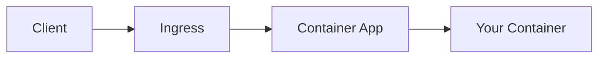

# AGENTS.md

> Knowledge base for AI agents working on this repository.

## Project Overview

**Azure Container Apps Guide** — A practical hub for learning, designing, operating, and troubleshooting Azure Container Apps and Jobs across languages.

### Repository Structure

```
├── docs/                   # Unified documentation hub
│   ├── start-here/         # Overview, learning-paths, when-to-use, repository-map
│   ├── platform/           # Architecture, environments, revisions, scaling, networking, jobs, identity, reliability
│   ├── language-guides/    # Index + python/ (01-07 tutorials, python-runtime, recipes/)
│   ├── operations/         # Deployment, monitoring, alerts, image-pull-and-registry, secret-rotation, recovery
│   └── troubleshooting/    # First-10-minutes, playbooks, methodology, kql, lab-guides
│
├── apps/                   # Reference applications
│   └── python/             # Flask reference app
│
├── jobs/                   # Reference jobs
│   └── python/             # Python reference job
│
├── labs/                   # Hands-on troubleshooting labs
│   ├── acr-pull-failure/
│   ├── revision-failover/
│   └── scale-rule-mismatch/
│
├── infra/                  # Bicep infrastructure
│   ├── main.bicep          # Main template
│   ├── modules/            # Modular Bicep files
│   ├── deploy.sh           # Basic deployment
│   └── deploy-private.sh   # VNet deployment
│
└── mkdocs.yml              # Documentation configuration
```

## Content Categories

The documentation is organized by intent and lifecycle stage:

- **start-here**: Entry points, high-level overview, learning paths, and guide mapping.
- **platform**: Design decisions and architecture — **HOW to architect** (environments, revisions, scaling, networking, jobs, identity, reliability).
- **language-guides**: Per-language step-by-step tutorials and integration recipes.
- **operations**: Day-2 execution — **HOW to run in production** (deployment, monitoring, alerts, recovery).
- **troubleshooting**: Diagnosis and resolution (first-10-minutes, playbooks, methodology, KQL, labs).

!!! info "Platform vs Operations"
    - **Platform** = Design judgment and architectural patterns.
    - **Operations** = Operational execution and maintenance.

## Documentation Conventions

### File Naming
- Tutorial: `XX-topic-name.md` (numbered for sequence)
- All others: `topic-name.md` (kebab-case)

### Document Structure (ALL documents follow this pattern)

```markdown
# Title

Brief introduction (1-2 sentences)

## Prerequisites (if applicable)

## Main Content

### Subsections with code examples

## Advanced Topics

Further reading for deeper understanding.

## See Also

- [Related Doc 1](../category/related-doc.md)
- [Related Doc 2](../category/another-doc.md)
```

### CLI Command Style

```bash
# ALWAYS use long flags for readability
az containerapp create --resource-group $RG --name $APP_NAME --environment $ENVIRONMENT_NAME

# NEVER use short flags in documentation
az containerapp create -g $RG -n $APP_NAME  # ❌ Don't do this
```

### Variable Naming Convention

| Variable | Description | Example |
|----------|-------------|---------|
| `$RG` | Resource Group | `rg-myapp` |
| `$APP_NAME` | Container App Name | `ca-myapp-abc123` |
| `$ENVIRONMENT_NAME` | Container Apps Environment | `cae-myapp` |
| `$ACR_NAME` | Container Registry | `acrmyapp` |
| `$LOCATION` | Azure Region | `koreacentral` |

### PII Removal (Quality Gate)

**CRITICAL**: All CLI output examples MUST have PII removed.

Patterns to mask:
- UUIDs: `xxxxxxxx-xxxx-xxxx-xxxx-xxxxxxxxxxxx`
- Subscription IDs: `<subscription-id>`
- Tenant IDs: `<tenant-id>`
- Object IDs: `<object-id>`
- Emails: Remove or mask
- Secrets/Tokens: NEVER include

### Mermaid Diagrams

All architectural diagrams use Mermaid. Test with `mkdocs build --strict`.

```markdown

```

## Container Apps Specifics

### Key Concepts

1. **Environment** — Shared boundary for Container Apps (networking, logging)
2. **Container App** — The application itself
3. **Revision** — Immutable snapshot of an app version
4. **Replica** — Instance of a revision (scaled by KEDA)

### Required Application Patterns

1. **PORT binding**: Use `CONTAINER_APP_PORT` or default to 8000
2. **Health probes**: Configure liveness and readiness probes
3. **Graceful shutdown**: Handle SIGTERM for container termination
4. **Structured logging**: JSON format for Log Analytics

### Container Requirements

```dockerfile
# Use Gunicorn for production
FROM python:3.11-slim
WORKDIR /app
COPY requirements.txt .
RUN pip install --no-cache-dir -r requirements.txt
COPY . .
EXPOSE 8000
CMD ["gunicorn", "--bind", "0.0.0.0:8000", "--workers", "4", "--chdir", "src", "app:app"]
```

### Common Issues

1. **Container not starting**: Check health probe configuration
2. **Scale issues**: Verify KEDA scale rules
3. **Networking**: Ingress must be enabled for external access
4. **Secrets**: Use managed identity, not connection strings

## Reference Assets

- **apps/**: Reference applications per language (e.g., `apps/python` for Flask).
- **jobs/**: Reference jobs per language (e.g., `jobs/python`).
- **labs/**: Hands-on troubleshooting labs for simulating and resolving common platform issues.

## Documentation Format Quality Gate

Before committing any documentation changes, verify these format rules:

### 1. Admonition Body Indentation (CRITICAL)

All content inside `!!!` or `???` admonition blocks **must be indented with 4 spaces**. Content without indentation renders as plain text outside the admonition box.

```markdown
# ✅ CORRECT — body indented 4 spaces
!!! warning "Title"
    This content is inside the admonition box.

    - List item also inside
    - Another item inside

# ❌ WRONG — body not indented
!!! warning "Title"
This content renders OUTSIDE the box.
- This list is also outside
```

### 2. Code Fence Balance

Every opening ` ``` ` must have a matching closing ` ``` `. An odd number of fences breaks all subsequent rendering.

```bash
# Quick check — output should be 0 or even numbers only
grep -c '^\s*```' docs/**/*.md
```

### 3. Automated Scan Script

Run this before committing to catch admonition indentation issues:

```python
import os, sys

def scan_docs(repo_path):
    docs_dir = os.path.join(repo_path, 'docs')
    issues = {}
    for root, _, files in os.walk(docs_dir):
        for fname in sorted(files):
            if not fname.endswith('.md'):
                continue
            fpath = os.path.join(root, fname)
            file_issues = []
            in_admonition = False
            in_code = False
            with open(fpath, encoding='utf-8', errors='ignore') as f:
                for i, line in enumerate(f, 1):
                    s = line.rstrip('\n')
                    if s.startswith('```'):
                        in_code = not in_code
                    if in_code:
                        continue
                    if s.startswith('!!!') or s.startswith('???'):
                        in_admonition = True
                        continue
                    if in_admonition:
                        if s == '':
                            pass
                        elif s.startswith('    '):
                            in_admonition = False
                        else:
                            if s.startswith(('-', '*')) or (s and s[0].isalnum()):
                                file_issues.append(f"  L{i}: {s[:80]}")
                            in_admonition = False
            if file_issues:
                issues[os.path.relpath(fpath, repo_path)] = file_issues
    return issues

results = scan_docs('.')
if results:
    for f, errs in results.items():
        print(f"❌ {f}")
        for e in errs:
            print(e)
    sys.exit(1)
else:
    print("✅ All admonition indentation OK")
```

### 4. Final Validation

```bash
# Must pass with zero warnings/errors
mkdocs build --strict
```

## Build & Validate

```bash
# Install MkDocs dependencies
pip install mkdocs-material mkdocs-minify-plugin

# Build documentation (strict mode catches broken links)
mkdocs build --strict

# Local preview
mkdocs serve
```

## Documentation Verification Policy (MANDATORY)

All documentation in this repository follows a **step-by-step learning** approach. Every command, code snippet, and CLI output MUST be verified against real Azure resources before publishing.

### Verification Process

1. **CLI Commands**: Execute every `az` command in the documentation against a live Azure subscription. Confirm the command succeeds and the output matches the documented format.
2. **Code Snippets**: Run all Python/Bicep/YAML code to confirm correctness. Application code must build and pass health checks.
3. **CLI Output Examples**: All example output blocks in documentation MUST come from real execution results with PII removed (see PII Removal rules below).
4. **Cross-Document Consistency**: When a parameter, variable name, port number, or resource name is used across multiple documents, verify they are consistent. If intentionally different (e.g., demo vs production context), add an explicit note explaining the difference.
5. **Infrastructure Templates**: Bicep parameter names, default values, and outputs MUST match the commands in tutorial and operations documents exactly. Run `az deployment group validate` to confirm.

### What Counts as Verified

| Artifact | Verification Method |
|----------|-------------------|
| `az` CLI command | Executed successfully against live Azure subscription |
| Bicep template | `az deployment group validate` + `az deployment group what-if` pass |
| Python code | `python -c "import ..."` or app health check returns HTTP 200 |
| KQL query | Executed in Log Analytics workspace and returns expected schema |
| Docker commands | `docker build` + `docker run` + health endpoint check |
| Example output | Captured from real execution, PII stripped, pasted into docs |

### When to Re-Verify

- Any change to `infra/main.bicep` parameters or outputs → re-verify all tutorials referencing Bicep
- Any change to `app/Dockerfile` or `app/requirements.txt` → re-verify tutorial/01 and reference/python-runtime
- Any change to route definitions in `app/src/routes/` → re-verify endpoint references in all docs
- Azure CLI breaking changes or API version updates → re-verify affected commands

## Git Commit Conventions

```
type: short description

- feat: New feature
- fix: Bug fix
- docs: Documentation changes
- chore: Maintenance tasks
- refactor: Code restructuring
```

## Related Resources

- [Azure Container Apps Documentation](https://learn.microsoft.com/azure/container-apps/)
- [Dapr Documentation](https://docs.dapr.io/)
- [KEDA Documentation](https://keda.sh/)
- [Bicep Documentation](https://learn.microsoft.com/azure/azure-resource-manager/bicep/)
