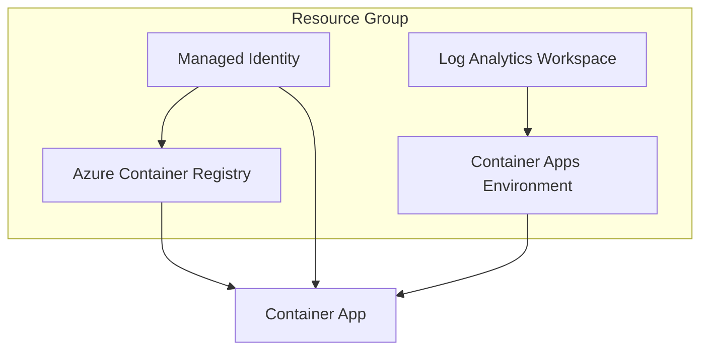

# Provision Infrastructure with Bicep

Azure Container Apps (ACA) requires an environment and supporting resources like Log Analytics and Container Registry. This guide covers provisioning these resources using Bicep.

## Overview



## Core Infrastructure Components

| Component | Purpose |
|-----------|---------|
| Container Apps Environment | Shared network boundary for apps |
| Log Analytics Workspace | Centralized logging |
| Azure Container Registry | Private image storage |
| Managed Identity | Secure authentication |

!!! info "Environment Sharing"
    Multiple Container Apps can share the same environment. This enables service-to-service communication and shared logging.

- **Container Apps Environment:** The logical boundary and shared network for your container apps.
- **Log Analytics Workspace:** Used by the environment for aggregating system and application logs.
- **Azure Container Registry (ACR):** A private registry to store your Docker images.
- **Managed Identity:** To allow the container app to pull images from ACR and access other Azure services.

## Provisioning with Azure CLI

1. **Create a resource group:**

   ```bash
   az group create --name my-aca-rg --location eastus
   ```

2. **Deploy infrastructure via Bicep:**

   Assuming you have a Bicep file at `infra/main.bicep`:

   ```bash
   az deployment group create \
     --resource-group my-aca-rg \
     --template-file infra/main.bicep \
     --parameters \
       appName=aca-python-reference \
        acrName=myuniqueacrname
   ```

!!! warning "Unique ACR Name"
    The `acrName` must be globally unique across all of Azure. Use a combination like `yourinitials` + `aca` + random number.

## Infrastructure Configuration

The Bicep template sets up the environment to use Log Analytics by default. This is critical for viewing logs in the Azure portal or querying via Kusto (KQL).

### Environment Settings

Your Bicep should define the `Microsoft.App/managedEnvironments` resource:

```bicep
resource environment 'Microsoft.App/managedEnvironments@2022-03-01' = {
  name: 'aca-env'
  location: location
  properties: {
    appLogsConfiguration: {
      destination: 'log-analytics'
      logAnalyticsConfiguration: {
        customerId: logAnalytics.properties.customerId
        sharedKey: logAnalytics.listKeys().primarySharedKey
      }
    }
  }
}
```

By default, this reference app uses a public IP for the environment. For production workloads, consider deploying within a Virtual Network (VNet) for enhanced security.

!!! tip "Production Recommendation"
    For production deployments, use the VNet-integrated environment. See [VNet Integration](recipes/networking-vnet.md) for details.
