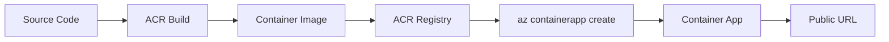
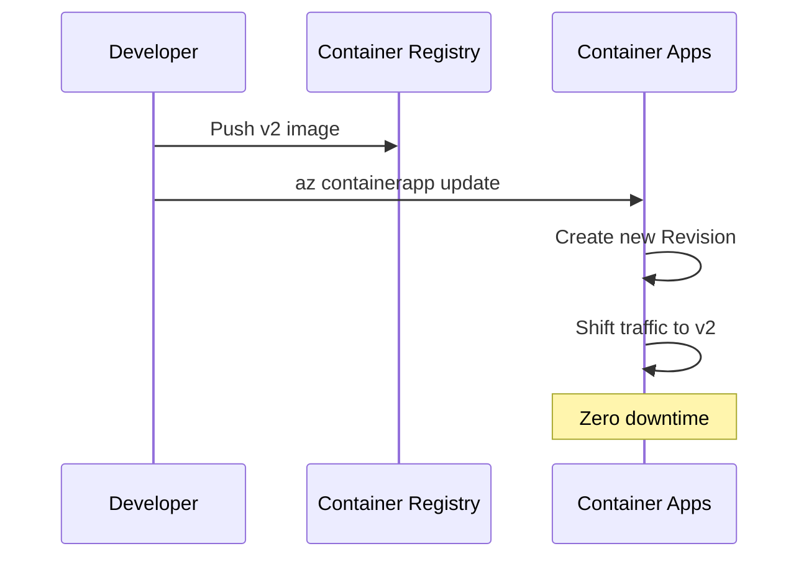
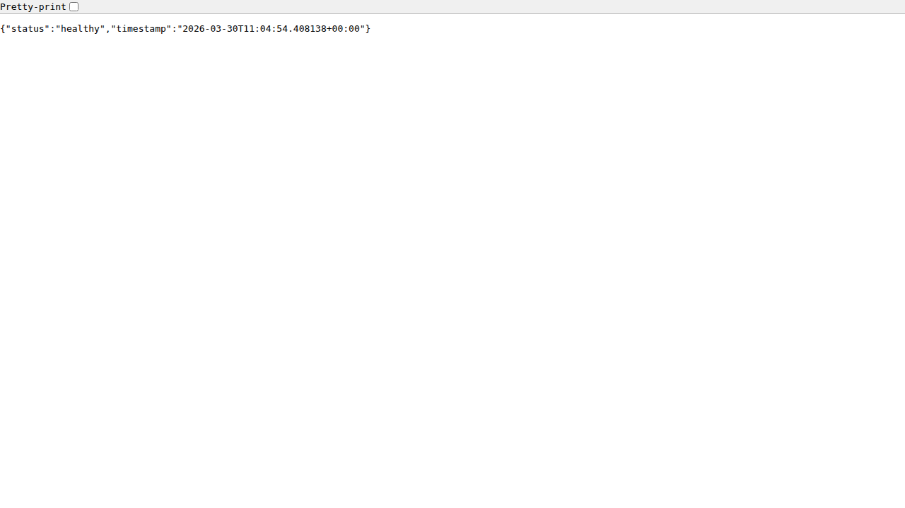
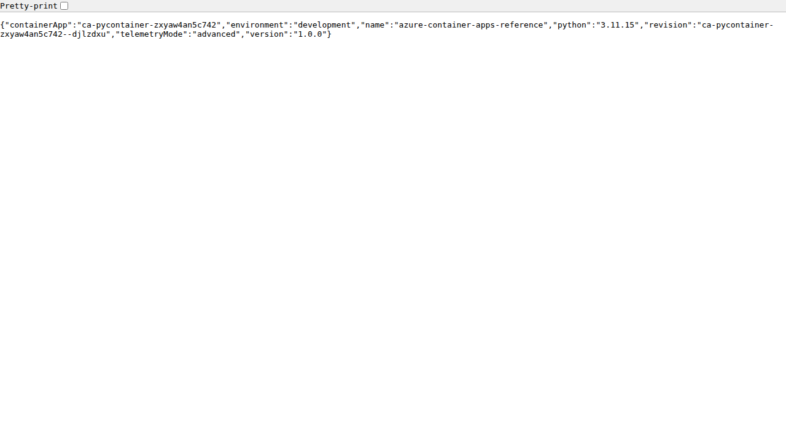

# Build and Deploy to Container Apps

Deploying to Azure Container Apps involves building your Python application into a container image, pushing it to a registry, and then creating or updating your Container App.

## Overview



## 1. Build and Push Image

Azure Container Registry (ACR) is the recommended place to store your images.

```bash
# Log in to ACR
az acr login --name myacrname

# Build and push using ACR Tasks (no local Docker needed)
az acr build --registry myacrname --image aca-python-app:v1 .
```

!!! tip "ACR Tasks"
    Using `az acr build` builds the image in the cloud — no local Docker installation required. This is faster and doesn't consume local resources.

## 2. Create the Container App

If you haven't created the app yet, use the `az containerapp create` command:

```bash
az containerapp create \
  --name my-python-app \
  --resource-group my-aca-rg \
  --environment my-aca-env \
  --image myacrname.azurecr.io/aca-python-app:v1 \
  --target-port 8000 \
  --ingress external \
  --registry-server myacrname.azurecr.io \
  --query properties.configuration.ingress.fqdn
```

!!! info "Ingress Types"
    - `external`: Publicly accessible from the internet
    - `internal`: Only accessible within the VNet/environment

## 3. Update an Existing App

To deploy a new version of your application, update the container image:

```bash
az containerapp update \
  --name my-python-app \
  --resource-group my-aca-rg \
  --image myacrname.azurecr.io/aca-python-app:v2
```

Azure Container Apps creates a new **Revision** automatically when you update the image. This allows for safe rollouts and zero-downtime deployments.



## Verified Deployment

After the command completes, you can verify the deployment status:

```bash
az containerapp show \
  --name my-python-app \
  --resource-group my-aca-rg \
  --query properties.provisioningState
```

Your Python application is now running on Azure Container Apps, accessible via the URL returned in step 2.

!!! warning "Provisioning State"
    If `provisioningState` returns `Failed`, check the Revision logs for errors. Common issues include image pull failures and port mismatches.

## Test Endpoints

Once deployed, verify your application is working:

### Health Check


```bash
curl https://your-app.azurecontainerapps.io/health
# {"status": "healthy", "timestamp": "..."}
```

### Application Info


```bash
curl https://your-app.azurecontainerapps.io/info
# {"name": "azure-container-apps-reference", "version": "1.0.0", ...}
```
