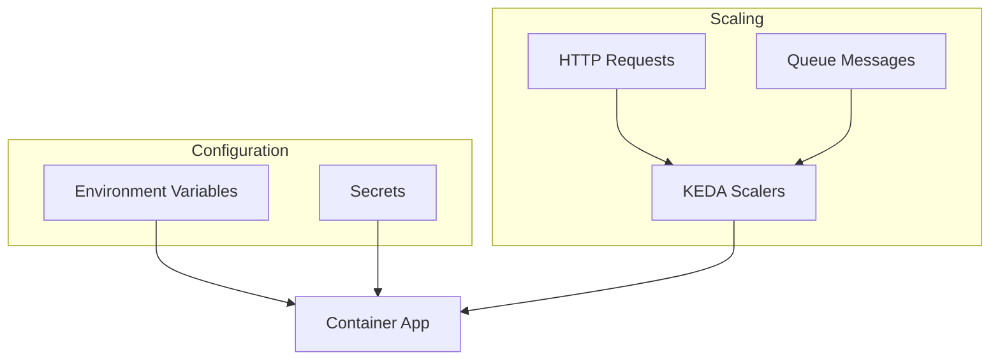
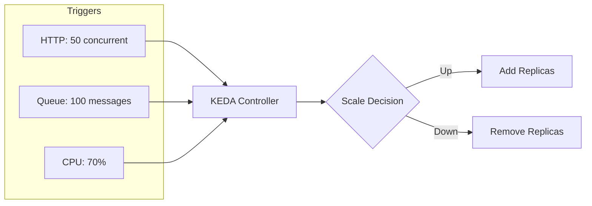

# Configure App Settings and Scaling

Azure Container Apps (ACA) provides robust mechanisms for managing configuration, secrets, and auto-scaling using KEDA.

## Overview



## Environment Variables

Configure application settings by passing environment variables directly to your container.

```bash
az containerapp update \
  --name my-python-app \
  --resource-group my-aca-rg \
  --set-env-vars "LOG_LEVEL=DEBUG" "DB_HOST=my-db-server"
```

In your Python code, access these variables using `os.environ`:

```python
import os
db_host = os.environ.get('DB_HOST', 'localhost')
```

!!! tip "Configuration Best Practice"
    Use environment variables for all configuration. Never hardcode values in your container image.

## Secrets Management

Store sensitive data such as API keys and connection strings securely as secrets within the Container App.

1. **Create a secret:**

   ```bash
   az containerapp secret set \
     --name my-python-app \
     --resource-group my-aca-rg \
     --secrets "db-password=mysecurepassword"
   ```

2. **Reference the secret in an environment variable:**

   ```bash
   az containerapp update \
     --name my-python-app \
     --resource-group my-aca-rg \
     --set-env-vars "DB_PASS=secretref:db-password"
   ```

Alternatively, you can pull secrets directly from Azure Key Vault using managed identity.

!!! warning "Secret Updates"
    Updating a secret value requires a new Revision. The running containers won't see secret changes until restarted.

## Auto-scaling with KEDA

ACA uses KEDA for horizontal scaling based on various metrics.



### Scaling based on HTTP traffic

Configure your app to scale between 1 and 10 replicas based on concurrent HTTP requests:

```bash
az containerapp update \
  --name my-python-app \
  --resource-group my-aca-rg \
  --min-replicas 1 \
  --max-replicas 10 \
  --scale-rule-name http-rule \
  --scale-rule-type http \
  --scale-rule-http-concurrency 50
```

!!! info "Scale to Zero"
    Set `--min-replicas 0` to enable scale-to-zero, which saves costs when your app has no traffic. Note: cold starts may increase latency.

### Scaling based on Event Streams

You can also scale based on external triggers like Azure Service Bus queues or RabbitMQ. This is particularly useful for asynchronous Python worker processes.

```bash
az containerapp update \
  --name my-python-worker \
  --resource-group my-aca-rg \
  --scale-rule-name queue-rule \
  --scale-rule-type azure-servicebus \
  --scale-rule-metadata "queueName=myqueue" "namespace=myservicebus" \
  --scale-rule-auth "connection=connection-string-secret"
```

!!! note "KEDA Scalers"
    KEDA supports 50+ scalers including Azure Service Bus, Kafka, RabbitMQ, PostgreSQL, and more. See [KEDA documentation](https://keda.sh/docs/scalers/) for the full list.
