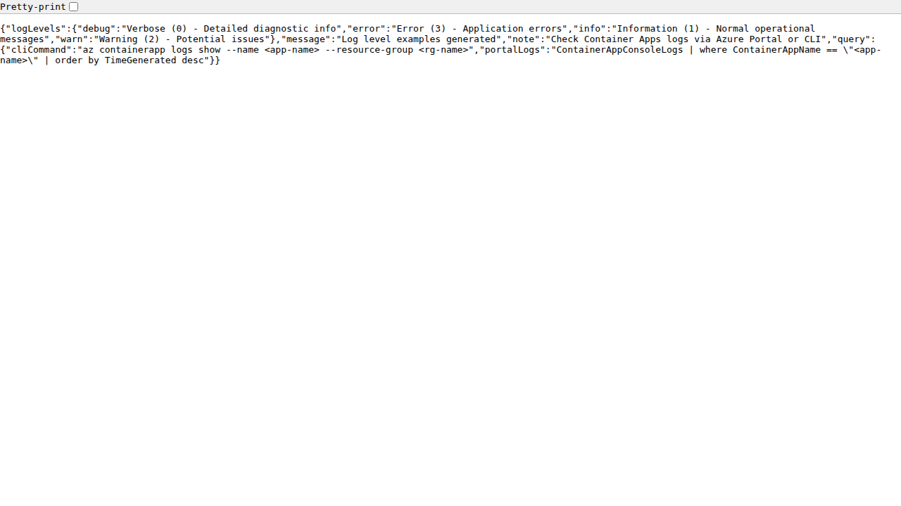
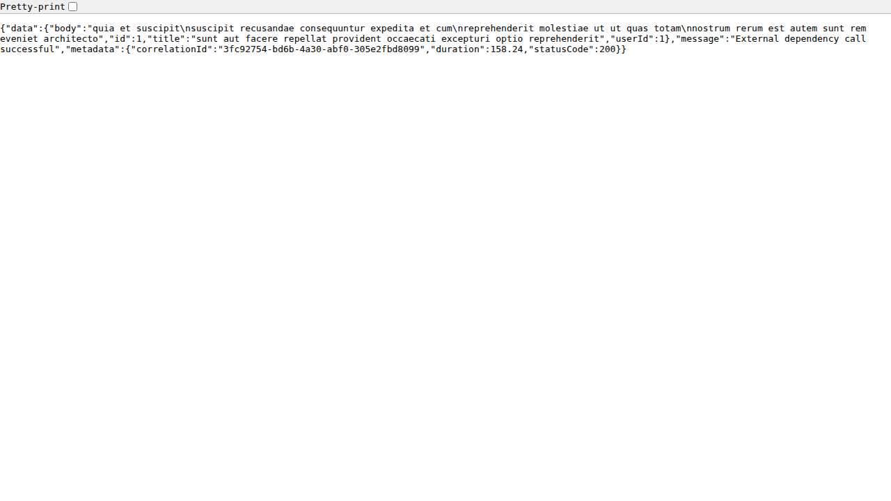
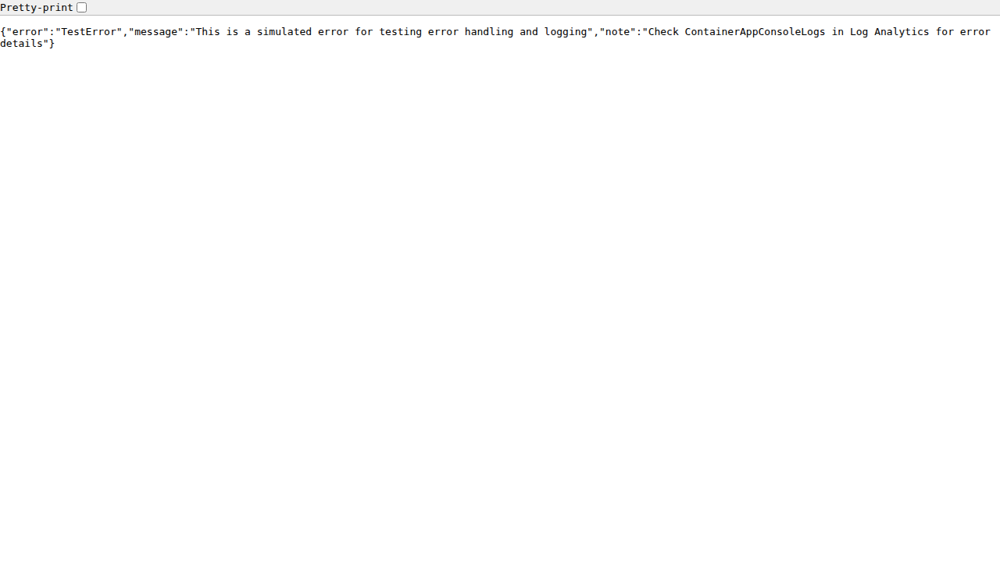

# Monitoring Basics

Azure Container Apps (ACA) provides integrated monitoring through Log Analytics and Application Insights.

## Demo Endpoints for Testing Logs

### Log Levels Demo


```bash
curl https://your-app.azurecontainerapps.io/api/requests/log-levels
```

This endpoint generates logs at different levels (DEBUG, INFO, WARNING, ERROR) to test your logging configuration.

### External Dependency Call


```bash
curl https://your-app.azurecontainerapps.io/api/dependencies/external
```

### Exception Handling


```bash
curl https://your-app.azurecontainerapps.io/api/exceptions/test-error
```

## Container App Logs

ACA captures all standard output (`stdout`) and standard error (`stderr`) from your containers.

### Log Streaming

View real-time logs from your container directly in the terminal:

```bash
az containerapp logs show \
  --name my-python-app \
  --resource-group my-aca-rg \
  --follow
```

### Querying Logs (Log Analytics)

ACA stores logs in the `ContainerAppConsoleLogs_CL` (legacy) or `ContainerAppConsoleLogs` table in your Log Analytics workspace.

**Example KQL query to find errors:**

```kusto
ContainerAppConsoleLogs
| where Log contains "error" or Log contains "exception"
| project TimeGenerated, ContainerAppName, RevisionName, Log
| order by TimeGenerated desc
```

## Application Insights Integration

For deeper visibility into Python application performance, traces, and dependencies, integrate Application Insights.

1. **Install the SDK:**

   ```bash
   pip install azure-monitor-opentelemetry
   ```

2. **Configure OpenTelemetry in your app:**

   ```python
   from azure.monitor.opentelemetry import configure_azure_monitor
   configure_azure_monitor(
       connection_string="InstrumentationKey=...;IngestionEndpoint=..."
   )
   ```

### Metrics and Distributed Tracing

Once integrated, Application Insights provides:
- **Live Metrics:** Real-time request rates, durations, and failure rates.
- **Application Map:** Visual representation of service dependencies.
- **Transaction Search:** End-to-end tracing for individual requests.

## Container Metrics

Azure Monitor provides several standard metrics for Container Apps:
- CPU usage
- Memory usage
- Network In/Out
- Requests (if ingress is enabled)

These metrics can be viewed in the **Metrics** section of your Container App in the Azure portal.
