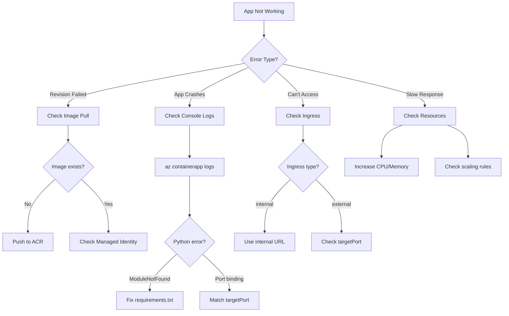

# Troubleshooting Azure Container Apps

This guide covers common issues and debugging techniques for Python applications running in Azure Container Apps.

## Troubleshooting Flowchart



## Revision Provisioning Failures

If a new revision fails to provision, check the **Revision Management** section in the Azure portal for specific error messages.

### Common causes:

| Error | Cause | Solution |
|-------|-------|----------|
| Image pull error | Missing ACR credentials | Configure managed identity |
| Health check failure | Wrong port or path | Update probe configuration |
| CrashLoopBackOff | App crashes on startup | Check console logs |

- **Image pull error:** Verify that the Container App has the correct managed identity or credentials to pull the image from ACR.
- **Health check failure:** If you've configured readiness/liveness probes, ensure your app is responding correctly on the specified port.
- **CrashLoopBackOff:** Your application container is crashing immediately after startup. Check the console logs.

## Viewing Startup Errors

If your app crashes before it can stream logs, use the **Log Stream** in the portal or CLI:

```bash
az containerapp logs show \
  --name my-python-app \
  --resource-group my-aca-rg \
  --type system
```

The `system` logs provide details on container startup, image pulls, and environment setup.

!!! tip "Log Types"
    - `--type console`: Application logs (stdout/stderr)
    - `--type system`: Container lifecycle events

## Debugging Application Issues

### Interactive Console

You can open an interactive shell in a running container to inspect the environment and run diagnostic commands:

```bash
az containerapp exec \
  --name my-python-app \
  --resource-group my-aca-rg \
  --command /bin/bash
```

### Checking Environment Variables

Inside the `exec` session, verify that your environment variables and secrets are correctly mapped:

```bash
env | grep MY_VAR
```

!!! warning "Security Note"
    The `exec` command provides shell access to your running container. Use it for debugging only, and avoid in production environments.

## Performance Issues

If your application is slow or timing out:
1. **Check CPU/Memory metrics:** Ensure you haven't hit the resource limits of your container.
2. **Review Auto-scaling rules:** Verify that your app is scaling out as expected when traffic increases.
3. **Analyze Traces:** Use Application Insights to find slow database queries or external API calls.

## Ingress Issues

If you cannot reach your application URL:
1. **Check Target Port:** Ensure the `targetPort` in ACA matches the port your Python app (Gunicorn/Uvicorn) is listening on.
2. **Review Ingress settings:** Confirm that ingress is set to `external` if you want it accessible from the internet.

!!! info "Port Matching"
    The `targetPort` in Container Apps must match the port your application listens on. For Gunicorn, this is typically 8000. For Uvicorn (FastAPI), it's often 80 or 8000.
