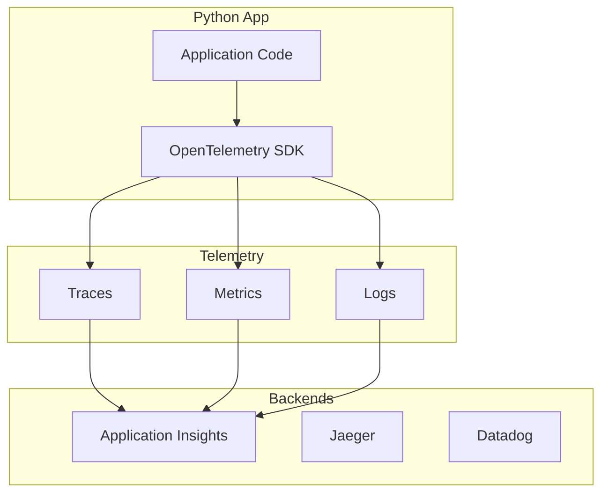
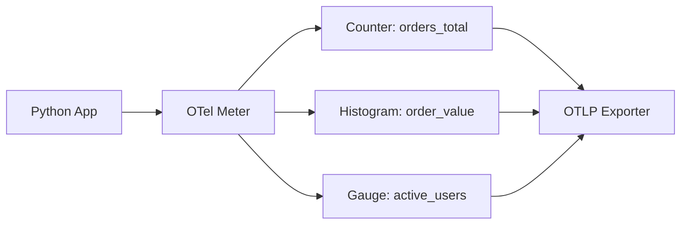

# Advanced Observability with OpenTelemetry

Azure Container Apps (ACA) supports OpenTelemetry (OTel) for collecting distributed traces, metrics, and logs in a standardized way.

## Overview



## Why OpenTelemetry?

OpenTelemetry provides a vendor-neutral approach to observability, allowing you to switch between backends (like Application Insights, Jaeger, or Datadog) without changing your application code.

!!! info "Vendor Neutrality"
    OTel means you're not locked into any observability vendor. Switch from Jaeger to Datadog to Azure Monitor without code changes.

## Python OTel Setup

1. **Install requirements:**

   ```bash
   pip install opentelemetry-api \
               opentelemetry-sdk \
               opentelemetry-exporter-otlp \
               opentelemetry-instrumentation-flask
   ```

2. **Initialize OTel in your application:**

   ```python
   from opentelemetry import trace
   from opentelemetry.sdk.trace import TracerProvider
   from opentelemetry.sdk.trace.export import BatchSpanProcessor
   from opentelemetry.exporter.otlp.proto.grpc.trace_exporter import OTLPSpanExporter

   trace.set_tracer_provider(TracerProvider())
   otlp_exporter = OTLPSpanExporter(endpoint="http://localhost:4317")
   trace.get_tracer_provider().add_span_processor(BatchSpanProcessor(otlp_exporter))
   ```

!!! tip "Auto-Instrumentation"
    For common libraries (Flask, requests, psycopg2), use auto-instrumentation packages instead of manual setup. Example: `opentelemetry-instrumentation-flask`

## Custom Metrics

Capture domain-specific metrics (e.g., number of items processed, order value) using OTel.



```python
from opentelemetry import metrics
meter = metrics.get_meter(__name__)
order_counter = meter.create_counter("orders_total")

def process_order(order):
    # ... business logic ...
    order_counter.add(1, {"order_type": order.type})
```

## ACA OTel Collector

You can run an OpenTelemetry Collector as a sidecar in your Container App to aggregate and forward telemetry to multiple backends. This is particularly useful for complex microservices architectures.

1. **Configure the collector sidecar in your ACA Bicep/ARM template.**
2. **Point your application's OTLP exporter to the sidecar's endpoint.**

This setup provides the most flexible and scalable way to observe your Python services running in Azure Container Apps.

!!! note "Sidecar Pattern"
    Running the OTel Collector as a sidecar decouples telemetry export from your application. Your app sends to localhost, and the collector handles batching, retries, and multi-destination export.
