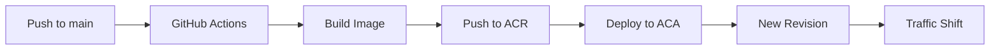
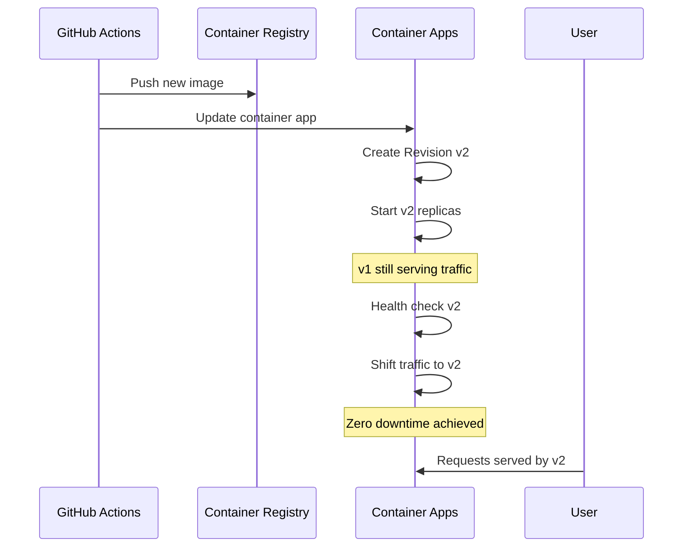

# CI/CD with GitHub Actions

Automate your deployment to Azure Container Apps (ACA) using GitHub Actions. This workflow builds your Python container image, pushes it to ACR, and updates your Container App.

## Overview



## Prerequisites

!!! warning "Secrets Required"
    Store sensitive credentials as GitHub Secrets. Never commit credentials to your repository.

- **GitHub Repository Secrets:**
  - `AZURE_CREDENTIALS`: Service principal credentials (JSON).
  - `REGISTRY_USERNAME`: ACR username (usually the ACR name).
  - `REGISTRY_PASSWORD`: ACR access key.

## Example Workflow File

Create `.github/workflows/deploy.yml`:

```yaml
name: Deploy to Azure Container Apps

on:
  push:
    branches: [ main ]

jobs:
  build-and-deploy:
    runs-on: ubuntu-latest
    steps:
      - name: Checkout code
        uses: actions/checkout@v3

      - name: Log in to Azure
        uses: azure/login@v1
        with:
          creds: ${{ secrets.AZURE_CREDENTIALS }}

      - name: Log in to ACR
        uses: azure/docker-login@v1
        with:
          login-server: ${{ vars.ACR_NAME }}.azurecr.io
          username: ${{ secrets.REGISTRY_USERNAME }}
          password: ${{ secrets.REGISTRY_PASSWORD }}

      - name: Build and push image
        run: |
          docker build -t ${{ vars.ACR_NAME }}.azurecr.io/aca-python-app:${{ github.sha }} .
          docker push ${{ vars.ACR_NAME }}.azurecr.io/aca-python-app:${{ github.sha }}

      - name: Deploy to ACA
        uses: azure/container-apps-deploy-action@v1
        with:
          imageToDeploy: ${{ vars.ACR_NAME }}.azurecr.io/aca-python-app:${{ github.sha }}
          resourceGroup: ${{ vars.RESOURCE_GROUP }}
          containerAppName: ${{ vars.APP_NAME }}
```

!!! tip "Image Tagging"
    Using `${{ github.sha }}` as the image tag ensures each commit has a unique, traceable image. This makes rollbacks easier.

## Zero Downtime Rollouts

By default, the `container-apps-deploy-action` updates the container image of your app, which triggers a new Revision. ACA manages the transition from the old revision to the new one, ensuring zero downtime.



## Infrastructure as Code (IaC) Integration

You can also include a step to deploy your Bicep infrastructure before deploying the application code:

```yaml
      - name: Deploy Infrastructure
        uses: azure/arm-deploy@v1
        with:
          resourceGroupName: ${{ vars.RESOURCE_GROUP }}
          template: ./infra/main.bicep
          parameters: appName=${{ vars.APP_NAME }} acrName=${{ vars.ACR_NAME }}
```

!!! info "IaC Benefits"
    Deploying infrastructure alongside application code ensures your environment is always in sync with your app requirements.
