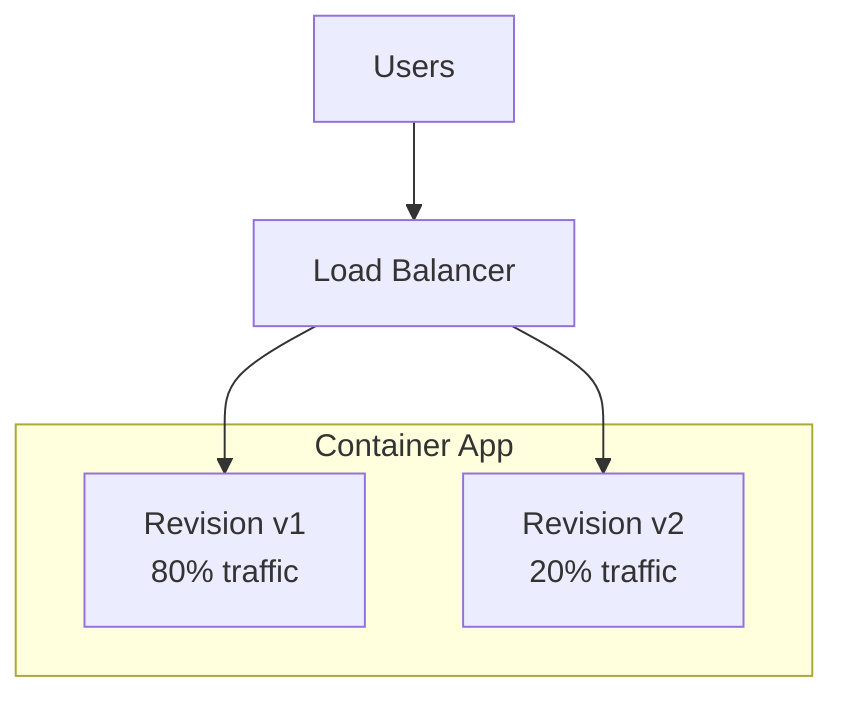
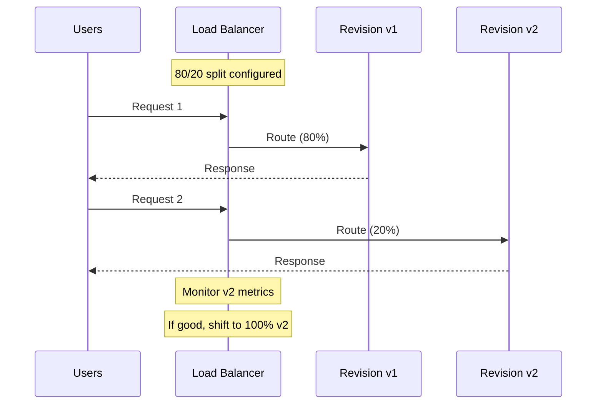

# Revision Management and Traffic Splitting

Azure Container Apps (ACA) uses Revisions to manage deployments. This guide explains how to use Revisions for safe updates and traffic control.

## Overview



## What are Revisions?

A Revision is an immutable snapshot of your container app. Every time you update the image or change a configuration setting, a new Revision is created.

!!! info "Immutability"
    Revisions are immutable. To change configuration, you create a new revision. This provides a clear audit trail and easy rollbacks.

### Revision Modes

| Mode | Behavior | Use Case |
|------|----------|----------|
| Single | Only one active revision | Simple deployments |
| Multiple | Multiple active revisions | A/B testing, canary |

- **Single Mode:** Only one Revision is active at a time. Deploying a new Revision automatically replaces the old one.
- **Multiple Mode:** Multiple Revisions can be active simultaneously, allowing you to split traffic between them.

## Changing Revision Mode

To enable traffic splitting, switch to multiple revision mode:

```bash
az containerapp revision set-mode \
  --name my-python-app \
  --resource-group my-aca-rg \
  --mode multiple
```

!!! tip "When to Use Multiple Mode"
    Enable multiple mode for canary deployments, A/B testing, or gradual rollouts. For simple apps with fast rollback needs, single mode is sufficient.

## Traffic Splitting

Traffic splitting is useful for A/B testing or Canary deployments.



### Example: Split traffic between two Revisions

1. **Deploy a new version (v2):**

   ```bash
   az containerapp update \
     --name my-python-app \
     --resource-group my-aca-rg \
     --image myacrname.azurecr.io/aca-python-app:v2
   ```

2. **Split traffic 80/20:**

   ```bash
   # Get the Revision names
   az containerapp revision list \
     --name my-python-app \
     --resource-group my-aca-rg

   # Apply traffic split
   az containerapp ingress traffic set \
     --name my-python-app \
     --resource-group my-aca-rg \
      --traffic-weight "revision-v1=80" "revision-v2=20"
   ```

!!! warning "Revision Naming"
    Use `az containerapp revision list` to get exact revision names. They typically include a random suffix like `my-app--abc123`.

## Rolling Back

To roll back to a previous version, simply direct 100% of the traffic back to the older Revision:

```bash
az containerapp ingress traffic set \
  --name my-python-app \
  --resource-group my-aca-rg \
  --traffic-weight "revision-v1=100"
```

You can then deactivate the problematic Revision:

```bash
az containerapp revision deactivate \
  --name my-python-app \
  --resource-group my-aca-rg \
  --revision revision-v2
```

!!! tip "Rollback Strategy"
    Keep at least one previous revision active (even at 0% traffic) for instant rollback capability. Deactivate only after confirming the new version is stable.
