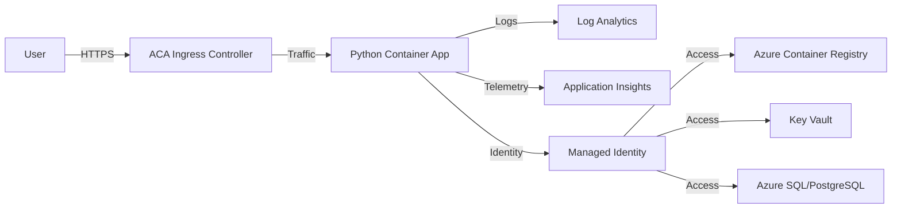

# Architecture Reference

The Azure Container Apps (ACA) Python reference application is designed for scalability and high availability within a managed serverless environment.

## System Architecture

The following diagram illustrates the core components of the reference application:

### Core Components

- **ACA Ingress Controller:** Managed L7 load balancer that handles SSL termination and traffic routing.
- **Python Container App:** Your application running within the ACA Environment.
- **Log Analytics (LA):** Aggregates logs from the ACA Environment and individual containers.
- **Application Insights (AI):** Collects performance metrics, traces, and application-level logs.
- **Managed Identity (MI):** Provides secure, passwordless access to other Azure services.
- **Azure Container Registry (ACR):** Private registry for storing and managing Docker images.
- **Key Vault (KV):** Securely stores secrets and keys, accessible via Managed Identity.

## Network Security

- **Public Ingress:** The app is accessible from the internet via a managed public endpoint.
- **VNet Integration (Optional):** ACA can be deployed within a Virtual Network for enhanced security and private connectivity to other resources.

## Scalability

- **Horizontal Scaling:** ACA uses KEDA to scale replicas based on HTTP traffic, event triggers, or custom metrics.
- **Zero-to-N Scaling:** Applications can scale down to zero replicas when not in use to save costs.
