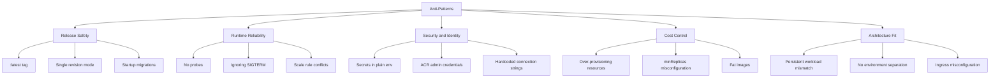

---
content_sources:
  diagrams:
    - id: anti-pattern-relationship-map
      type: flowchart
      source: mslearn-adapted
      based_on:
        - https://learn.microsoft.com/en-us/azure/well-architected/service-guides/azure-container-apps
        - https://learn.microsoft.com/en-us/azure/container-apps/revisions
        - https://learn.microsoft.com/en-us/azure/container-apps/scale-app
        - https://learn.microsoft.com/en-us/azure/container-apps/networking
content_validation:
  status: verified
  last_reviewed: '2026-04-12'
  reviewer: ai-agent
  core_claims:
    - claim: A revision is an immutable snapshot of your container app.
      source: https://learn.microsoft.com/en-us/azure/container-apps/revisions
      verified: true
    - claim: Single revision mode automatically diverts traffic from the old revision to the new one after the new revision is ready.
      source: https://learn.microsoft.com/en-us/azure/container-apps/revisions
      verified: true
    - claim: If you want to ensure that an instance of your revision is always running, set the minimum number of replicas to 1 or higher.
      source: https://learn.microsoft.com/en-us/azure/container-apps/scale-app
      verified: true
    - claim: Internal environments have no public endpoints and are deployed with a virtual IP mapped to an internal IP address.
      source: https://learn.microsoft.com/en-us/azure/container-apps/networking
      verified: true
    - claim: You can use managed identity to authenticate with a private Azure Container Registry without a username and password.
      source: https://learn.microsoft.com/en-us/azure/container-apps/managed-identity
      verified: true
---
# Common Anti-Patterns

This quick-reference guide lists frequent Azure Container Apps anti-patterns seen in production, why they fail, and what to do instead. Use it as a pre-deployment review checklist and incident prevention reference.

## Why This Matters

Production Container Apps behavior depends on explicit platform choices for ingress, scale, identity, observability, and release safety. This page turns the cited Microsoft Learn guidance into reviewable practices that can be checked before promotion.

## Prerequisites

- Azure Container Apps environment and at least one deployed app
- Azure CLI with Container Apps extension
- Access to ACR, Log Analytics, and app configuration

```bash
export RG="rg-aca-prod"
export APP_NAME="ca-orders-api"
export ACA_ENV_NAME="cae-prod-shared"
export ACR_NAME="acrsharedprod"
export LOCATION="koreacentral"

az extension add --name "containerapp" --upgrade
az account show --output table
```

| Command | Purpose |
|---|---|
| `export RG=...`, `APP_NAME=...`, `ACA_ENV_NAME=...`, `ACR_NAME=...`, `LOCATION=...` | Defines the resource group, app, environment, registry, and region variables reused by the anti-pattern examples so each later command points at the same production-like deployment context. |
| `az extension add --name "containerapp" --upgrade` | Ensures the Container Apps CLI extension is installed and current before you validate revision, scale, ingress, identity, or job settings from this checklist. |
| `az account show --output table` | Confirms which subscription and tenant the audit commands will run against so you do not review the wrong environment. |

## Recommended Practices

### Anti-pattern quick reference table

| Problem | Why It Fails | Better Approach |
|---|---|---|
| Using `:latest` image tag in production | Revisions are not reproducible; rollbacks can pull unexpected image content | Use immutable version tags (`v1.2.3`) or digest pinning |
| Fat container images larger than 1 GB | Slow pulls increase cold start and deployment risk; more registry storage cost | Use minimal runtime images, multi-stage builds, and dependency trimming |
| No health probes configured | Platform cannot distinguish slow start from broken runtime; unhealthy replicas linger | Configure readiness and liveness probes matching startup/runtime behavior |
| Storing secrets directly in environment variables | Secret sprawl, accidental leakage in logs, manual rotation pain | Use Container Apps secrets and Key Vault references |
| Using ACR admin credentials instead of managed identity | Shared static credentials create blast radius and rotation risk | Use managed identity for image pulls and disable admin auth where possible |
| Setting `minReplicas=0` for latency-sensitive APIs | Cold starts increase p95 and p99 latency | Keep `minReplicas` at 1 or higher for strict latency services |
| Single revision mode for production apps | No safe canary or traffic split; rollback requires disruptive full switch | Use multiple revision mode with staged rollout and validation gates |
| Hardcoded connection strings | Secrets baked into image/config drift across environments | Resolve from secret store at runtime with identity-based access |
| Ignoring SIGTERM and ungraceful shutdown | In-flight requests/jobs are interrupted; data corruption and retry storms | Handle SIGTERM, drain requests, and flush telemetry before exit |
| Not configuring ingress when external access is required | App is healthy but unreachable from clients | Explicitly configure external ingress, target port, and transport |
| Using Container Apps for persistent stateful workloads | Ephemeral replicas are poor fit for durable local-state dependencies | Use managed state services or AKS for strict persistent workload patterns |
| Over-provisioning CPU and memory "just in case" | Continuous waste and lower bin-packing efficiency | Right-size from observed p95 usage and revise periodically |
| Not separating dev, staging, prod environments | Shared blast radius and accidental cross-environment impact | Separate environments and enforce scoped RBAC and network boundaries |
| Running database migrations in app startup | Startup path becomes risky and slow; scale-out can trigger concurrent migrations | Run migrations as controlled job or pipeline step before traffic shift |
| Ignoring scale rule interaction and precedence | Competing scalers create unstable replica behavior and cost spikes | Document scaler intent, test interaction, and set clear thresholds |

### 1) Using `:latest` image tag in production

`latest` breaks revision traceability because the same tag can point to different image contents over time.

Bad pattern:

```bash
az containerapp update \
  --name "$APP_NAME" \
  --resource-group "$RG" \
  --image "$ACR_NAME.azurecr.io/orders-api:latest"
```

| Command | Why it is used |
|---|---|
| `az containerapp update ...` | Updates the existing Container App configuration without recreating the app. |

Better pattern:

```bash
az containerapp update \
  --name "$APP_NAME" \
  --resource-group "$RG" \
  --image "$ACR_NAME.azurecr.io/orders-api:v1.9.4"
```

| Command | Why it is used |
|---|---|
| `az containerapp update ...` | Updates the existing Container App configuration without recreating the app. |

### 2) Fat container images larger than 1 GB

Large images increase pull duration and make scale-from-zero slower.

Operational impact:

- Longer revision provisioning windows
- Higher failure probability during pull/network pressure
- Increased registry storage and transfer overhead

Better approach:

- Use slim base image
- Remove build-time tooling from runtime image
- Keep only required runtime assets

### 3) No health probes configured

Without probes, platform-level health decisions are less precise.

Bad outcome examples:

- Broken dependency initialization treated as healthy
- Stuck replicas remain in rotation too long

Better approach with explicit probe settings:

```bash
az containerapp update \
  --name "$APP_NAME" \
  --resource-group "$RG" \
  --set "properties.template.containers[0].probes[0].type=Readiness" \
        "properties.template.containers[0].probes[0].httpGet.path=/health" \
        "properties.template.containers[0].probes[0].httpGet.port=8000"
```

| Command | Why it is used |
|---|---|
| `az containerapp update ...` | Updates the existing Container App configuration without recreating the app. |

!!! note "Probe design"
    Readiness should represent dependency readiness for serving traffic. Liveness should represent process health, not external dependency state.

### 4) Secrets in environment variables instead of Container Apps secrets

Directly embedding secrets in plain environment values increases exposure risk.

Bad pattern:

```bash
az containerapp update \
  --name "$APP_NAME" \
  --resource-group "$RG" \
  --set-env-vars "DATABASE_URL=Server=tcp:db.example;User Id=admin;Password=<plaintext>"
```

| Command | Why it is used |
|---|---|
| `az containerapp update ...` | Updates the existing Container App configuration without recreating the app. |

Better pattern using platform secret abstraction:

```bash
az containerapp secret set \
  --name "$APP_NAME" \
  --resource-group "$RG" \
  --secrets "db-connection=<redacted-secret-value>"

az containerapp update \
  --name "$APP_NAME" \
  --resource-group "$RG" \
  --set-env-vars "DATABASE_URL=secretref:db-connection"
```

| Command | Why it is used |
|---|---|
| `az containerapp secret set ...` | Manages Container Apps secrets without exposing secret values in plain configuration. |

### 5) Using ACR admin credentials instead of managed identity

ACR admin credentials are long-lived shared secrets and weaken least privilege.

Better approach:

1. Assign managed identity to app.
2. Grant AcrPull role to that identity.
3. Configure registry identity-based auth.

Assign identity:

```bash
az containerapp identity assign \
  --name "$APP_NAME" \
  --resource-group "$RG" \
  --system-assigned
```

| Command | Why it is used |
|---|---|
| `az containerapp identity assign ...` | Assigns or inspects managed identity configuration for the Container App. |

### 6) `minReplicas=0` on latency-sensitive APIs

For strict SLO APIs, scale-to-zero introduces predictable cold-start delay.

Bad pattern:

```bash
az containerapp update \
  --name "$APP_NAME" \
  --resource-group "$RG" \
  --min-replicas 0
```

| Command | Why it is used |
|---|---|
| `az containerapp update ...` | Updates the existing Container App configuration without recreating the app. |

Better pattern:

```bash
az containerapp update \
  --name "$APP_NAME" \
  --resource-group "$RG" \
  --min-replicas 1 \
  --max-replicas 20
```

| Command | Why it is used |
|---|---|
| `az containerapp update ...` | Updates the existing Container App configuration without recreating the app. |

### 7) Single revision mode in production

Single revision mode removes safe progressive rollout options.

Risks:

- All traffic instantly exposed to new build
- Rollback depends on full revision replacement
- Reduced observability for side-by-side comparison

Better approach:

- Enable multiple revisions
- Send small traffic percentage to candidate revision
- Promote after SLO and error checks

### 8) Hardcoded connection strings

Hardcoded values in code or container args become operational debt.

Failure modes:

- Secrets leak through repository, logs, or diagnostics
- Environment promotion requires image rebuilds
- Rotation causes downtime or drift

Better approach:

- Use secret references and managed identity
- Use one code artifact across environments
- Resolve environment-specific values at deploy/runtime

### 9) Ignoring SIGTERM and ungraceful shutdown

Container Apps sends termination signal during scale-in and revision changes.

If ignored:

- In-flight requests can fail
- Background work may be interrupted mid-transaction
- Telemetry may never flush

Better approach:

- Handle SIGTERM in runtime
- Stop accepting new work immediately
- Drain active work and close cleanly within timeout

### 10) Missing ingress configuration for externally consumed apps

A common issue is healthy app replicas with no reachable endpoint.

Set ingress explicitly during create:

```bash
az containerapp create \
  --name "$APP_NAME" \
  --resource-group "$RG" \
  --environment "$ACA_ENV_NAME" \
  --image "$ACR_NAME.azurecr.io/orders-api:v1.9.4" \
  --ingress external \
  --target-port 8000
```

| Command | Why it is used |
|---|---|
| `az containerapp create ...` | Creates the Container App with the documented image, ingress, scale, and environment settings. |

Validate ingress state:

```bash
az containerapp show \
  --name "$APP_NAME" \
  --resource-group "$RG" \
  --query "properties.configuration.ingress" \
  --output json
```

| Command | Why it is used |
|---|---|
| `az containerapp show ...` | Reads the Container App configuration so the documented setting can be verified. |

### 11) Using Container Apps for persistent local-state workloads

Container Apps is optimized for stateless or externally stateful services.

Anti-pattern examples:

- Local filesystem as primary database
- Stateful leader election dependent on replica identity
- Long-running node-local storage assumptions

Better approach:

- Use managed database/storage services for durable state
- For strict container-orchestrated persistent patterns, evaluate AKS

### 12) Over-provisioning CPU and memory

Provisioning "just in case" directly inflates cost and can mask performance problems.

Review configured resources:

```bash
az containerapp show \
  --name "$APP_NAME" \
  --resource-group "$RG" \
  --query "properties.template.containers[0].resources" \
  --output json
```

| Command | Why it is used |
|---|---|
| `az containerapp show ...` | Reads the Container App configuration so the documented setting can be verified. |

Better approach:

- Start with measured baseline
- Increase only when metrics show sustained contention
- Reassess after each major release

### 13) Mixing dev/staging/prod in one environment

Single shared environment for all stages causes blast-radius coupling.

Typical failures:

- Non-production experiments impact production networking or quotas
- Shared secrets and RBAC reduce control boundaries
- Troubleshooting signal is noisy and ambiguous

Better approach:

- Separate managed environments per stage
- Separate resource groups and budgets
- Enforce stage-specific RBAC policies

### 14) Running database migrations in app startup

Startup migrations turn deployment into an implicit schema operation.

Risk pattern:

- Horizontal scale events run migration logic concurrently
- App startup blocks on long migration tasks
- Failed migration leaves mixed schema/runtime state

Better approach:

- Run migrations as explicit pre-deployment job
- Verify migration success before traffic shift
- Keep startup path limited to health-ready initialization

Example migration as job:

```bash
az containerapp job create \
  --name "job-db-migrate" \
  --resource-group "$RG" \
  --environment "$ACA_ENV_NAME" \
  --trigger-type "Manual" \
  --replica-timeout 1800 \
  --replica-retry-limit 0 \
  --image "$ACR_NAME.azurecr.io/orders-migration:v1.9.4"
```

| Command | Why it is used |
|---|---|
| `az containerapp job create ...` | Creates, updates, starts, or inspects a Container Apps job. |

### 15) Ignoring scale rule interaction and precedence

Multiple scalers can interact in unexpected ways when thresholds are inconsistent.

Symptoms:

- Replica oscillation (rapid up/down)
- Excessive scale-out under one hot metric
- Cost spikes without throughput gains

Better approach:

- Document each scale rule intent and owner
- Test rule combinations under synthetic load
- Align cooldown and threshold settings with downstream capacity

Inspect current scale settings:

```bash
az containerapp show \
  --name "$APP_NAME" \
  --resource-group "$RG" \
  --query "properties.template.scale" \
  --output json
```

| Command | Purpose |
|---|---|
| `az containerapp show --query "properties.template.scale"` | Pulls the app's full scale block so you can review min/max replicas and every configured scaler together instead of diagnosing scale-rule conflicts from memory. |
| `--name "$APP_NAME"` / `--resource-group "$RG"` | Reuses the app and resource group variables defined at the top of the page so the inspection targets the same production candidate discussed in the anti-pattern checklist. |
| `--output json` | Preserves the nested scale configuration, which is easier to inspect than a flattened table when multiple rules may be interacting. |

### Anti-pattern severity and impact matrix

| Anti-Pattern | Severity | Impact Area | Detection Difficulty | Fix Effort |
|---|---|---|---|---|
| `:latest` image tag | 🔴 High | Release safety | Easy — check image field | Low |
| No health probes | 🔴 High | Runtime reliability | Easy — check probe config | Low |
| Secrets in plain env vars | 🔴 High | Security | Medium — audit env config | Medium |
| ACR admin credentials | 🟠 Medium | Security | Easy — check registry auth | Medium |
| Ignoring SIGTERM | 🔴 High | Runtime reliability | Hard — requires load testing | Medium |
| Fat images > 1 GB | 🟠 Medium | Cost, cold start | Easy — check image size | Medium |
| `minReplicas=0` on SLO APIs | 🟠 Medium | Latency | Medium — correlate cold starts | Low |
| Single revision mode | 🟠 Medium | Release safety | Easy — check revision mode | Low |
| Hardcoded connection strings | 🔴 High | Security, operations | Medium — code/config audit | High |
| Missing ingress config | 🟡 Low | Connectivity | Easy — check ingress field | Low |
| Persistent local state | 🔴 High | Architecture fit | Hard — requires design review | High |
| Over-provisioned resources | 🟠 Medium | Cost | Medium — compare usage vs config | Low |
| Mixed dev/staging/prod env | 🟠 Medium | Blast radius | Easy — list environment apps | High |
| DB migrations in startup | 🔴 High | Release safety | Medium — review entrypoint | Medium |
| Scale rule conflicts | 🟠 Medium | Cost, reliability | Hard — requires load testing | Medium |

### Anti-pattern relationship map

<!-- diagram-id: anti-pattern-relationship-map -->


### Pre-production anti-pattern review checklist

| Review category | Key check | Pass criteria |
|---|---|---|
| Image management | No mutable production tags | Version or digest pinned |
| Runtime health | Readiness/liveness probes present | Probe paths tested |
| Secret handling | No plaintext credentials in env vars | Secret references used |
| Identity | Managed identity configured for dependencies | Least privilege applied |
| Scaling | Min/max replicas and scale rules justified | No contradictory scaler behavior |
| Release safety | Multiple revisions with progressive rollout | Rollback path documented |
| Environment boundaries | Stage isolation enforced | Separate environments for prod and non-prod |

!!! warning "Bookmark this page"
    Most high-severity Container Apps incidents map to one or more anti-patterns in this list. Running this checklist before every major release prevents avoidable outages.

### Verify anti-pattern surfaces in Azure Portal


**[Observed]** `ca-sample-d38538 | Revisions and replicas` `Container App` `Create new revision` `Save` `Refresh` `Deployment mode` `Active revisions` `Inactive revisions` `Replicas` `Name` `Date created` `Running status` `View Logs` `Label` `Traffic` `Replicas` `ca-sample-d38538--0uzoi59` `6/3/2026, 10:34:26 PM` `Running` `View details` `Show Logs` `100 %` `1 (Show replicas)`.

**[Inferred]** The immutable revision suffix on `ca-sample-d38538--0uzoi59` is consistent with the digest-or-versioned-tag guidance in [1) Using `:latest` image tag in production](#1-using-latest-image-tag-in-production), which treats mutable tags as the anti-pattern under review. The `Deployment mode` setting appears to map to the multi-revision posture called out in [7) Single revision mode in production](#7-single-revision-mode-in-production), which is consistent with treating single-revision mode as the anti-pattern. The `Active revisions` and `Inactive revisions` grouping appears to map to the rollout-history guidance referenced in the [Anti-pattern quick reference table](#anti-pattern-quick-reference-table), which is consistent with treating retained revisions as the rollback surface. The `Traffic` column with the displayed `100 %` value is consistent with the no-staged-rollout concern in [7) Single revision mode in production](#7-single-revision-mode-in-production), where all traffic on a single revision removes the canary option.

**[Not Proven]** Additional revision configuration detail and runtime parameters are not visible on this view.

## Advanced Topics

- Automate anti-pattern detection in CI using policy checks for image tags, resource limits, and revision mode.
- Build organization-level deployment templates that enforce managed identity and secret reference defaults.
- Combine platform diagnostics and KQL dashboards to detect anti-pattern drift (for example sudden increase in image pull failures or cold-start latency).
- Establish a quarterly architecture review to identify workloads that should move to jobs, managed services, or AKS based on state and performance requirements.

## Common Mistakes / Anti-Patterns

- Treating sample defaults as production-ready without checking ingress, scale, identity, and monitoring requirements.
- Applying a configuration change without verifying the resulting revision, logs, and metrics.
- Leaving ownership for certificates, private DNS, secrets, or rollout decisions undocumented.

## Validation Checklist

- [ ] Required Container Apps settings are represented in infrastructure as code.
- [ ] The active revision, ingress, scale, identity, and monitoring state match the intended design.
- [ ] Rollback or cleanup commands have been tested in a non-production environment.

## See Also

- [Best Practices - Revision Strategy](revision-strategy.md)
- [Best Practices - Scaling](scaling.md)
- [Best Practices - Identity and Secrets](identity-and-secrets.md)
- [Best Practices - Reliability](reliability.md)
- [Platform - Reliability](../platform/reliability/health-recovery.md)

## Sources

- [Microsoft Learn source 1](https://learn.microsoft.com/en-us/azure/well-architected/service-guides/azure-container-apps)
- [Microsoft Learn source 2](https://learn.microsoft.com/en-us/azure/container-apps/revisions)
- [Microsoft Learn source 3](https://learn.microsoft.com/en-us/azure/container-apps/scale-app)
- [Microsoft Learn source 4](https://learn.microsoft.com/en-us/azure/container-apps/networking)
- [Microsoft Learn source 5](https://learn.microsoft.com/en-us/azure/container-apps/revisions)
- [Microsoft Learn source 6](https://learn.microsoft.com/en-us/azure/container-apps/scale-app)
- [Microsoft Learn source 7](https://learn.microsoft.com/en-us/azure/container-apps/networking)
- [Microsoft Learn source 8](https://learn.microsoft.com/en-us/azure/container-apps/managed-identity)
