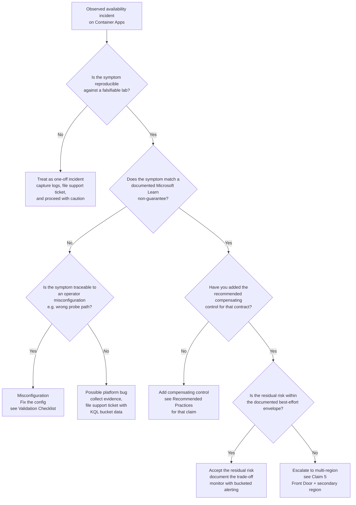

---
content_sources:
  diagrams:
    - id: is-this-a-bug-or-a-non-guarantee-or-a-misconfig
      type: flowchart
      source: self-generated
      justification: "No single MS Learn article presents an operator-facing decision tree that distinguishes a platform bug from a documented platform non-guarantee from operator misconfiguration. Synthesized from the reliability, revisions, zone-redundancy, planned-maintenance, and scaling articles plus the two published falsifiable claim labs (zone-redundancy-best-effort for Claims 2 and 3; startup-degraded-transient-failure for Claim 4). The Claim 1 backing lab is tracked separately under issue #202 and is not yet published; Claim 5 is a MSLearn-only non-guarantee with no falsifiable reproduction needed."
      based_on:
        - https://learn.microsoft.com/en-us/azure/reliability/reliability-container-apps
        - https://learn.microsoft.com/en-us/azure/container-apps/revisions
        - https://learn.microsoft.com/en-us/azure/container-apps/how-to-zone-redundancy
        - https://learn.microsoft.com/en-us/azure/container-apps/planned-maintenance
        - https://learn.microsoft.com/en-us/azure/container-apps/scale-app
content_validation:
  status: verified
  last_reviewed: '2026-06-12'
  reviewer: agent
  core_claims:
    - claim: Microsoft Learn documents that Container Apps performs replica placement via a platform scheduler across physical hosts, but does not document any per-replica node-placement contract or operator-facing control that would let an operator pin N replicas to N distinct physical nodes.
      source: https://learn.microsoft.com/en-us/azure/reliability/reliability-container-apps
      verified: true
    - claim: Zone redundancy in Container Apps is implemented by the platform scheduler and is described as a best-effort distribution across physical hosts in different zones while meeting the minimum replica count; it is not an absolute guarantee.
      source: https://learn.microsoft.com/en-us/azure/reliability/reliability-container-apps
      verified: true
    - claim: Microsoft Learn documents Container Apps planned-maintenance scheduling and windowing, but does not publish a per-app guarantee that the restarts triggered by a given maintenance event will be spread out in time; combined with the absence of a per-replica node-placement contract (Claim 1), an operator cannot point at a Microsoft Learn page that rules out the possibility that multiple replicas of the same app are restarted within a short time window during a maintenance event that affects a shared physical host.
      source: https://learn.microsoft.com/en-us/azure/container-apps/planned-maintenance
      verified: true
    - claim: A new revision is considered ready only after it provisions successfully, scales to match the previous revision's replica count, and all replicas pass startup and readiness probes; rolling rollout depends on correctly-configured probes to mask client-visible transients.
      source: https://learn.microsoft.com/en-us/azure/container-apps/revisions
      verified: true
    - claim: Microsoft Learn directs operators to multi-region designs fronted by Azure Front Door when the availability target exceeds what a single zone-redundant environment provides.
      source: https://learn.microsoft.com/en-us/azure/reliability/reliability-container-apps
      verified: true
---
# Availability and Non-Guarantees

Use this page to align operator expectations with what Azure Container Apps **explicitly does not promise**. Most production incidents traced to "ACA outage" are actually operator assumptions that exceed the platform's documented best-effort contracts. This page enumerates the five most-commonly-violated assumptions, cites the Microsoft Learn statement that disclaims each, and points to a falsifiable lab when one exists.

## Why This Matters

Container Apps is a managed platform that abstracts away node placement, zone distribution, replica scheduling, and rolling-rollout transitions. Each abstraction is a **best-effort contract**, not a hard guarantee. Microsoft Learn is explicit about every one of these contracts, but the disclaimers are spread across multiple articles and are easy to miss when reading the marketing-facing landing pages.

When an operator's mental model assumes a hard guarantee where the platform offers best-effort, the failure mode is predictable:

- "My zone-redundant app went down during an AZ fault — ACA must be broken." (Claim 2: zone redundancy is best-effort.)
- "I set `minReplicas=3` so I should always have 3 replicas running across 3 nodes." (Claim 1: node spread is not guaranteed.)
- "All my replicas restarted at the same time — that can't be normal." (Claim 3: planned maintenance can cluster restarts.)
- "I have probes configured, so my rolling rollout should produce zero 5xx." (Claim 4: probe correctness gates transients, not the rollout mechanism alone.)
- "Microsoft sells this as enterprise-grade — that means 99.99% on a single region." (Claim 5: Microsoft Learn explicitly directs higher SLO targets to multi-region.)

The remediation in every case is the same shape: **add a compensating control at a layer the platform does not own** (multi-region failover, client-side retries with jitter, sub-minute bucketed alerting, etc.). This page documents the contracts, names the failure modes, and lists the compensating controls. Operators should treat "no observed failures yet" as distinct from "the platform guarantees no failures" — many of the failure modes below are rare in normal operation but documented as possible, and the operator-side compensating control is what bounds the worst-case blast radius.

<!-- diagram-id: is-this-a-bug-or-a-non-guarantee-or-a-misconfig -->

## Recommended Practices

Each subsection follows the pattern **Practice → Non-guarantee disclosure → Remediation pattern → Lab evidence**. The non-guarantee disclosure quotes (or paraphrases with a direct link) the Microsoft Learn statement that disclaims the assumption. The remediation pattern is the operator-side control that compensates.

### Claim 1: Replica node spread is best-effort, not guaranteed

**Practice**: Set `minReplicas` to the number of independent failure domains you require, set CPU and memory `requests` and `limits` explicitly, and design the workload to tolerate the loss of any single replica.

**Non-guarantee disclosure**: Container Apps places replicas on physical hosts using a platform scheduler. The Microsoft Learn article on [reliability in Container Apps](https://learn.microsoft.com/en-us/azure/reliability/reliability-container-apps) documents that the scheduler distributes replicas across physical hosts; the article on [scaling in Container Apps](https://learn.microsoft.com/en-us/azure/container-apps/scale-app) is the source for `minReplicas` / `maxReplicas` semantics. Neither article documents a per-replica node-placement contract or an operator-facing control that pins specific replicas to specific physical hosts. The absence-of-documentation framing is the binding one: an operator cannot point at a Microsoft Learn page that promises `N` replicas will land on `N` distinct nodes, so a production design that depends on that assumption is unsupported by the public platform contract. Explicit resource requests and limits give the scheduler more information for placement decisions, but they do not introduce a published placement guarantee.

**Remediation pattern**:

1. Set CPU and memory `requests` and `limits` explicitly on every container (do not rely on defaults). Explicit resource shape gives the scheduler more information to spread replicas, and is a precondition for any zone-redundancy benefit.
2. Use `minReplicas >= 2` and pair it with a client-side retry layer (SDK retry policy, API gateway retry, or CDN-level retry). Single-replica designs have no failure-domain budget regardless of platform behavior.
3. If the workload genuinely requires hard-isolated node placement (e.g., compliance requirement for physical separation), Container Apps is not the right platform — escalate to Azure Kubernetes Service with explicit node pool and anti-affinity rules.
4. Add an alert on the [`Replicas` metric](../reference/metrics.md) for the app dropping below `minReplicas` for more than one bucket. This is a **count-based secondary symptom alert**: the metric does not directly observe physical-host placement, so it cannot detect hidden host co-tenancy when the replica count stays at or above the floor. Use it to catch the subset of scheduler-driven re-placement events that take the count below `minReplicas`, not as proof of node spread.

**Lab evidence**: A focused lab for Claim 1 is tracked separately in [issue #202](https://github.com/yeongseon/azure-container-apps-practical-guide/issues/202) and is not yet published. The planned lab uses `boot_id` and uptime monotonicity as proxy signals to compare Consumption-profile and Dedicated-D8-profile replica distribution at scale. When the lab ships, this cross-link will land here and the page-level `content_sources` justification will be updated to list it.

### Claim 2: Zone redundancy is best-effort, not absolute

**Practice**: Set `zoneRedundant=true` on the Container Apps environment, use `minReplicas >= 3` so the platform has at least one replica per zone to work with, set resource requests and limits explicitly, and design the application to tolerate transient unavailability of one zone.

**Non-guarantee disclosure**: The Microsoft Learn article on [reliability in Container Apps](https://learn.microsoft.com/en-us/azure/reliability/reliability-container-apps) documents that zone redundancy is implemented by the platform scheduler as a best-effort distribution across physical hosts in different zones while still meeting the minimum replica count. The article does not publish a per-app guarantee of zone-spread under all conditions; the operator-side implication is that under capacity pressure, planned maintenance, or replica resource constraints, the scheduler can land more than the expected number of replicas in any given zone. Setting `zoneRedundant=true` does not change the best-effort contract; it changes the scheduler's preference.

**Remediation pattern**:

1. Set `minReplicas` to the number of zones you want covered (at least 3 in a 3-zone region). With `minReplicas=2`, the scheduler has only 2 replicas to distribute across 3 zones, so one zone always has zero coverage.
2. Set CPU and memory `requests` and `limits` explicitly. Underspecified resource requirements force the scheduler into conservative placement decisions that can collapse the zone spread.
3. Implement client-side retry with jitter for all calls into the Container App. A transient zone-level outage during a planned maintenance event is invisible to the app code but visible to the client.
4. Configure bucketed alerting on `err_pct` at 10-second granularity (see the [Startup-Degraded Bucketed 5xx KQL Pack](../troubleshooting/kql/scaling-and-replicas/startup-degraded-bucketed-5xx.md) for the bucket-aggregation pattern). Minute-granularity alerting is too coarse to detect sub-minute zone-level transients.
5. If your availability target exceeds what a single zone-redundant environment provides (see Claim 5), promote to a multi-region design.

**Lab evidence**: [Zone Redundancy Best-Effort Lab](../troubleshooting/lab-guides/zone-redundancy-best-effort.md) uses operator-driven perturbations (revision restart, sustained load) against a `zoneRedundant=true` environment to exercise the scheduler's replacement behavior. Across the lab's 24h baseline, the audit sampler did NOT observe platform-initiated clustered replica replacement, so the lab cannot definitively refute the absolute-zone-redundancy assumption from natural platform behavior alone. Per the lab's evidence-integrity ceiling — and the absence of per-replica AZ identity in the public Container Apps API — Claim 2 is held at `[Strongly Suggested]`, never `[Observed]`. The companion playbook [Zone Redundancy Is Best-Effort](../troubleshooting/playbooks/platform-features/zone-redundancy-best-effort.md) lists the four-layer mitigation flow.

### Claim 3: Microsoft Learn does not publish a restart-spreading guarantee for planned maintenance

**Practice**: Treat planned maintenance as an event whose timing-distribution of replica restarts is **not contractually bounded** by Microsoft Learn. Design the application to handle the worst-case operator-side interpretation (multiple replicas of the same app restarting within a short time window) and design the client to retry those restarts.

**Non-guarantee disclosure**: The Microsoft Learn article on [planned maintenance](https://learn.microsoft.com/en-us/azure/container-apps/planned-maintenance) documents the platform's overall maintenance schedule and windowing. The article does not publish a per-app guarantee that replica restarts during a single maintenance event are spread out in time, nor does it expose per-replica node placement (per Claim 1). The [reliability article](https://learn.microsoft.com/en-us/azure/reliability/reliability-container-apps) notes that maintenance is staged to minimize interruption, but staging is described at the platform level and does not constitute a published per-app restart-spreading contract. The binding framing is documentation-absence: an operator cannot point at a Microsoft Learn page that rules out clustered restarts within a single maintenance event, so a production design must treat the clustered case as possible.

**Remediation pattern**:

1. Configure `terminationGracePeriodSeconds` to bracket the application's drain time, and ensure the application drains in-flight work before the grace period expires. In-flight requests that have not completed by the end of the grace period surface as client-visible failures. Container Apps follows the standard container-runtime lifecycle for graceful shutdown; the exact signal semantics are a runtime detail and are not the subject of a Container Apps-specific public contract.
2. Configure `minReplicas` high enough that the loss of all replicas on a single physical host still leaves at least one replica serving traffic. With `minReplicas=3` and worst-case 2-of-3 co-tenancy (per Claim 1), the surviving 1 replica must absorb 100% of the load for the duration of the restart.
3. Implement client-side retry with jitter for any call whose failure has user-visible impact. Maintenance-driven restarts are a normal platform event, not an incident to escalate.
4. Configure an alert on the [`Replicas` metric](../reference/metrics.md) dropping below `minReplicas` for more than 60 seconds. This is a **count-based secondary symptom alert**: the metric does not directly observe physical-host placement, so it can only catch a clustered restart that takes the replica count below the floor. A clustered restart that stays at or above `minReplicas` (because the platform replaces replicas as fast as it restarts them) will not trigger this alert.

**Lab evidence**: The [Zone Redundancy Best-Effort Lab](../troubleshooting/lab-guides/zone-redundancy-best-effort.md) uses operator-driven `revision restart` as a proxy for the planned-maintenance restart pattern. Under the operator-driven perturbation, the lab observed `MaxReplacementFraction=1.0` and clustered churn (multiple replicas replaced within seconds), demonstrating that the scheduler is capable of producing the clustered-restart pattern. The lab does NOT directly observe a real platform maintenance event — that would require a coincident maintenance window during the 24h baseline, which did not occur. Per the lab's evidence-integrity discipline, Claim 3's platform-initiated case is `[Strongly Suggested]`, not `[Observed]`. The lab's measurement infrastructure is identical to Claim 2's; the perturbation type and the failure-mode framing differ.

### Claim 4: Rolling rollout transient masking depends on probe correctness, not on the rollout mechanism alone

**Practice**: Configure startup, readiness, and liveness probes against a dedicated `/healthz` (or equivalent) endpoint that is **distinct** from the workload endpoint. Validate probe correctness with a perturbation-tolerance load harness, not with single-shot health checks.

**Non-guarantee disclosure**: The Microsoft Learn article on [revisions](https://learn.microsoft.com/en-us/azure/container-apps/revisions) states that a new revision is considered ready only after it provisions successfully, scales to match the previous revision's replica count, and **all replicas pass startup and readiness probes**. The article does NOT say that the rolling-rollout mechanism alone masks client-visible 5xx. The masking is a consequence of correctly-configured probes gating traffic. If probes return 200 before the application is actually ready to serve the workload path, the platform will route traffic to a not-yet-warm replica regardless of the rollout strategy, and client-visible 5xx will result.

**Remediation pattern**:

1. Probes must target a path that returns 200 ONLY when the application is ready to serve the workload. Using `/` (the workload path) as the probe path is the most common operator misconfiguration: it returns 200 as soon as the HTTP server binds, before any application-level warm-up completes.
2. Configure `initialDelaySeconds` on the startup probe to bracket the application's actual cold-start time, including any framework warm-up, JIT compilation, and connection-pool initialization. Underspecified `initialDelaySeconds` causes the probe to flap, the platform to mark the replica as failed, and traffic to be routed inconsistently.
3. Test the rollout with a constant-arrival-rate load harness (k6 or equivalent), at a target RPS that consumes nontrivial headroom on the replica. A single-shot `curl` after deploy does not exercise the load path; the rollout could produce a 5-second 5xx burst that the single-shot check misses entirely.
4. Bucket alerting on `err_pct` at 10-second granularity. Default platform alerting is at minute granularity; sub-minute rollout transients are invisible at that resolution. The KQL pack's falsification query (Q5 in the [Startup-Degraded Bucketed 5xx KQL Pack](../troubleshooting/kql/scaling-and-replicas/startup-degraded-bucketed-5xx.md)) is the canonical bucket-level alerting pattern.

**Lab evidence**: [Startup-Degraded Transient Failure Lab](../troubleshooting/lab-guides/startup-degraded-transient-failure.md) reproduces the failure-mode envelope using a deterministic 25-second cold-start subject app, a constant-arrival-rate k6 loadgen at 200 RPS, an ACA-managed rolling-rollout perturbation, and a 5-second-cadence revision-state sampler. The falsification rule (any sustained 3-consecutive-10s-bucket window above 0.5% err_pct during a rollout) is binding. The companion KQL pack lists the seven queries used to reach the verdict.

### Claim 5: Single-region availability target exceeded — promote to multi-region

**Practice**: When the application's availability SLO exceeds what a single zone-redundant Container Apps environment can deliver, deploy the application to a second region and front it with Azure Front Door (or an equivalent global load balancer with health-based failover).

**Non-guarantee disclosure**: The Microsoft Learn article on [reliability in Container Apps](https://learn.microsoft.com/en-us/azure/reliability/reliability-container-apps) is explicit that for higher availability targets than a single zone-redundant environment provides, operators are directed to multi-region designs fronted by Azure Front Door. The article does not publish a numeric SLO for the single-region zone-redundant configuration. The operator MUST assume that "single region, zone-redundant" tops out short of any availability target that requires regional-scale failure tolerance.

**Remediation pattern**:

1. Deploy the application to two regions. The secondary region can be lower-capacity (warm-standby pattern) or equal-capacity (active-active pattern) depending on the recovery time objective (RTO) and recovery point objective (RPO).
2. Front both regions with [Azure Front Door](https://learn.microsoft.com/en-us/azure/frontdoor/front-door-overview) using a health-probe-based routing rule. Front Door's regional failover is the operator-side control that compensates for any single-region availability ceiling.
3. Ensure stateful dependencies (databases, queues, caches) are also configured for cross-region replication or failover. A multi-region Container Apps deployment fronted by Front Door fails over to the secondary region in seconds; if the database is single-region, the Container Apps failover is meaningless.
4. Test the failover regularly with a chaos exercise. An untested DR path is not a DR path. See the [multi-region failover playbook](../troubleshooting/playbooks/platform-features/multi-region-failover.md) for the operational pattern.

**Lab evidence**: This claim is a Microsoft Learn explicit non-guarantee statement (no falsifiable reproduction is needed — the documentation itself caps single-region availability). The corroborating cross-link is the [multi-region failover playbook](../troubleshooting/playbooks/platform-features/multi-region-failover.md), which describes the failover topology that compensates for the cap.

## Common Mistakes / Anti-Patterns

Each anti-pattern below maps to one of the five claims above. The pattern is **assumption → consequence → fix**.

### Mistake 1: Assuming `minReplicas=N` guarantees `N` distinct physical nodes

**Assumption**: Setting `minReplicas=3` on a zone-redundant environment will always result in 3 replicas across 3 distinct physical hosts.

**Consequence**: A single physical-host fault takes out more than one replica simultaneously; surviving replicas absorb a load spike they were not capacity-planned for, and may themselves fail.

**Fix**: Set `requests` and `limits` explicitly (improves scheduler placement), set `minReplicas` to at least one more than the failure-domain budget you require, and add a client-side retry layer.

### Mistake 2: Treating zone redundancy as a hard guarantee

**Assumption**: `zoneRedundant=true` means an AZ-level fault has zero customer impact.

**Consequence**: An AZ-level event correlates with measurable customer 5xx; the operator escalates to Azure support expecting a platform bug, and is directed to the best-effort disclosure in Microsoft Learn instead.

**Fix**: Treat zone redundancy as a probabilistic improvement, not a guarantee. Add bucket-granularity alerting (sub-minute), implement client-side retry, and document the residual risk against the application's SLO.

### Mistake 3: Conflating clustered replica restart with platform outage

**Assumption**: Multiple replicas restarting within a 60-second window indicates a platform incident.

**Consequence**: Time is wasted chasing a non-existent platform bug instead of running the relevant operator-side check (e.g., correlating the restart timestamp with the published platform maintenance schedule).

**Fix**: First check whether the timestamps align with a documented platform maintenance event. If yes, the clustered restart is consistent with the documented maintenance schedule — operator-side remediation is in-flight-request draining within `terminationGracePeriodSeconds` and a higher `minReplicas`, not a support ticket.

### Mistake 4: Using the workload path `/` as the health probe path

**Assumption**: A 200 response from `/` means the application is ready to serve traffic.

**Consequence**: The probe returns 200 as soon as the HTTP listener binds (before warm-up completes), the platform marks the replica as ready, traffic is routed in, and the workload path returns 5xx because the app is not actually warm yet. The 5xx burst lasts seconds and is invisible at minute-granularity alerting.

**Fix**: Implement a dedicated `/healthz` endpoint that returns 200 ONLY when the application is genuinely ready (warm-up done, downstream dependencies reachable, JIT compilation complete). Configure all three probes against `/healthz`, not `/`. Test with a perturbation-tolerance load harness.

### Mistake 5: Assuming a single-region zone-redundant deployment hits four-nines availability

**Assumption**: ACA zone redundancy delivers the same availability target as a multi-region Front Door topology.

**Consequence**: The application's published SLO exceeds what the platform can deliver; an SLO breach is treated as a platform failure rather than as a topology design failure.

**Fix**: Read the [reliability in Container Apps](https://learn.microsoft.com/en-us/azure/reliability/reliability-container-apps) article carefully and align the published SLO with the topology. If the SLO requires regional-scale failure tolerance, the topology must be multi-region.

## Validation Checklist

Run this checklist before depending on any of the five contracts in production.

### For Claim 1 (node spread):

- [ ] CPU and memory `requests` are set explicitly on every container (not relying on platform defaults).
- [ ] CPU and memory `limits` are set explicitly on every container.
- [ ] `minReplicas` is at least 2 (preferably 3 in a 3-zone region).
- [ ] A secondary count-based alert is configured on the `Replicas` metric dropping below `minReplicas` (acknowledged: this alert cannot detect hidden host co-tenancy when the replica count stays at or above the floor).
- [ ] A client-side retry layer (SDK retry, API gateway retry, or CDN retry) is in place.

### For Claim 2 (zone redundancy):

- [ ] Environment is created with `zoneRedundant=true`.
- [ ] `minReplicas` is at least 3 in a 3-zone region (so the scheduler has at least one replica per zone to distribute).
- [ ] Bucket-level (10-second) alerting on `err_pct` is configured.
- [ ] The application's SLO is documented as a best-effort improvement, not an absolute guarantee.
- [ ] The corresponding playbook [Zone Redundancy Is Best-Effort](../troubleshooting/playbooks/platform-features/zone-redundancy-best-effort.md) has been reviewed.

### For Claim 3 (clustered restart):

- [ ] Application drains in-flight work in response to container-termination signals before the grace period expires.
- [ ] `terminationGracePeriodSeconds` is set to bracket the application's drain time.
- [ ] `minReplicas` is high enough that a 2-of-N co-tenant loss still leaves at least one replica serving traffic.
- [ ] A secondary count-based alert is configured on the `Replicas` metric for any sustained drop below `minReplicas` (acknowledged: this alert only catches clustered restarts that take the count below the floor; the metric does not directly observe physical-host placement).
- [ ] The platform maintenance schedule is checked when investigating clustered restart events.

### For Claim 4 (rolling rollout):

- [ ] Probes target a dedicated `/healthz` (or equivalent) endpoint, not the workload path `/`.
- [ ] All three probes (startup, readiness, liveness) target the same dedicated health path.
- [ ] `/healthz` returns 200 ONLY when the application is genuinely ready to serve the workload.
- [ ] Rolling rollout is tested with a constant-arrival-rate load harness at a target RPS that consumes nontrivial headroom on the replica.
- [ ] Bucket-level (10-second) alerting on `err_pct` is configured during rollout windows.
- [ ] The [Startup-Degraded Transient Failure Lab](../troubleshooting/lab-guides/startup-degraded-transient-failure.md) and its [companion KQL pack](../troubleshooting/kql/scaling-and-replicas/startup-degraded-bucketed-5xx.md) have been reviewed.

### For Claim 5 (single-region cap):

- [ ] The application's published SLO is consistent with what a single zone-redundant environment can deliver.
- [ ] If the SLO requires regional-scale failure tolerance, the application is deployed to a second region.
- [ ] Azure Front Door (or equivalent global load balancer) is configured with health-probe-based regional failover.
- [ ] Stateful dependencies (databases, queues, caches) are configured for cross-region replication or failover.
- [ ] A regular chaos exercise validates the regional failover path.
- [ ] The [multi-region failover playbook](../troubleshooting/playbooks/platform-features/multi-region-failover.md) has been reviewed.

## See Also

- [Reliability](reliability.md) — production patterns for probes, graceful termination, and revision rollback.
- [Revision Strategy](revision-strategy.md) — choosing revision mode, traffic split, and rollback approach.
- [Anti-Patterns](anti-patterns.md) — broader catalog of Container Apps design mistakes.
- [Platform / Reliability / Health and Recovery](../platform/reliability/health-recovery.md) — underlying platform behavior for health and recovery.
- [Zone Redundancy Best-Effort Lab](../troubleshooting/lab-guides/zone-redundancy-best-effort.md) — operator-driven perturbation lab for Claims 2 and 3; conclusions held at `[Strongly Suggested]`.
- [Startup-Degraded Transient Failure Lab](../troubleshooting/lab-guides/startup-degraded-transient-failure.md) — falsifiable reproduction for Claim 4.
- [Startup-Degraded Bucketed 5xx KQL Pack](../troubleshooting/kql/scaling-and-replicas/startup-degraded-bucketed-5xx.md) — the bucket-aggregation pattern used by Claims 2 and 4.
- [Zone Redundancy Is Best-Effort playbook](../troubleshooting/playbooks/platform-features/zone-redundancy-best-effort.md) — operator-side mitigation flow for Claims 1, 2, and 3.
- [Multi-Region Failover playbook](../troubleshooting/playbooks/platform-features/multi-region-failover.md) — operator-side topology for Claim 5.

## Sources

- [Reliability in Azure Container Apps](https://learn.microsoft.com/en-us/azure/reliability/reliability-container-apps) — primary source for Claims 1, 2, and 5.
- [How to configure zone redundancy in Container Apps](https://learn.microsoft.com/en-us/azure/container-apps/how-to-zone-redundancy) — corroborating source for Claim 2.
- [Container Apps planned maintenance](https://learn.microsoft.com/en-us/azure/container-apps/planned-maintenance) — primary source for Claim 3.
- [Container Apps revisions](https://learn.microsoft.com/en-us/azure/container-apps/revisions) — primary source for Claim 4.
- [Set scaling rules in Container Apps](https://learn.microsoft.com/en-us/azure/container-apps/scale-app) — corroborating source for Claim 1 (`minReplicas` and `maxReplicas` semantics).
- [Health probes in Container Apps](https://learn.microsoft.com/en-us/azure/container-apps/health-probes) — corroborating source for Claim 4.
- [Azure Front Door overview](https://learn.microsoft.com/en-us/azure/frontdoor/front-door-overview) — corroborating source for Claim 5.
