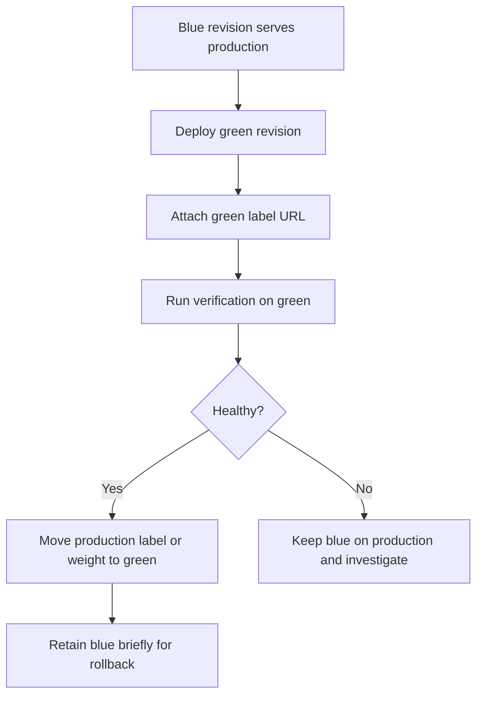

---
content_sources:
  diagrams:
    - id: blue-green-label-swap
      type: flowchart
      source: self-generated
      justification: Synthesized from Microsoft Learn guidance on revisions, deployment labels, and blue/green deployment.
      based_on:
        - https://learn.microsoft.com/azure/container-apps/blue-green-deployment
        - https://learn.microsoft.com/azure/container-apps/deployment-labels
        - https://learn.microsoft.com/azure/container-apps/revisions
content_validation:
  status: verified
  last_reviewed: "2026-04-25"
  reviewer: ai-agent
  core_claims:
    - claim: "Blue/green deployment in Azure Container Apps uses revisions, traffic weights, and deployment labels."
      source: "https://learn.microsoft.com/azure/container-apps/blue-green-deployment"
      verified: true
    - claim: "Deployment labels provide a stable URL that can be moved between revisions."
      source: "https://learn.microsoft.com/azure/container-apps/deployment-labels"
      verified: true
    - claim: "Multiple revision mode allows multiple active revisions and traffic management between them."
      source: "https://learn.microsoft.com/azure/container-apps/revisions"
      verified: true
---

# Blue/Green Deployment for Azure Container Apps

Blue/green deployment in Azure Container Apps keeps the current production revision and the candidate revision alive at the same time, then swaps traffic when validation passes. The safest implementation uses multiple revision mode plus label-based routing.

## Why This Matters

Blue/green is the right pattern when you need:

- deterministic pre-cutover validation
- instant rollback without rebuilding artifacts
- a stable validation endpoint that does not disturb production users

<!-- diagram-id: blue-green-label-swap -->


## Recommended Practices

### 1. Use multiple revision mode first

```bash
az containerapp revision set-mode \
  --name "$APP_NAME" \
  --resource-group "$RG" \
  --mode multiple
```

### 2. Keep production traffic on blue while green is created

```bash
az containerapp ingress traffic set \
  --name "$APP_NAME" \
  --resource-group "$RG" \
  --label-weight "blue=100"
```

### 3. Attach a stable label to the green revision

```bash
az containerapp revision label add \
  --name "$APP_NAME" \
  --resource-group "$RG" \
  --revision "$APP_NAME--20260425-1" \
  --label "green"
```

This gives you a deterministic revision-specific URL before production cutover.

### 4. Verify green before swap

Recommended verification gates:

- readiness and startup success
- core smoke tests against the green label URL
- request success rate and latency
- downstream dependency checks

For operational commands and telemetry checks, reuse the release validation flow in the revision and monitoring docs rather than duplicating it here.

### 5. Swap with a label move or weight change

Use a label move when you want a stable production endpoint pattern, or a 100/0 weight change when production uses the main app FQDN.

```bash
az containerapp ingress traffic set \
  --name "$APP_NAME" \
  --resource-group "$RG" \
  --label-weight "green=100" "blue=0"
```

### 6. Keep blue warm for a short rollback window

Do not deactivate blue immediately. Give on-call and release automation a short confidence window.

### Bicep baseline for blue/green-ready apps

Use Bicep to set the app into multiple revision mode and define a traffic block that production automation can later update.

```bicep
resource app 'Microsoft.App/containerApps@2026-01-01' = {
  name: appName
  location: location
  properties: {
    configuration: {
      activeRevisionsMode: 'Multiple'
      ingress: {
        external: true
        targetPort: 8080
        traffic: [
          {
            latestRevision: true
            weight: 100
          }
        ]
      }
    }
  }
}
```

## Common Mistakes / Anti-Patterns

- **Using DNS cutover instead of revision labels**
    DNS adds cache delay and hides which revision you are actually testing.
- **Destroying blue immediately after swap**
    Keep a short rollback window unless the release is trivial and fully validated.
- **Testing green only through the shared production route**
    That defeats the purpose of side-by-side validation.
- **Turning blue/green into permanent dual production**
    Blue is a rollback path, not a long-term second primary.

!!! warning "Do not treat label URLs as a replacement for production readiness checks"
    Labels make validation deterministic, but they do not guarantee production safety. Still evaluate telemetry and dependency health before the swap.

## Validation Checklist

- Multiple revision mode enabled
- Blue still serves production before cutover
- Green has its own label URL
- Smoke and health checks passed on green
- Rollback command prepared before swap
- Blue retained for the agreed confidence window

## See Also

- [Canary Deployment](canary-deployment.md)
- [Revision Strategy Best Practices](revision-strategy.md)
- [Traffic Split](../platform/revisions/traffic-split.md)
- [Revision Modes](../platform/revisions/revision-modes.md)
- [Revision Operations](../operations/revision-management/index.md)

## Sources

- [Blue-Green Deployment in Azure Container Apps (Microsoft Learn)](https://learn.microsoft.com/azure/container-apps/blue-green-deployment)
- [Deployment labels in Azure Container Apps (Microsoft Learn)](https://learn.microsoft.com/azure/container-apps/deployment-labels)
- [Revisions in Azure Container Apps (Microsoft Learn)](https://learn.microsoft.com/azure/container-apps/revisions)
- [Microsoft.App/containerApps template reference (Microsoft Learn)](https://learn.microsoft.com/azure/templates/microsoft.app/2026-01-01/containerapps)
