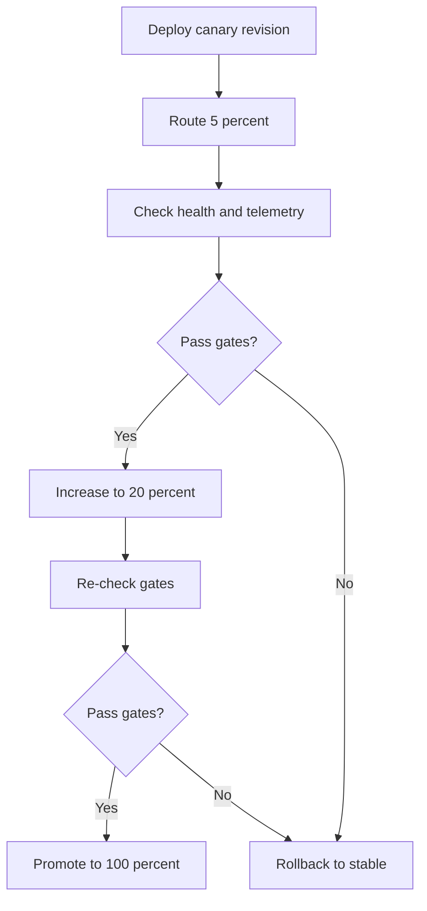

---
content_sources:
  diagrams:
  - id: staged-canary-promotion
    type: flowchart
    source: self-generated
    justification: Synthesized from Microsoft Learn guidance on revisions, traffic splitting, and revision-based deployment
      strategies.
    based_on:
    - https://learn.microsoft.com/azure/container-apps/traffic-splitting
    - https://learn.microsoft.com/azure/container-apps/revisions
    - https://learn.microsoft.com/azure/container-apps/blue-green-deployment
content_validation:
  status: verified
  last_reviewed: '2026-04-25'
  reviewer: ai-agent
  core_claims:
  - claim: Azure Container Apps supports weighted traffic splitting between revisions.
    source: https://learn.microsoft.com/azure/container-apps/traffic-splitting
    verified: true
  - claim: Multiple revision mode lets you keep more than one revision active during a rollout.
    source: https://learn.microsoft.com/azure/container-apps/revisions
    verified: true
  - claim: Revision-based deployment strategies in Azure Container Apps can support canary-style release workflows.
    source: https://learn.microsoft.com/azure/container-apps/blue-green-deployment
    verified: true
---
# Canary Deployment for Azure Container Apps

Canary deployment exposes a small slice of production traffic to a new revision, validates real behavior, and then increases weight in controlled steps. In Azure Container Apps, the platform primitive is weighted traffic split in multiple revision mode.

## Why This Matters

Canary is useful when you want production confidence without a binary full cutover.

- It reduces blast radius.
- It produces real traffic evidence.
- It supports rollback with a traffic change instead of a rebuild.

<!-- diagram-id: staged-canary-promotion -->


## Recommended Practices

### 1. Keep rollout stages explicit

Use fixed promotion steps such as:

- `95/5`
- `80/20`
- `50/50`
- `0/100`

```bash
az containerapp ingress traffic set \
  --name "$APP_NAME" \
  --resource-group "$RG" \
  --revision-weight "$APP_NAME--stable=95" "$APP_NAME--canary=5"
```

| Command | Why it is used |
|---|---|
| `az containerapp ingress traffic ...` | Runs the Azure CLI operation required by the documented step. |

### 2. Put metric gates between increments

Do not promote on elapsed time alone. Use gates such as:

- request success rate
- latency percentiles
- restart or probe failures
- queue lag or downstream saturation

Use the monitoring and alerting docs for the detailed telemetry implementation.

### 3. Keep the stable revision warm

The stable revision should remain active until the canary reaches 100% and clears the post-promotion confidence window.

### 4. Automate promotion, but automate rollback too

CI-driven gradual rollout is useful only if the same pipeline can stop or reverse promotion.

Example promotion progression:

```bash
az containerapp ingress traffic set \
  --name "$APP_NAME" \
  --resource-group "$RG" \
  --revision-weight "$APP_NAME--stable=80" "$APP_NAME--canary=20"

az containerapp ingress traffic set \
  --name "$APP_NAME" \
  --resource-group "$RG" \
  --revision-weight "$APP_NAME--stable=0" "$APP_NAME--canary=100"
```

| Command | Why it is used |
|---|---|
| `az containerapp ingress traffic ...` | Runs the Azure CLI operation required by the documented step. |

### 5. Use infrastructure code for the baseline, not each promotion step

Canary promotion is usually an operational action. Use Bicep to define revision mode and ingress, then let the pipeline update weights between stages.

```bicep
resource app 'Microsoft.App/containerApps@2026-01-01' = {
  name: appName
  location: location
  properties: {
    configuration: {
      activeRevisionsMode: 'Multiple'
      ingress: {
        external: true
        targetPort: 8080
      }
    }
  }
}
```

### Verify canary surfaces in Azure Portal


**[Observed]** `ca-sample-d38538 | Revisions and replicas` `Container App` `Create new revision` `Save` `Refresh` `Deployment mode` `Active revisions` `Inactive revisions` `Replicas` `Name` `Date created` `Running status` `View Logs` `Label` `Traffic` `Replicas` `ca-sample-d38538--0uzoi59` `6/3/2026, 10:34:26 PM` `Running` `View details` `Show Logs` `100 %` `1 (Show replicas)`.

**[Inferred]** The `Deployment mode` setting appears to map to the staged-rollout prerequisite in [1. Keep rollout stages explicit](#1-keep-rollout-stages-explicit), which is consistent with treating multiple-revision mode as the baseline for canary increments. The `Traffic` column with the displayed `100 %` value is consistent with the weighted-increment guidance in [1. Keep rollout stages explicit](#1-keep-rollout-stages-explicit), which advances the canary by adjusting traffic weights. The `Active revisions` and `Inactive revisions` grouping is consistent with the stable-warm guidance in [3. Keep the stable revision warm](#3-keep-the-stable-revision-warm), which keeps the prior revision available during the canary window. The `Save` command appears to map to the explicit-promotion step described in [4. Automate promotion, but automate rollback too](#4-automate-promotion-but-automate-rollback-too), which is consistent with committing a traffic change as the promotion action.

**[Not Proven]** Additional canary rollout detail, validation detail, and rollback detail are not visible on this view.

## Common Mistakes / Anti-Patterns

- **Jumping from 5% to 100% with no gates**
- **Ignoring revision-specific telemetry during the canary window**
- **Letting the stable revision go inactive too early**
- **Treating canary as a permanent traffic split**
- **Using resource signals alone as promotion gates**

!!! warning "Microsoft Learn documents weighted traffic splitting, but not one universal canary schedule"
    Percentages such as 95/5 or 80/20 are operational patterns, not service defaults. Tune the schedule to your SLOs and downstream capacity.

## Validation Checklist

- Multiple revision mode enabled
- Canary percentages defined before deployment
- Revision-specific health and latency gates defined
- Stable revision still active
- Rollback command scripted and tested
- Post-promotion observation window defined

## See Also

- [Blue/Green Deployment](blue-green-deployment.md)
- [Revision Strategy Best Practices](revision-strategy.md)
- [Traffic Split](../platform/revisions/traffic-split.md)
- [Scaling Best Practices](scaling.md)
- [Revision Operations](../operations/revision-management/index.md)
- [Monitoring Operations](../operations/monitoring/index.md)

## Sources

- [Traffic splitting in Azure Container Apps (Microsoft Learn)](https://learn.microsoft.com/azure/container-apps/traffic-splitting)
- [Revisions in Azure Container Apps (Microsoft Learn)](https://learn.microsoft.com/azure/container-apps/revisions)
- [Blue-Green Deployment in Azure Container Apps (Microsoft Learn)](https://learn.microsoft.com/azure/container-apps/blue-green-deployment)
- [Microsoft.App/containerApps template reference (Microsoft Learn)](https://learn.microsoft.com/azure/templates/microsoft.app/2026-01-01/containerapps)
