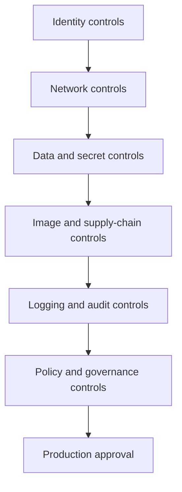

---
content_sources:
  diagrams:
    - id: production-security-baseline-control-stack
      type: flowchart
      source: mslearn-adapted
      based_on:
        - https://learn.microsoft.com/security/benchmark/azure/baselines/azure-container-apps-security-baseline
        - https://learn.microsoft.com/azure/container-apps/security
        - https://learn.microsoft.com/azure/container-apps/networking
        - https://learn.microsoft.com/azure/container-apps/manage-secrets
        - https://learn.microsoft.com/azure/container-apps/managed-identity-image-pull
        - https://learn.microsoft.com/azure/container-apps/policy-reference
content_validation:
  status: verified
  last_reviewed: "2026-04-25"
  reviewer: ai-agent
  core_claims:
    - claim: "Microsoft publishes an Azure security baseline for Azure Container Apps that maps benchmark controls to the service."
      source: "https://learn.microsoft.com/security/benchmark/azure/baselines/azure-container-apps-security-baseline"
      verified: true
    - claim: "Azure Container Apps supports managed identity, Key Vault-backed secrets, and revision-based configuration updates."
      source: "https://learn.microsoft.com/azure/container-apps/manage-secrets"
      verified: true
    - claim: "Container Apps networking documentation supports internal environments, custom VNets, private endpoints, and supported egress control patterns."
      source: "https://learn.microsoft.com/azure/container-apps/networking"
      verified: true
    - claim: "Container Apps policy reference documents built-in Azure Policy coverage for the service."
      source: "https://learn.microsoft.com/azure/container-apps/policy-reference"
      verified: true
---

# Azure Container Apps Compliance Baseline

This baseline turns Microsoft Learn security guidance into a practical production checklist for Azure Container Apps. Use it to validate a workload before promotion, while keeping a clear distinction between verified service features and governance controls that must be enforced outside the app resource.

## Why This Matters

Compliance reviews usually fail because teams mix together supported service controls, optional governance controls, and undocumented assumptions. Azure Container Apps works best when you validate each control category explicitly and record where the enforcement actually lives.

## Recommended Practices

### Start from the Microsoft baseline, then map to your platform standard

Microsoft publishes an Azure security baseline for Azure Container Apps. Use it as the control reference point, then convert it into a deployment checklist for your own environment.

Common benchmark areas you can verify directly on Microsoft Learn include:

- **IM**: identity management
- **NS**: network security
- **DP**: data protection
- **PV**: posture and vulnerability management
- **LT**: logging and threat detection
- **AM**: asset management and governance

<!-- diagram-id: production-security-baseline-control-stack -->


### Production baseline checklist by category

#### Identity

Mapped benchmark themes: **IM-1**, **IM-3**, **IM-8**

- Enable **managed identity** on every production container app.
- Prefer **Key Vault references** over inline secrets for sensitive values.
- Avoid embedding registry or service credentials where managed identity is supported.

Validation examples:

```bash
az containerapp identity show \
  --name "$APP_NAME" \
  --resource-group "$RG" \
  --output json

az role assignment list \
  --assignee-object-id "<principal-id>" \
  --output table
```

#### Network

Mapped benchmark themes: **NS-1**, **NS-2**

- Use an **internal environment** for private-only workloads.
- Use **private endpoints** for private inbound exposure or downstream Azure PaaS access where required.
- Use **internal ingress** or **no ingress** for non-edge services.
- Use **egress lockdown** only with supported environment networking features and validated dependency allow-lists.

Validation examples:

```bash
az containerapp env show \
  --name "$CONTAINER_ENV" \
  --resource-group "$RG" \
  --query "properties.vnetConfiguration.internal" \
  --output tsv

az containerapp show \
  --name "$APP_NAME" \
  --resource-group "$RG" \
  --query "properties.configuration.ingress.external" \
  --output tsv
```

#### Data and secrets

Mapped benchmark themes: **DP-3**, **DP-4**, **DP-6**, **DP-7**

- Use **TLS in transit** for exposed application paths.
- Use **Key Vault-backed secrets** for centralized lifecycle and auditability.
- Use **Key Vault certificate integration** where certificate lifecycle must be governed centrally.

!!! warning "Do not assume ACA environment CMK support"
    Microsoft Learn currently documents Key Vault-backed secrets and certificate integration, but not customer-managed keys for Container Apps environment encryption at rest. If your control framework requires environment-level CMK, record this as a gap or platform selection constraint.

Validation examples:

```bash
az containerapp secret list \
  --name "$APP_NAME" \
  --resource-group "$RG" \
  --output table

az containerapp show \
  --name "$APP_NAME" \
  --resource-group "$RG" \
  --query "properties.configuration.ingress.transport" \
  --output tsv
```

#### Image

Mapped benchmark themes: **PV-3**

- Use **ACR + managed identity** for production image pulls.
- Prefer immutable tags or **digests**.
- Enable **Defender for Containers** for ACR vulnerability assessment.
- Restrict image sources with **Azure Policy** and CI/CD governance.

Validation examples:

```bash
az containerapp registry show \
  --name "$APP_NAME" \
  --resource-group "$RG" \
  --server "$ACR_NAME.azurecr.io" \
  --output json

az containerapp show \
  --name "$APP_NAME" \
  --resource-group "$RG" \
  --query "properties.template.containers[].image" \
  --output table
```

#### Logging and audit

Mapped benchmark themes: **LT-4**

- Send diagnostic data to **Log Analytics**.
- Retain **Azure Activity Log** data according to policy.
- Review authentication failures, revision failures, and system logs.

Validation examples:

```bash
az monitor diagnostic-settings list \
  --resource "/subscriptions/<subscription-id>/resourceGroups/$RG/providers/Microsoft.App/managedEnvironments/$CONTAINER_ENV" \
  --output json
```

```kusto
ContainerAppSystemLogs_CL
| where TimeGenerated > ago(24h)
| summarize Count=count() by Reason_s
| order by Count desc
```

#### Encryption and service-to-service security

Mapped benchmark themes: **DP-3**, **DP-4**

- Use standard TLS for ingress and private dependency calls.
- Use **peer-to-peer mTLS** where documented for your workload pattern.
- Record that **environment-level CMK** is not a documented Container Apps feature surface today.

## Common Mistakes / Anti-Patterns

| Anti-pattern | Compliance risk | Better approach |
|---|---|---|
| Treating undocumented features as approved controls | Audit finding and architecture drift | Cite only what Microsoft Learn documents |
| External ingress on every app | Excessive attack surface | Edge-only public exposure |
| Secrets stored directly in environment variables without lifecycle control | Weak secret governance | Key Vault references |
| Registry passwords used where MI is available | Credential management risk | Managed identity + AcrPull |
| No diagnostic settings on environments | Weak investigation trail | Log Analytics + retention policy |
| Assuming CMK is available for ACA environment encryption | Incorrect compliance assertion | Record as unsupported/not documented |

## Validation Checklist

- [ ] Managed identity enabled on each production app.
- [ ] Role assignments scoped to least privilege.
- [ ] Internal environment used where public access is not required.
- [ ] Internal ingress or no ingress used for non-edge apps.
- [ ] Private endpoints configured for sensitive Azure dependencies where required.
- [ ] Key Vault references used for sensitive secrets.
- [ ] TLS enforced on exposed endpoints.
- [ ] ACR image pulls use managed identity.
- [ ] Defender for Containers enabled for ACR image scanning.
- [ ] Diagnostic settings stream logs to Log Analytics.
- [ ] Azure Policy coverage reviewed for Container Apps.
- [ ] CMK requirement assessed explicitly and documented as unsupported/not documented for ACA environment encryption at rest.

## See Also

- [Security Overview (Platform)](../platform/security/index.md)
- [Image Security (Platform)](../platform/security/image-security.md)
- [Secrets (Platform)](../platform/security/secrets.md)
- [Network Isolation (Platform)](../platform/security/network-isolation.md)
- [Customer-Managed Keys (Platform)](../platform/security/customer-managed-keys.md)
- [Security Best Practices](security.md)

## Sources

- [Azure security baseline for Azure Container Apps (Microsoft Learn)](https://learn.microsoft.com/security/benchmark/azure/baselines/azure-container-apps-security-baseline)
- [Security in Azure Container Apps (Microsoft Learn)](https://learn.microsoft.com/azure/container-apps/security)
- [Networking in Azure Container Apps (Microsoft Learn)](https://learn.microsoft.com/azure/container-apps/networking)
- [Manage secrets in Azure Container Apps (Microsoft Learn)](https://learn.microsoft.com/azure/container-apps/manage-secrets)
- [Pull images from Azure Container Registry with managed identity in Azure Container Apps (Microsoft Learn)](https://learn.microsoft.com/azure/container-apps/managed-identity-image-pull)
- [Policy reference for Azure Container Apps (Microsoft Learn)](https://learn.microsoft.com/azure/container-apps/policy-reference)
