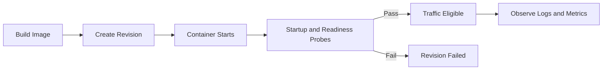
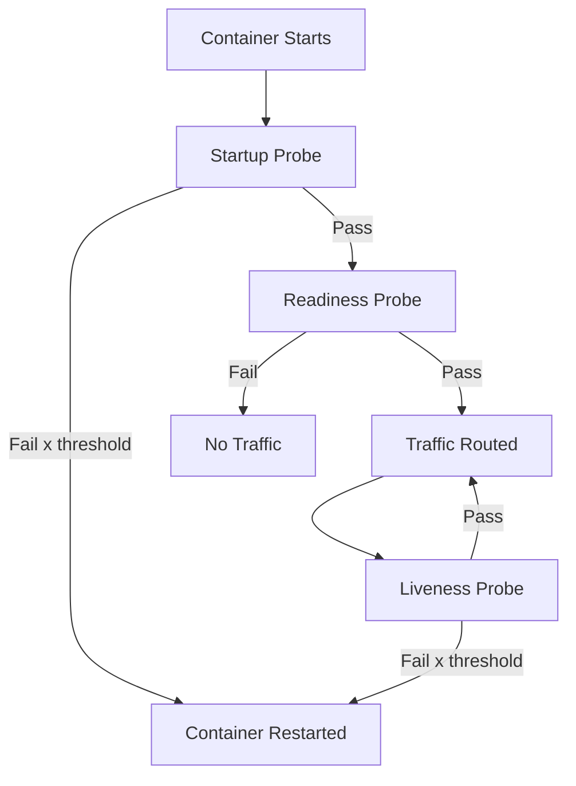

---
hide:
  - toc
content_sources:
  diagrams:
    - id: bad-container-defaults-slow-startup-missing
      type: flowchart
      source: mslearn-adapted
      based_on:
        - https://learn.microsoft.com/azure/container-apps/containers
    - id: probe-design-in-container-apps-should
      type: flowchart
      source: mslearn-adapted
      based_on:
        - https://learn.microsoft.com/azure/container-apps/containers
---

# Container Design Best Practices for Azure Container Apps

This guide focuses on container-level operational decisions that improve startup reliability, revision stability, observability quality, and cost control in Azure Container Apps. It complements the platform architecture pages by translating core runtime behaviors into repeatable container design standards.

## Prerequisites

- Azure CLI 2.57+ with Container Apps extension
- Docker 24+ or compatible OCI image builder
- Existing resource group (`$RG`), Container Apps environment (`$ENVIRONMENT_NAME`), and Container Registry (`$ACR_NAME`)
- A containerized app with a health endpoint and graceful shutdown support

```bash
az extension add --name containerapp --upgrade
az account show --output table
az acr show --name "$ACR_NAME" --resource-group "$RG" --output table
az containerapp env show --name "$ENVIRONMENT_NAME" --resource-group "$RG" --output table
```

## Main Content

### Design for the Azure Container Apps execution model

In Azure Container Apps, revision readiness gates traffic and scaler behavior. Container design directly affects whether revisions become healthy, scale correctly, and recover quickly.

Use these design assumptions:

1. Every deployment creates a revision candidate.
2. A revision must pass startup and readiness checks before it can safely carry production traffic.
3. Bad container defaults (slow startup, missing probe path, unhandled SIGTERM, noisy logs) become deployment incidents.

<!-- diagram-id: bad-container-defaults-slow-startup-missing -->


### Multi-stage builds to reduce pull and cold-start time

Large images increase pull latency and amplify scale-out delay. Multi-stage builds keep runtime artifacts only.

Key practices:

- Separate build toolchain from runtime image.
- Pin base image tags to predictable patch versions.
- Remove package manager cache from final layer.
- Build wheel/artifact once, reuse in runtime stage.

```dockerfile
# syntax=docker/dockerfile:1.7
FROM python:3.11-slim AS builder

ENV PIP_DISABLE_PIP_VERSION_CHECK=1 \
    PIP_NO_CACHE_DIR=1 \
    PYTHONDONTWRITEBYTECODE=1

WORKDIR /build
RUN apt-get update && apt-get install --yes --no-install-recommends \
    build-essential \
    gcc \
    && rm -rf /var/lib/apt/lists/*

COPY requirements.txt .
RUN pip install --upgrade pip \
    && pip wheel --wheel-dir /wheels --requirement requirements.txt

FROM python:3.11-slim AS runtime

ENV PYTHONDONTWRITEBYTECODE=1 \
    PYTHONUNBUFFERED=1 \
    CONTAINER_APP_PORT=8000

WORKDIR /app
RUN groupadd --gid 10001 appgroup \
    && useradd --uid 10001 --gid appgroup --create-home appuser

COPY --from=builder /wheels /wheels
COPY requirements.txt .
RUN pip install --no-cache-dir --no-index --find-links=/wheels --requirement requirements.txt \
    && rm -rf /wheels

COPY src ./src
USER appuser
EXPOSE 8000

CMD ["gunicorn", "--bind", "0.0.0.0:8000", "--workers", "4", "--chdir", "src", "app:app"]
```

!!! warning "Do not optimize only for image size"
    A smaller image is useful only when runtime dependencies are complete. Validate SSL libraries, DNS behavior, and timezone data in runtime images before promoting revisions.

### Choose base image type by operational constraints

Base image selection is an operational tradeoff between security posture, debuggability, and compatibility.

| Base image | Strength | Risk | Good fit in Container Apps |
|---|---|---|---|
| distroless | Minimal attack surface | Harder interactive debugging | Mature services with strong CI validation |
| slim | Balanced size and compatibility | Slightly larger footprint | Most production services |
| alpine | Very small | musl-related compatibility issues | Carefully tested static-friendly workloads |

Decision checklist:

- Need shell-based runtime investigation during incident response? Prefer `slim`.
- Need maximum hardening and deterministic runtime? Consider `distroless` with strict CI.
- Using native extensions compiled against glibc? Validate before choosing `alpine`.

### Ensure deterministic startup behavior

Startup failures in revisions commonly come from non-deterministic boot logic.

Use these controls:

- Avoid migration execution inside container startup command for request-serving apps.
- Fail fast on invalid configuration.
- Keep bootstrap network calls bounded by short timeouts.
- Log one clear startup summary line with critical runtime configuration.

Example startup summary payload:

```json
{
  "event": "startup_summary",
  "app_name": "orders-api",
  "bind_port": 8000,
  "revision_mode": "single",
  "config_version": "2026-04-04",
  "status": "starting"
}
```

### Configure startup, readiness, and liveness probes intentionally

Probe design in Container Apps should represent actual lifecycle intent.

| Probe Type | Purpose | Endpoint Design | Failure Effect |
|---|---|---|---|
| **Startup** | Protect slow initialization from premature restart | Return 200 after all boot tasks complete | Container restarted before ready |
| **Readiness** | Control when traffic can reach the revision | Return 200 only when serving is safe | Traffic sent to unready replica |
| **Liveness** | Restart hung processes after running state | Return 200 if process loop is healthy | Stuck replica stays in rotation |

<!-- diagram-id: probe-design-in-container-apps-should -->


Use a YAML template for probes (the probe-specific CLI flags are not supported in current `az containerapp create`).

```yaml
# probes.yaml
properties:
  template:
    containers:
      - name: myapp
        image: myacr.azurecr.io/myapp:v1
        resources:
          cpu: 0.5
          memory: 1Gi
        probes:
          - type: startup
            httpGet:
              path: /health/startup
              port: 8000
            initialDelaySeconds: 5
            periodSeconds: 5
            failureThreshold: 24
            timeoutSeconds: 3
          - type: readiness
            httpGet:
              path: /health/ready
              port: 8000
            periodSeconds: 5
            failureThreshold: 6
            timeoutSeconds: 3
          - type: liveness
            httpGet:
              path: /health/live
              port: 8000
            periodSeconds: 10
            failureThreshold: 3
            timeoutSeconds: 3
```

```bash
az containerapp create \
  --name "$APP_NAME" \
  --resource-group "$RG" \
  --environment "$ENVIRONMENT_NAME" \
  --image "$ACR_NAME.azurecr.io/$APP_NAME:20260404-1" \
  --target-port 8000 \
  --ingress external \
  --registry-server "$ACR_NAME.azurecr.io" \
  --registry-identity system \
  --min-replicas 1 \
  --max-replicas 5

az containerapp update \
  --name "$APP_NAME" \
  --resource-group "$RG" \
  --yaml "probes.yaml"
```

Probe tuning guidance:

1. Set startup probe window to worst-case cold start plus dependency initialization.
2. Keep readiness endpoint shallow and deterministic.
3. Keep liveness endpoint focused on process health, not deep dependency checks.
4. Avoid using one endpoint for all probe types unless the app is simple and initialization is minimal.

!!! warning "Readiness must reflect true traffic safety"
    Returning HTTP 200 before connection pools, config fetch, or cache warm-up is complete causes immediate production errors after deployment. Gate readiness on real serving capability.

### Align application port binding with `CONTAINER_APP_PORT`

Container Apps ingress forwards to the target port you configure. The app must listen on the same value.

Recommended pattern:

```python
import os
from flask import Flask

app = Flask(__name__)

if __name__ == "__main__":
    port = int(os.environ.get("CONTAINER_APP_PORT", "8000"))
    app.run(host="0.0.0.0", port=port)
```

!!! note "PORT vs CONTAINER_APP_PORT"
    The reference application in this repository uses `PORT` as its environment variable for Gunicorn binding. `CONTAINER_APP_PORT` is the platform-injected variable. Both approaches work; what matters is that your application listens on the same port configured as the ingress target port. This guide recommends `CONTAINER_APP_PORT` for new applications to align with platform conventions.

Validation commands:

```bash
az containerapp show \
  --name "$APP_NAME" \
  --resource-group "$RG" \
  --query "properties.configuration.ingress.targetPort"

az containerapp revision list \
  --name "$APP_NAME" \
  --resource-group "$RG" \
  --output table
```

### Implement SIGTERM-aware graceful shutdown

Scale-in and revision deactivation terminate containers. If SIGTERM is ignored, in-flight requests are dropped and logs are truncated.

```python
import signal
import threading
from flask import Flask, jsonify

app = Flask(__name__)
is_draining = threading.Event()

def handle_sigterm(signum, frame):
    is_draining.set()

signal.signal(signal.SIGTERM, handle_sigterm)

@app.get("/health/ready")
def ready():
    if is_draining.is_set():
        return jsonify(status="draining"), 503
    return jsonify(status="ready"), 200
```

Operational behavior:

- Stop accepting new requests quickly.
- Let current requests finish within grace period.
- Flush structured logs before process exit.

### Emit structured JSON logs for Log Analytics

Container Apps streams stdout/stderr to Log Analytics. Structured JSON allows precise KQL filtering and correlation.

Required fields per line:

- `timestamp`
- `level`
- `message`
- `app`
- `revision`
- `trace_id` (if available)
- `operation` or endpoint

Example log line:

```json
{
  "timestamp": "2026-04-04T09:15:26Z",
  "level": "INFO",
  "message": "request_complete",
  "app": "orders-api",
  "revision": "orders-api--20260404-1",
  "method": "GET",
  "path": "/orders/123",
  "status": 200,
  "duration_ms": 42,
  "trace_id": "5f9d95d9f1ef4a1abf17"
}
```

KQL check for malformed logs:

```kusto
ContainerAppConsoleLogs_CL
| where TimeGenerated > ago(30m)
| where ContainerAppName_s == "$APP_NAME"
| extend Parsed = parse_json(Log_s)
| where isnull(Parsed.level) or isnull(Parsed.message)
| project TimeGenerated, Log_s
```

### Separate environment variables from secrets

Use plain environment variables for non-sensitive runtime toggles and endpoint names. Use Container Apps secrets for credentials and tokens.

```bash
az containerapp secret set \
  --name "$APP_NAME" \
  --resource-group "$RG" \
  --secrets "db-password=<db-password>" "api-key=<api-key>"

az containerapp update \
  --name "$APP_NAME" \
  --resource-group "$RG" \
  --set-env-vars "APP_LOG_LEVEL=INFO" "UPSTREAM_BASE_URL=https://internal.example" \
  --replace-env-vars "DB_PASSWORD=secretref:db-password" "API_KEY=secretref:api-key"
```

Separation policy:

1. Non-secret configuration can be revision-scoped and visible in deployment manifests.
2. Secrets should be rotated independently and referenced via `secretref:`.
3. Never hardcode secrets in Dockerfile layers.

!!! warning "Secret values are operational assets"
    Treat every secret update as a production change. Validate applications handle secret refresh and restart behavior safely.

### Use immutable image tags and reject `:latest` in production

Container Apps revision immutability is strongest when image tags are immutable.

### Immutable image tag formats

| Tag Format | Example | Traceability | Recommended |
|---|---|---|---|
| Date + sequence | `20260404-1` | Deploy date visible | ✅ Simple teams |
| Git short SHA | `git-a1b2c3d` | Exact commit link | ✅ CI/CD pipelines |
| Semantic release | `release-2026-04-04.1` | Calendar + ordinal | ✅ Release-gated |
| `latest` | `latest` | None — mutable | ❌ Never in production |
| Branch name | `main` | None — mutable | ❌ Never in production |

```bash
export IMAGE_TAG="git-$(git rev-parse --short HEAD)"
export IMAGE_NAME="$ACR_NAME.azurecr.io/$APP_NAME:$IMAGE_TAG"

docker build --tag "$IMAGE_NAME" .
docker push "$IMAGE_NAME"

az containerapp update \
  --name "$APP_NAME" \
  --resource-group "$RG" \
  --image "$IMAGE_NAME"
```

### Validate container behavior before revision promotion

Pre-promotion checks reduce failed revisions and emergency rollbacks.

```bash
docker run --rm --publish 8000:8000 --env CONTAINER_APP_PORT=8000 "$IMAGE_NAME"
curl --fail "http://localhost:8000/health/startup"
curl --fail "http://localhost:8000/health/ready"
curl --fail "http://localhost:8000/health/live"
```

Container readiness checklist:

- Image size within team budget threshold.
- Port binding is dynamic through `CONTAINER_APP_PORT`.
- Probe endpoints are present and stable.
- SIGTERM handling confirmed.
- JSON log schema validated.
- No secret material in build layers.

### Standardize container design with a policy baseline

Define a shared baseline so every app team ships revisions with consistent runtime quality.

Example policy baseline:

| Control | Minimum Standard |
|---|---|
| Base image | Supported LTS image with patch cadence policy |
| User context | Non-root runtime user |
| Port binding | Uses `CONTAINER_APP_PORT` fallback to 8000 |
| Health probes | Startup, readiness, liveness endpoints implemented |
| Logging | JSON logs with severity and revision fields |
| Secrets | All sensitive values injected via `secretref:` |
| Tagging | Immutable tag only, no `latest` |

## Advanced Topics

### Hardened supply chain integration

For higher assurance deployments:

- Generate SBOM per image build.
- Enforce vulnerability threshold gates in CI.
- Sign images and verify signatures in release pipelines.
- Retain digest-to-release metadata for incident reconstruction.

### Progressive probe tightening

Start with conservative probe thresholds for new services, then tighten based on observed startup distributions and error patterns.

### Distroless migration strategy

Migrate from `slim` to `distroless` only after:

1. Runtime dependency map is complete.
2. Startup and TLS behavior are validated in staging.
3. Incident playbooks include non-shell troubleshooting methods.

### Structured logging schema governance

Treat log schema as a versioned contract. Breaking schema changes should go through review, with KQL dashboard compatibility checks.

## See Also

- [Platform: Revisions](../platform/revisions/index.md)
- [Platform: Scaling](../platform/scaling/index.md)
- [Operations: Deployment](../operations/deployment/index.md)
- [Operations: Monitoring](../operations/monitoring/index.md)
- [Python Recipe: Custom Container](../language-guides/python/recipes/custom-container.md)

## Sources

- [Microsoft Learn: Manage containers in Azure Container Apps](https://learn.microsoft.com/azure/container-apps/containers)
