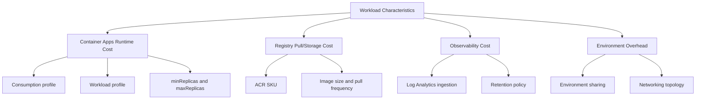
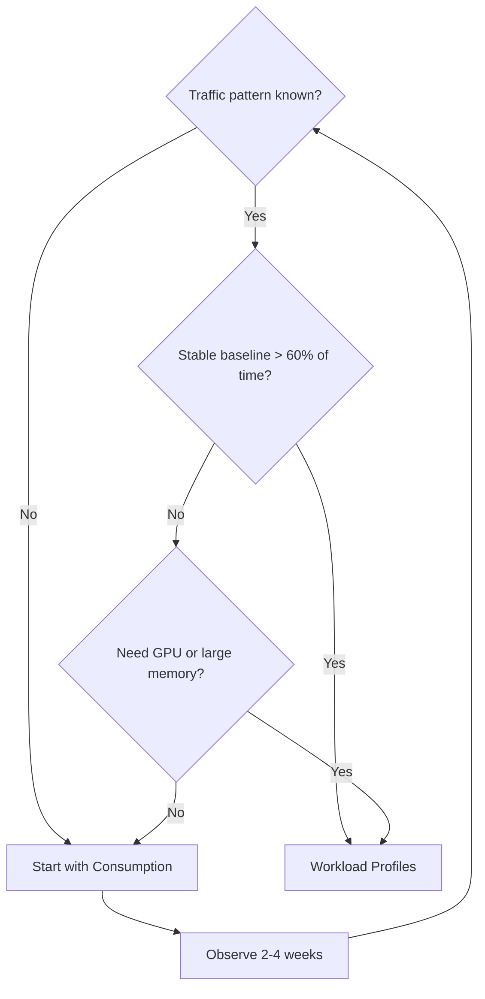

---
hide:
  - toc
content_sources:
  diagrams:
    - id: if-you-optimize-only-one-meter
      type: flowchart
      source: mslearn-adapted
      based_on:
        - https://learn.microsoft.com/en-us/azure/container-apps/billing
        - https://learn.microsoft.com/en-us/azure/container-apps/environment
        - https://learn.microsoft.com/en-us/azure/reliability/reliability-container-apps
    - id: choose-profile-type-by-workload-shape
      type: flowchart
      source: mslearn-adapted
      based_on:
        - https://learn.microsoft.com/en-us/azure/container-apps/billing
        - https://learn.microsoft.com/en-us/azure/container-apps/environment
        - https://learn.microsoft.com/en-us/azure/reliability/reliability-container-apps
---

# Cost-Aware Best Practices

Cost optimization in Azure Container Apps is an operational design activity, not a one-time tuning task. This guide explains how to reduce spend without sacrificing reliability by using the platform's scaling, profile, registry, and observability features intentionally.

## Prerequisites

- Existing Azure Container Apps environment
- At least one running Container App
- Access to Cost Management and Log Analytics
- Azure CLI with Container Apps extension

```bash
export RG="rg-aca-prod"
export APP_NAME="app-orders-api"
export ENVIRONMENT_NAME="cae-prod-shared"
export ACR_NAME="acrsharedprod"
export LOCATION="koreacentral"

az extension add --name "containerapp" --upgrade
az account show --output table
```

## Main Content

### Understand the billing model before tuning

Azure Container Apps costs come from multiple meters that interact:

- Compute/runtime usage (CPU and memory)
- Workload profile capacity (when using dedicated profiles)
- Registry costs (Azure Container Registry SKU and data transfer)
- Log ingestion and retention (Log Analytics)
- Environment-level resources and optional networking features

If you optimize only one meter (for example, CPU), your total cost can still increase due to logs, always-on replicas, or over-frequent job schedules.

<!-- diagram-id: if-you-optimize-only-one-meter -->


!!! note "Optimization sequence"
    Start with architecture-level choices (profile, environment boundary, image strategy), then tune per-app resources and scale rules. Reversing this order usually creates local optimizations but higher total spend.

### Consumption profile vs workload profiles

Choose profile type by workload shape, not team preference:

| Factor | Consumption | Workload Profiles |
|---|---|---|
| Billing model | Pay per vCPU-second and GiB-second | Reserved node capacity |
| Scale-to-zero | ✅ Supported | ✅ Supported (on Consumption nodes) |
| Burst handling | Automatic, platform-managed | Bounded by node pool size |
| Cost predictability | Variable with traffic | More predictable baseline |
| Best for | Bursty, intermittent, unknown traffic | Stable baseline, GPU, large memory |
| Cold start | Platform-managed, possible delay | Faster if nodes pre-provisioned |

<!-- diagram-id: choose-profile-type-by-workload-shape -->


Inspect current environment profile configuration:

```bash
az containerapp env show \
  --name "$ENVIRONMENT_NAME" \
  --resource-group "$RG" \
  --query "properties.workloadProfiles" \
  --output json
```

Inspect an app's active profile and requested resources:

```bash
az containerapp show \
  --name "$APP_NAME" \
  --resource-group "$RG" \
  --query "{workloadProfile:properties.workloadProfileName,cpu:properties.template.containers[0].resources.cpu,memory:properties.template.containers[0].resources.memory,minReplicas:properties.template.scale.minReplicas,maxReplicas:properties.template.scale.maxReplicas}" \
  --output json
```

Practical decision pattern:

1. Start in consumption for unknown traffic.
2. Observe p50/p95 baseline replica hours over 2-4 weeks.
3. Move stable high-baseline services to workload profiles.
4. Keep burst-only APIs and async edges on consumption.

### Scale-to-zero and billing impact

Scale-to-zero is the strongest cost control for non-critical or sporadic workloads.

```bash
az containerapp update \
  --name "$APP_NAME" \
  --resource-group "$RG" \
  --min-replicas 0 \
  --max-replicas 5
```

When min replicas are zero:

- You avoid always-on runtime cost during idle periods.
- You may increase cold-start latency.
- You must validate startup probes and initialization time.

For user-facing APIs where latency SLO is strict, use a non-zero baseline:

```bash
az containerapp update \
  --name "$APP_NAME" \
  --resource-group "$RG" \
  --min-replicas 1 \
  --max-replicas 10
```

!!! warning "Do not optimize cost by breaking SLO"
    If your API has hard latency objectives, forcing `--min-replicas 0` can make tail latency unacceptable. Optimize elsewhere first (resource sizing, image startup, scaling thresholds).

### Min replica costs and always-on design

`minReplicas` is effectively an explicit "always-on" commitment.

Use min replicas when you need:

- Consistent p95 latency without cold starts
- Warm caches or preloaded models
- Immediate queue processing for low-lag pipelines

Use zero min replicas when you have:

- Batch-style traffic
- Background APIs for admin tooling
- Internal endpoints with no strict latency target

Quick baseline cost check for min replica usage:

```bash
az containerapp show \
  --name "$APP_NAME" \
  --resource-group "$RG" \
  --query "properties.template.scale.minReplicas" \
  --output tsv
```

### Right-size CPU and memory intentionally

Over-provisioned resources are one of the most common sources of Container Apps waste.

Start with measured targets:

- CPU: sustained usage under expected p95 load
- Memory: steady-state plus burst headroom, not arbitrary large buffers
- OOM event count: should be zero in normal operation

Review configured resources:

```bash
az containerapp show \
  --name "$APP_NAME" \
  --resource-group "$RG" \
  --query "properties.template.containers[0].resources" \
  --output json
```

Apply a smaller footprint safely:

```bash
az containerapp update \
  --name "$APP_NAME" \
  --resource-group "$RG" \
  --cpu 0.5 \
  --memory "1Gi"
```

Then validate health and throughput before further reduction.

### Registry SKU and image pull economics (ACR Basic vs Standard vs Premium)

ACR selection affects both direct registry pricing and indirect runtime behavior:

| ACR SKU | Storage | Throughput | Geo-Replication | Best For |
|---|---|---|---|---|
| **Basic** | 10 GiB | Low | ❌ | Small teams, dev/test |
| **Standard** | 100 GiB | Medium | ❌ | Growing production workloads |
| **Premium** | 500 GiB | High | ✅ | Multi-region, enterprise scale |

Check registry SKU:

```bash
az acr show \
  --name "$ACR_NAME" \
  --resource-group "$RG" \
  --query "{name:name,sku:sku.name,loginServer:loginServer}" \
  --output json
```

Operational implications:

- Large images + frequent revision deployments increase pull and startup overhead.
- Geo-distributed workloads can benefit from lower image pull latency with higher SKU features.
- Excessively retaining old tags increases storage cost and operational confusion.

List recent repository tags to review cleanup candidates:

```bash
az acr repository show-tags \
  --name "$ACR_NAME" \
  --repository "orders-api" \
  --orderby "time_desc" \
  --top 20 \
  --output table
```

### Reduce log ingestion cost without losing diagnostic value

Log Analytics can become a dominant cost driver if you emit verbose logs at high request volume.

Container Apps-specific tactics:

- Keep structured logs, but avoid duplicate payload dumps.
- Log business events once, not at each internal layer.
- Use `Info` for lifecycle milestones, `Warning/Error` for action-worthy signals.
- Restrict high-cardinality fields that explode ingestion size.

Inspect workspace linkage:

```bash
az containerapp env show \
  --name "$ENVIRONMENT_NAME" \
  --resource-group "$RG" \
  --query "properties.appLogsConfiguration" \
  --output json
```

Example KQL to estimate noisy categories:

```kusto
ContainerAppConsoleLogs_CL
| where TimeGenerated > ago(24h)
| summarize LogLines=count(), ApproxBytes=sum(_BilledSize) by ContainerAppName_s, LogLevel=tostring(parse_json(Log_s).level)
| order by ApproxBytes desc
```

Use results to cap noisy logs in application and sidecar settings.

### Share environments strategically to reduce overhead

Environment sharing can reduce duplicated operational overhead, but only when boundaries are compatible.

Share an environment when workloads have similar:

- Compliance and data boundary requirements
- Network topology (public/private ingress patterns)
- Operational ownership and release cadence

Separate environments when you need:

- Strict isolation across teams or trust zones
- Distinct networking policies (for example private-only ingress)
- Independent lifecycle and change windows

List apps in an environment to evaluate consolidation:

```bash
az containerapp list \
  --resource-group "$RG" \
  --query "[?contains(properties.managedEnvironmentId, '$ENVIRONMENT_NAME')].{name:name,ingress:properties.configuration.ingress.external,minReplicas:properties.template.scale.minReplicas}" \
  --output table
```

### Understand idle environment cost

A common misconception is that "no running app" equals "zero platform cost".

Even with minimal workload activity, environment-related services and connected resources may continue to incur charges, including:

- Log Analytics workspace retention/ingestion
- Registry storage
- Networking resources used by the environment topology

Review environment state regularly:

```bash
az containerapp env show \
  --name "$ENVIRONMENT_NAME" \
  --resource-group "$RG" \
  --query "{name:name,location:location,provisioningState:properties.provisioningState,zoneRedundant:properties.zoneRedundant}" \
  --output json
```

### Budget guardrails with Azure Cost Management

Create budget and anomaly review routines for Container Apps estates:

- Budget per environment (dev, staging, prod)
- Budget per shared platform resource group
- Alert thresholds (for example 50%, 80%, 100%)

Quick cost snapshot by service name:

```bash
az consumption usage list \
  --top 50 \
  --output table
```

Export cost data regularly and tag resources for cost allocation:

```bash
az group update \
  --name "$RG" \
  --set "tags.CostCenter=platform" "tags.Environment=prod"
```

!!! tip "Governance pattern"
    Pair technical guardrails (`--max-replicas`, right-sized resources, log controls) with financial guardrails (budgets, alerts, owner review cadence). Either one without the other is incomplete.

### Cost-aware deployment checklist

Use this checklist before production rollout:

| Area | Check | Target |
|---|---|---|
| Scaling | `minReplicas` aligned to latency need | `0` for async, `1+` for latency-critical |
| Resources | CPU/memory based on measured load | No speculative over-allocation |
| Registry | ACR SKU and retention reviewed | Throughput and storage aligned |
| Logs | High-volume noise reduced | Actionable logs with bounded volume |
| Environment | Sharing/isolation decision documented | No accidental sprawl |
| Budget | Alerts configured | 50/80/100 percent notifications |

### Example: end-to-end cost tuning workflow

1. Baseline current app scale and resources.
2. Set `minReplicas` based on SLO, not habit.
3. Reduce CPU/memory one step and observe error budget.
4. Cut log verbosity where `_BilledSize` dominates.
5. Review image size and tag retention.
6. Validate monthly trend with Cost Management export.

Baseline command group:

```bash
az containerapp show \
  --name "$APP_NAME" \
  --resource-group "$RG" \
  --query "{profile:properties.workloadProfileName,minReplicas:properties.template.scale.minReplicas,maxReplicas:properties.template.scale.maxReplicas,cpu:properties.template.containers[0].resources.cpu,memory:properties.template.containers[0].resources.memory}" \
  --output json
```

### Cost anti-patterns to avoid during optimization

- Forcing scale-to-zero on user-facing critical APIs
- Increasing `maxReplicas` without downstream capacity planning
- Enabling highly verbose logs in production by default
- Retaining oversized base images and rebuilding frequently
- Creating many small environments without ownership boundaries

## Advanced Topics

- Model monthly cost per workload class (interactive API, internal service, scheduled jobs) and assign explicit SLO-to-cost envelopes.
- Combine workload profiles for baseline traffic and consumption profiles for burst edges in the same architecture.
- Build automated policy checks for `minReplicas`, image tag format, and maximum resource requests before deployment.
- Use KQL-based spend proxies (for example billed log volume and replica-hours approximations) as early warning signals between official billing cycles.

## See Also

- [Best Practices - Scaling](scaling.md)
- [Best Practices - Reliability](reliability.md)
- [Best Practices - Identity and Secrets](identity-and-secrets.md)
- [Platform - Reliability Cost Optimization](../platform/reliability/cost-optimization.md)
- [Operations - Monitoring](../operations/monitoring/index.md)
