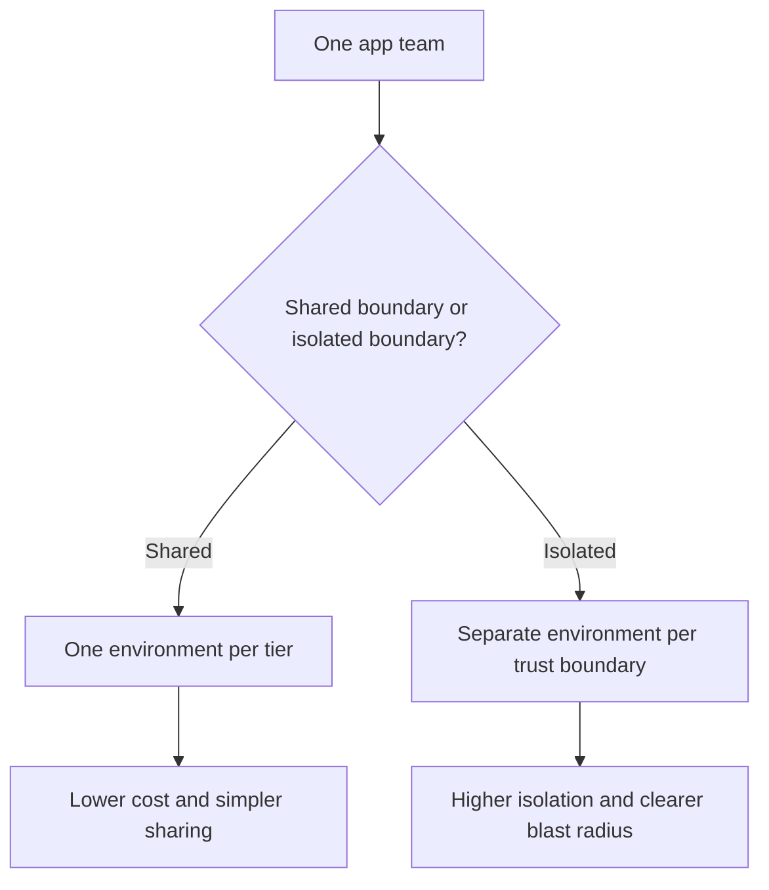

---
content_sources:
  diagrams:
    - id: environment-boundary-patterns
      type: flowchart
      source: self-generated
      justification: "Synthesizes Azure Container Apps environment boundaries with Azure naming, tagging, and regional guidance."
      based_on:
        - https://learn.microsoft.com/en-us/azure/container-apps/structure
        - https://learn.microsoft.com/en-us/azure/container-apps/networking
        - https://learn.microsoft.com/en-us/azure/cloud-adoption-framework/ready/azure-best-practices/resource-naming
        - https://learn.microsoft.com/en-us/azure/cloud-adoption-framework/ready/azure-best-practices/resource-tagging
        - https://learn.microsoft.com/en-us/azure/reliability/regions-list
content_validation:
  status: verified
  last_reviewed: "2026-04-26"
  reviewer: ai-agent
  core_claims:
    - claim: "Workload profiles (v2) is the default Azure Container Apps environment type for new environments."
      source: "https://learn.microsoft.com/en-us/azure/container-apps/structure"
      verified: true
    - claim: "Once created, a Container Apps environment can't change between the default Azure network and an existing VNet."
      source: "https://learn.microsoft.com/en-us/azure/container-apps/networking"
      verified: true
    - claim: "Cloud Adoption Framework guidance says most Azure resource names can't be changed after creation and recommends using tags for information that can change."
      source: "https://learn.microsoft.com/en-us/azure/cloud-adoption-framework/ready/azure-best-practices/resource-naming"
      verified: true
    - claim: "Cloud Adoption Framework guidance recommends using the same core tagging schema for all resources and not storing sensitive values in tags."
      source: "https://learn.microsoft.com/en-us/azure/cloud-adoption-framework/ready/azure-best-practices/resource-tagging"
      verified: true
---

# Environment Design

Environment design determines the blast radius, networking flexibility, and operational ownership model of your Azure Container Apps platform. Get this right early, because environment boundaries are harder to change than app settings.

## Why This Matters

<!-- diagram-id: environment-boundary-patterns -->


Environment choices affect:

- Network and ingress posture.
- Subnet sizing and quota planning.
- Cost shape and profile reuse.
- How safely you can separate dev, staging, and production change windows.

## Recommended Practices

### Use one environment per lifecycle tier by default

Start with separate environments for:

- Development
- Staging / pre-production
- Production

This keeps production networking, quota, and rollback boundaries separate from lower environments.

### Share environments only when the boundary is truly shared

Sharing an environment across multiple apps is reasonable when they share the same:

- Network trust boundary
- Compliance posture
- Operational ownership
- Deployment cadence tolerance

If those differ, separate the environments.

### Use environment-level blue/green sparingly

Environment-level blue/green is useful, but rare. Prefer revision traffic management first because it is usually cheaper and simpler than cloning an entire environment. Reserve environment-level blue/green for cases where you must test new environment networking, profile mix, or regional placement.

### Choose regions deliberately

Pick regions by checking:

- Compliance and geography requirements.
- User latency.
- Availability zone support.
- Workload profile and GPU availability.

### Standardize names and tags

For environment names, keep only stable information in the name.

Suggested pattern:

```text
cae-<workload>-<tier>-<region>
```

Examples:

- `cae-payments-prod-koreacentral`
- `cae-shared-dev-eastus2`

Suggested baseline tags:

| Tag | Example |
|---|---|
| `environment` | `production` |
| `workload` | `payments` |
| `region` | `koreacentral` |
| `business-unit` | `finance` |
| `operations-team` | `platform-engineering` |

## Common Mistakes / Anti-Patterns

- Putting production and development apps in the same environment.
- Starting with the smallest possible subnet and discovering IP pressure during rollout.
- Reserving far more subnet space than the workload can justify.
- Assuming environment migration is a quick in-place setting change.
- Skipping zone redundancy review for critical environments.
- Encoding changeable business metadata into environment names instead of tags.

## Validation Checklist

- [ ] Environment boundaries are documented by tier, trust zone, and ownership.
- [ ] Subnet sizing includes growth headroom, not only day-one minimums.
- [ ] Region choice is validated for latency, compliance, and required profile availability.
- [ ] Naming follows a stable convention and avoids mutable metadata.
- [ ] Tags cover ownership, environment, workload, and region.
- [ ] Production isolation is explicit, not implied.

## See Also

- [Environments in Azure Container Apps](../platform/environments/index.md)
- [Plans and Workload Profiles](../platform/environments/plans-and-workload-profiles.md)
- [Networking and CIDR](../platform/environments/networking-and-cidr.md)
- [Azure Container Apps Networking Best Practices](networking.md)
- [Migration](../platform/environments/migration.md)

## Sources

- [Compute and billing structures in Azure Container Apps (Microsoft Learn)](https://learn.microsoft.com/en-us/azure/container-apps/structure)
- [Networking in Azure Container Apps environment (Microsoft Learn)](https://learn.microsoft.com/en-us/azure/container-apps/networking)
- [Define your naming convention (Cloud Adoption Framework)](https://learn.microsoft.com/en-us/azure/cloud-adoption-framework/ready/azure-best-practices/resource-naming)
- [Define your tagging strategy (Cloud Adoption Framework)](https://learn.microsoft.com/en-us/azure/cloud-adoption-framework/ready/azure-best-practices/resource-tagging)
- [List of Azure regions (Microsoft Learn)](https://learn.microsoft.com/en-us/azure/reliability/regions-list)
