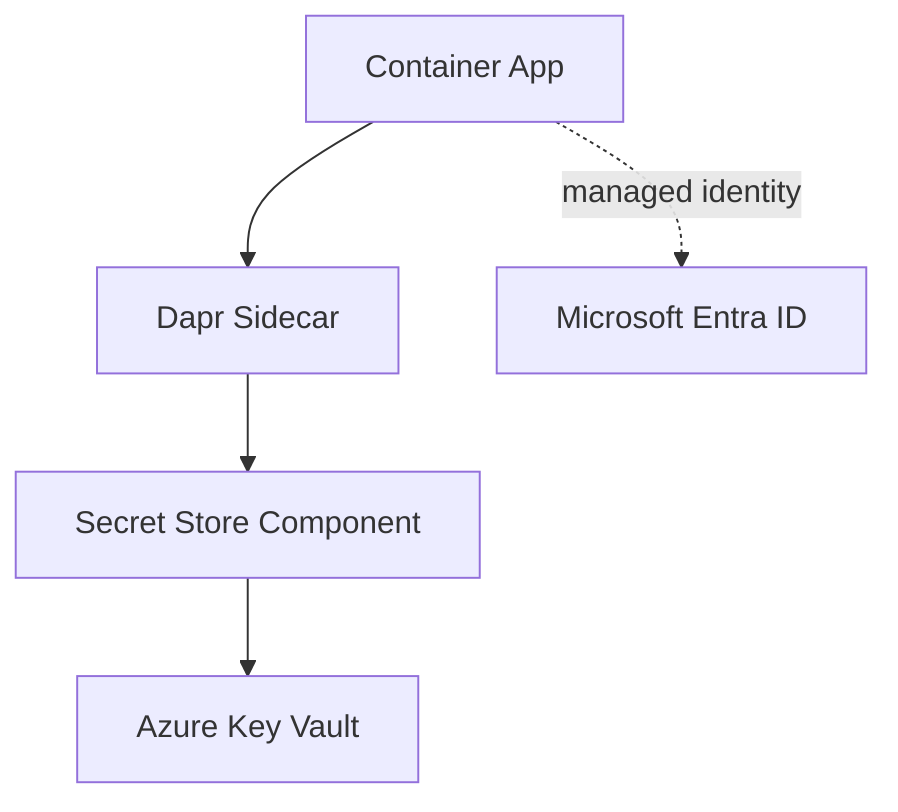
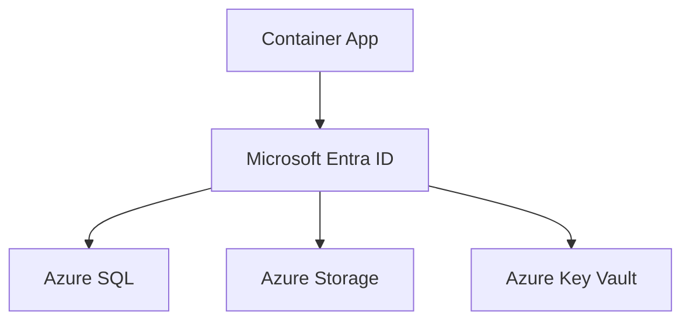
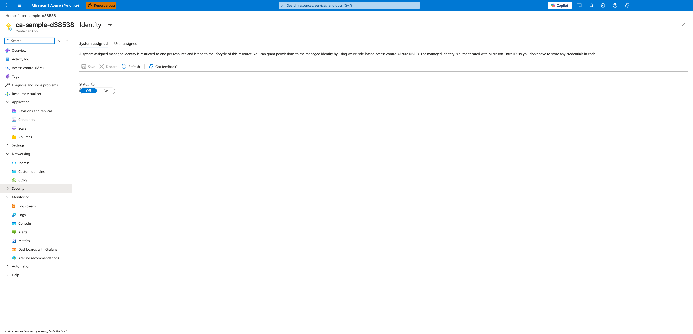

---
content_sources:
  diagrams:
  - id: if-you-use-dapr-centralize-runtime
    type: flowchart
    source: mslearn-adapted
    based_on:
    - https://learn.microsoft.com/en-us/azure/container-apps/managed-identity
    - https://learn.microsoft.com/en-us/azure/container-apps/manage-secrets
    - https://learn.microsoft.com/en-us/azure/container-apps/authentication
  - id: use-managed-identity-entra-authentication
    type: flowchart
    source: mslearn-adapted
    based_on:
    - https://learn.microsoft.com/en-us/azure/container-apps/managed-identity
    - https://learn.microsoft.com/en-us/azure/container-apps/manage-secrets
    - https://learn.microsoft.com/en-us/azure/container-apps/authentication
content_validation:
  status: verified
  last_reviewed: '2026-04-12'
  reviewer: ai-agent
  core_claims:
  - claim: A system-assigned identity is tied to the container app and is deleted when the container app is deleted.
    source: https://learn.microsoft.com/azure/container-apps/managed-identity
    verified: true
  - claim: A user-assigned identity is a standalone Azure resource that you can assign to a container app and other resources.
    source: https://learn.microsoft.com/azure/container-apps/managed-identity
    verified: true
  - claim: A container app can have multiple user-assigned identities.
    source: https://learn.microsoft.com/azure/container-apps/managed-identity
    verified: true
  - claim: Managed identities let a container app authenticate to Microsoft Entra protected resources without managing credentials
      in the app.
    source: https://learn.microsoft.com/azure/container-apps/managed-identity
    verified: true
  - claim: You can use managed identity to authenticate with a private Azure Container Registry without a username and password.
    source: https://learn.microsoft.com/azure/container-apps/managed-identity
    verified: true
---
# Azure Container Apps Identity and Secret Management Best Practices

This guide explains how to run Azure Container Apps with passwordless access, least privilege, and controlled secret lifecycle operations. It focuses on practical decisions for production, not conceptual identity internals.

## Why This Matters

Production Container Apps behavior depends on explicit platform choices for ingress, scale, identity, observability, and release safety. This page turns the cited Microsoft Learn guidance into reviewable practices that can be checked before promotion.

## Prerequisites

- You reviewed concept docs first:
  - [Managed Identity (Platform)](../platform/identity-and-secrets/managed-identity.md)
  - [Key Vault (Platform)](../platform/identity-and-secrets/key-vault.md)
  - [Networking (Platform)](../platform/networking/index.md)
- Azure CLI is installed and authenticated.
- You can create role assignments in the target subscription/resource group.

Set standard variables:

```bash
export RG="rg-myapp"
export APP_NAME="ca-myapp"
export ENVIRONMENT_NAME="cae-myapp"
export ACR_NAME="<acr-name>"
export LOCATION="koreacentral"
```

## Recommended Practices

### Use a managed identity decision matrix first

Choose identity type per operational ownership model.

| Requirement | System-assigned identity | User-assigned identity |
|---|---|---|
| Lifecycle tightly coupled to one app | Best fit | Possible but unnecessary |
| Shared identity across multiple apps | Poor fit | Best fit |
| Isolated blast radius | Strong | Depends on sharing pattern |
| Rotation / replacement procedure | Recreate with app lifecycle | Managed independently |

Rule of thumb:

- Start with **system-assigned** for single-app ownership.
- Use **user-assigned** only when shared identity or centralized governance is required.

!!! warning "Avoid defaulting to shared identities"
    Shared user-assigned identities reduce credential sprawl but increase blast radius. Prefer per-app identities unless there is a clear governance reason to share.

### Enable system-assigned identity as the baseline pattern

```bash
az containerapp identity assign \
  --name "$APP_NAME" \
  --resource-group "$RG" \
  --system-assigned
```

| Command | Why it is used |
|---|---|
| `az containerapp identity assign ...` | Assigns or inspects managed identity configuration for the Container App. |

Verify principal creation:

```bash
az containerapp show \
  --name "$APP_NAME" \
  --resource-group "$RG" \
  --query "identity.principalId" \
  --output tsv
```

| Command | Why it is used |
|---|---|
| `az containerapp show ...` | Reads the Container App configuration so the documented setting can be verified. |

Expected output format:

```text
xxxxxxxx-xxxx-xxxx-xxxx-xxxxxxxxxxxx
```

### Use user-assigned identity intentionally for shared operations

Create user-assigned identity:

```bash
az identity create \
  --name "id-aca-shared-pull" \
  --resource-group "$RG" \
  --location "$LOCATION"
```

| Command | Why it is used |
|---|---|
| `az identity create ...` | Creates a user-assigned managed identity for image pulls or runtime access. |

Attach to app:

```bash
az containerapp identity assign \
  --name "$APP_NAME" \
  --resource-group "$RG" \
  --user-assigned "/subscriptions/<subscription-id>/resourceGroups/$RG/providers/Microsoft.ManagedIdentity/userAssignedIdentities/id-aca-shared-pull"
```

| Command | Why it is used |
|---|---|
| `az containerapp identity assign ...` | Assigns or inspects managed identity configuration for the Container App. |

Governance pattern:

1. Use one shared identity for a narrow function (for example, image pull).
2. Keep data-plane identities app-specific where possible.
3. Document ownership and emergency revoke procedure.

### Managed identity for ACR pull (never admin credentials)

Disable ACR admin account in production and grant AcrPull to identity.

Get principal ID:

```bash
export PRINCIPAL_ID=$(az containerapp show \
  --name "$APP_NAME" \
  --resource-group "$RG" \
  --query "identity.principalId" \
  --output tsv)
```

Get ACR resource ID:

```bash
export ACR_ID=$(az acr show \
  --name "$ACR_NAME" \
  --resource-group "$RG" \
  --query "id" \
  --output tsv)
```

Assign pull role:

```bash
az role assignment create \
  --assignee-object-id "$PRINCIPAL_ID" \
  --assignee-principal-type "ServicePrincipal" \
  --role "AcrPull" \
  --scope "$ACR_ID"
```

| Command | Why it is used |
|---|---|
| `az role assignment create ...` | Grants the required Azure RBAC role at the documented scope. |

Update app registry auth mode:

```bash
az containerapp registry set \
  --name "$APP_NAME" \
  --resource-group "$RG" \
  --server "$ACR_NAME.azurecr.io" \
  --identity "system"
```

Validate repositories in the registry (PII scrubbed):

```bash
az acr repository list \
  --name "$ACR_NAME" \
  --output json
```

```json
[
  "myapp",
  "myapp-job"
]
```

!!! note "Why this matters operationally"
    Password-based registry auth usually leaks into scripts and pipelines. Identity-based pull removes secret rotation burden and reduces incident response scope.

### Key Vault reference vs Container Apps secret store

Use the right source for each secret lifecycle.

| Secret Pattern | Recommended Location | Reason |
|---|---|---|
| Frequently rotated enterprise secret | Azure Key Vault reference | Centralized rotation and policy |
| Small app-local operational secret | Container Apps secret | Fast, local deployment simplicity |
| High-value shared credential | Key Vault | Access audit and strong controls |

Guidance:

- Use Key Vault when rotation cadence or compliance pressure is high.
- Use Container Apps secrets for local, low-sharing operational values.
- Never put secrets in environment variables directly via plain text commands in shared shells.

Set secret from Key Vault reference:

```bash
az containerapp secret set \
  --name "$APP_NAME" \
  --resource-group "$RG" \
  --secrets "db-password=keyvaultref:https://<key-vault-name>.vault.azure.net/secrets/sql-admin-password,identityref:system"
```

| Command | Why it is used |
|---|---|
| `az containerapp secret set ...` | Manages Container Apps secrets without exposing secret values in plain configuration. |

Map secret to environment variable:

```bash
az containerapp update \
  --name "$APP_NAME" \
  --resource-group "$RG" \
  --set-env-vars "DB_PASSWORD=secretref:db-password"
```

| Command | Why it is used |
|---|---|
| `az containerapp update ...` | Updates the existing Container App configuration without recreating the app. |

### Separate secret and config data clearly

Classify configuration before deployment:

- **Secret**: password, token, connection credential, signing key.
- **Config**: endpoint URL, timeout, feature flag, retry count.

Good pattern:

- Put non-sensitive config in plain environment variables.
- Put sensitive values in secrets, then reference them.

Bad pattern:

- Treating every variable as a secret, causing unnecessary operational friction.
- Treating secrets as config, exposing them in logs or deployment pipelines.

Example mixed configuration update:

```bash
az containerapp update \
  --name "$APP_NAME" \
  --resource-group "$RG" \
  --set-env-vars \
  "APP_MODE=production" \
  "REQUEST_TIMEOUT_SECONDS=10" \
  "STORAGE_ACCOUNT_URL=https://<storage-account>.blob.core.windows.net" \
  "STORAGE_TOKEN=secretref:storage-token"
```

| Command | Why it is used |
|---|---|
| `az containerapp update ...` | Updates the existing Container App configuration without recreating the app. |

### Scope identities per app unless sharing is required

Per-app identity advantages:

- Least privilege assignments are easier.
- Revoking one app does not break others.
- Access review and audit mapping is straightforward.

Shared identity acceptable cases:

- Centralized pull-only access to one ACR.
- Transitional migration where app decomposition is in progress.

!!! warning "Do not share data-plane identity broadly"
    A shared identity with SQL and Storage write permissions across multiple apps is a high-blast-radius anti-pattern.

### Dapr secret store component pattern

If you use Dapr, centralize runtime secret retrieval with a secret store component.

<!-- diagram-id: if-you-use-dapr-centralize-runtime -->


Operational benefits:

- Keeps secret retrieval path consistent across services.
- Supports policy-driven component configurations.
- Reduces duplicated secret access logic in app code.

### Rotate secrets without downtime using revisions

Use revision-based rollout, not in-place mutation under load.

Recommended sequence:

1. Add new secret version in Key Vault.
2. Update Container App secret reference.
3. Create new revision with updated env mapping.
4. Smoke test revision endpoint.
5. Shift traffic gradually.
6. Deactivate old revision after soak period.

Set new secret reference and create revision:

```bash
az containerapp secret set \
  --name "$APP_NAME" \
  --resource-group "$RG" \
  --secrets "sql-password=keyvaultref:https://<key-vault-name>.vault.azure.net/secrets/sql-password,identityref:system"

az containerapp update \
  --name "$APP_NAME" \
  --resource-group "$RG" \
  --set-env-vars "SQL_PASSWORD=secretref:sql-password"
```

Then route traffic:

```bash
az containerapp ingress traffic set \
  --name "$APP_NAME" \
  --resource-group "$RG" \
  --revision-weight "${APP_NAME}--new=20" "${APP_NAME}--old=80"
```

### Apply Azure RBAC least privilege for managed identity

Role assignment principles:

1. Assign the narrowest role that works.
2. Scope at resource level before resource group level.
3. Avoid Owner/Contributor unless control-plane management is required.

Common role examples:

| Resource | Typical Role | Notes |
|---|---|---|
| Azure Storage | Storage Blob Data Reader/Contributor | Use data-plane role by need |
| Azure SQL | SQL DB role mapping + Entra auth | Prefer DB-scoped grants |
| Key Vault | Key Vault Secrets User | Read-only secret retrieval |
| Service Bus | Azure Service Bus Data Sender/Receiver | Separate send vs receive roles |

Example Key Vault scope assignment:

```bash
az role assignment create \
  --assignee-object-id "$PRINCIPAL_ID" \
  --assignee-principal-type "ServicePrincipal" \
  --role "Key Vault Secrets User" \
  --scope "/subscriptions/<subscription-id>/resourceGroups/$RG/providers/Microsoft.KeyVault/vaults/<key-vault-name>"
```

### Cross-resource authentication patterns (SQL, Storage, Key Vault)

Use managed identity + Entra authentication end to end.

<!-- diagram-id: use-managed-identity-entra-authentication -->


Practical pattern by dependency:

- **SQL**: Configure Entra auth, create database users for identity principal, grant minimal DB roles.
- **Storage**: Use account URL + token credential in SDK; grant blob/table/queue data role as needed.
- **Key Vault**: Grant secret read role; resolve secrets at startup and on refresh boundaries.

### Identity and secret operational checklist

Use this checklist before release:

- Identity type decision recorded per app.
- ACR pull uses managed identity, not username/password.
- Secret inventory exists with owner and rotation cadence.
- Key Vault references used for high-value rotated secrets.
- RBAC scope is resource-level wherever possible.
- No secrets in plain-text pipeline variables or shell history.
- Revision-based secret rollout tested and rollback documented.

### Incident response playbook snippets

When a credential leak is suspected:

1. Rotate secret at source (Key Vault or backing service).
2. Force new revision with updated secret mapping.
3. Shift traffic to clean revision.
4. Revoke old role assignments if identity compromise is suspected.

List current role assignments for principal:

```bash
az role assignment list \
  --assignee "$PRINCIPAL_ID" \
  --all \
  --output table
```

| Command | Why it is used |
|---|---|
| `az role assignment list ...` | Lists Azure RBAC assignments to verify access or diagnose conflicts. |

List app secrets metadata (names only):

```bash
az containerapp secret list \
  --name "$APP_NAME" \
  --resource-group "$RG" \
  --output table
```

| Command | Why it is used |
|---|---|
| `az containerapp secret list ...` | Manages Container Apps secrets without exposing secret values in plain configuration. |

### Anti-patterns to avoid

- Using ACR admin credentials in CI/CD scripts.
- Assigning broad Contributor roles for data access scenarios.
- Sharing one identity for all microservices and all data stores.
- Embedding secrets directly in YAML committed to source control.
- Rotating secrets without creating a new revision and validation window.

## Advanced Topics

For mature environments, add these patterns:

- Federated workload identity for pipeline-to-Azure authentication without static credentials.
- Policy-as-code checks that block deployment when unsupported secret patterns are detected.
- Scheduled RBAC access reviews for managed identities by app owner.
- Emergency break-glass identity paths with strict approval and audit logging.
- Dapr component versioning strategy coordinated with secret rotation windows.

Validation commands for ongoing governance:

```bash
az containerapp show \
  --name "$APP_NAME" \
  --resource-group "$RG" \
  --query "identity" \
  --output json

az role assignment list \
  --scope "/subscriptions/<subscription-id>/resourceGroups/$RG" \
  --output table
```

| Command | Why it is used |
|---|---|
| `az containerapp show ...` | Reads the Container App configuration so the documented setting can be verified. |

### Verify managed identity surfaces in Azure Portal



**[Observed]** `ca-sample-d38538 | Identity` `Container App` `System assigned` `User assigned` `Save` `Discard` `Refresh` `Got feedback?` `Status` `Off` `On`.

**[Inferred]** The `System assigned` tab appears to map to the baseline pattern described in [Enable system-assigned identity as the baseline pattern](#enable-system-assigned-identity-as-the-baseline-pattern), which is consistent with treating the per-resource system identity as the default starting point. The `User assigned` tab is consistent with the shared-operations scope discussed in [Use user-assigned identity intentionally for shared operations](#use-user-assigned-identity-intentionally-for-shared-operations), where a user-assigned identity is reused across resources. The `Status` `Off` and `On` toggle appears to map to the decision-matrix step in [Use a managed identity decision matrix first](#use-a-managed-identity-decision-matrix-first), which is consistent with treating identity activation as a deliberate choice rather than a default. The `Save` and `Discard` controls are consistent with the per-app scoping guidance in [Scope identities per app unless sharing is required](#scope-identities-per-app-unless-sharing-is-required), which keeps identity changes bounded to this app.

**[Not Proven]** The current state of the `Status` toggle (Off or On) is not visible on this view. The Azure RBAC role assignments granted to this identity are not visible on this view. The user-assigned identity associations under the `User assigned` tab are not visible on this view. The Microsoft Entra ID object ID and principal ID for the system-assigned identity are not visible on this view.

## Common Mistakes / Anti-Patterns

- Treating sample defaults as production-ready without checking ingress, scale, identity, and monitoring requirements.
- Applying a configuration change without verifying the resulting revision, logs, and metrics.
- Leaving ownership for certificates, private DNS, secrets, or rollout decisions undocumented.

## Validation Checklist

- [ ] Required Container Apps settings are represented in infrastructure as code.
- [ ] The active revision, ingress, scale, identity, and monitoring state match the intended design.
- [ ] Rollback or cleanup commands have been tested in a non-production environment.

## See Also

- [Managed Identity (Platform)](../platform/identity-and-secrets/managed-identity.md)
- [Key Vault (Platform)](../platform/identity-and-secrets/key-vault.md)
- [Networking (Platform)](../platform/networking/index.md)
- [Operations: Secret Rotation](../operations/secret-rotation/index.md)
- [Operations: Image Pull and Registry](../operations/image-pull-and-registry/index.md)
- [Reliability Best Practices](./reliability.md)

## Sources

- [Microsoft Learn source 1](https://learn.microsoft.com/en-us/azure/container-apps/managed-identity)
- [Microsoft Learn source 2](https://learn.microsoft.com/en-us/azure/container-apps/manage-secrets)
- [Microsoft Learn source 3](https://learn.microsoft.com/en-us/azure/container-apps/authentication)
- [Microsoft Learn source 4](https://learn.microsoft.com/azure/container-apps/managed-identity)
