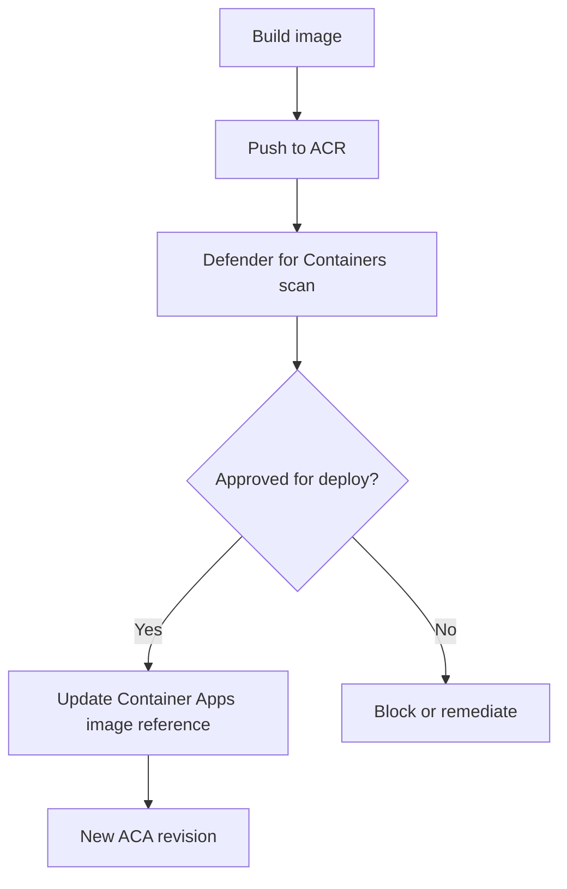

---
content_sources:
  diagrams:
    - id: secure-image-promotion-path
      type: flowchart
      source: mslearn-adapted
      based_on:
        - https://learn.microsoft.com/azure/container-apps/managed-identity-image-pull
        - https://learn.microsoft.com/azure/container-apps/revisions
        - https://learn.microsoft.com/azure/defender-for-cloud/defender-for-containers-azure-overview
        - https://learn.microsoft.com/azure/container-registry/policy-reference
content_validation:
  status: verified
  last_reviewed: "2026-04-25"
  reviewer: ai-agent
  core_claims:
    - claim: "Managed identity is a supported way for Azure Container Apps to authenticate to Azure Container Registry for image pulls."
      source: "https://learn.microsoft.com/azure/container-apps/managed-identity-image-pull"
      verified: true
    - claim: "Image changes are revision-scope changes in Azure Container Apps."
      source: "https://learn.microsoft.com/azure/container-apps/revisions"
      verified: true
    - claim: "Defender for Containers provides vulnerability assessment for images in Azure Container Registry."
      source: "https://learn.microsoft.com/azure/defender-for-cloud/defender-for-containers-azure-overview"
      verified: true
---

# Azure Container Apps Image Security Best Practices

Image security is one of the easiest places to weaken a Container Apps deployment with convenience defaults. This page focuses on practical production patterns that reduce supply-chain risk, credential sprawl, and surprise rollouts.

## Why This Matters

An image reference is both a deployment input and a security boundary. Weak image controls can lead to:

- Unapproved registries in production.
- Mutable tags pulling unexpected content.
- Registry passwords lingering in secrets.
- Unscanned vulnerable images reaching active revisions.

## Recommended Practices

### Use Azure Container Registry with managed identity

Make ACR the default production registry and let the container app authenticate with managed identity plus `AcrPull`.

Why this is the preferred default:

- No registry password in app configuration.
- Access is controlled by RBAC.
- Identity use is auditable.

### Pin deploys to immutable versions

Use versioned tags and prefer digests where your deployment process can support them.

Good examples:

- `api:2026-04-25.1`
- `api:gitsha-1a2b3c4d`
- `api@sha256:<digest>`

This is especially important because image changes create new revisions. Immutable references make revision history easier to reason about.

### Scan images before promotion

Enable Defender for Containers for vulnerability assessment on Azure Container Registry and review findings before promotion.

<!-- diagram-id: secure-image-promotion-path -->

### Restrict image sources with governance

Use Azure Policy and internal platform rules to keep production deployments on approved registries.

Conservative guidance:

- Treat registry restriction as a **governance control**, not as an ACA-native allow-list feature.
- Standardize on approved registries such as ACR.
- Review pipeline inputs so application teams cannot silently switch to unapproved public registries.

## Common Mistakes / Anti-Patterns

| Anti-pattern | Why it is risky | Better choice |
|---|---|---|
| `:latest` in production | Mutable deploy target and weak rollback traceability | Versioned tag or digest |
| Public images in production without governance review | Weak supply-chain control | Approved private registry workflow |
| ACR admin user enabled for routine production pulls | Shared credential and broad access | Managed identity + AcrPull |
| Service principal or PAT used when MI is available | Credential rotation burden | Managed identity |
| Shipping unscanned images | Vulnerabilities reach active revisions | Scan in ACR before promotion |

## Validation Checklist

- [ ] Production images are stored in Azure Container Registry.
- [ ] Container Apps uses managed identity for ACR pulls.
- [ ] `AcrPull` is scoped to the right registry.
- [ ] Deployed image references are immutable tags or digests.
- [ ] Defender for Containers is enabled for ACR image scanning.
- [ ] CI/CD blocks or flags high-severity image findings.
- [ ] Approved registry policy is documented and enforced.
- [ ] No production app relies on the ACR admin user.

## See Also

- [Image Security (Platform)](../platform/security/image-security.md)
- [Security Best Practices](security.md)
- [Operations: Image Pull and Registry](../operations/image-pull-and-registry/index.md)
- [Container Design Best Practices](container-design.md)

## Sources

- [Pull images from Azure Container Registry with managed identity in Azure Container Apps (Microsoft Learn)](https://learn.microsoft.com/azure/container-apps/managed-identity-image-pull)
- [Revisions in Azure Container Apps (Microsoft Learn)](https://learn.microsoft.com/azure/container-apps/revisions)
- [Microsoft Defender for Containers overview (Microsoft Learn)](https://learn.microsoft.com/azure/defender-for-cloud/defender-for-containers-azure-overview)
- [Policy reference for Azure Container Registry (Microsoft Learn)](https://learn.microsoft.com/azure/container-registry/policy-reference)
