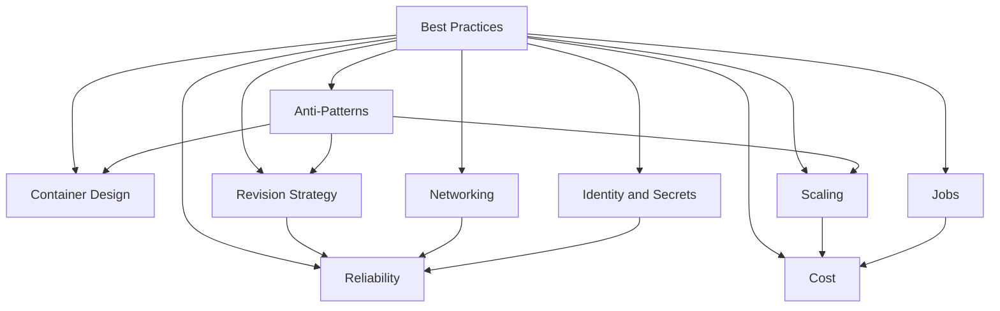

# Best Practices

This section covers practical patterns for running Azure Container Apps in production. Read Platform first for concepts, then apply these patterns.

## Concept Map

## Best Practice Areas

| Guide | Focus Area | Key Decisions |
|---|---|---|
| [Container Design](container-design.md) | Image build, probes, startup, logging | Base image choice, probe tuning, SIGTERM handling |
| [Revision Strategy](revision-strategy.md) | Immutable revisions, traffic split, rollback | Single vs multiple revision mode, canary % |
| [Scaling](scaling.md) | KEDA rules, replica boundaries, cold start | Scaler type, min/max replicas, scale-to-zero |
| [Networking](networking.md) | Ingress, service-to-service, VNet | Public vs internal ingress, DNS, private endpoints |
| [Identity and Secrets](identity-and-secrets.md) | Managed identity, Key Vault, secret refs | System vs user identity, rotation strategy |
| [Reliability](reliability.md) | Probes, shutdown, dependencies, recovery | Probe thresholds, circuit breakers, zone redundancy |
| [Cost](cost.md) | Profiles, sizing, registry, logs | Consumption vs workload profile, right-sizing |
| [Jobs](jobs.md) | Triggers, retry, execution, observability | Schedule vs event vs manual, parallelism |
| [Anti-Patterns](anti-patterns.md) | Common mistakes and safer alternatives | Pre-deploy checklist, severity reference |

## Who Should Read This

| Role | Start With | Then Read |
|---|---|---|
| Application developer | Container Design → Revision Strategy | Scaling, Networking |
| Platform engineer | Networking → Identity and Secrets | Reliability, Cost, Anti-Patterns |
| SRE / Operations | Reliability → Scaling | Cost, Anti-Patterns, Jobs |
| Security engineer | Identity and Secrets → Anti-Patterns | Container Design, Networking |

## Recommended Reading Order

```mermaid
flowchart LR
    P[Platform Concepts] --> CD[Container Design]
    CD --> RS[Revision Strategy]
    RS --> SC[Scaling]
    SC --> NW[Networking]
    NW --> ID[Identity and Secrets]
    ID --> RL[Reliability]
    RL --> CO[Cost]
    CO --> JB[Jobs]
    JB --> AP[Anti-Patterns]

    style P fill:#e0e0e0,stroke:#666
    style AP fill:#fff3cd,stroke:#856404
```

1. Read [Platform](../platform/index.md) first to understand how Container Apps works.
2. Start with container design, revision strategy, and scaling before your first production rollout.
3. Apply networking and identity guidance when integrating with private dependencies.
4. Use reliability, cost, and jobs guidance to tune day-2 operations.
5. Keep [anti-patterns](anti-patterns.md) bookmarked as a release checklist.

## Advanced Topics

- Convert these guides into reusable templates and policy checks.
- Build environment-specific standards for production and non-production boundaries.
- Align best practices with incident postmortems to prevent recurrence.

## See Also

- [Platform - Understand concepts first](../platform/index.md)
- [Operations - Execute these patterns](../operations/index.md)
- [Troubleshooting](../troubleshooting/index.md)
