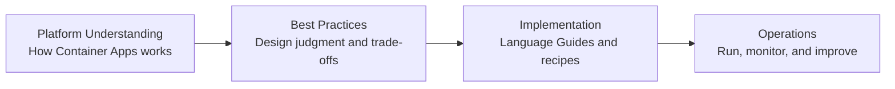

# Best Practices

This section is the design judgment layer of the guide. Read it after [Platform](../platform/index.md) and before implementation so architectural choices are intentional rather than reactive.

## Main Content

### Why this section exists

Use this section as the bridge between platform knowledge and implementation decisions:

1. Platform explains how Container Apps behaves.
2. Best Practices helps you decide what to do with that behavior.
3. Language Guides show how to implement those decisions.

### Document map

| Topic | Purpose | Primary Outcome |
|---|---|---|
| [Container Design](container-design.md) | Establish image, probe, startup, and logging standards | Consistent container builds across teams |
| [Revision Strategy](revision-strategy.md) | Choose revision mode, traffic split, and rollback approach | Lower deployment risk and faster recovery |
| [Scaling](scaling.md) | Match scale rules to workload characteristics | Better performance stability and cost efficiency |
| [Networking](networking.md) | Design secure inbound/outbound connectivity | Controlled traffic paths and reliable DNS behavior |
| [Identity and Secrets](identity-and-secrets.md) | Apply managed identity and secret management patterns | Reduced attack surface and stronger secret hygiene |
| [Reliability](reliability.md) | Build resilience for transient failures and outages | Improved availability and clearer failure handling |
| [Cost Optimization](cost.md) | Right-size profiles, registries, and log retention | Lower operational cost without sacrificing reliability |
| [Jobs](jobs.md) | Design job triggers, retry, and execution patterns | Reliable batch and event-driven processing |
| [Anti-Patterns](anti-patterns.md) | Identify common Container Apps design mistakes early | Fewer avoidable incidents and refactoring cycles |

### How to use this section

1. Read [Platform](../platform/index.md) first to align on environment, revision, scale, and networking behavior.
2. Establish a baseline from [Container Design](container-design.md), [Revision Strategy](revision-strategy.md), and [Scaling](scaling.md).
3. Add boundary controls through [Networking](networking.md) and [Identity and Secrets](identity-and-secrets.md).
4. Harden for production with [Reliability](reliability.md), [Cost Optimization](cost.md), and [Jobs](jobs.md).
5. Run [Anti-Patterns](anti-patterns.md) as a final pre-production and post-incident review checklist.

!!! info "Design judgment over checklist thinking"
    This section is not only a static checklist. Use it to reason about trade-offs in your context: traffic shape, compliance, team maturity, dependency profile, and cost envelope.

### Recommended reading paths

#### Path A: New production rollout

1. [Container Design](container-design.md)
2. [Revision Strategy](revision-strategy.md)
3. [Scaling](scaling.md)
4. [Networking](networking.md)
5. [Identity and Secrets](identity-and-secrets.md)
6. [Reliability](reliability.md)
7. [Cost Optimization](cost.md)
8. [Jobs](jobs.md)
9. [Anti-Patterns](anti-patterns.md)

#### Path B: Existing app hardening

1. [Anti-Patterns](anti-patterns.md)
2. [Identity and Secrets](identity-and-secrets.md)
3. [Networking](networking.md)
4. [Reliability](reliability.md)
5. [Revision Strategy](revision-strategy.md)
6. [Scaling](scaling.md)
7. [Container Design](container-design.md)
8. [Cost Optimization](cost.md)
9. [Jobs](jobs.md)

#### Path C: Performance and cost tuning

1. [Scaling](scaling.md)
2. [Cost Optimization](cost.md)
3. [Reliability](reliability.md)
4. [Container Design](container-design.md)
5. [Revision Strategy](revision-strategy.md)
6. [Jobs](jobs.md)
7. [Anti-Patterns](anti-patterns.md)

### Decision areas covered

- Compute baseline selection across Consumption and workload profiles, including replica and resource boundaries.
- Container standards for image hardening, startup behavior, health probes, graceful shutdown, and structured logs.
- Identity and secret patterns using managed identity, Key Vault references, and rotation workflows.
- Connectivity controls for ingress scope, internal service calls, private endpoints, DNS, and egress constraints.
- Release safety through revision mode, traffic splitting, rollback criteria, and blast-radius control.
- Scale behavior design using KEDA trigger fit, cooldown windows, concurrency shaping, and scale-to-zero boundaries.
- Reliability mechanics for dependency failure handling, transient retries, observability thresholds, and recovery runbooks.

### Who should read this

| Role | Start With | Then Read |
|---|---|---|
| Application architects | Container Design → Revision Strategy | Scaling, Reliability, Networking |
| Platform engineers | Networking → Identity and Secrets | Revision Strategy, Reliability, Cost Optimization |
| Tech leads | Anti-Patterns → Container Design | Scaling, Cost Optimization, Jobs |
| Operators | Reliability → Scaling | Revision Strategy, Anti-Patterns, Recovery guidance in Operations |

### What this section is not

- Not a replacement for platform docs.
- Not language-specific implementation detail.
- Not a one-time task; revisit after major workload changes.

!!! warning "Avoid copy-paste architecture"
    A reference architecture is a starting point, not a universal answer. Validate each decision against your own latency, throughput, compliance, and operational constraints.

### Quality gate before implementation

- [ ] Compute profile and image strategy are defined, including base image, startup command, and resource sizing.
- [ ] HTTPS ingress model is chosen (external or internal), with exposure scope and custom domain needs documented.
- [ ] Managed identity and secret lifecycle strategy are documented, including Key Vault integration and rotation ownership.
- [ ] Networking design is validated for inbound/outbound dependencies, DNS behavior, and private connectivity.
- [ ] Logging and telemetry baseline is implemented with structured logs, metric targets, and trace correlation.
- [ ] Deployment and rollback strategy is validated using revision traffic controls and explicit rollback triggers.

### Decision record template

| Decision | Context | Alternatives considered | Trade-off | Validation | Review date |
|---|---|---|---|---|---|
| Use workload profile with min replicas 2 for API app | API has weekday peaks and strict p95 latency objective | Consumption with scale-to-zero; Consumption with min replicas 1 | Higher baseline cost in exchange for reduced cold-start risk and steadier latency | 14-day p95 latency and cost review from Log Analytics + Metrics | 2026-07-01 |

### Common outcomes when this layer is skipped

- Apps are deployed with default scale behavior that does not match traffic shape, causing unstable latency or unnecessary spend.
- Secrets are injected directly as environment values without managed rotation ownership or Key Vault integration.
- Revision mode and rollback procedures are undefined, making incident recovery slow and high risk.
- Ingress and networking choices are made ad hoc, resulting in avoidable connectivity failures and DNS confusion.
- Probe and startup baselines are inconsistent, increasing restart loops and hard-to-diagnose runtime failures.

### Keeping guidance current

- Revisit decisions after major workload profile changes (traffic growth, new regions, new dependencies).
- Re-evaluate after platform feature updates that affect scaling, networking, identity, or jobs.
- Update decision records after incidents, postmortems, and significant architecture deviations.
- Review quarterly with platform, security, and operations stakeholders to remove stale assumptions.

## Advanced Topics

- Define environment-specific baseline profiles (dev, pre-prod, prod) with explicit trade-off boundaries.
- Encode standards as policy-as-code and CI checks to prevent drift before deployment.
- Run architecture drift reviews against actual revision and scaling behavior in production telemetry.
- Tie design decisions to SLO indicators so trade-offs remain measurable over time.

## See Also

- [Platform](../platform/index.md)
- [Operations](../operations/index.md)
- [Language Guides](../language-guides/index.md)
- [Troubleshooting](../troubleshooting/index.md)

## Sources

- [Azure Container Apps documentation (Microsoft Learn)](https://learn.microsoft.com/azure/container-apps/)
- [Container Apps best practices (Microsoft Learn)](https://learn.microsoft.com/azure/container-apps/best-practices)
- [Security in Azure Container Apps](https://learn.microsoft.com/azure/container-apps/security-concept)
- [Networking in Azure Container Apps](https://learn.microsoft.com/azure/container-apps/networking)
- [Azure Container Apps scaling](https://learn.microsoft.com/azure/container-apps/scale-app)
