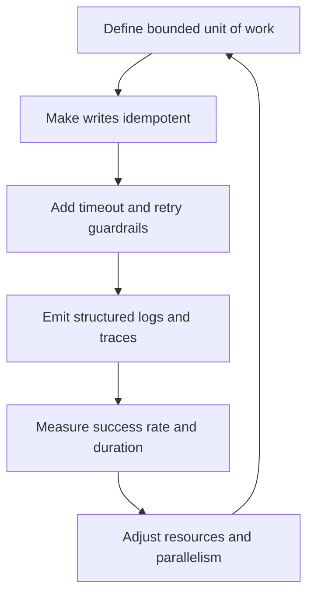

---
content_sources:
  diagrams:
    - id: resilient-job-design-loop
      type: flowchart
      source: self-generated
      justification: Synthesized best-practice flow based on Microsoft Learn Jobs, logging, OpenTelemetry, and workload profile guidance.
      based_on:
        - https://learn.microsoft.com/azure/container-apps/jobs
        - https://learn.microsoft.com/azure/container-apps/log-monitoring
        - https://learn.microsoft.com/azure/container-apps/opentelemetry-agents
        - https://learn.microsoft.com/azure/container-apps/workload-profiles-overview
content_validation:
  status: pending_review
  last_reviewed: "2026-04-26"
  reviewer: ai-agent
  core_claims:
    - claim: "Jobs are intended for finite background execution."
      source: "https://learn.microsoft.com/azure/container-apps/jobs"
      verified: true
    - claim: "Container Apps supports log monitoring and OpenTelemetry-based observability patterns."
      source: "https://learn.microsoft.com/azure/container-apps/log-monitoring"
      verified: true
---

# Job Design

Good Job design is mostly about safe replay, clear telemetry, and predictable failure boundaries. A fast job that cannot be retried safely is still a production risk.

## Why This Matters

Jobs concentrate work into short windows. That makes mistakes expensive:

- retries can duplicate side effects
- timeouts can leave partial work behind
- fan-out can overwhelm dependencies
- missing telemetry makes replay blind

<!-- diagram-id: resilient-job-design-loop -->

## Recommended Practices

### Make every job idempotent

Assume a job can be retried, replayed manually, or overlap with another run during incident handling.

Patterns that help:

- business idempotency keys
- upsert instead of blind insert
- checkpoint tables for processed partitions
- immutable output paths plus final publish step

### Design observability from the first revision

Emit:

- structured JSON logs
- correlation IDs or execution IDs in every major step
- explicit start, completion, failure, and retry events
- dependency-specific error codes

If the job is business-critical, send application traces to Application Insights or another OpenTelemetry-compatible backend so you can connect execution failures to downstream calls.

### Choose Jobs vs apps based on runtime shape

Prefer Jobs when the workload is bounded and can exit cleanly. Prefer Container Apps workers when the process should stay warm, hold open connections, or consume work continuously.

### Right-size CPU and memory

Start from measured runtime, not guesswork.

- CPU-bound parsing or transforms usually need more CPU before more memory.
- ETL and SDK-heavy processing often need more memory headroom.
- Large batch jobs may benefit from separate job definitions for small and large payload classes.
- GPU jobs should only be considered when the environment and workload profile are designed for them; treat GPU capacity as a specialized deployment choice, not a default batch setting.

### Handle failure with explicit dead-letter strategy

For event-driven Jobs:

1. classify retryable vs non-retryable failure
2. retry only transient conditions
3. send poison messages or irrecoverable payloads to a dead-letter path
4. keep replay runbooks separate from automatic retry rules

## Common Mistakes / Anti-Patterns

- assuming retries make a non-idempotent job safe
- omitting `replicaTimeout` and letting stuck work hide indefinitely
- setting retry limits high enough to amplify an outage
- mixing app concerns and job concerns in one container image without clear entrypoints
- using the ephemeral filesystem as a durable dedup store
- treating Job execution history as the only long-term audit trail

## Validation Checklist

- [ ] The unit of work has a clear start and finish boundary.
- [ ] Every external write is idempotent or guarded by a dedup/checkpoint record.
- [ ] Timeout is based on measured runtime, not guesswork.
- [ ] Retry policy only covers transient failure classes.
- [ ] Logs include execution correlation fields.
- [ ] Monitoring tracks success rate, duration, and retry count.
- [ ] Event-driven workloads have a dead-letter or quarantine path.
- [ ] Long-running continuous consumers have been challenged against [Jobs vs Apps](../platform/jobs/jobs-vs-apps.md).

## See Also

- [Jobs Best Practices](jobs.md)
- [Jobs vs Apps](../platform/jobs/jobs-vs-apps.md)
- [Execution Lifecycle](../platform/jobs/execution-lifecycle.md)
- [Jobs Operations](../operations/jobs/index.md)

## Sources

- [Jobs in Azure Container Apps (Microsoft Learn)](https://learn.microsoft.com/azure/container-apps/jobs)
- [Azure Monitor for Container Apps (Microsoft Learn)](https://learn.microsoft.com/azure/container-apps/log-monitoring)
- [OpenTelemetry in Azure Container Apps (Microsoft Learn)](https://learn.microsoft.com/azure/container-apps/opentelemetry-agents)
- [Workload profiles in Azure Container Apps (Microsoft Learn)](https://learn.microsoft.com/azure/container-apps/workload-profiles-overview)
