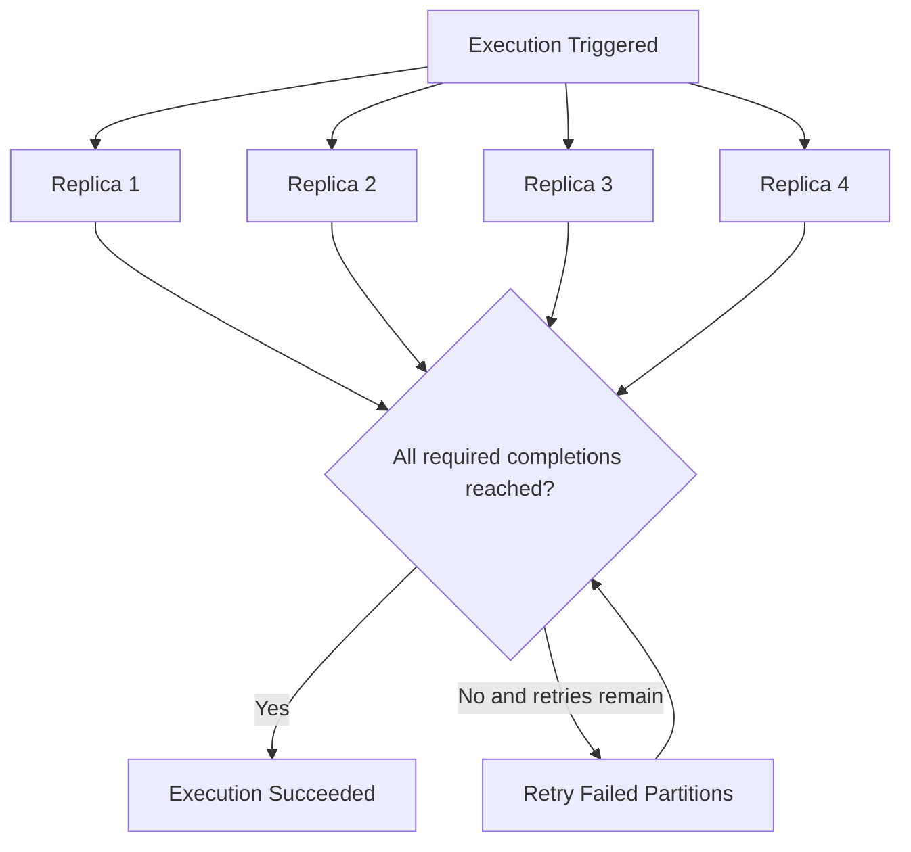
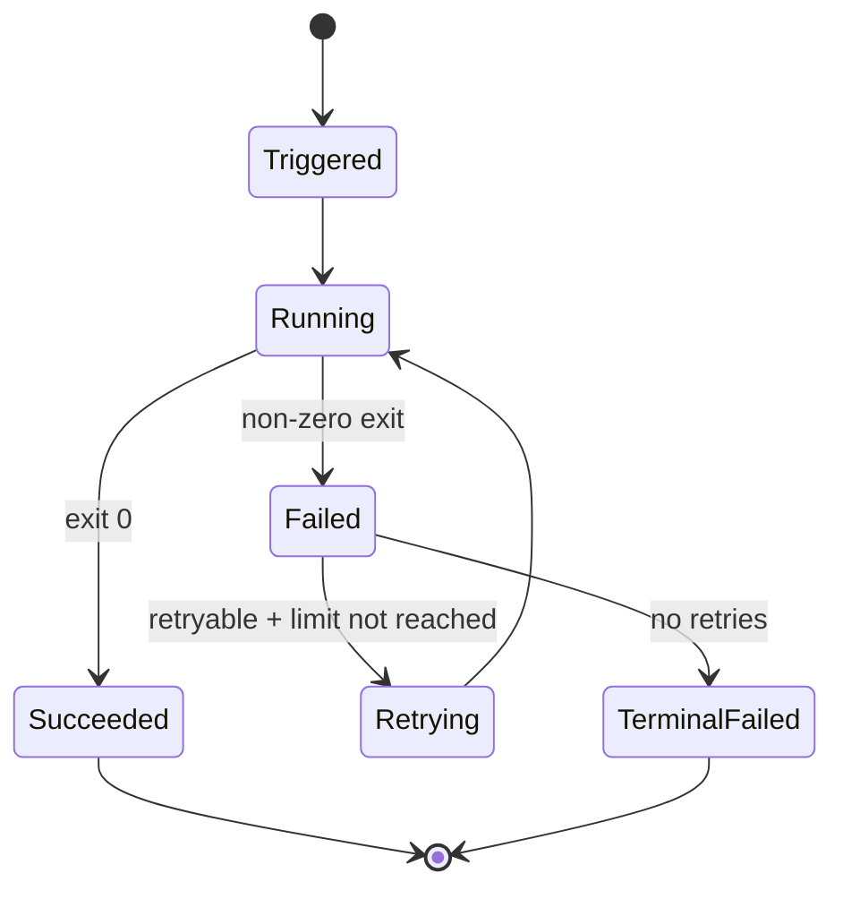

---
content_sources:
  diagrams:
    - id: image-acr-name-azurecr-io-jobs-orders-reconcile-v1-0-0
      type: flowchart
      source: mslearn-adapted
      based_on:
        - https://learn.microsoft.com/en-us/azure/container-apps/jobs
        - https://learn.microsoft.com/en-us/azure/container-apps/scale-app#jobs
        - https://learn.microsoft.com/en-us/azure/container-apps/overview
    - id: final-status-published-to-dashboard-alert-channel
      type: state
      source: mslearn-adapted
      based_on:
        - https://learn.microsoft.com/en-us/azure/container-apps/jobs
        - https://learn.microsoft.com/en-us/azure/container-apps/scale-app#jobs
        - https://learn.microsoft.com/en-us/azure/container-apps/overview
content_validation:
  status: verified
  last_reviewed: '2026-04-12'
  reviewer: ai-agent
  core_claims:
    - claim: Azure Container Apps jobs run containerized tasks for a finite duration and then stop.
      source: https://learn.microsoft.com/en-us/azure/container-apps/jobs
      verified: true
    - claim: Job executions can start manually, on a schedule, or in response to events.
      source: https://learn.microsoft.com/en-us/azure/container-apps/jobs
      verified: true
    - claim: Container apps and jobs run in the same environment and can share capabilities such as networking and logging.
      source: https://learn.microsoft.com/en-us/azure/container-apps/jobs
      verified: true
    - claim: The execution history for scheduled and event-based jobs is limited to the most recent 100 successful and failed job executions.
      source: https://learn.microsoft.com/en-us/azure/container-apps/jobs
      verified: true
    - claim: Ingress and related features such as custom domains and SSL certificates aren't supported for jobs.
      source: https://learn.microsoft.com/en-us/azure/container-apps/jobs
      verified: true
---
# Jobs Best Practices

Azure Container Apps Jobs are built for bounded background execution, not permanently running processes. This guide covers design patterns that keep job workloads reliable, observable, and cost-efficient in production.

## Why This Matters

Production Container Apps behavior depends on explicit platform choices for ingress, scale, identity, observability, and release safety. This page turns the cited Microsoft Learn guidance into reviewable practices that can be checked before promotion.

## Prerequisites

- Azure Container Apps environment available
- Azure CLI with Container Apps extension
- A container image for job execution
- Access to data dependencies used by the job

```bash
export RG="rg-aca-prod"
export ACA_ENV_NAME="cae-prod-shared"
export APP_NAME="ca-orders-api"
export ACR_NAME="acrsharedprod"
export LOCATION="koreacentral"
export JOB_NAME="job-orders-reconcile"

az extension add --name "containerapp" --upgrade
az account show --output table
```

## Recommended Practices

### Decide correctly: Job vs App

Use Container Apps Jobs when work has a clear start and finish boundary.

Use Container Apps (apps) when work is continuously available and request-driven.

| Decision area | Use Job | Use App |
|---|---|---|
| Workload lifetime | Finite execution | Long-running process |
| Trigger mode | Manual, scheduled, event-driven | HTTP and scaler-driven service runtime |
| Ingress requirement | Usually none | Common for APIs |
| Retry ownership | Platform execution retry + app idempotency | App and queue semantics |
| Cost shape | Execution window based | Baseline plus scale |

Signals you should switch from app to job:

- The process wakes up only on timer/queue and idles otherwise.
- Success is defined by "completed with exit code 0".
- You need execution history as an operational artifact.

Signals you should switch from job to app:

- You require low-latency request serving.
- Work cannot tolerate cold startup at each run.
- Stateful session behavior is expected across requests.

### Trigger type design: Manual, Scheduled, Event-driven

Container Apps Jobs support three trigger models. Match trigger to operational intent.

#### Manual trigger (operator-controlled runs)

Manual jobs are useful for one-off tasks:

- Backfill operations
- Data repair and replay
- Controlled maintenance windows

Create a manual job:

```bash
az containerapp job create \
  --name "$JOB_NAME" \
  --resource-group "$RG" \
  --environment "$ACA_ENV_NAME" \
  --trigger-type "Manual" \
  --replica-timeout 1800 \
  --replica-retry-limit 1 \
  --image "$ACR_NAME.azurecr.io/jobs/orders-reconcile:v1.0.0"
```

| Command | Why it is used |
|---|---|
| `az containerapp job create ...` | Creates, updates, starts, or inspects a Container Apps job. |

Start execution on demand:

```bash
az containerapp job start \
  --name "$JOB_NAME" \
  --resource-group "$RG"
```

| Command | Why it is used |
|---|---|
| `az containerapp job start ...` | Creates, updates, starts, or inspects a Container Apps job. |

#### Scheduled trigger (predictable recurring runs)

Scheduled jobs are best when time is the primary trigger.

Common examples:

- Daily settlement calculations
- Nightly cleanup
- Hourly materialized view refresh

Create a scheduled job:

```bash
az containerapp job create \
  --name "$JOB_NAME" \
  --resource-group "$RG" \
  --environment "$ACA_ENV_NAME" \
  --trigger-type "Schedule" \
  --cron-expression "0 */2 * * *" \
  --replica-timeout 1200 \
  --replica-retry-limit 2 \
  --image "$ACR_NAME.azurecr.io/jobs/orders-reconcile:v1.0.0"
```

| Command | Why it is used |
|---|---|
| `az containerapp job create ...` | Creates, updates, starts, or inspects a Container Apps job. |

!!! note "Cron timezone"
    Store and document cron expectations in UTC to avoid daylight saving ambiguity. Add business-local translation in your runbook.

#### Event-driven trigger (throughput-linked runs)

Event-driven jobs are best when signal volume changes over time (for example queue depth).

Create an event-driven job with Service Bus scaler metadata:

```bash
az containerapp job create \
  --name "$JOB_NAME" \
  --resource-group "$RG" \
  --environment "$ACA_ENV_NAME" \
  --trigger-type "Event" \
  --scale-rule-name "orders-queue" \
  --scale-rule-type "azure-servicebus" \
  --scale-rule-metadata "queueName=orders" "messageCount=50" "namespace=<servicebus-namespace>.servicebus.windows.net" \
  --replica-timeout 900 \
  --replica-retry-limit 3 \
  --image "$ACR_NAME.azurecr.io/jobs/orders-reconcile:v1.0.0"
```

| Command | Why it is used |
|---|---|
| `az containerapp job create ...` | Creates, updates, starts, or inspects a Container Apps job. |

### Tune timeout and retry limits as SLO controls

`--replica-timeout` and `--replica-retry-limit` define both recovery behavior and spend profile.

Design method:

1. Measure p95 execution duration under normal load.
2. Set timeout at p95 + safety margin.
3. Classify failures as transient vs deterministic.
4. Allow retries only for transient categories.

Update timeout/retry:

```bash
az containerapp job update \
  --name "$JOB_NAME" \
  --resource-group "$RG" \
  --replica-timeout 1500 \
  --replica-retry-limit 2
```

| Command | Why it is used |
|---|---|
| `az containerapp job update ...` | Creates, updates, starts, or inspects a Container Apps job. |

Failure-classification pattern:

- Authentication denied: no retry until configuration is fixed.
- Dependency timeout: limited retries with backoff.
- Data validation error: fail fast and send to dead-letter flow.

!!! warning "Retry amplification"
    High retry limits on non-idempotent operations can duplicate side effects. Always design write paths with idempotency keys or conflict-safe upserts before increasing retries.

### Parallelism and completion count patterns

Jobs support execution-level concurrency controls:

- `--parallelism`: how many replicas run in parallel
- `--replica-completion-count`: how many successful replicas mark the execution complete

Pattern guidance:

- Set `parallelism=1` for order-sensitive workloads.
- Increase parallelism for partitioned workloads with independent shards.
- Use completion count equal to partition count when all shards are mandatory.

Create a parallelized job execution model:

```bash
az containerapp job create \
  --name "$JOB_NAME" \
  --resource-group "$RG" \
  --environment "$ACA_ENV_NAME" \
  --trigger-type "Manual" \
  --parallelism 4 \
  --replica-completion-count 4 \
  --replica-timeout 1800 \
  --image "$ACR_NAME.azurecr.io/jobs/orders-reconcile:v1.0.0"
```

<!-- diagram-id: image-acr-name-azurecr-io-jobs-orders-reconcile-v1-0-0 -->


### Exit code conventions and error handling contracts

Define a clear contract between your job container and operations team.

Recommended exit code model:

| Exit code | Meaning | Operational action |
|---|---|---|
| 0 | Success | No action |
| 10 | Retryable external dependency issue | Allow configured retries |
| 20 | Validation/business-rule failure | No retry, inspect payload |
| 30 | Configuration or identity failure | Stop and fix deployment config |
| 40 | Unknown unhandled failure | Investigate logs and crash context |

Implementation principles:

- Emit structured log event before exit.
- Include correlation identifiers for replay.
- Keep final failure summary in one machine-readable line.

### Job image design for fast startup and lower spend

Job runtime cost is sensitive to startup overhead. Keep images minimal and deterministic.

Best practices:

- Use slim base images and minimal runtime dependencies.
- Separate build dependencies from runtime layer.
- Avoid shell-heavy entrypoints for simple workloads.
- Pin image tags by immutable version (for example `v1.4.2`), not `latest`.

List job image currently configured:

```bash
az containerapp job show \
  --name "$JOB_NAME" \
  --resource-group "$RG" \
  --query "properties.template.containers[0].image" \
  --output tsv
```

| Command | Why it is used |
|---|---|
| `az containerapp job show ...` | Creates, updates, starts, or inspects a Container Apps job. |

!!! tip "Startup budget"
    If job average runtime is short, image pull and startup can dominate total execution time. A 30-second startup penalty on a 60-second job can increase cost and delay by 50 percent or more.

### Use managed identity for job workloads

Jobs frequently access Storage, Service Bus, Key Vault, or databases. Avoid embedded credentials.

Enable system-assigned identity:

```bash
az containerapp job identity assign \
  --name "$JOB_NAME" \
  --resource-group "$RG" \
  --system-assigned
```

Inspect principal ID for role assignment workflows:

```bash
az containerapp job show \
  --name "$JOB_NAME" \
  --resource-group "$RG" \
  --query "identity.principalId" \
  --output tsv
```

Identity patterns:

- Give jobs dedicated identities when blast radius must be isolated.
- Apply least-privilege role assignments per dependency.
- Rotate away from shared credentials and admin keys.

### Storage and I/O design patterns for jobs

Choose storage by execution pattern:

| Pattern | Preferred storage | Why |
|---|---|---|
| Large immutable input/output files | Blob Storage | Durable and cost-efficient object store |
| Shared mutable work queue | Queue or Service Bus | Explicit delivery semantics |
| Low-latency metadata and checkpoints | Table/Cosmos DB/SQL | Queryable state with partitioning |
| Temporary per-execution files | Ephemeral local filesystem | Fast local scratch space |

Design guidance:

- Keep local filesystem usage ephemeral and bounded.
- Persist checkpoint state externally for retry continuation.
- Never assume execution affinity to previous replicas.

### Monitor job execution health with CLI and KQL

List recent executions:

```bash
az containerapp job execution list \
  --name "$JOB_NAME" \
  --resource-group "$RG" \
  --output table
```

| Command | Why it is used |
|---|---|
| `az containerapp job execution ...` | Creates, updates, starts, or inspects a Container Apps job. |

Show execution logs:

```bash
az containerapp job logs show \
  --name "$JOB_NAME" \
  --resource-group "$RG"
```

| Command | Why it is used |
|---|---|
| `az containerapp job logs ...` | Creates, updates, starts, or inspects a Container Apps job. |

KQL: success/failure trend by job over 24 hours:

```kusto
ContainerAppSystemLogs_CL
| where TimeGenerated > ago(24h)
| where Reason_s has "Job" or Log_s has "execution"
| summarize Events=count() by JobName=tostring(ContainerAppName_s), Result=tostring(Reason_s), bin(TimeGenerated, 1h)
| order by TimeGenerated asc
```

KQL: identify long-running executions:

```kusto
ContainerAppConsoleLogs_CL
| where TimeGenerated > ago(24h)
| where ContainerAppName_s == "$JOB_NAME"
| extend Parsed=parse_json(Log_s)
| where tostring(Parsed.event) in ("job-start", "job-end")
| project TimeGenerated, ExecutionId=tostring(Parsed.executionId), Event=tostring(Parsed.event), DurationMs=todouble(Parsed.durationMs)
| summarize MaxDurationMs=max(DurationMs), AvgDurationMs=avg(DurationMs) by ExecutionId
| order by MaxDurationMs desc
```

Operational SLO indicators:

- Success rate by trigger type
- p95 execution duration
- Retry amplification ratio
- Queue lag to execution start delay

### Cost implications of schedule frequency

Scheduling frequency directly controls run count and therefore total cost.

Guideline:

- If data freshness objective is 15 minutes, do not schedule every minute.
- Batch lightweight tasks into fewer runs when latency allows.
- Avoid overlap where one execution starts before previous completion.

Example adjustment from aggressive schedule to aligned schedule:

```bash
az containerapp job update \
  --name "$JOB_NAME" \
  --resource-group "$RG" \
  --cron-expression "*/15 * * * *"
```

Schedule design checklist:

| Question | Action |
|---|---|
| What freshness SLA is required? | Set cron at SLA boundary, not below |
| Can executions overlap? | Add guard logic or widen interval |
| Is runtime variable? | Use timeout headroom and concurrency limits |
| Is workload bursty? | Prefer event-driven trigger over fixed cron |

### Execution lifecycle runbook pattern

Use a consistent lifecycle runbook for every production job:

1. Trigger observed (manual/schedule/event)
2. Execution started and correlated
3. Dependency reachability verified
4. Completion event emitted with exit code
5. Retry decision logged
6. Final status published to dashboard/alert channel

<!-- diagram-id: final-status-published-to-dashboard-alert-channel -->


### Production hardening checklist for jobs

| Domain | Required control |
|---|---|
| Trigger design | Manual/schedule/event selected by workload semantics |
| Timeouts | `--replica-timeout` set from measured p95 |
| Retries | `--replica-retry-limit` matches idempotency capability |
| Parallelism | Throughput tuned without overloading dependencies |
| Identity | Managed identity enabled with least privilege |
| Observability | Structured logs + execution dashboards + alerts |
| Cost | Schedule frequency and run duration reviewed monthly |

### Verify job configuration in Azure Portal

![cj-sample-d38538 | Container App Job | Run now | Suspend | Refresh | Delete | Essentials | Resource group (move) | rg-aca-basics-d38538 | Location (move) | Korea Central | Subscription (move) | Visual Studio Enterprise Subscription | Subscription ID | 00000000-0000-0000-0000-000000000000 | Tags (edit) | Add tags | Container Apps Environme... | cae-basics-d38538 | Log Analytics | law-basics-d38538 | Workload profile | Consumption | Properties | Job | Provisioning status | Succeeded | Trigger Type | Manual | Execution history | View | Configuration | Replica timeout | 300 (change) | Replica retry limit | 1 (change) | Advanced | Parallelism | 1 (change) | Completion count | 1 (change)](../assets/best-practices/jobs-job-overview.png)

**[Observed]** `cj-sample-d38538` `Container App Job` `Run now` `Suspend` `Refresh` `Delete` `Essentials` `Resource group (move)` `rg-aca-basics-d38538` `Location (move)` `Korea Central` `Subscription (move)` `Visual Studio Enterprise Subscription` `Subscription ID` `00000000-0000-0000-0000-000000000000` `Tags (edit)` `Add tags` `Container Apps Environme...` `cae-basics-d38538` `Log Analytics` `law-basics-d38538` `Workload profile` `Consumption` `Properties` `Job` `Provisioning status` `Succeeded` `Trigger Type` `Manual` `Execution history` `View` `Configuration` `Replica timeout` `300 (change)` `Replica retry limit` `1 (change)` `Advanced` `Parallelism` `1 (change)` `Completion count` `1 (change)`.

**[Inferred]** The resource-type label `Container App Job` paired with the `Run now`/`Suspend` command bar entries is consistent with the long-running compute boundary discussed in [Decide correctly: Job vs App](#decide-correctly-job-vs-app), which separates short-lived task workloads from always-on Container Apps. The `Trigger Type` value `Manual` appears to map to the `--trigger-type "Manual"` flag shown in the `az containerapp job create` example in [Manual trigger (operator-controlled runs)](#manual-trigger-operator-controlled-runs). The `Replica timeout` value `300` and `Replica retry limit` value `1` are consistent with the `--replica-timeout` and `--replica-retry-limit` SLO levers documented in [Tune timeout and retry limits as SLO controls](#tune-timeout-and-retry-limits-as-slo-controls). The `Parallelism` value `1` and `Completion count` value `1` are consistent with the `--parallelism` and `--replica-completion-count` flags documented in [Parallelism and completion count patterns](#parallelism-and-completion-count-patterns).

**[Not Proven]** Additional job configuration detail, access detail, execution detail, and provisioning detail are not visible on this view.

## Advanced Topics

- Build partition-aware jobs that dynamically assign shards using queue metadata and bounded parallelism.
- Add execution idempotency tokens persisted in durable storage to guarantee exactly-once side effects at business level.
- Use separate job definitions for fast and slow paths to avoid one timeout/retry policy for incompatible workloads.
- Integrate job execution status with deployment gates so critical release steps are blocked on failed prerequisite jobs.

## Common Mistakes / Anti-Patterns

- Treating sample defaults as production-ready without checking ingress, scale, identity, and monitoring requirements.
- Applying a configuration change without verifying the resulting revision, logs, and metrics.
- Leaving ownership for certificates, private DNS, secrets, or rollout decisions undocumented.

## Validation Checklist

- [ ] Required Container Apps settings are represented in infrastructure as code.
- [ ] The active revision, ingress, scale, identity, and monitoring state match the intended design.
- [ ] Rollback or cleanup commands have been tested in a non-production environment.

## See Also

- [Platform - Jobs](../platform/jobs/index.md)
- [Best Practices - Job Design](job-design.md)
- [Platform - Jobs vs Apps](../platform/jobs/jobs-vs-apps.md)
- [Best Practices - Scaling](scaling.md)
- [Best Practices - Reliability](reliability.md)
- [Best Practices - Identity and Secrets](identity-and-secrets.md)
- [Operations - Monitoring](../operations/monitoring/index.md)

## Sources

- [Microsoft Learn source 1](https://learn.microsoft.com/en-us/azure/container-apps/jobs)
- [Microsoft Learn source 2](https://learn.microsoft.com/en-us/azure/container-apps/scale-app#jobs)
- [Microsoft Learn source 3](https://learn.microsoft.com/en-us/azure/container-apps/overview)
- [Microsoft Learn source 4](https://learn.microsoft.com/en-us/azure/container-apps/jobs)
