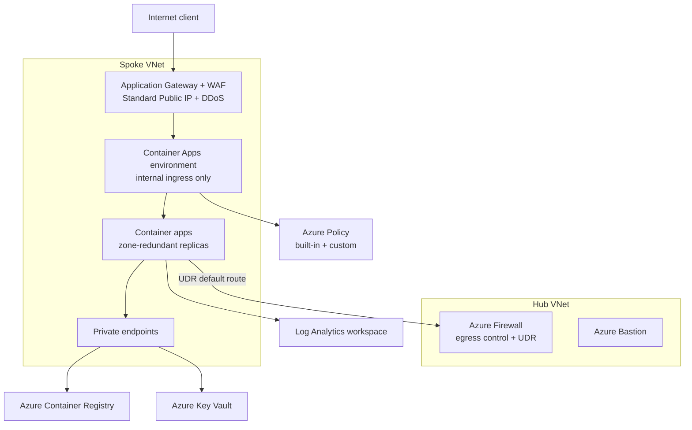

---
content_sources:
  diagrams:
    - id: aca-lza-reference-architecture
      type: flowchart
      source: mslearn-adapted
      based_on:
        - https://learn.microsoft.com/en-us/azure/cloud-adoption-framework/scenarios/app-platform/container-apps/landing-zone-accelerator
        - https://learn.microsoft.com/en-us/azure/architecture/example-scenario/serverless/microservices-with-container-apps
        - https://github.com/Azure/aca-landing-zone-accelerator
content_validation:
  status: verified
  last_reviewed: '2026-07-18'
  reviewer: agent
  core_claims:
    - claim: "The Azure Container Apps landing zone accelerator organizes guidance across four design areas: identity and access management, network topology and connectivity, security/governance/compliance, and management and monitoring"
      source: https://learn.microsoft.com/en-us/azure/cloud-adoption-framework/scenarios/app-platform/container-apps/landing-zone-accelerator
      verified: true
    - claim: "The recommended enterprise architecture deploys Container Apps into a custom virtual network with internal ingress and no public endpoint, fronted by Application Gateway with a Web Application Firewall"
      source: https://learn.microsoft.com/en-us/azure/architecture/example-scenario/serverless/microservices-with-container-apps
      verified: true
    - claim: "A custom virtual network lets you apply network security groups and user-defined routing through Azure Firewall, which the automatically generated Microsoft-managed virtual network does not allow"
      source: https://learn.microsoft.com/en-us/azure/architecture/example-scenario/serverless/microservices-with-container-apps
      verified: true
    - claim: "The built-in external ingress feature cannot be placed behind a WAF or DDoS Protection plan, so web-facing workloads should be fronted with Application Gateway or Azure Front Door"
      source: https://learn.microsoft.com/en-us/azure/architecture/example-scenario/serverless/microservices-with-container-apps
      verified: true
---
# Container Apps Landing Zone Accelerator

The Azure Container Apps landing zone accelerator (LZA) is an open-source collection of architectural guidance and a reference implementation that helps enterprises deploy Container Apps at scale inside an Azure landing zone. This page explains how to adopt the LZA for Container Apps and how its guidance maps to the environment, networking, identity, and compliance patterns elsewhere in this guide.

For general Azure landing zone theory (management groups, subscription topology, platform vs application landing zones), see the [Cloud Adoption Framework](https://learn.microsoft.com/en-us/azure/cloud-adoption-framework/ready/landing-zone/) and the sibling [Azure Architecture Practical Guide](https://github.com/yeongseon/azure-architecture-practical-guide). This page stays Container Apps-specific.

## Why This Matters

Enterprise adopters rarely deploy a Container App in isolation. They onboard it into an existing landing zone with centralized networking (hub-spoke), shared identity, policy-driven governance, and centralized observability. Without a cohesive reference, teams stitch these concerns together ad hoc and produce inconsistent, hard-to-audit environments.

The LZA reduces that fragmentation by providing:

- A **secure-baseline reference architecture** for a Container Apps workload deployed into a private virtual network with no public endpoint.
- **Infrastructure-as-code** (Bicep and Terraform) that provisions the whole topology, so environments are reproducible and reviewable.
- **Design-area guidance** that aligns each cross-cutting concern with the centralized platform services an enterprise already runs.

The accelerator works both as **greenfield** design guidance and as a **brownfield** assessment baseline for teams already running containers.

## Reference Architecture

The LZA "internal environment secure baseline" scenario deploys Container Apps into a spoke virtual network with private ingress, fronted by Application Gateway with a Web Application Firewall (WAF), and egress-controlled through Azure Firewall.

<!-- diagram-id: aca-lza-reference-architecture -->

The reference implementation's core components include the Container Apps environment, hub-spoke virtual networks, Azure Container Registry, Azure Bastion, Azure Firewall, user-defined routing, Application Gateway with WAF, a DDoS-protected Standard public IP, Key Vault, private endpoints, private DNS zones, a Log Analytics workspace, and Azure Policy assignments (built-in and custom).

## Recommended Practices

### Organize guidance around the four design areas

The LZA structures every decision into four design areas. Map each to the corresponding page in this guide when you implement it.

| Design area | What it covers | Related guidance |
|---|---|---|
| Identity and access management | Managed identities for workload and registry access, RBAC, secretless auth | [Identity and Secrets](identity-and-secrets.md), [mTLS](mtls.md) |
| Network topology and connectivity | Custom VNet, hub-spoke, private ingress, egress firewall, private endpoints | [Networking](networking.md), [Environment Design](environment-design.md) |
| Security, governance, and compliance | WAF, Azure Policy, Key Vault, image scanning | [Security](security.md), [Image Security](image-security.md), [Compliance Baseline](compliance-baseline.md) |
| Management and monitoring | Centralized Log Analytics, Application Insights, alerting | [Reliability](reliability.md), [Operations - Monitoring](../operations/index.md) |

### Deploy into a custom virtual network

Provide a custom virtual network when you create the environment. Only a custom VNet lets you apply network security groups and user-defined routing through Azure Firewall; the automatically generated, Microsoft-managed virtual network cannot be manipulated this way. Over-provision the environment subnet so it always has enough IP addresses for future replicas and jobs.

### Front public ingress with a WAF

The built-in external ingress feature cannot be placed behind a WAF or included in a DDoS Protection plan. For web-facing workloads, disable public ingress and front the app with [Application Gateway](https://learn.microsoft.com/en-us/azure/container-apps/waf-app-gateway) or [Azure Front Door](https://learn.microsoft.com/en-us/azure/container-apps/how-to-integrate-with-azure-front-door). Keep back-end services on internal ingress only.

### Prefer managed identities over secrets

Use Microsoft Entra managed identities so apps authenticate to Key Vault, Container Registry, and other dependencies without stored credentials. Use a dedicated user-assigned identity for registry access, and system-assigned identities for workload components so identity lifecycle tracks component lifecycle. Fall back to Key Vault-stored secrets only for dependencies that don't support Entra authentication.

### Govern with Azure Policy and IaC

Apply Azure Policy (built-in and custom) to the workload's resource group to enforce baseline governance. Deploy the whole topology with infrastructure as code (Bicep or Terraform), and separate infrastructure pipelines from application deployment pipelines because they have different lifecycles.

### Design for availability zones

Deploy zone-redundant resources (Container Apps environment, Application Gateway, Standard public IP) across availability zones. Set the minimum replica count for nontransient apps to at least one replica per availability zone so replicas distribute across zones under normal operation.

## Common Mistakes / Anti-Patterns

- **Relying on the Microsoft-managed VNet for enterprise workloads.** It blocks NSGs and egress firewalling. Always supply a custom VNet for landing-zone deployments.
- **Exposing apps through built-in public ingress without a WAF.** This leaves web-facing workloads unprotected from layer-7 attacks and outside DDoS Protection.
- **Sharing one Container Apps environment across unrelated workloads.** Any app or job in an environment can reach any internal-ingress service in it. Segment workloads into separate environments.
- **Storing long-lived secrets in code or config instead of using managed identities.** It increases credential-leak risk and operational toil.
- **Undersizing the environment subnet.** Running out of IP addresses blocks scale-out of replicas and jobs.
- **Copying the LZA defaults straight to production without review.** For example, the reference implementation uses Azure Firewall Basic for cost reasons; enterprise workloads may need a higher SKU.

## Validation Checklist

- [ ] Container Apps environment is deployed into a **custom virtual network** (not the Microsoft-managed VNet).
- [ ] Public ingress is fronted by **Application Gateway or Azure Front Door with a WAF**; back-end services use internal ingress.
- [ ] **Managed identities** are used for registry and Key Vault access; no long-lived secrets in code.
- [ ] **Azure Policy** assignments are applied to the workload resource group.
- [ ] Egress is routed through **Azure Firewall** via user-defined routes.
- [ ] Private endpoints and private DNS zones are configured for **ACR and Key Vault**.
- [ ] Zone-redundant resources are enabled and **minimum replicas ≥ 1 per availability zone**.
- [ ] The environment subnet is **over-provisioned** for future replica and job growth.
- [ ] The whole topology is deployed via **infrastructure as code**, with infra and app pipelines separated.
- [ ] Logs and metrics flow to a **centralized Log Analytics workspace**.

## See Also

- [Environment Design](environment-design.md)
- [Networking](networking.md)
- [Security](security.md)
- [Identity and Secrets](identity-and-secrets.md)
- [Compliance Baseline](compliance-baseline.md)
- [Reliability](reliability.md)

## Sources

- [Azure Container Apps landing zone accelerator - Cloud Adoption Framework (Microsoft Learn)](https://learn.microsoft.com/en-us/azure/cloud-adoption-framework/scenarios/app-platform/container-apps/landing-zone-accelerator)
- [Identity and access management design area (Microsoft Learn)](https://learn.microsoft.com/en-us/azure/cloud-adoption-framework/scenarios/app-platform/container-apps/identity)
- [Network topology and connectivity design area (Microsoft Learn)](https://learn.microsoft.com/en-us/azure/cloud-adoption-framework/scenarios/app-platform/container-apps/networking)
- [Security, governance, and compliance design area (Microsoft Learn)](https://learn.microsoft.com/en-us/azure/cloud-adoption-framework/scenarios/app-platform/container-apps/security)
- [Management and monitoring design area (Microsoft Learn)](https://learn.microsoft.com/en-us/azure/cloud-adoption-framework/scenarios/app-platform/container-apps/management)
- [Deploy Microservices to Azure Container Apps (Azure Architecture Center)](https://learn.microsoft.com/en-us/azure/architecture/example-scenario/serverless/microservices-with-container-apps)
- [Protect Azure Container Apps with Application Gateway and Web Application Firewall (Microsoft Learn)](https://learn.microsoft.com/en-us/azure/container-apps/waf-app-gateway)
- [Integrate Azure Container Apps with Azure Front Door (Microsoft Learn)](https://learn.microsoft.com/en-us/azure/container-apps/how-to-integrate-with-azure-front-door)
- [Azure Container Apps landing zone accelerator reference implementation (GitHub)](https://github.com/Azure/aca-landing-zone-accelerator)
