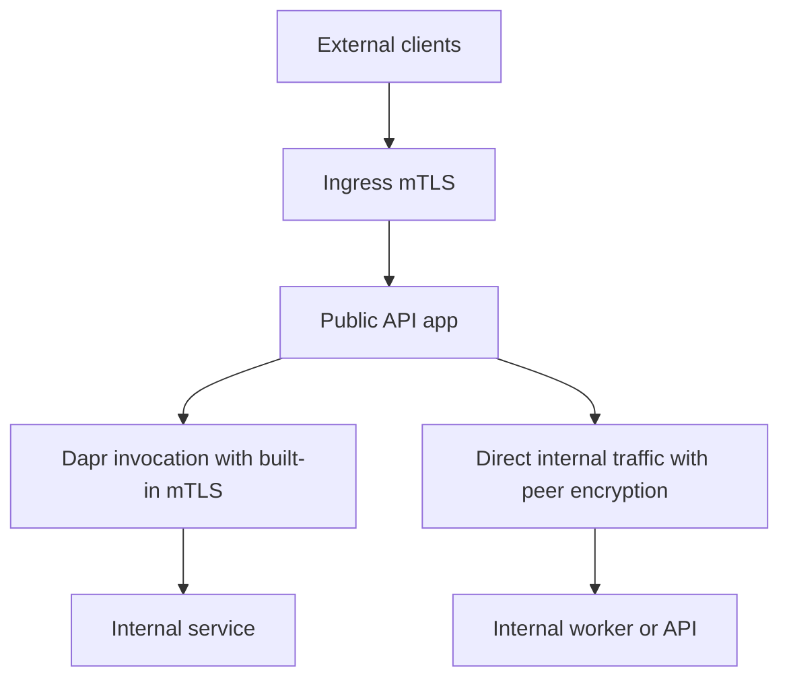

---
content_sources:
  diagrams:
  - id: aca-mtls-best-practice-pattern
    type: flowchart
    source: mslearn-adapted
    based_on:
    - https://learn.microsoft.com/en-us/azure/container-apps/ingress-environment-configuration
    - https://learn.microsoft.com/en-us/azure/container-apps/client-certificate-authorization
    - https://learn.microsoft.com/en-us/azure/container-apps/connect-apps
    - https://learn.microsoft.com/en-us/azure/container-apps/dapr-overview
content_validation:
  status: verified
  last_reviewed: '2026-04-25'
  reviewer: ai-agent
  core_claims:
  - claim: Azure Container Apps supports peer-to-peer TLS encryption within the environment.
    source: https://learn.microsoft.com/en-us/azure/container-apps/ingress-environment-configuration
    verified: true
  - claim: Ingress passes the client certificate to the app when clientCertificateMode is set to require or accept.
    source: https://learn.microsoft.com/en-us/azure/container-apps/client-certificate-authorization
    verified: true
  - claim: Dapr service invocation in Azure Container Apps provides built-in mutual TLS.
    source: https://learn.microsoft.com/en-us/azure/container-apps/connect-apps
    verified: true
---
# mTLS Best Practices

Use mTLS in Azure Container Apps as a layered control: edge client authentication at ingress, peer encryption for direct environment traffic, and Dapr sidecar mTLS for service invocation.

## Why This Matters

mTLS helps you answer three different trust questions:

- Is this external caller allowed to reach my app?
- Is east-west traffic inside the environment encrypted?
- Should this internal service call use a platform-managed service identity path instead of custom TLS code?

<!-- diagram-id: aca-mtls-best-practice-pattern -->

## Recommended Practices

### Enable peer encryption for production environments

Use environment peer encryption when services communicate directly inside the same managed environment and you want the platform to handle east-west encryption.

### Terminate external mTLS at ingress

Prefer `clientCertificateMode=require` or `clientCertificateMode=accept` at ingress instead of rebuilding TLS termination inside each application container.

Why:

- The platform already terminates TLS at Envoy.
- Your app receives a normalized `X-Forwarded-Client-Cert` header.
- App code can focus on authorization policy instead of low-level certificate exchange.

### Prefer Dapr for same-environment service-to-service calls

When both apps live in the same environment and Dapr already fits your architecture, use Dapr service invocation for:

- Built-in mTLS
- Service discovery through Dapr App IDs
- Retry and observability features alongside transport security

### Rotate and store certificates deliberately

- Keep external client certificates in Azure Key Vault or your enterprise PKI workflow.
- Track expiration dates for partner or device certificates.
- Treat thumbprint allowlists as configuration, not hardcoded source values.
- Let Dapr and the platform manage their own mTLS certificates rather than exporting internal private keys into app code.

### Validate the forwarded certificate in the app

Even when ingress accepts the certificate, your app should still validate the forwarded leaf certificate against:

- Expected issuer
- Expected subject or SAN
- Expected thumbprint
- Optional chain or revocation policy if your compliance model requires it

### Verify mTLS ingress surfaces in Azure Portal

![ca-sample-d38538 | Ingress | Container App | Refresh | Send us your feedback | Ingress | Ingress traffic | Limited to Container Apps Environment | Accepting traffic from anywhere | Ingress type | HTTP | TCP | Client certificate mode | Ignore | Accept | Require | Transport | Auto | Insecure connections | Target port | 80 | Endpoint(s) | https://<app-name>.<unique-id>.<region>.azurecontainerapps.io | Session affinity | Additional TCP ports | IP Restrictions | IP Security Restrictions Mode | Allow all traffic (default) | Save | Discard](../assets/best-practices/mtls-ingress-blade.png)

**[Observed]** `ca-sample-d38538 | Ingress` `Container App` `Refresh` `Send us your feedback` `Ingress` `Ingress traffic` `Limited to Container Apps Environment` `Accepting traffic from anywhere` `Ingress type` `HTTP` `TCP` `Client certificate mode` `Ignore` `Accept` `Require` `Transport` `Auto` `Insecure connections` `Target port` `80` `Endpoint(s)` `https://<app-name>.<unique-id>.<region>.azurecontainerapps.io` `Session affinity` `Additional TCP ports` `IP Restrictions` `IP Security Restrictions Mode` `Allow all traffic (default)` `Save` `Discard`.

**[Inferred]** The `Client certificate mode` selector with `Ignore`, `Accept`, and `Require` options appears to map to the ingress-side client-certificate handling discussed in [Terminate external mTLS at ingress](#terminate-external-mtls-at-ingress), where the platform negotiates the client certificate before the app sees the request. The `Accepting traffic from anywhere` radio paired with the external `Endpoint(s)` value is consistent with [Terminate external mTLS at ingress](#terminate-external-mtls-at-ingress) treating the external ingress edge as the mTLS termination point. The `Limited to Container Apps Environment` radio option appears to map to the same-environment service-to-service scope described in [Prefer Dapr for same-environment service-to-service calls](#prefer-dapr-for-same-environment-service-to-service-calls), which keeps service-to-service traffic inside the environment. The `Transport` `Auto` setting and `Insecure connections` toggle are consistent with the protocol-handling guidance in [Validate the forwarded certificate in the app](#validate-the-forwarded-certificate-in-the-app), which assumes the app receives the forwarded certificate over the ingress-negotiated transport.

**[Not Proven]** Whether the displayed `Client certificate mode` is set to `Ignore`, `Accept`, or `Require` is not visible on this view. The certificate authority list, allowed issuers, and validation rules applied by the ingress are not visible on this view. The `X-Forwarded-Client-Cert` header forwarding behavior and downstream app validation logic are not visible on this view. The Dapr mTLS state and peer-encryption status at the environment level are not visible on this view.

## Common Mistakes / Anti-Patterns

### Re-implementing east-west mTLS in every service

If direct environment peer encryption or Dapr already covers the traffic path, adding custom app-level mTLS for every internal hop often adds complexity without improving trust boundaries.

### Using `accept` mode and assuming authentication happened

`accept` means the request is still allowed without a certificate. Use it only when your app explicitly enforces certificate presence on selected routes or callers.

### Trusting `X-Forwarded-Client-Cert` as an opaque string

Always parse and validate the leaf certificate. Do not treat the raw header value as proof of authorization.

### Mixing CORS and mTLS decisions

CORS controls browser behavior. It does not authenticate callers and does not replace certificate validation.

### Ignoring performance impact of peer encryption

Microsoft Learn explicitly notes that enabling environment peer encryption can increase response latency and reduce throughput under high load. Measure before broad rollout.

## Validation Checklist

- `peerTrafficConfiguration.encryption.enabled` is documented for production environments that use direct internal traffic.
- External APIs use `clientCertificateMode=require` unless there is a documented reason to accept non-certificate callers.
- Application code parses `X-Forwarded-Client-Cert` and validates issuer, subject, or thumbprint.
- Dapr-enabled services use Dapr App IDs consistently and avoid bypassing the sidecar by accident.
- External certificate material is stored outside source code, ideally in Key Vault or enterprise PKI tooling.
- Load testing covers the latency impact of peer encryption or edge certificate validation.

## Review Matrix

| Review area | Page-specific check |
|---|---|
| Scope | Confirm the guidance applies to mTLS Best Practices. |
| Source basis | Validate the recommendation against the Microsoft Learn sources in this page. |
| Evidence | Capture command output, portal state, metrics, logs, or screenshots before treating the result as proven. |

## See Also

- [mTLS Architecture in Azure Container Apps](../platform/security/mtls.md)
- [Ingress Client Certificates](../platform/security/ingress-client-certificates.md)
- [Azure Container Apps Security Best Practices](security.md)
- [Service-to-Service Communication](../platform/networking/service-to-service.md)

## Sources

- [Ingress environment configuration in Azure Container Apps (Microsoft Learn)](https://learn.microsoft.com/en-us/azure/container-apps/ingress-environment-configuration)
- [Configure client certificate authentication in Azure Container Apps (Microsoft Learn)](https://learn.microsoft.com/en-us/azure/container-apps/client-certificate-authorization)
- [Communicate between container apps in Azure Container Apps (Microsoft Learn)](https://learn.microsoft.com/en-us/azure/container-apps/connect-apps)
- [Dapr overview in Azure Container Apps (Microsoft Learn)](https://learn.microsoft.com/en-us/azure/container-apps/dapr-overview)
