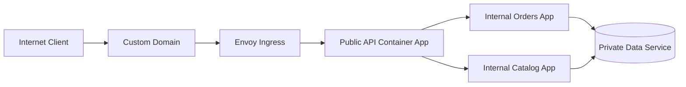
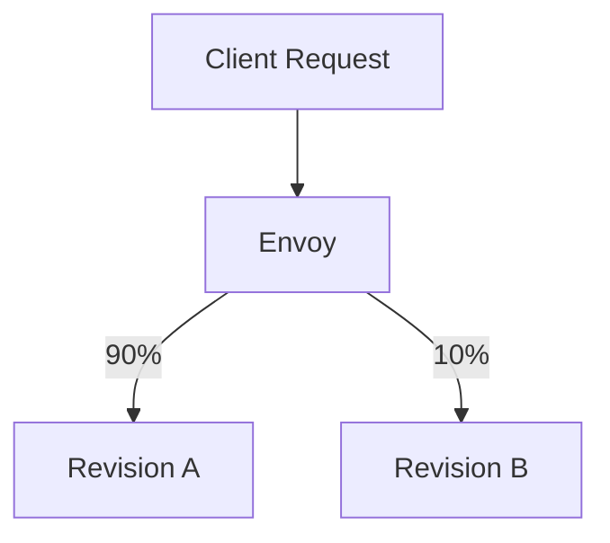
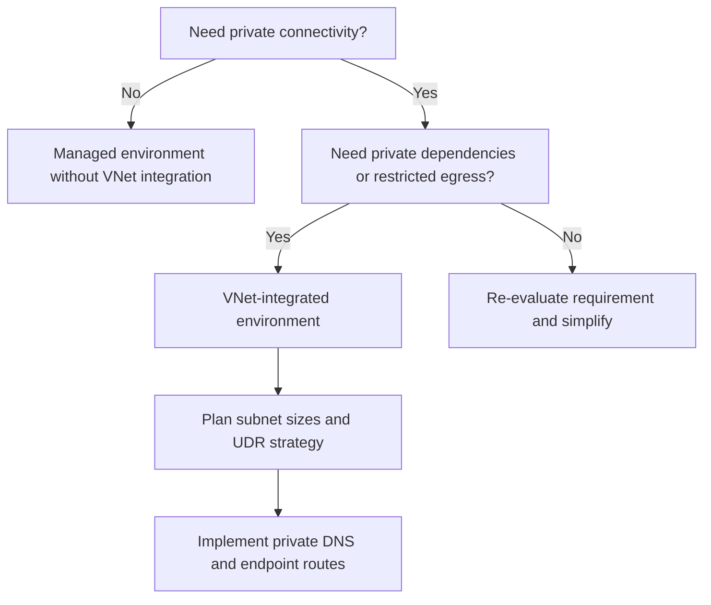
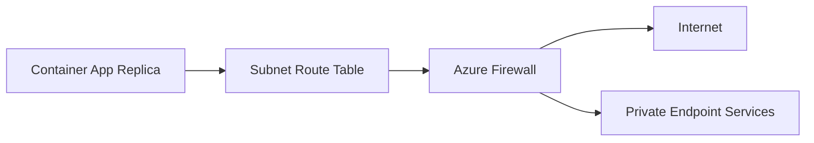

---
hide:
  - toc
content_sources:
  diagrams:
    - id: use-one-entry-app-for-public
      type: flowchart
      source: mslearn-adapted
      based_on:
        - https://learn.microsoft.com/en-us/azure/container-apps/networking
        - https://learn.microsoft.com/en-us/azure/container-apps/ingress-overview
        - https://learn.microsoft.com/en-us/azure/container-apps/private-endpoints-with-dns
    - id: traffic-weights-are-applied-at-ingress
      type: flowchart
      source: mslearn-adapted
      based_on:
        - https://learn.microsoft.com/en-us/azure/container-apps/networking
        - https://learn.microsoft.com/en-us/azure/container-apps/ingress-overview
        - https://learn.microsoft.com/en-us/azure/container-apps/private-endpoints-with-dns
    - id: choose-vnet-integration-when-private-networking
      type: flowchart
      source: mslearn-adapted
      based_on:
        - https://learn.microsoft.com/en-us/azure/container-apps/networking
        - https://learn.microsoft.com/en-us/azure/container-apps/ingress-overview
        - https://learn.microsoft.com/en-us/azure/container-apps/private-endpoints-with-dns
    - id: a-common-enterprise-pattern-is-controlled
      type: flowchart
      source: mslearn-adapted
      based_on:
        - https://learn.microsoft.com/en-us/azure/container-apps/networking
        - https://learn.microsoft.com/en-us/azure/container-apps/ingress-overview
        - https://learn.microsoft.com/en-us/azure/container-apps/private-endpoints-with-dns
---

# Azure Container Apps Networking Best Practices

This guide focuses on operating Azure Container Apps networking safely and predictably in production. Read this after the platform networking concepts so you can apply concrete patterns, guardrails, and rollout steps.

## Prerequisites

- You understand environment, ingress, revision, and service-to-service basics.
- You reviewed the conceptual networking docs first:
  - [Platform Networking Overview](../platform/networking/index.md)
  - [VNet Integration](../platform/networking/vnet-integration.md)
  - [Private Endpoints](../platform/networking/private-endpoints.md)
- Azure CLI is installed and authenticated.
- You have Contributor (or equivalent) permissions on your resource group.

Set reusable variables:

```bash
export RG="rg-aca-prod"
export APP_NAME="ca-api-prod"
export ENVIRONMENT_NAME="cae-prod"
export ACR_NAME="acrprodshared"
export LOCATION="koreacentral"
```

## Main Content

### Start with an ingress posture decision, not a command

Treat ingress as an application contract:

- **External ingress**: internet or external clients can reach the app endpoint.
- **Internal ingress**: only workloads with network reachability to the environment can call the app endpoint.
- **No ingress**: app is invoked through events, jobs, queues, or sidecar/service mesh paths.

Use this table before creating or updating an app:

| Workload Type | Recommended Ingress | Why |
|---|---|---|
| Public API | External | Client traffic must enter via managed Envoy |
| Internal API | Internal | Keep east-west private, no public endpoint |
| Queue processor | None | Reduces attack surface and accidental exposure |
| Admin tooling endpoint | Internal + access-controlled path | Avoid exposing privileged operations |

!!! warning "Do not use external ingress as a default"
    Every external endpoint becomes an internet boundary requiring TLS, WAF posture, abuse protection, and certificate lifecycle ownership.

### External ingress pattern for controlled public entry

Use one entry app for public traffic, and keep downstream services internal.

<!-- diagram-id: use-one-entry-app-for-public -->


Create or update with explicit ingress controls:

```bash
az containerapp create \
  --name "$APP_NAME" \
  --resource-group "$RG" \
  --environment "$ENVIRONMENT_NAME" \
  --image "$ACR_NAME.azurecr.io/api:2026-04-04" \
  --target-port 8000 \
  --ingress external \
  --min-replicas 2 \
  --max-replicas 10
```

Operational notes:

1. Keep public app stateless and narrow in scope.
2. Put authN/authZ checks at the edge app before internal fan-out.
3. Avoid making every microservice external; route internally instead.

### Internal ingress pattern for service APIs

Use internal ingress for service-to-service APIs that should not be internet-addressable.

```bash
az containerapp create \
  --name "ca-orders-internal" \
  --resource-group "$RG" \
  --environment "$ENVIRONMENT_NAME" \
  --image "$ACR_NAME.azurecr.io/orders:2026-04-04" \
  --target-port 8080 \
  --ingress internal \
  --min-replicas 2 \
  --max-replicas 20
```

Validate ingress exposure:

```bash
az containerapp show \
  --name "ca-orders-internal" \
  --resource-group "$RG" \
  --query "properties.configuration.ingress.external" \
  --output tsv
```

Expected output:

```text
false
```

### How traffic split really behaves with Envoy

Traffic weights are applied at ingress and route requests to active revisions.

<!-- diagram-id: traffic-weights-are-applied-at-ingress -->


Operational implications:

- Weight is probabilistic over many requests, not strict per minute.
- During low traffic, observed percentages can be noisy.
- Session affinity can skew effective split because sticky sessions pin users.

Set weighted traffic intentionally:

```bash
az containerapp ingress traffic set \
  --name "$APP_NAME" \
  --resource-group "$RG" \
  --revision-weight "${APP_NAME}--rev-a=90" "${APP_NAME}--rev-b=10"
```

Best practice rollout sequence:

1. Deploy new revision with zero traffic.
2. Run smoke tests against revision URL.
3. Shift to 5-10% and monitor latency/error trends.
4. Increase gradually if health remains stable.
5. Keep immediate rollback command prepared.

### VNet integration decision tree for real environments

Choose VNet integration when private networking requirements are explicit.

<!-- diagram-id: choose-vnet-integration-when-private-networking -->


Use VNet integration when any of the following is true:

- You must access Azure SQL/Storage/Key Vault through private endpoints.
- Corporate policy requires outbound filtering and audit trails.
- Your downstream systems are reachable only via private IP paths.

Avoid premature VNet integration when:

- You do not have private dependency requirements.
- Networking operations ownership is unclear.
- You cannot maintain DNS and route governance.

### Internal-only environment pattern for microservices

For highly private architectures, create an environment where all apps are internal.

Pattern:

- Place only internal ingress apps in the environment.
- Expose the system through API Management, Application Gateway, or a separate edge app.
- Keep direct internet traffic away from service workloads.

Reference check command:

```bash
az containerapp env show \
  --name "$ENVIRONMENT_NAME" \
  --resource-group "$RG" \
  --query "properties.vnetConfiguration.internal" \
  --output tsv
```

### Egress control with UDR and firewall patterns

A common enterprise pattern is controlled outbound internet access through Azure Firewall or NVA.

<!-- diagram-id: a-common-enterprise-pattern-is-controlled -->


Operational checklist:

1. Attach route table to the Container Apps delegated subnet.
2. Define default route to firewall where required.
3. Allow required service tags/FQDNs for platform dependencies.
4. Validate image pull, startup, and runtime connectivity after changes.

!!! note "Platform dependency allow-list"
    Restrictive egress often breaks image pulls, telemetry, or control-plane communication first. Validate with a canary app before broad rollout.

### Private endpoint exposure patterns

There are two separate goals teams often confuse:

1. **App consumes private endpoints** (outbound to private services).
2. **App is exposed privately** (inbound reachability over private network).

For outbound private access:

- Configure private endpoints on target services.
- Link private DNS zones correctly.
- Ensure environment subnet can resolve and route to private IPs.

For private inbound exposure:

- Prefer internal ingress and private network reachability.
- Front with private-capable gateway if centralized ingress is required.

Quick DNS validation from operations workstation:

```bash
az network private-dns record-set a list \
  --resource-group "$RG" \
  --zone-name "privatelink.database.windows.net" \
  --output table
```

### Service-to-service communication: Dapr vs direct HTTP

Use this rule:

- Choose **direct HTTP/gRPC** when communication is simple and tightly bounded.
- Choose **Dapr service invocation** when you need cross-cutting resiliency, mTLS abstraction, or sidecar-driven patterns.

| Criteria | Direct Calls | Dapr Invocation |
|---|---|---|
| Setup complexity | Lower | Moderate |
| Retries/timeouts policy | App code | Dapr policy/component |
| Service discovery abstraction | Basic | Strong |
| Portability of resilience policy | Lower | Higher |

Direct call environment variable pattern:

```bash
az containerapp update \
  --name "$APP_NAME" \
  --resource-group "$RG" \
  --set-env-vars "ORDERS_BASE_URL=http://ca-orders-internal"
```

Dapr-enabled app update pattern:

```bash
az containerapp update \
  --name "$APP_NAME" \
  --resource-group "$RG" \
  --enable-dapr true \
  --dapr-app-id "api-gateway" \
  --dapr-app-port 8000
```

### CORS configuration without accidental overexposure

CORS should be restrictive and environment-specific.

Minimum safe pattern:

- Explicit origin allow-list.
- Explicit methods and headers.
- No wildcard origins with credentials.

Apply CORS at ingress configuration level:

```bash
az containerapp ingress cors enable \
  --name "$APP_NAME" \
  --resource-group "$RG" \
  --allowed-origins "https://portal.contoso.com" "https://admin.contoso.com" \
  --allowed-methods "GET" "POST" "PUT" "DELETE" \
  --allowed-headers "authorization" "content-type" \
  --allow-credentials true
```

!!! warning "CORS is not authentication"
    CORS controls browser behavior, not API authorization. Keep identity checks in the app or gateway.

### Custom domain and TLS certificate operations

Custom domains improve trust and routing hygiene, but must be operationalized.

Recommended sequence:

1. Validate DNS ownership requirements.
2. Bind custom domain to app ingress.
3. Attach managed certificate.
4. Enforce HTTPS-only behavior.
5. Monitor certificate expiry and binding drift.

Bind custom hostname:

```bash
az containerapp hostname add \
  --name "$APP_NAME" \
  --resource-group "$RG" \
  --hostname "api.contoso.com"
```

Create and bind managed certificate:

```bash
az containerapp env certificate create \
  --resource-group "$RG" \
  --name "$ENVIRONMENT_NAME" \
  --hostname "api.contoso.com" \
  --validation-method "CNAME"
```

Verify hostname binding state:

```bash
az containerapp hostname list \
  --name "$APP_NAME" \
  --resource-group "$RG" \
  --output table
```

### Session affinity considerations with revisions and scaling

Sticky sessions can simplify legacy behavior, but they reduce load distribution quality.

Use session affinity only when all are true:

- Client workflow cannot be made stateless quickly.
- You understand skew impact on autoscaling and canary analysis.
- You plan a migration away from stickiness.

Operational risks:

- Canary traffic measurements become biased.
- Uneven replica utilization increases tail latency.
- Failover can disrupt sticky clients abruptly.

### Production networking guardrails checklist

Adopt this as a release gate before promoting revisions:

- Ingress mode explicitly declared and justified.
- Public endpoints mapped to approved threat model.
- CORS policy tested in browser and API clients.
- Private DNS resolution validated for all private dependencies.
- Outbound routes validated for image pull and telemetry.
- Domain and certificate status monitored.
- Rollback command prepared for current and previous revision.

### Anti-patterns to avoid

- Making all apps external because it is convenient during early testing.
- Mixing public and private exposure rules without documented ownership.
- Relying on wildcard CORS origins in production.
- Turning on session affinity to hide shared-state bugs.
- Applying strict UDR egress policies without canary validation.

## Advanced Topics

Explore these when baseline operations are stable:

- Blue/green environment networking across separate Container Apps Environments.
- Private ingress hub-and-spoke topologies with centralized edge services.
- mTLS and policy enforcement strategies with Dapr sidecars.
- Cross-region DNS failover for external ingress endpoints.
- Automated network conformance tests in CI/CD using CLI validation scripts.

Example network validation script fragment:

```bash
az containerapp show \
  --name "$APP_NAME" \
  --resource-group "$RG" \
  --query "properties.configuration.ingress" \
  --output json

az containerapp revision list \
  --name "$APP_NAME" \
  --resource-group "$RG" \
  --output table
```

## See Also

- [Platform Networking Overview](../platform/networking/index.md)
- [VNet Integration](../platform/networking/vnet-integration.md)
- [Private Endpoints](../platform/networking/private-endpoints.md)
- [Managed Identity](../platform/identity-and-secrets/managed-identity.md)
- [Health and Recovery](../platform/reliability/health-recovery.md)
- [Operations Monitoring](../operations/monitoring/index.md)
