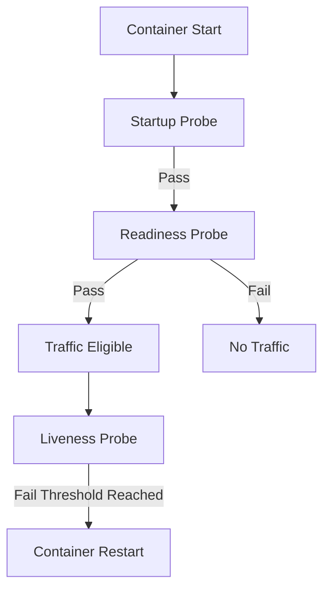
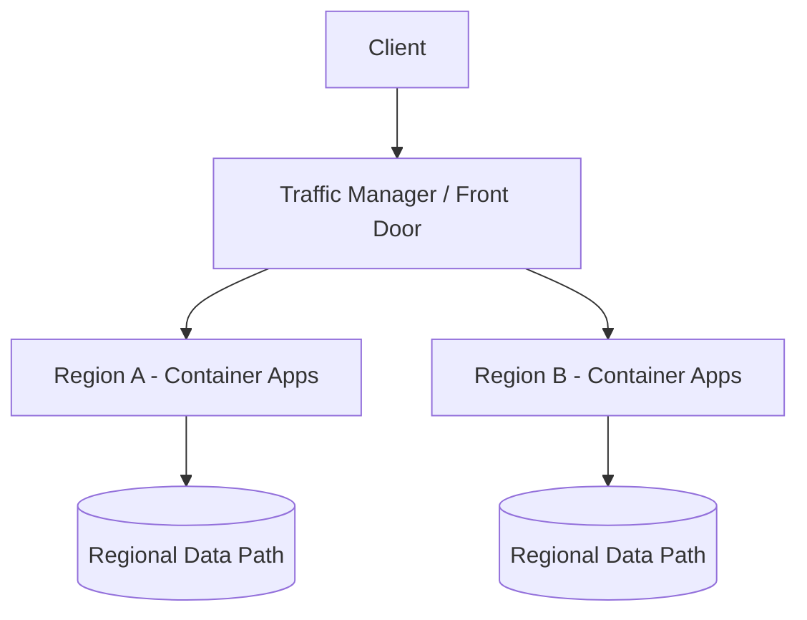
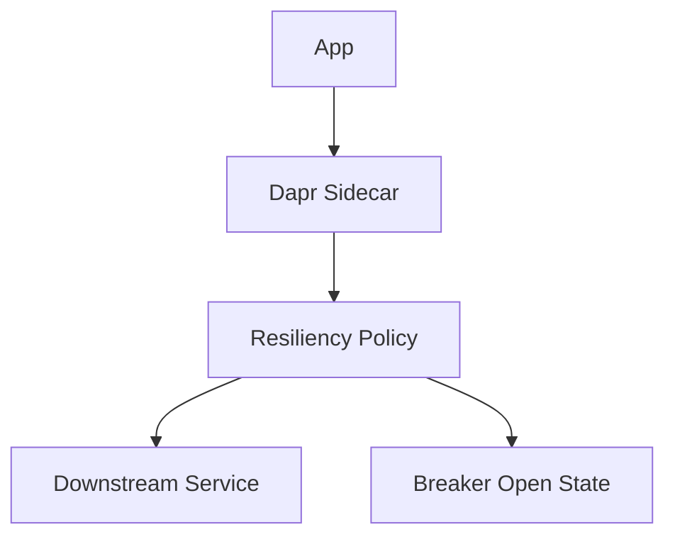

---
content_sources:
  diagrams:
    - id: do-not-reuse-one-endpoint-for
      type: flowchart
      source: mslearn-adapted
      based_on:
        - https://learn.microsoft.com/en-us/azure/reliability/reliability-container-apps
        - https://learn.microsoft.com/en-us/azure/container-apps/health-probes
        - https://learn.microsoft.com/en-us/azure/container-apps/scale-app
    - id: for-high-availability-public-services-run-active-passive
      type: flowchart
      source: mslearn-adapted
      based_on:
        - https://learn.microsoft.com/en-us/azure/reliability/reliability-container-apps
        - https://learn.microsoft.com/en-us/azure/container-apps/health-probes
        - https://learn.microsoft.com/en-us/azure/container-apps/scale-app
    - id: dapr-resiliency-high-level-flow
      type: flowchart
      source: mslearn-adapted
      based_on:
        - https://learn.microsoft.com/en-us/azure/reliability/reliability-container-apps
        - https://learn.microsoft.com/en-us/azure/container-apps/health-probes
        - https://learn.microsoft.com/en-us/azure/container-apps/scale-app
content_validation:
  status: verified
  last_reviewed: "2026-04-12"
  reviewer: ai-agent
  core_claims:
    - claim: "When you deploy a container app for the first time, an initial revision is automatically created."
      source: "https://learn.microsoft.com/azure/container-apps/revisions"
      verified: true
    - claim: "If ingress is enabled in single revision mode, the existing revision continues to receive 100% of the traffic until the new revision is ready."
      source: "https://learn.microsoft.com/azure/container-apps/revisions"
      verified: true
    - claim: "A new revision is considered ready only after it provisions successfully, scales to match the previous revision's replica count, and all replicas pass startup and readiness probes."
      source: "https://learn.microsoft.com/azure/container-apps/revisions"
      verified: true
    - claim: "In single revision mode, if an update fails, traffic remains pointed to the old revision."
      source: "https://learn.microsoft.com/azure/container-apps/revisions"
      verified: true
---

# Azure Container Apps Reliability Best Practices

This guide covers production reliability patterns for Azure Container Apps, including probe design, graceful termination, revision rollback, and disaster recovery planning. Use it to run stable services under failure, scale transitions, and regional incidents.

## Prerequisites

- You reviewed reliability concepts first:
  - [Health and Recovery (Platform)](../platform/reliability/health-recovery.md)
  - [Revisions (Platform)](../platform/revisions/index.md)
  - [Scaling (Platform)](../platform/scaling/index.md)
- Azure CLI is installed and authenticated.
- Application exposes health endpoints and supports SIGTERM handling.

Set common variables:

```bash
export RG="rg-aca-prod"
export APP_NAME="ca-api-prod"
export ENVIRONMENT_NAME="cae-prod"
export ACR_NAME="acrprodshared"
export LOCATION="koreacentral"
```

## Main Content

### Design health probes as separate reliability signals

Use each probe for one purpose only:

- **Startup probe**: determines whether bootstrap completed.
- **Readiness probe**: determines whether the replica can serve traffic now.
- **Liveness probe**: determines whether process should be restarted.

Do not reuse one endpoint for all three unless behavior is intentionally identical.

<!-- diagram-id: do-not-reuse-one-endpoint-for -->


Operational guidance:

1. Startup checks should tolerate cold start cost.
2. Readiness checks should validate dependencies required for serving.
3. Liveness checks should detect deadlock or irrecoverable process faults.

!!! warning "Liveness should not depend on fragile downstream calls"
    If liveness depends on transient external dependencies, healthy replicas restart unnecessarily and amplify outages.

### Probe timing: tune for workload behavior, not defaults

Key parameters and their impact:

| Field | Reliability Effect | Tuning Strategy |
|---|---|---|
| initialDelaySeconds | Grace period before probe starts | Increase for heavy startup |
| periodSeconds | Probe frequency | Balance detection speed and noise |
| failureThreshold | Consecutive failures before action | Increase to reduce false positives |

Example probe-focused YAML for updates:

```yaml
properties:
  template:
    containers:
      - name: api
        image: acrprodshared.azurecr.io/api:2026-04-04
        probes:
          - type: Startup
            httpGet:
              path: /health/startup
              port: 8000
            initialDelaySeconds: 10
            periodSeconds: 5
            failureThreshold: 24
          - type: Readiness
            httpGet:
              path: /health/ready
              port: 8000
            initialDelaySeconds: 5
            periodSeconds: 10
            failureThreshold: 3
          - type: Liveness
            httpGet:
              path: /health/live
              port: 8000
            initialDelaySeconds: 20
            periodSeconds: 15
            failureThreshold: 3
```

Apply YAML:

```bash
az containerapp update \
  --name "$APP_NAME" \
  --resource-group "$RG" \
  --yaml "./infra/containerapp-reliability.yaml"
```

### Graceful shutdown with SIGTERM and termination grace

Graceful termination prevents request loss during scale-in, rollout, and node maintenance.

Required behavior:

- App receives SIGTERM.
- App stops accepting new requests.
- In-flight requests complete within grace period.
- Background workers checkpoint and stop cleanly.

Set termination grace period in template:

```yaml
properties:
  template:
    terminationGracePeriodSeconds: 30
```

Update app template:

```bash
az containerapp update \
  --name "$APP_NAME" \
  --resource-group "$RG" \
  --yaml "./infra/containerapp-termination.yaml"
```

!!! note "Coordinate grace period with upstream timeout"
    If load balancer, gateway, or client timeout is shorter than termination grace, requests may still fail despite clean SIGTERM handling.

### Zone redundancy in Container Apps Environments

Use zone-redundant environment options when region and SKU support aligns with your SLO.

Benefits:

- Better resilience to single-zone failures.
- Improved availability for replica placement.

Trade-offs:

- Potential cost increase.
- Regional capability constraints.
- Additional architecture validation required for dependencies.

Check environment profile:

```bash
az containerapp env show \
  --name "$ENVIRONMENT_NAME" \
  --resource-group "$RG" \
  --output json
```

### Multi-region deployment pattern for critical APIs

For high-availability public services, run active-passive or active-active across regions.

<!-- diagram-id: for-high-availability-public-services-run-active-passive -->


Choose pattern by dependency model:

- **Active-passive**: simpler operations, slower failover switch.
- **Active-active**: faster failover, requires strict data and idempotency design.

Operational baseline:

1. Replicate IaC and runtime config across both regions.
2. Keep revision labels and rollout conventions consistent.
3. Run periodic failover drills with measurable RTO/RPO outcomes.

### Retry and circuit breaker patterns with Dapr resiliency

Apply retries and circuit breakers to control transient and persistent failures.

Reliability policy guidance:

- Retry idempotent operations only.
- Use bounded retry with backoff and jitter.
- Add circuit breaker for persistent dependency failure.
- Expose fallback behavior for degraded mode.

Dapr resiliency high-level flow:

<!-- diagram-id: dapr-resiliency-high-level-flow -->


Operational checks:

- Ensure retry budget does not exceed request timeout budget.
- Track retry and breaker metrics in telemetry.
- Validate behavior during dependency outage game day.

### Revision-based rollback for speed and safety

Use revisions as your primary rollback mechanism.

Rollback method:

1. Keep last known good revision active.
2. Route majority traffic to new revision gradually.
3. If errors rise, shift traffic back immediately.
4. Investigate failed revision without stopping stable path.

List revisions:

```bash
az containerapp revision list \
  --name "$APP_NAME" \
  --resource-group "$RG" \
  --output table
```

Immediate rollback example:

```bash
az containerapp ingress traffic set \
  --name "$APP_NAME" \
  --resource-group "$RG" \
  --revision-weight "${APP_NAME}--stable=100"
```

!!! warning "Do not deactivate stable revision too early"
    Keeping at least one proven revision active dramatically reduces mean time to recover during bad deployments.

### Monitor service health with Application Insights and KQL

Track reliability by signals, not single metrics.

Core indicators:

- Request success rate and latency percentiles.
- Revision-level error spikes.
- Restart count and probe failure trends.
- Dependency failure and retry amplification.

KQL query: failures by revision and status code:

```kql
ContainerAppConsoleLogs_CL
| where TimeGenerated > ago(30m)
| where ContainerAppName_s == "ca-api-prod"
| where Log_s has "HTTP"
| summarize Count=count() by RevisionName_s, bin(TimeGenerated, 5m)
| order by TimeGenerated desc
```

KQL query: probe-related system events:

```kql
ContainerAppSystemLogs_CL
| where TimeGenerated > ago(30m)
| where ContainerAppName_s == "ca-api-prod"
| where Log_s has_any ("Probe", "readiness", "liveness", "startup")
| project TimeGenerated, RevisionName_s, ReplicaName_s, Log_s
| order by TimeGenerated desc
```

CLI log check for incident triage:

```bash
az containerapp logs show \
  --name "$APP_NAME" \
  --resource-group "$RG" \
  --type system \
  --follow false
```

### Disaster recovery considerations for Container Apps

DR is not only regional deployment; it is an operational discipline.

Define and test:

- Recovery Time Objective (RTO)
- Recovery Point Objective (RPO)
- Data consistency model across regions
- Failover decision authority and communication flow

DR runbook minimum sections:

1. Trigger criteria and severity mapping.
2. Traffic failover steps and rollback conditions.
3. Region-specific dependency checks.
4. Validation checklist for health and business transactions.
5. Post-incident review actions.

### Reliability design for background jobs and workers

For queue/event workers in Container Apps:

- Prefer no ingress.
- Ensure idempotent message handling.
- Use visibility timeout aligned with processing duration.
- Emit checkpoint logs and dead-letter metrics.

When using Container Apps Jobs:

- Define retry policy per failure mode.
- Monitor execution history and failure categories.
- Keep job image/version pinned and reproducible.

### Scale reliability: avoid thrash and cold-start shock

Scale settings can create reliability problems if too aggressive.

Best practices:

- Keep non-zero minimum replicas for latency-sensitive APIs.
- Tune KEDA triggers to avoid oscillation.
- Set scale bounds according to dependency capacity.
- Coordinate HPA-like behavior with downstream connection pools.

### Reliability release gate checklist

Use this checklist before production rollout:

- Startup, readiness, and liveness probes tested under load.
- Graceful shutdown tested during active traffic.
- Revision rollback tested with one command path.
- Alert rules cover error rate, latency, restarts, and failed revisions.
- SLO dashboard includes revision and dependency dimensions.
- Regional failover drill completed in last quarter.

### Example incident workflow (15-minute containment target)

1. Detect error budget burn from alerts.
2. Identify impacted revision and dependency.
3. Roll traffic to known-good revision.
4. Confirm recovery via SLI dashboard and KQL.
5. Freeze further rollout until root cause is understood.

Useful CLI during containment:

```bash
az containerapp show \
  --name "$APP_NAME" \
  --resource-group "$RG" \
  --query "properties.latestReadyRevisionName" \
  --output tsv

az containerapp ingress traffic show \
  --name "$APP_NAME" \
  --resource-group "$RG" \
  --output table
```

### Anti-patterns to avoid

- One `/health` endpoint reused for all probe types without intent.
- Liveness probe checking downstream dependencies directly.
- Zero stable revision retained during canary rollout.
- No termination grace period for long-running requests.
- Declaring multi-region architecture without failover drills.

## Advanced Topics

Use these advanced patterns for higher maturity:

- SLO-based progressive delivery gates tied to revision traffic automation.
- Synthetic transactions from multiple geographies for early detection.
- Adaptive concurrency limits and queue backpressure controls.
- Chaos experiments targeting dependency outages and network faults.
- Automated postmortem data capture from logs, traces, and deployment events.

Sample command set for recurring reliability audits:

```bash
az containerapp revision list \
  --name "$APP_NAME" \
  --resource-group "$RG" \
  --output json

az monitor metrics list \
  --resource "/subscriptions/<subscription-id>/resourceGroups/$RG/providers/Microsoft.App/containerApps/$APP_NAME" \
  --metric "CpuUsage" "MemoryUsage" \
  --interval "PT5M" \
  --aggregation "Average"
```

## See Also

- [Health and Recovery (Platform)](../platform/reliability/health-recovery.md)
- [Revisions (Platform)](../platform/revisions/index.md)
- [Scaling (Platform)](../platform/scaling/index.md)
- [Operations Monitoring](../operations/monitoring/index.md)
- [Operations Recovery](../operations/recovery/index.md)
- [Networking Best Practices](./networking.md)
- [Identity and Secrets Best Practices](./identity-and-secrets.md)
