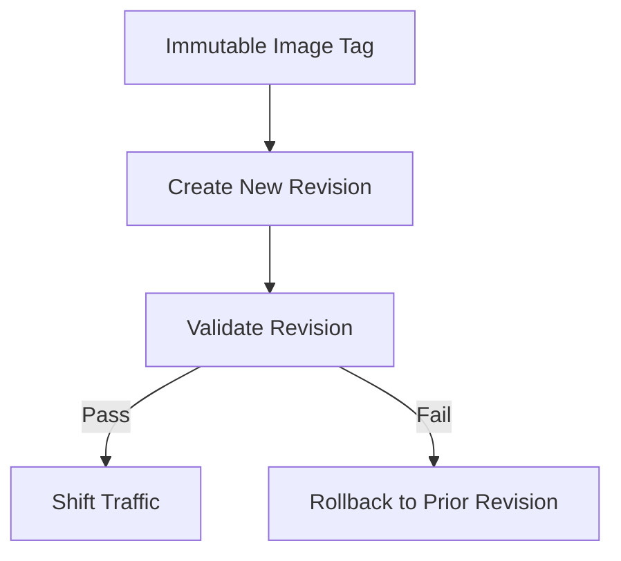
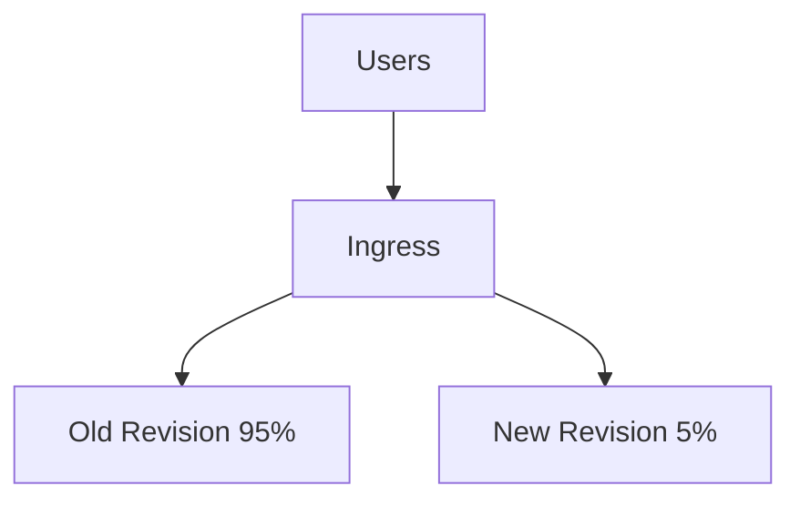
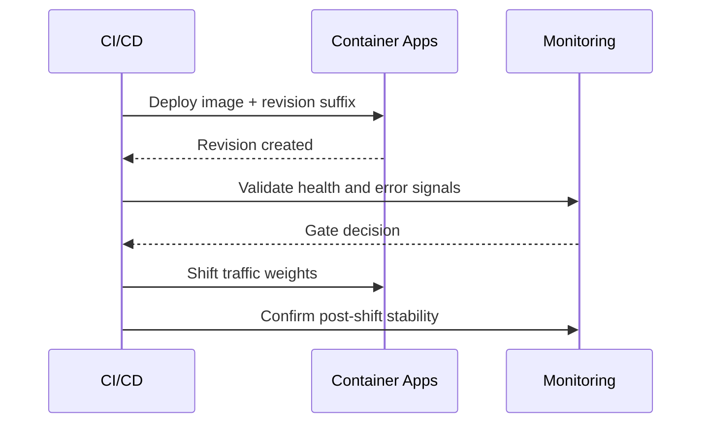

---
content_sources:
  diagrams:
    - id: shift-traffic-only-when-release-criteria
      type: flowchart
      source: mslearn-adapted
      based_on:
        - https://learn.microsoft.com/en-us/azure/container-apps/revisions
        - https://learn.microsoft.com/en-us/azure/container-apps/traffic-splitting
        - https://learn.microsoft.com/en-us/azure/container-apps/blue-green-deployment
    - id: when-slo-and-dependency-metrics
      type: flowchart
      source: mslearn-adapted
      based_on:
        - https://learn.microsoft.com/en-us/azure/container-apps/revisions
        - https://learn.microsoft.com/en-us/azure/container-apps/traffic-splitting
        - https://learn.microsoft.com/en-us/azure/container-apps/blue-green-deployment
    - id: deactivate-stale-revisions-after-confidence-window
      type: sequenceDiagram
      source: mslearn-adapted
      based_on:
        - https://learn.microsoft.com/en-us/azure/container-apps/revisions
        - https://learn.microsoft.com/en-us/azure/container-apps/traffic-splitting
        - https://learn.microsoft.com/en-us/azure/container-apps/blue-green-deployment
content_validation:
  status: verified
  last_reviewed: "2026-04-12"
  reviewer: ai-agent
  core_claims:
    - claim: "Revisions are immutable snapshots of each version of a container app."
      source: "https://learn.microsoft.com/azure/container-apps/revisions"
      verified: true
    - claim: "Azure Container Apps supports single and multiple revision modes."
      source: "https://learn.microsoft.com/azure/container-apps/revisions"
      verified: true
    - claim: "In multiple revision mode, you can have multiple active revisions and split traffic between revisions."
      source: "https://learn.microsoft.com/azure/container-apps/revisions"
      verified: true
    - claim: "Labels provide unique URLs that route traffic to specific revisions."
      source: "https://learn.microsoft.com/azure/container-apps/revisions"
      verified: true
    - claim: "Container Apps doesn't charge for inactive revisions, and by default it keeps up to 100 inactive revisions."
      source: "https://learn.microsoft.com/azure/container-apps/revisions"
      verified: true
---

# Revision Strategy Best Practices for Azure Container Apps

This guide explains how to operate revisions as a controlled release mechanism in Azure Container Apps, including rollout safety, rollback speed, and lifecycle hygiene. It focuses on practical decision patterns you can apply in production pipelines.

## Prerequisites

- Azure CLI 2.57+ with Container Apps extension
- Existing app (`$APP_NAME`) in resource group (`$RG`) and environment (`$ENVIRONMENT_NAME`)
- Container image in Azure Container Registry (`$ACR_NAME`)
- Team agreement on release gates and rollback criteria

```bash
az extension add --name containerapp --upgrade
az containerapp show --name "$APP_NAME" --resource-group "$RG" --output table
az containerapp revision list --name "$APP_NAME" --resource-group "$RG" --output table
```

## Main Content

### Treat revisions as the unit of release risk

A revision is immutable once created. That immutability gives you repeatability if and only if your release process is revision-first.

Revision-first release means:

1. Build one immutable image tag.
2. Deploy that image to create one revision candidate.
3. Validate health and telemetry on that specific revision.
4. Shift traffic only when release criteria pass.

<!-- diagram-id: shift-traffic-only-when-release-criteria -->


### Decide single vs multiple revision mode by release complexity

Use revision mode as a product of operational complexity, not developer preference.

| Decision point | Single mode | Multiple mode |
|---|---|---|
| Deployment simplicity | Highest | Moderate |
| Canary and staged rollout | Not suitable | Native fit |
| Rollback speed | Fast for simple replace | Fast with pre-warmed old revision |
| Operational overhead | Low | Higher |
| Experimentation (A/B) | Limited | Strong |

Use **single revision mode** when:

- The app is low-risk and stateless.
- You deploy frequently with narrow blast radius.
- You do not need partial traffic exposure.

Use **multiple revision mode** when:

- You need canary, blue-green, or A/B routing.
- You want quick rollback by weight reassignment.
- You must run controlled side-by-side validation.

```bash
az containerapp revision set-mode \
  --name "$APP_NAME" \
  --resource-group "$RG" \
  --mode multiple
```

!!! warning "Switching revision mode changes release behavior"
    In single mode, old revisions are automatically deactivated after successful replacement. In multiple mode, you must manage deactivation and traffic intentionally to avoid drift and unnecessary cost.

### Use a revision suffix convention that is machine-sortable

Revision suffixes should encode release chronology and source identity.

Recommended suffix examples:

- `20260404-1`
- `20260404-2`
- `git-8f2c1d4`

Avoid opaque suffixes that force manual lookup.

```bash
az containerapp update \
  --name "$APP_NAME" \
  --resource-group "$RG" \
  --image "$ACR_NAME.azurecr.io/$APP_NAME:20260404-1" \
  --revision-suffix "20260404-1"
```

Naming policy recommendations:

1. Keep suffix length short enough for readability in dashboards.
2. Include sortable date token for timeline reconstruction.
3. Include release sequence if multiple deployments per day occur.

### Use labels for stable endpoints and weights for controlled migration

Labels and traffic weights solve different operational problems.

| Need | Preferred mechanism | Why |
|---|---|---|
| Stable URL for specific revision | Revision label | Deterministic route for validation or partner integration |
| Gradual production shift | Traffic weights | Fine-grained progressive exposure |
| Instant failback | Traffic weights to previous revision | Fast rollback without redeploy |
| Parallel test environments | Labels | Isolated testing without affecting weighted production flow |

Label assignment example:

```bash
az containerapp revision label add \
  --name "$APP_NAME" \
  --resource-group "$RG" \
  --revision "$APP_NAME--20260404-1" \
  --label "candidate"
```

Traffic weighting example:

```bash
az containerapp ingress traffic set \
  --name "$APP_NAME" \
  --resource-group "$RG" \
  --revision-weight "$APP_NAME--20260404-1=10" "$APP_NAME--20260403-4=90"
```

### Apply repeatable traffic splitting patterns

#### Canary rollout pattern

Use canary when you want statistical confidence before full migration.

Typical progression:

1. 5% for smoke + error budget check.
2. 25% for medium-volume observation.
3. 50% for sustained behavior under normal load.
4. 100% when SLO and dependency metrics remain healthy.

<!-- diagram-id: when-slo-and-dependency-metrics -->


Promotion criteria examples:

- Error rate delta < 0.3% vs baseline.
- P95 latency increase < 15%.
- No sustained liveness probe failures.

#### Blue-green pattern

Use blue-green when cutover must be fast and binary.

Flow:

1. Keep blue revision at 100% production traffic.
2. Deploy green revision with 0% traffic.
3. Validate green via revision label endpoint.
4. Switch traffic to green in one operation.
5. Keep blue active temporarily for immediate failback.

```bash
az containerapp ingress traffic set \
  --name "$APP_NAME" \
  --resource-group "$RG" \
  --revision-weight "$APP_NAME--green=100" "$APP_NAME--blue=0"
```

#### A/B pattern

Use A/B when comparing behavior across revision variants.

- Keep experiment duration bounded.
- Define explicit success metrics in advance.
- Avoid long-lived A/B states that complicate operations.

### Design rollback as a first-class fast path

Rollback should be one command and one decision, not a multi-step scramble.

Rollback readiness checklist:

- Previous stable revision remains active during rollout window.
- Traffic command is scripted in pipeline.
- Alert routing includes release context.
- On-call has clear rollback threshold.

Rollback command pattern:

```bash
az containerapp ingress traffic set \
  --name "$APP_NAME" \
  --resource-group "$RG" \
  --revision-weight "$APP_NAME--20260403-4=100" "$APP_NAME--20260404-1=0"
```

!!! warning "Do not rollback by rebuilding old image"
    Rebuild-based rollback is slower and may not reproduce the same artifact. Route traffic back to an existing known-good revision whenever possible.

### Build a zero-downtime deployment workflow

Zero-downtime in Container Apps depends on health-gated promotion and controlled traffic movement.

Recommended workflow:

1. Deploy new image with explicit revision suffix.
2. Keep traffic on current stable revision.
3. Validate startup/readiness and key telemetry on new revision.
4. Shift traffic gradually or switch atomically by strategy.
5. Observe post-cutover SLO window.
6. Deactivate stale revisions after confidence window ends.

<!-- diagram-id: deactivate-stale-revisions-after-confidence-window -->


### Manage revision lifecycle to control cost and cognitive load

Active revisions consume resources and operational attention. Keep only what is useful.

Lifecycle policy suggestions:

- Keep at least one known-good fallback revision active during rollout.
- Deactivate superseded revisions after release confidence window.
- Regularly review inactive revision count and retention policy.
- Annotate release records with revision names for incident forensics.

List and deactivate example:

```bash
az containerapp revision list \
  --name "$APP_NAME" \
  --resource-group "$RG" \
  --output table

az containerapp revision deactivate \
  --name "$APP_NAME" \
  --resource-group "$RG" \
  --revision "$APP_NAME--20260328-2"
```

### Avoid schema-coupled rollouts without compatibility windows

Multiple revisions can run concurrently against shared dependencies.

Compatibility practices:

1. Use expand-and-contract schema changes.
2. Make new code tolerate old fields and vice versa.
3. Delay destructive migrations until old revision traffic reaches zero.

### Combine revision strategy with autoscaling behavior

Traffic split affects load per revision, which affects scale events.

Operational implications:

- A small canary weight may still trigger autoscaling if request profile is bursty.
- Min replicas for canary revisions can reduce false negatives due to cold starts.
- Separate scale rule tuning may be needed for low-percentage revisions.

### Use release guardrails in automation

Codify release safety in CI/CD:

- Enforce immutable image tags.
- Require revision suffix on production deploy.
- Block traffic shift if health checks fail.
- Require explicit rollback plan per release.

Example update command in pipeline:

```bash
az containerapp update \
  --name "$APP_NAME" \
  --resource-group "$RG" \
  --image "$ACR_NAME.azurecr.io/$APP_NAME:$IMAGE_TAG" \
  --revision-suffix "$IMAGE_TAG"
```

### Operational checklist for every release

Pre-deploy:

- Stable revision identified and documented.
- Rollback command prepared.
- Alert thresholds confirmed.

Deploy:

- New revision created successfully.
- Probe health stable.
- Candidate telemetry baseline collected.

Promote:

- Traffic shifted according to chosen pattern.
- Error and latency deltas within threshold.

Post-deploy:

- Old revision retained only for defined fallback period.
- Release notes include final traffic state.
- Cleanup task scheduled.

## Advanced Topics

### Weighted promotion automation with safety windows

Automate canary progression with timed hold periods and automatic halt conditions when SLO deltas exceed thresholds.

### Revision labels for external contract testing

Use stable labels for partner validation endpoints to avoid coupling external tests to transient revision names.

### Incident forensics with revision-scoped telemetry

Correlate errors, latency spikes, and dependency failures by revision name to isolate whether issues are release-induced or platform/environmental.

### Coordinating revision rollout across multiple apps

For distributed systems, sequence rollouts by dependency direction and maintain compatibility windows so mixed-revision states remain safe.

## See Also

- [Platform: Revisions](../platform/revisions/index.md)
- [Platform: Scaling](../platform/scaling/index.md)
- [Operations: Revision Management](../operations/revision-management/index.md)
- [Operations: Deployment](../operations/deployment/index.md)
- [Python Guide: Revisions and Traffic](../language-guides/python/tutorial/07-revisions-traffic.md)
- [Microsoft Learn: Revisions in Azure Container Apps](https://learn.microsoft.com/azure/container-apps/revisions)
