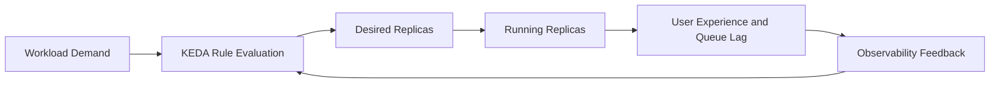
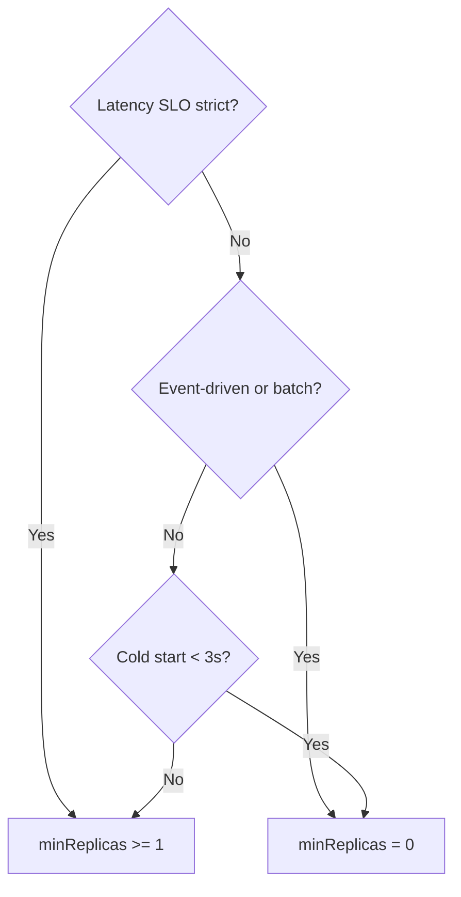

# Scaling Best Practices for Azure Container Apps

This guide provides practical scaling patterns for Azure Container Apps using KEDA-backed rules, replica boundaries, and production validation techniques. It focuses on tuning decisions that balance latency, reliability, and cost under real workload variability.

## Prerequisites

- Azure CLI 2.57+ with Container Apps extension
- Existing app (`$APP_NAME`) deployed in resource group (`$RG`) and environment (`$ENVIRONMENT_NAME`)
- Log Analytics connected to the Container Apps environment
- Baseline load profile for your service (steady and peak)

```bash
az extension add --name containerapp --upgrade
az containerapp show --name "$APP_NAME" --resource-group "$RG" --output table
az containerapp revision list --name "$APP_NAME" --resource-group "$RG" --output table
```

## Main Content

### Start with scaling objectives, not scaler defaults

Before setting rules, define objective boundaries:

1. Target latency (for example, P95 under 300 ms).
2. Maximum allowed backlog age for queue workloads.
3. Cost envelope for expected peak periods.
4. Safe load ceiling for downstream dependencies.

Without explicit objectives, scaling rules become arbitrary and unstable.



### Tune HTTP scaling with concurrency and response behavior in mind

HTTP-driven apps often fail from poor concurrency targets, not from missing scale rules.

Practical method:

1. Measure per-replica sustainable concurrency under normal CPU/memory usage.
2. Set HTTP concurrency threshold below saturation point.
3. Validate with burst traffic and observe error/latency slope.

```bash
az containerapp update \
  --name "$APP_NAME" \
  --resource-group "$RG" \
  --min-replicas 1 \
  --max-replicas 20 \
  --scale-rule-name "http-concurrency" \
  --scale-rule-type http \
  --scale-rule-metadata "concurrentRequests=50"
```

HTTP tuning guidance:

- Lower threshold for CPU-heavy request handlers.
- Higher threshold for lightweight I/O-bound handlers.
- Re-evaluate after significant code-path changes.

!!! warning "High concurrency thresholds can hide overload"
    If concurrency is set above real application capacity, scale-out arrives too late and user latency spikes before replicas increase.

### Understand request-count vs concurrency behavior

In practice, request pressure is experienced as concurrent in-flight work. Design thresholds around in-flight work, not raw request totals over long windows.

Use controlled tests to determine:

- Point where latency inflects sharply.
- Point where error rate starts increasing.
- CPU and memory usage at those points.

### Choose scaler types by workload signal quality

KEDA offers many scalers. The best one is the most direct signal of pending work.

| Workload type | Preferred scaler signal | Why |
|---|---|---|
| Public API | HTTP concurrency | Direct user-facing pressure |
| Async workers | Queue depth or lag | Backlog reflects pending work |
| Event processing | Event source lag/count | Indicates unprocessed demand |
| Compute tasks | CPU or memory + backlog | Resource pressure plus demand context |

Selection principles:

1. Prefer backlog-based triggers for asynchronous systems.
2. Use CPU/memory as supporting signals, not sole demand proxy.
3. Avoid combining unrelated triggers without clear precedence expectations.

### Configure Service Bus scaler with realistic thresholds

For Service Bus-driven workers, queue length and message age are primary indicators.

```bash
az containerapp update \
  --name "$APP_NAME" \
  --resource-group "$RG" \
  --min-replicas 0 \
  --max-replicas 30 \
  --scale-rule-name "servicebus-orders" \
  --scale-rule-type azure-servicebus \
  --scale-rule-metadata "queueName=orders" "namespace=$SERVICEBUS_NAMESPACE" "messageCount=25" \
  --scale-rule-auth "connection=servicebus-connection"
```

Threshold planning example:

- If one replica reliably processes 10 messages/second, and acceptable queue drain target is 60 seconds, backlog threshold should reflect desired response time and burst profile.

### Configure Azure Storage Queue scaler for batch workers

Storage Queue scaling should align with message processing cost per item.

```bash
az containerapp update \
  --name "$APP_NAME" \
  --resource-group "$RG" \
  --min-replicas 0 \
  --max-replicas 40 \
  --scale-rule-name "storagequeue-ingest" \
  --scale-rule-type azure-queue \
  --scale-rule-metadata "queueName=ingest" "queueLength=50" "accountName=$STORAGE_ACCOUNT" \
  --scale-rule-auth "connection=storage-connection"
```

Operational tuning tips:

- Increase `queueLength` when each message is lightweight.
- Decrease `queueLength` when each message is expensive or latency-sensitive.
- Verify poison/dead-letter handling to prevent endless retries driving unnecessary scale.

### Plan min and max replicas as reliability guardrails

Replica boundaries are not optional; they are safety controls.

| Setting | Effect | Tradeoff |
|---|---|---|
| min replicas = 0 | Lowest idle cost | Cold starts on new demand |
| min replicas > 0 | Faster first response | Baseline cost persists |
| high max replicas | Better burst absorption | Higher dependency and spend risk |
| low max replicas | Cost containment | Potential backlog/latency growth |

Planning approach:

1. Set `max-replicas` from downstream safe capacity, not from optimism.
2. Set `min-replicas` from latency SLO and cold-start tolerance.
3. Review bounds after each major traffic shape change.

### Decide explicitly on scale-to-zero

Scale-to-zero is ideal for intermittent workloads but can be harmful for strict latency APIs.

| Criteria | `minReplicas: 0` | `minReplicas: 1+` |
|---|---|---|
| Idle cost | Zero runtime cost | Baseline cost persists |
| Cold start | Yes — startup delay on first request | No — always warm |
| Best for | Event-driven, batch, admin tools | User-facing APIs, strict SLO |
| Startup probe | Must tolerate full cold boot | Only on new revision deploy |
| Queue processing | Acceptable lag on first message | Immediate processing |



Use `min-replicas: 0` when:

- Workload is event-driven and tolerant of startup delay.
- Cost minimization during idle windows is primary.

Use `min-replicas > 0` when:

- API latency SLO is strict.
- Cold start penalties are visible to end users.
- Startup includes heavy dependency initialization.

```bash
az containerapp update \
  --name "$APP_NAME" \
  --resource-group "$RG" \
  --min-replicas 1 \
  --max-replicas 15
```

### Mitigate cold starts for user-facing services

Cold start mitigation techniques:

1. Keep at least one warm replica.
2. Reduce image size and startup dependency chain.
3. Ensure startup probe allows realistic warm-up time.
4. Preload critical caches if startup cost is predictable.

### Use CPU and memory triggers carefully

CPU/memory signals capture resource saturation, but they are lagging indicators for demand spikes.

Use cases:

- CPU rule to protect against sustained compute pressure.
- Memory rule to prevent OOM-prone growth patterns.
- Combined with backlog/HTTP rules for complete behavior.

```bash
az containerapp update \
  --name "$APP_NAME" \
  --resource-group "$RG" \
  --scale-rule-name "cpu-protect" \
  --scale-rule-type cpu \
  --scale-rule-metadata "type=Utilization" "value=70"
```

!!! warning "Resource-only scaling can miss incoming bursts"
    CPU and memory often rise after queues or request concurrency already spike. Pair them with demand-proximate scalers for faster response.

### Understand scale rule interaction and effective behavior

When multiple scale rules are configured, replica decisions are driven by the highest demanded scale outcome among active triggers.

Implications:

- A single aggressive rule can dominate scaling.
- Inconsistent thresholds produce oscillation risk.
- Validation must cover combined-rule behavior, not isolated rules.

Rule interaction checklist:

- Are thresholds aligned with one coherent capacity model?
- Does any rule force excessive scale-out for transient noise?
- Are min/max bounds preventing runaway growth?

### Test scaling rules before production promotion

Scaling must be load-tested as part of release validation.

| Test Scenario | What to Measure | Pass Criteria |
|---|---|---|
| Steady-state normal load | Replica count stability | No oscillation, latency within SLO |
| Sudden burst (2-5x peak) | Time to first scale-out | Scale-out within 30-60s |
| Dependency slowdown | Replica growth vs error rate | No runaway scale-out |
| Recovery after burst drops | Scale-in timing | Smooth cooldown, no premature termination |
| Scale-from-zero (if enabled) | First request latency | Cold start within acceptable budget |

Validation outcomes to capture:

- Time to first scale-out.
- Peak replica count.
- Queue drain time.
- Error and timeout rate during transitions.

### Observe scaling events with KQL

Use KQL to correlate scaling behavior with latency and failures.

Example: correlate replica changes with errors.

```kusto
ContainerAppConsoleLogs_CL
| where TimeGenerated > ago(2h)
| where ContainerAppName_s == "$APP_NAME"
| project TimeGenerated, RevisionName_s, Log_s
| order by TimeGenerated asc
```

Example: inspect system-level scaling signals from Container Apps logs.

```kusto
ContainerAppSystemLogs_CL
| where TimeGenerated > ago(2h)
| where ContainerAppName_s == "$APP_NAME"
| where Log_s has "Scale" or Log_s has "replica"
| project TimeGenerated, RevisionName_s, Log_s
| order by TimeGenerated asc
```

Example: detect periods of repeated rapid scaling.

```kusto
ContainerAppSystemLogs_CL
| where TimeGenerated > ago(6h)
| where ContainerAppName_s == "$APP_NAME"
| where Log_s has "Scale"
| summarize ScaleEvents = count() by bin(TimeGenerated, 5m)
| where ScaleEvents > 5
| order by TimeGenerated asc
```

### Protect downstream systems from scaler-induced surges

Autoscaling can overwhelm databases, caches, and third-party APIs if replica growth is unconstrained.

Protection patterns:

- Set max replicas from dependency capacity limits.
- Add connection pool caps per replica.
- Use circuit breakers and bounded retries.
- Enforce queue backpressure where possible.

### Coordinate scaling with revision rollout strategy

Scaling and revisions interact strongly during canaries and blue-green deployments.

Recommendations:

1. Give canary revisions enough min replicas to avoid cold-start-biased results.
2. Compare scaling behavior across old/new revisions before full cutover.
3. Keep rollback revision warm during early rollout window.

### Maintain scaling runbooks and ownership boundaries

Document who can change thresholds, max replica caps, and scaler credentials.

Runbook essentials:

- Current scale rules and rationale.
- Known safe and unsafe threshold ranges.
- Emergency cap-reduction command.
- Rollback plan for faulty scale-rule updates.

Emergency containment example:

```bash
az containerapp update \
  --name "$APP_NAME" \
  --resource-group "$RG" \
  --max-replicas 5
```

### Scaling governance checklist

Use this checklist for recurring scale reviews:

- Are objective thresholds still aligned with current traffic profile?
- Did recent releases change per-request compute cost?
- Are cold starts affecting measured user latency?
- Are scale events correlated with dependency incidents?
- Is cost trend consistent with demand growth?

## Advanced Topics

### Adaptive threshold tuning by time window

Some workloads have predictable daily or weekly cycles. Advanced teams tune thresholds or min replicas based on schedule to reduce oscillation and improve efficiency.

### Multi-signal scaler strategy

For complex systems, combine HTTP, queue, and resource triggers with clear ownership and documented precedence expectations.

### Synthetic load as continuous scaling validation

Run controlled synthetic bursts in non-production environments after significant runtime or dependency changes to detect scaling regressions early.

### Capacity modeling with dependency budgets

Model safe replica ranges from downstream dependency limits (database connections, API rate limits, cache throughput), then derive max replicas and scaler thresholds from those budgets.

## See Also

- [Platform: Scaling](../platform/scaling/index.md)
- [Platform: Revisions](../platform/revisions/index.md)
- [Operations: Monitoring](../operations/monitoring/index.md)
- [Operations: Alerts](../operations/alerts/index.md)
- [Troubleshooting: Playbooks](../troubleshooting/playbooks/index.md)
- [Microsoft Learn: Set scaling rules in Azure Container Apps](https://learn.microsoft.com/azure/container-apps/scale-app)
