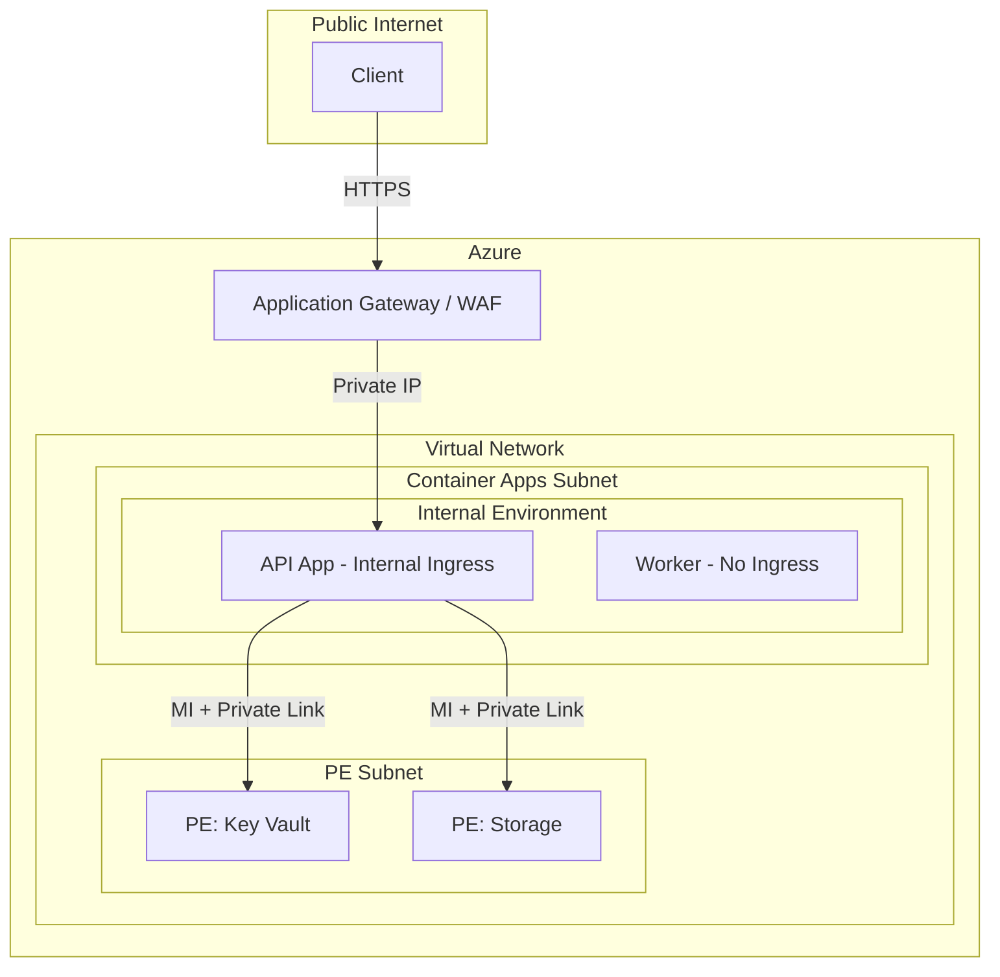
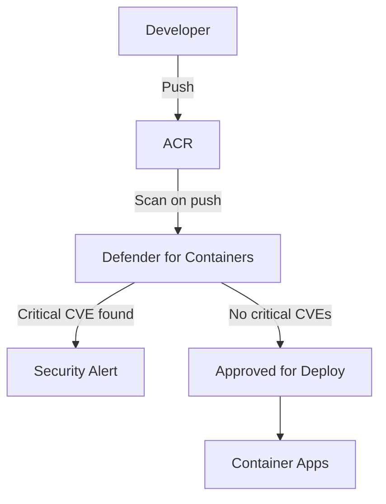
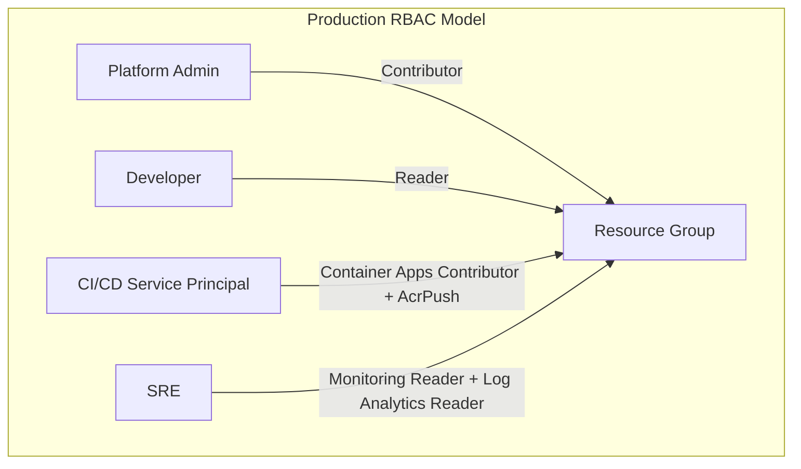

---
content_sources:
  diagrams:
  - id: create-environments-with-no-public-endpoint
    type: flowchart
    source: mslearn-adapted
    based_on:
    - https://learn.microsoft.com/azure/container-apps/security
    - https://learn.microsoft.com/azure/container-apps/authentication
    - https://learn.microsoft.com/azure/container-apps/managed-identity
    - https://learn.microsoft.com/azure/container-apps/networking
    - https://learn.microsoft.com/azure/defender-for-cloud/defender-for-containers-introduction
    - https://learn.microsoft.com/azure/role-based-access-control/overview
    - https://learn.microsoft.com/azure/container-apps/policy-reference
    - https://learn.microsoft.com/azure/container-apps/manage-secrets
  - id: enable-vulnerability-scanning
    type: flowchart
    source: mslearn-adapted
    based_on:
    - https://learn.microsoft.com/azure/container-apps/security
    - https://learn.microsoft.com/azure/container-apps/authentication
    - https://learn.microsoft.com/azure/container-apps/managed-identity
    - https://learn.microsoft.com/azure/container-apps/networking
    - https://learn.microsoft.com/azure/defender-for-cloud/defender-for-containers-introduction
    - https://learn.microsoft.com/azure/role-based-access-control/overview
    - https://learn.microsoft.com/azure/container-apps/policy-reference
    - https://learn.microsoft.com/azure/container-apps/manage-secrets
  - id: apply-least-privilege-role-assignments
    type: flowchart
    source: mslearn-adapted
    based_on:
    - https://learn.microsoft.com/azure/container-apps/security
    - https://learn.microsoft.com/azure/container-apps/authentication
    - https://learn.microsoft.com/azure/container-apps/managed-identity
    - https://learn.microsoft.com/azure/container-apps/networking
    - https://learn.microsoft.com/azure/defender-for-cloud/defender-for-containers-introduction
    - https://learn.microsoft.com/azure/role-based-access-control/overview
    - https://learn.microsoft.com/azure/container-apps/policy-reference
    - https://learn.microsoft.com/azure/container-apps/manage-secrets
content_validation:
  status: verified
  last_reviewed: '2026-04-12'
  reviewer: ai-agent
  core_claims:
  - claim: Internal environments have no public endpoints and are deployed with a virtual IP mapped to an internal IP address.
    source: https://learn.microsoft.com/azure/container-apps/networking
    verified: true
  - claim: To create private endpoints on an Azure Container Apps environment, public network access must be set to Disabled.
    source: https://learn.microsoft.com/azure/container-apps/networking
    verified: true
  - claim: A managed identity allows a container app to access other Microsoft Entra protected resources.
    source: https://learn.microsoft.com/azure/container-apps/managed-identity
    verified: true
  - claim: You can use managed identity to authenticate with a private Azure Container Registry without a username and password.
    source: https://learn.microsoft.com/azure/container-apps/managed-identity
    verified: true
  - claim: You can use role-based access control to grant specific permissions to a managed identity.
    source: https://learn.microsoft.com/azure/container-apps/managed-identity
    verified: true
---
# Azure Container Apps Security Best Practices

This guide provides actionable security hardening patterns for Azure Container Apps production workloads. It consolidates network, identity, image, and access control practices into a single operational checklist with CLI commands.

## Prerequisites

- You reviewed the security architecture concepts:
    - [Security Overview (Platform)](../platform/security/index.md)
    - [Managed Identity (Platform)](../platform/identity-and-secrets/managed-identity.md)
    - [Networking (Platform)](../platform/networking/index.md)
- Azure CLI is installed and authenticated.
- You have Contributor (or equivalent) permissions on your resource group.

Set reusable variables:

```bash
export RG="rg-aca-prod"
export APP_NAME="ca-api-prod"
export ENVIRONMENT_NAME="cae-prod"
export ACR_NAME="acrprodshared"
export LOCATION="koreacentral"
```

## Why This Matters

Security misconfigurations in Container Apps often result from convenience defaults carried into production:

- External ingress left open on internal services.
- Admin credentials used for ACR image pulls.
- Secrets stored in environment variables instead of Key Vault.
- No egress filtering — unrestricted outbound access.
- Overly broad RBAC assignments at the subscription level.

Each of these creates an exploitable surface. The patterns below address them systematically.

## Recommended Practices

### Network Hardening

#### Use internal environments for sensitive workloads

Create environments with no public endpoint. Front with Application Gateway or API Management for controlled entry.

<!-- diagram-id: create-environments-with-no-public-endpoint -->


Verify environment is internal:

```bash
az containerapp env show \
  --name "$ENVIRONMENT_NAME" \
  --resource-group "$RG" \
  --query "properties.vnetConfiguration.internal" \
  --output tsv
```

| Command | Why it is used |
|---|---|
| `az containerapp env show ...` | Reads managed environment settings for networking, logging, or workload profile verification. |

Expected output:

```text
true
```

#### Restrict ingress to internal for backend services

```bash
az containerapp update \
  --name "ca-orders-internal" \
  --resource-group "$RG" \
  --ingress internal
```

| Command | Why it is used |
|---|---|
| `az containerapp update ...` | Updates the existing Container App configuration without recreating the app. |

Verify ingress mode:

```bash
az containerapp show \
  --name "ca-orders-internal" \
  --resource-group "$RG" \
  --query "properties.configuration.ingress.external" \
  --output tsv
```

| Command | Why it is used |
|---|---|
| `az containerapp show ...` | Reads the Container App configuration so the documented setting can be verified. |

Expected output:

```text
false
```

#### Enable private endpoints for all Azure dependencies

```bash
# Create private endpoint for Key Vault
az network private-endpoint create \
  --name "pe-keyvault" \
  --resource-group "$RG" \
  --vnet-name "vnet-aca" \
  --subnet "snet-pe" \
  --private-connection-resource-id "/subscriptions/<subscription-id>/resourceGroups/$RG/providers/Microsoft.KeyVault/vaults/<keyvault-name>" \
  --group-id "vault" \
  --connection-name "kv-connection"
```

| Command | Why it is used |
|---|---|
| `az network private-endpoint create ...` | Creates or inspects networking resources such as VNets, DNS zones, routes, or private endpoints. |

#### Configure egress filtering

Route outbound traffic through Azure Firewall and allow-list only required FQDNs:

```bash
# Attach route table to Container Apps subnet
az network vnet subnet update \
  --name "snet-cae" \
  --vnet-name "vnet-aca" \
  --resource-group "$RG" \
  --route-table "rt-cae-egress"
```

| Command | Why it is used |
|---|---|
| `az network vnet subnet ...` | Creates or inspects networking resources such as VNets, DNS zones, routes, or private endpoints. |

!!! warning "Validate platform dependencies before enforcing egress rules"
    Overly restrictive egress breaks image pulls, telemetry, and control-plane communication. Test with a canary app first.

### Identity Hardening

#### Use managed identity for all service access

Eliminate passwords and connection strings from application configuration:

```bash
# Enable system-assigned managed identity
az containerapp identity assign \
  --name "$APP_NAME" \
  --resource-group "$RG" \
  --system-assigned
```

| Command | Why it is used |
|---|---|
| `az containerapp identity assign ...` | Assigns or inspects managed identity configuration for the Container App. |

#### Grant least-privilege role assignments

```bash
# Get the managed identity principal ID
PRINCIPAL_ID=$(az containerapp identity show \
  --name "$APP_NAME" \
  --resource-group "$RG" \
  --query "principalId" \
  --output tsv)

# Assign narrow role at resource scope
az role assignment create \
  --assignee-object-id "$PRINCIPAL_ID" \
  --assignee-principal-type ServicePrincipal \
  --role "Key Vault Secrets User" \
  --scope "/subscriptions/<subscription-id>/resourceGroups/$RG/providers/Microsoft.KeyVault/vaults/<keyvault-name>"
```

| Command | Why it is used |
|---|---|
| `az containerapp identity show ...` | Assigns or inspects managed identity configuration for the Container App. |

!!! tip "Avoid Contributor role for managed identities"
    Managed identities should have the narrowest role possible. Use data-plane roles like "Key Vault Secrets User", "Storage Blob Data Reader", or "Azure SQL Database Contributor" instead of broad Contributor.

#### Use managed identity for ACR image pulls

```bash
# Enable managed identity pull from ACR
az containerapp registry set \
  --name "$APP_NAME" \
  --resource-group "$RG" \
  --server "$ACR_NAME.azurecr.io" \
  --identity system
```

| Command | Why it is used |
|---|---|
| `az containerapp registry set ...` | Runs the Azure CLI operation required by the documented step. |

Verify ACR authentication method:

```bash
az containerapp registry show \
  --name "$APP_NAME" \
  --resource-group "$RG" \
  --server "$ACR_NAME.azurecr.io" \
  --query "identity" \
  --output tsv
```

| Command | Why it is used |
|---|---|
| `az containerapp registry show ...` | Runs the Azure CLI operation required by the documented step. |

Expected output:

```text
system
```

### Image Hardening

#### Use specific image tags or digests

Never deploy with `:latest` in production. Pin to a specific version or use a digest:

```bash
az containerapp update \
  --name "$APP_NAME" \
  --resource-group "$RG" \
  --image "$ACR_NAME.azurecr.io/api:2026-04-09-sha-abc1234"
```

| Command | Why it is used |
|---|---|
| `az containerapp update ...` | Updates the existing Container App configuration without recreating the app. |

#### Enable vulnerability scanning

<!-- diagram-id: enable-vulnerability-scanning -->


Enable Defender for Containers at the subscription level:

```bash
az security pricing create \
  --name Containers \
  --tier Standard
```

| Command | Why it is used |
|---|---|
| `az security pricing ...` | Runs the Azure CLI operation required by the documented step. |

#### Restrict ACR network access

```bash
# Disable public access to ACR
az acr update \
  --name "$ACR_NAME" \
  --resource-group "$RG" \
  --public-network-enabled false
```

| Command | Why it is used |
|---|---|
| `az acr update ...` | Runs the Azure CLI operation required by the documented step. |

### Authentication Hardening

#### Enable Easy Auth to require authentication

```bash
az containerapp auth update \
  --name "$APP_NAME" \
  --resource-group "$RG" \
  --enabled true \
  --unauthenticated-client-action Return401
```

| Command | Why it is used |
|---|---|
| `az containerapp auth update ...` | Runs the Azure CLI operation required by the documented step. |

Verify auth configuration:

```bash
az containerapp auth show \
  --name "$APP_NAME" \
  --resource-group "$RG" \
  --query "{enabled:platform.enabled,unauthenticatedAction:globalValidation.unauthenticatedClientAction}" \
  --output json
```

| Command | Why it is used |
|---|---|
| `az containerapp auth show ...` | Runs the Azure CLI operation required by the documented step. |

Expected output:

```json
{
  "enabled": true,
  "unauthenticatedAction": "Return401"
}
```

#### Enable Dapr mTLS for service-to-service encryption

```bash
az containerapp update \
  --name "$APP_NAME" \
  --resource-group "$RG" \
  --enable-dapr true \
  --dapr-app-id "api-service" \
  --dapr-app-port 8000
```

| Command | Why it is used |
|---|---|
| `az containerapp update ...` | Updates the existing Container App configuration without recreating the app. |

!!! note "mTLS requires Dapr on both sides"
    Both the caller and callee apps must have Dapr enabled for mTLS to be effective. Direct HTTP calls bypass Dapr encryption.

### RBAC Hardening

#### Apply least-privilege role assignments

<!-- diagram-id: apply-least-privilege-role-assignments -->


Assign CI/CD pipeline with minimal deployment permissions:

```bash
# Create service principal with Container Apps Contributor
az ad sp create-for-rbac \
  --name "sp-cicd-aca" \
  --role "Contributor" \
  --scopes "/subscriptions/<subscription-id>/resourceGroups/$RG" \
  --output json
```

| Command | Why it is used |
|---|---|
| `az ad sp create-for-rbac ...` | Creates or inspects service principal settings for automation identity. |

!!! warning "Rotate service principal credentials"
    If using service principal for CI/CD, rotate credentials on a regular schedule (90 days recommended). Prefer workload identity federation (OIDC) with GitHub Actions to eliminate credential management entirely.

#### Audit role assignments regularly

```bash
az role assignment list \
  --resource-group "$RG" \
  --output table
```

| Command | Why it is used |
|---|---|
| `az role assignment list ...` | Lists Azure RBAC assignments to verify access or diagnose conflicts. |

Review for:

- Assignments at broader scope than necessary.
- Unused or orphaned service principal assignments.
- Direct user assignments that should be group-based.

### Secret Management Hardening

#### Use Key Vault references instead of platform secrets

```bash
# Set Key Vault reference as a secret
az containerapp secret set \
  --name "$APP_NAME" \
  --resource-group "$RG" \
  --secrets "db-password=keyvaultref:/subscriptions/<subscription-id>/resourceGroups/$RG/providers/Microsoft.KeyVault/vaults/<keyvault-name>/secrets/db-password,identityref:/subscriptions/<subscription-id>/resourceGroups/$RG/providers/Microsoft.ManagedIdentity/userAssignedIdentities/<identity-name>"
```

| Command | Why it is used |
|---|---|
| `az containerapp secret set ...` | Manages Container Apps secrets without exposing secret values in plain configuration. |

#### Enable Key Vault audit logging

```bash
az monitor diagnostic-settings create \
  --name "kv-audit" \
  --resource "/subscriptions/<subscription-id>/resourceGroups/$RG/providers/Microsoft.KeyVault/vaults/<keyvault-name>" \
  --workspace "/subscriptions/<subscription-id>/resourceGroups/$RG/providers/Microsoft.OperationalInsights/workspaces/<workspace-name>" \
  --logs '[{"category":"AuditEvent","enabled":true}]'
```

| Command | Why it is used |
|---|---|
| `az monitor diagnostic-settings ...` | Creates or inspects Azure Monitor alerts, diagnostic settings, or metrics. |

### Monitoring for Security Events

#### Enable diagnostic settings on Container Apps environment

```bash
az monitor diagnostic-settings create \
  --name "cae-security-logs" \
  --resource "/subscriptions/<subscription-id>/resourceGroups/$RG/providers/Microsoft.App/managedEnvironments/$ENVIRONMENT_NAME" \
  --workspace "/subscriptions/<subscription-id>/resourceGroups/$RG/providers/Microsoft.OperationalInsights/workspaces/<workspace-name>" \
  --logs '[{"category":"ContainerAppSystemLogs","enabled":true},{"category":"ContainerAppConsoleLogs","enabled":true}]'
```

#### Monitor authentication failures

Query Easy Auth rejection events in Log Analytics:

```bash
az monitor log-analytics query \
  --workspace "<workspace-id>" \
  --analytics-query "ContainerAppSystemLogs_CL | where Reason_s == 'AuthFailure' | summarize count() by bin(TimeGenerated, 1h)" \
  --output table
```

### Verify security hardening surfaces in Azure Portal

![ca-sample-d38538 | Ingress | Container App | Refresh | Send us your feedback | Ingress | Ingress traffic | Limited to Container Apps Environment | Accepting traffic from anywhere | Ingress type | HTTP | TCP | Client certificate mode | Ignore | Accept | Require | Transport | Auto | Insecure connections | Target port | 80 | Endpoint(s) | https://<app-name>.<unique-id>.<region>.azurecontainerapps.io | Session affinity | Additional TCP ports | IP Restrictions | IP Security Restrictions Mode | Allow all traffic (default) | Save | Discard](../assets/best-practices/security-ingress-blade.png)

**[Observed]** `ca-sample-d38538 | Ingress` `Container App` `Refresh` `Send us your feedback` `Ingress` `Ingress traffic` `Limited to Container Apps Environment` `Accepting traffic from anywhere` `Ingress type` `HTTP` `TCP` `Client certificate mode` `Ignore` `Accept` `Require` `Transport` `Auto` `Insecure connections` `Target port` `80` `Endpoint(s)` `https://<app-name>.<unique-id>.<region>.azurecontainerapps.io` `Session affinity` `Additional TCP ports` `IP Restrictions` `IP Security Restrictions Mode` `Allow all traffic (default)` `Save` `Discard`.

**[Inferred]** The `Limited to Container Apps Environment` radio option is consistent with the internal-scope expectation in [Use internal environments for sensitive workloads](#use-internal-environments-for-sensitive-workloads). The `Accepting traffic from anywhere` radio paired with the external `Endpoint(s)` value is consistent with the externally-reachable scope discussed in [Restrict ingress to internal for backend services](#restrict-ingress-to-internal-for-backend-services). The external `Endpoint(s)` value `https://<app-name>.<unique-id>.<region>.azurecontainerapps.io` is consistent with the public-DNS dependency referenced in [Enable private endpoints for all Azure dependencies](#enable-private-endpoints-for-all-azure-dependencies). The `IP Restrictions` section paired with the `IP Security Restrictions Mode` `Allow all traffic (default)` value is consistent with the ingress-scope concern discussed in [Restrict ingress to internal for backend services](#restrict-ingress-to-internal-for-backend-services).

**[Not Proven]** Additional ingress security detail, restriction detail, identity detail, and secret-binding detail are not visible on this view.

## Common Mistakes / Anti-Patterns

| Anti-Pattern | Risk | Fix |
|---|---|---|
| All apps with external ingress | Unnecessary public attack surface | Default to internal ingress, expose only edge apps |
| ACR admin credentials in secrets | Shared password, no audit trail | Use managed identity for image pulls |
| `:latest` tag in production | Unpredictable deployments, no rollback target | Pin image tags or use digests |
| Secrets in environment variables | No rotation, no audit, visible in config | Use Key Vault references |
| Subscription-level Contributor for CI/CD | Blast radius across all resources | Scope to resource group, use narrow roles |
| No egress filtering | Unrestricted outbound — data exfiltration risk | Route through firewall with allow-list |
| Disabled diagnostic settings | No security event retention | Enable logs to Log Analytics workspace |
| Direct HTTP between apps (no Dapr) | Unencrypted service-to-service traffic | Enable Dapr mTLS on all inter-service communication |

## Validation Checklist

Use this checklist before promoting to production:

- [ ] Environment uses VNet integration with dedicated subnet.
- [ ] Internal services use internal ingress (no external exposure).
- [ ] All Azure dependencies accessed via private endpoints.
- [ ] Egress filtered through firewall with allow-listed FQDNs.
- [ ] System-assigned or user-assigned managed identity enabled on all apps.
- [ ] ACR image pull uses managed identity (no admin credentials).
- [ ] Role assignments scoped to resource or resource group level (not subscription).
- [ ] Images tagged with specific versions or digests (no `:latest`).
- [ ] Defender for Containers enabled for vulnerability scanning.
- [ ] Easy Auth enabled on public-facing apps.
- [ ] Dapr mTLS enabled for service-to-service communication.
- [ ] Secrets stored in Key Vault with references (not platform secrets).
- [ ] Key Vault audit logging enabled.
- [ ] Diagnostic settings configured for Container Apps environment.
- [ ] RBAC assignments reviewed within last quarter.

## Advanced Topics

- Workload identity federation for GitHub Actions OIDC — eliminate service principal secrets entirely.
- Azure Policy initiatives for Container Apps security baselines at scale.
- Microsoft Defender for Cloud security posture dashboard integration.
- Automated compliance reporting with Azure Resource Graph queries.
- Network micro-segmentation with multiple environments and separate VNets.
- Container runtime threat detection with Defender for Containers runtime protection.

## See Also

- [Security Overview (Platform)](../platform/security/index.md)
- [Networking Best Practices](networking.md)
- [Identity and Secrets Best Practices](identity-and-secrets.md)
- [Networking Overview (Platform)](../platform/networking/index.md)
- [VNet Integration](../platform/networking/vnet-integration.md)
- [Private Endpoints](../platform/networking/private-endpoints.md)
- [Managed Identity](../platform/identity-and-secrets/managed-identity.md)
- [Security Operations](../platform/identity-and-secrets/security-operations.md)
- [Image Security Best Practices](image-security.md)
- [Compliance Baseline](compliance-baseline.md)
- [Image Security (Platform)](../platform/security/image-security.md)
- [Secrets (Platform)](../platform/security/secrets.md)
- [Network Isolation (Platform)](../platform/security/network-isolation.md)
- [Customer-Managed Keys (Platform)](../platform/security/customer-managed-keys.md)

## Sources

- [Security in Azure Container Apps (Microsoft Learn)](https://learn.microsoft.com/azure/container-apps/security)
- [Authentication and Authorization in Azure Container Apps (Microsoft Learn)](https://learn.microsoft.com/azure/container-apps/authentication)
- [Managed Identity in Azure Container Apps (Microsoft Learn)](https://learn.microsoft.com/azure/container-apps/managed-identity)
- [Networking in Azure Container Apps (Microsoft Learn)](https://learn.microsoft.com/azure/container-apps/networking)
- [Microsoft Defender for Containers (Microsoft Learn)](https://learn.microsoft.com/azure/defender-for-cloud/defender-for-containers-introduction)
- [Azure RBAC Overview (Microsoft Learn)](https://learn.microsoft.com/azure/role-based-access-control/overview)
- [Azure Policy for Container Apps (Microsoft Learn)](https://learn.microsoft.com/azure/container-apps/policy-reference)
- [Key Vault References in Container Apps (Microsoft Learn)](https://learn.microsoft.com/azure/container-apps/manage-secrets)
