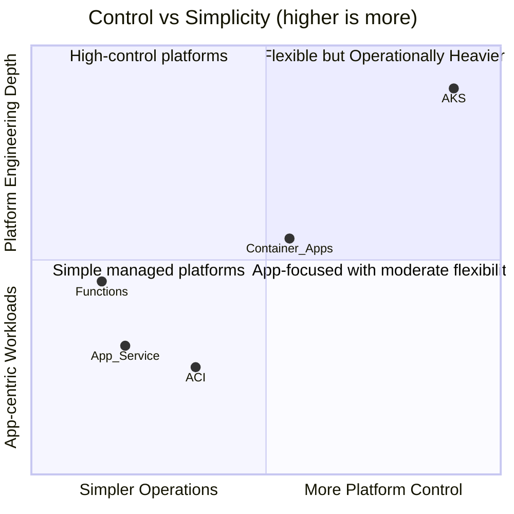

# Azure Container Apps vs Other Azure Compute Options

Azure offers multiple ways to run apps. This guide compares Container Apps with AKS, App Service, ACI, and Functions so you can choose based on operational model, scaling behavior, and control requirements.

## Decision Framing

Choose based on these priorities:

1. How much platform control do you need?
2. Do you need event-driven scaling to zero?
3. Are you optimizing for simplicity, flexibility, or both?

## Comparison Overview

| Service | Best For | Operations Burden | Scale Model | Notable Trade-off |
|---|---|---|---|---|
| **Container Apps** | Microservices, APIs, workers with container portability | Low-to-medium | KEDA-driven, supports scale-to-zero | Less cluster-level control than AKS |
| **AKS** | Full Kubernetes control, advanced platform engineering | High | Kubernetes-native autoscaling | More operational responsibility |
| **App Service** | Web apps with minimal container complexity | Low | Instance-based autoscale | Less event-native scaling behavior |
| **ACI** | Short-lived or burst container jobs | Low | Per-container execution model | Limited app platform features |
| **Functions** | Function-first event processing | Low | Trigger-based, granular execution | Runtime model is function-centric, not app-centric |

## Visual Positioning

## Service-by-Service Notes

### Container Apps vs AKS

- Pick **Container Apps** when you want Kubernetes benefits (containers, autoscale, revision rollout) without managing clusters.
- Pick **AKS** when you need deep Kubernetes primitives (custom operators, advanced scheduling, full network policy control).

### Container Apps vs App Service

- Pick **Container Apps** for event-driven workers, scale-to-zero scenarios, and revision-based traffic splitting.
- Pick **App Service** for straightforward web hosting patterns with built-in deployment ergonomics.

### Container Apps vs ACI

- Pick **Container Apps** for long-running services that need ingress, revisions, and autoscaling.
- Pick **ACI** for simple ephemeral containers and task-style execution.

### Container Apps vs Functions

- Pick **Container Apps** when your unit is a service/application with custom runtime requirements.
- Pick **Functions** when your unit is an event handler and function-level programming model is preferred.

## Practical Example: Typical Team Choices

| Team Scenario | Better Fit |
|---|---|
| Startup with API + queue worker, small ops team | Container Apps |
| Enterprise platform team standardizing Kubernetes internals | AKS |
| Existing web app modernization with minimal architecture changes | App Service |
| Batch spike processing from CI or scheduled jobs | ACI |
| High-volume event handlers with function-first code model | Functions |

## Advanced Topics

- Hybrid architectures: Container Apps for APIs + Functions for event glue.
- Migration patterns from App Service containers to revisions and KEDA rules.
- Governance models when combining AKS and Container Apps in one organization.

## See Also
- [How Container Apps Works](./how-container-apps-works.md)
- [Environments and Apps](./environments-and-apps.md)
- [Scaling with KEDA](./scaling-keda.md)
- [Networking](./networking.md)

## References
- [Azure Container Apps vs Other Azure Compute Options (Microsoft Learn)](https://learn.microsoft.com/azure/container-apps/compare-options)
- [Choose an Azure container service (Microsoft Learn)](https://learn.microsoft.com/azure/architecture/guide/choose-azure-container-service)
