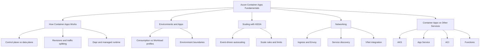

# Concepts: Understanding Azure Container Apps

This section explains **how Azure Container Apps works** so you can make better design decisions before writing deployment scripts.

Use these concept guides to understand platform behavior (revisions, scaling, ingress, environments) and choose the right architecture for production workloads.

## Concept Map

## Who Should Read This

- Teams moving from App Service or AKS to Container Apps.
- Developers planning revision-based rollouts.
- Platform engineers designing network boundaries and autoscaling behavior.

## How to Use This Section

1. Start with [How Container Apps Works](./how-container-apps-works.md).
2. Read [Environments and Apps](./environments-and-apps.md) before provisioning.
3. Review [Scaling with KEDA](./scaling-keda.md) and [Networking](./networking.md) for production architecture.
4. Use [Container Apps vs Others](./container-apps-vs-others.md) for platform selection decisions.

## Advanced Topics

- Multi-environment topology (dev/stage/prod isolation patterns).
- Cost and performance tuning with workload profiles.
- Progressive delivery using revisions and weighted traffic.

## See Also
- [How Container Apps Works](./how-container-apps-works.md)
- [Environments and Apps](./environments-and-apps.md)
- [Scaling with KEDA](./scaling-keda.md)
- [Networking](./networking.md)
- [Container Apps vs Others](./container-apps-vs-others.md)
- [Revision Management and Traffic Splitting](../tutorial/07-revisions-traffic.md)
