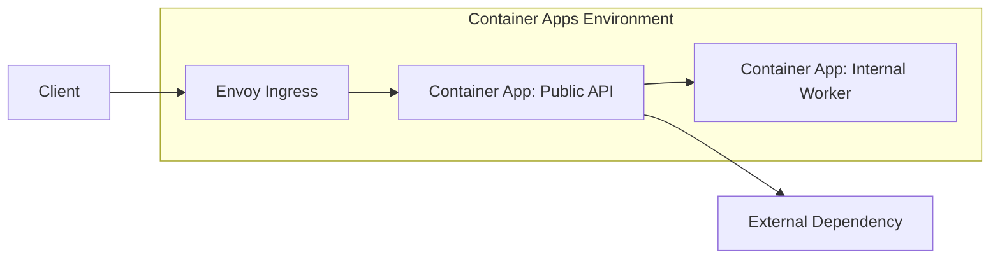
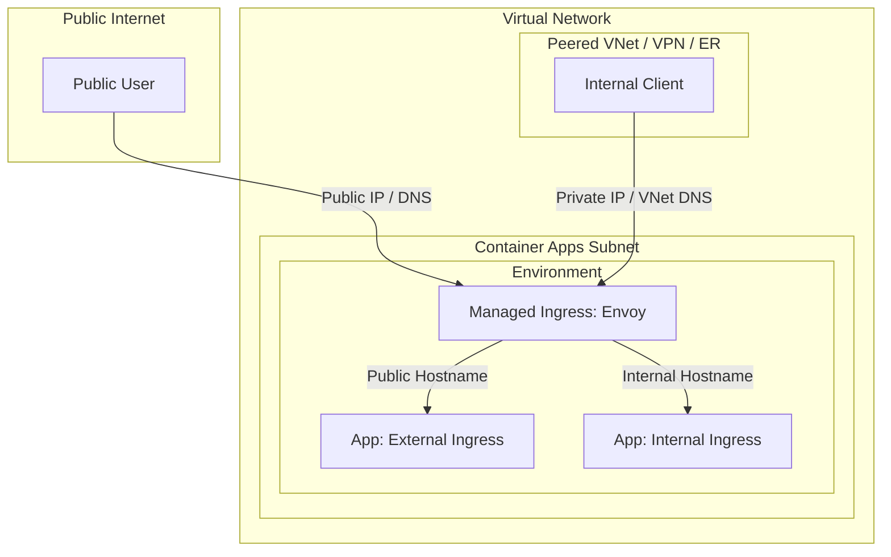
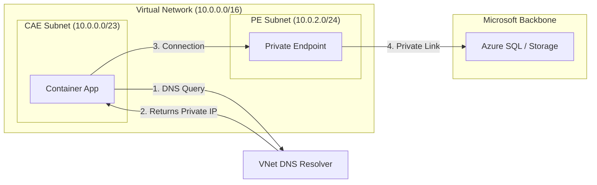
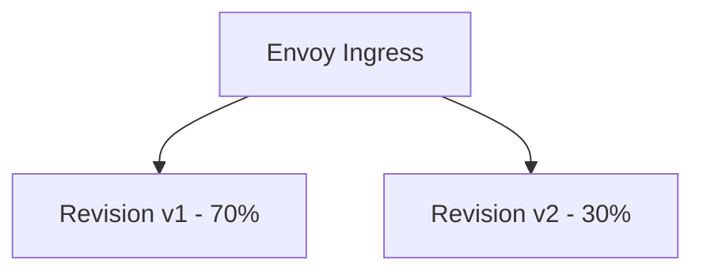

# Networking in Azure Container Apps

Networking in Azure Container Apps combines managed ingress with optional private networking controls. Understanding ingress mode, service discovery, and environment boundaries is key to secure and reliable architectures.

## High-Level Network Flow

Envoy acts as the managed ingress layer, handling routing into app revisions and enforcing transport behavior.

## Ingress Modes

| Mode | Reachability | Typical Use |
|---|---|---|
| External ingress | Public internet entry point | Public APIs and web backends |
| Internal ingress | Environment-internal access | Private microservice endpoints |
| No ingress | Not directly addressable by HTTP clients | Queue-driven/background workers |

### Traffic Flow: External vs Internal Ingress

## VNet Integration and Isolation

Container Apps environments can integrate with virtual networks to control east-west and north-south traffic patterns.

### VNet Integration Architecture

Use VNet integration when you need:

- Private access to internal services.
- Controlled egress paths to dependencies.
- Alignment with enterprise network governance.

## Service Discovery and East-West Calls

Apps in the same environment can use internal naming/service invocation patterns for service-to-service communication.

With optional Dapr integration, service invocation becomes more uniform across services while keeping networking concerns centralized.

## Revisions and Traffic Routing

Ingress routes traffic to active revisions based on configured weights.

This model supports canary testing without introducing an external traffic manager for basic progressive delivery.

## TLS and Managed Certificates

For custom domains, managed certificates simplify HTTPS lifecycle operations:

- Certificate issuance and renewal are platform-managed.
- Teams avoid manual certificate rotation overhead.
- HTTPS posture remains consistent as apps evolve.

## Practical Example: Public Edge + Private Backend

| Component | Network Posture |
|---|---|
| API app | External ingress with TLS |
| Orders/worker app | Internal ingress only |
| Data services | Private connectivity through VNet design |

This pattern reduces attack surface while keeping the public API straightforward.

## Advanced Topics

- Combining internal ingress with private endpoints for end-to-end private data paths.
- Zero-trust service segmentation across multiple environments.
- Egress governance and outbound allow-list strategies.

## See Also

- [How Container Apps Works](./how-container-apps-works.md)
- [Environments and Apps](./environments-and-apps.md)
- [Scaling with KEDA](./scaling-keda.md)
- [Container Apps vs Others](./container-apps-vs-others.md)
- [Networking in Azure Container Apps (Microsoft Learn)](https://learn.microsoft.com/azure/container-apps/networking)
- [Ingress in Azure Container Apps (Microsoft Learn)](https://learn.microsoft.com/azure/container-apps/ingress-overview)
- [VNet Integration Recipe](../recipes/networking-vnet.md)
- [Private Endpoint Recipe](../recipes/networking-private-endpoint.md)
