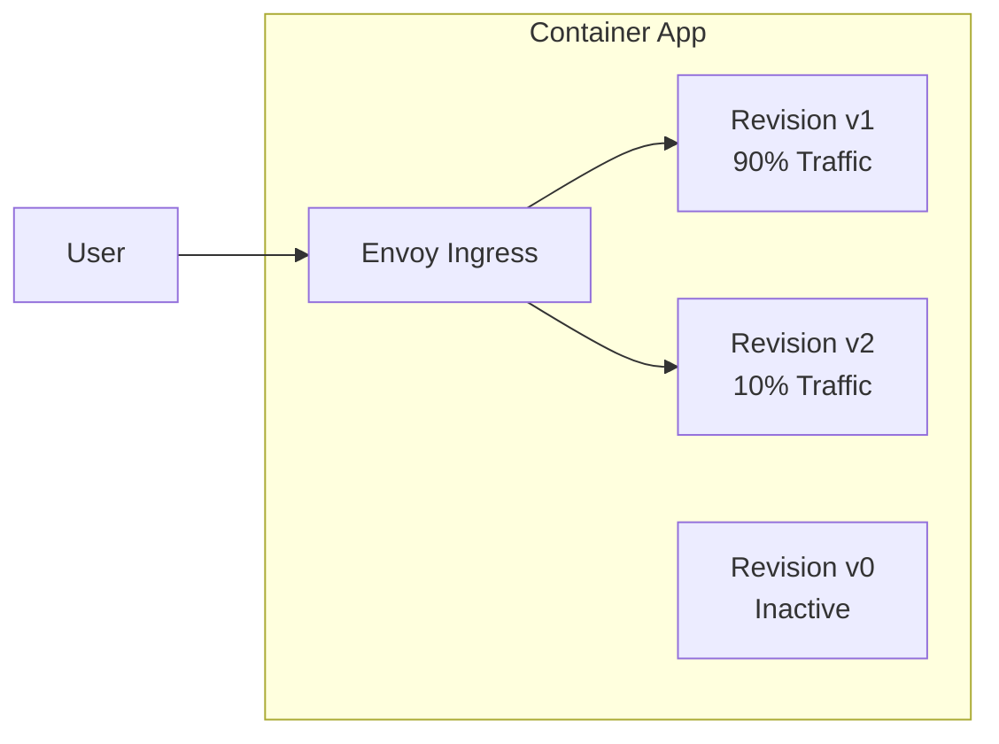
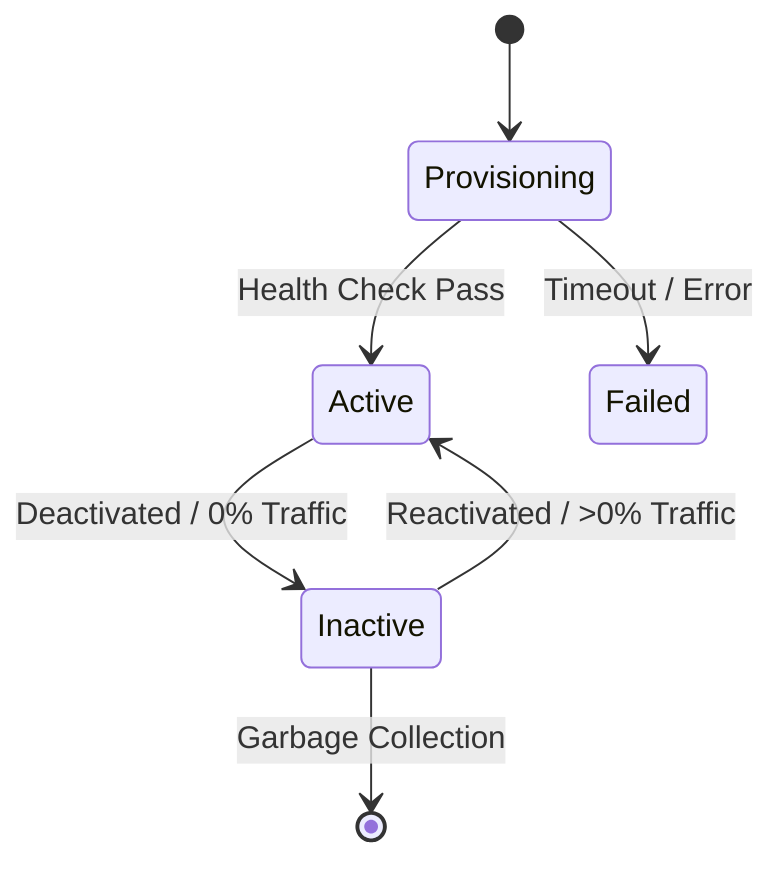

# Revision Lifecycle in Azure Container Apps

A revision is an immutable snapshot of a Container App version. Every change to the configuration or container image creates a new revision, enabling safe deployments and easy rollbacks.

## Revision Creation and Traffic Flow

When you deploy a change, the platform creates a new revision. Depending on your traffic settings, the ingress layer routes requests to one or more active revisions.

## States and Transitions

Revisions progress through a lifecycle managed by the Container Apps platform.

- **Provisioning**: The platform allocates resources and pulls container images.
- **Active**: The revision is healthy and can receive traffic or process events.
- **Inactive**: The revision exists but has no replicas and receives no traffic.
- **Failed**: The revision could not start (e.g., image pull error or failing health probes).

## Single vs Multiple Revision Mode

The revision mode determines how many revisions can be active at the same time.

| Mode | Active Revisions | Best For |
|---|---|---|
| **Single** | Exactly one | Standard web apps, simple updates |
| **Multiple** | One or more | Canary, blue-green, A/B testing |

In **Single mode**, the platform automatically deactivates the old revision when the new one becomes healthy. In **Multiple mode**, you manually control deactivation and traffic weights.

## Practical Guidance

| Action | Revision Mode | Effect |
|---|---|---|
| Image Update | Single | Creates new revision; replaces old one once healthy |
| Traffic Split | Multiple | Shifts percentage of requests between active revisions |
| Deactivation | Multiple | Stops all replicas of a revision without deleting it |
| Reactivation | Multiple | Re-provisions replicas for a previously inactive revision |

## Common Pitfalls

- **Sticky Sessions**: Traffic splitting may disrupt session state if not handled at the app layer.
- **Database Schema**: Revisions share the same backing services; ensure backward compatibility.
- **Max Revisions**: The platform limits the number of revisions; inactive ones are eventually purged.

## See Also

- [Revision Management and Traffic Splitting](../tutorial/07-revisions-traffic.md)
- [Managing Revisions and Traffic](../operations/revisions.md)
- [Scaling with KEDA](./scaling-keda.md)

## References

- [Revisions in Azure Container Apps (Microsoft Learn)](https://learn.microsoft.com/azure/container-apps/revisions)
- [Traffic splitting in Azure Container Apps (Microsoft Learn)](https://learn.microsoft.com/azure/container-apps/traffic-splitting)
