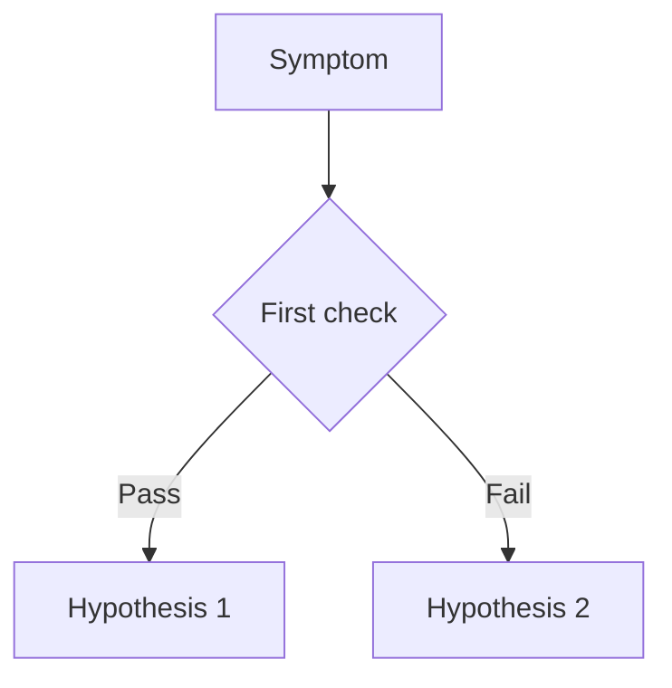

---
# ─── Playbook template ───────────────────────────────────────────────
# Copy this file, rename it, and fill in each section.
# Delete this comment block and any TODO markers before submitting.
#
# Frontmatter requirements:
#   - Every mermaid diagram needs a matching entry in content_sources.diagrams
#   - Every az CLI code block needs a nearby "| Command | Why it is used |" table
#   - content_validation.status should start as "draft"
# ─────────────────────────────────────────────────────────────────────
content_sources:
  diagrams:
  - id: TODO-decision-flow
    type: flowchart
    source: self-generated
    justification: TODO — describe why this diagram exists and what sources inform it.
    based_on:
    - https://learn.microsoft.com/azure/container-apps/
content_validation:
  status: draft
  last_reviewed: 'YYYY-MM-DD'
  reviewer: TODO
  core_claims:
  - claim: "TODO — primary claim this playbook makes"
    source: "TODO — URL"
    verified: false
---
# TODO: Playbook Title

## 1. Summary

### Symptom

<!-- One paragraph: what the operator sees that brings them here. -->

!!! tip "TL;DR"
    <!-- Two-sentence actionable summary. -->

### When to use this playbook

Use this playbook when:

- <!-- Condition 1 -->
- <!-- Condition 2 -->

### When not to use this playbook

Do not start from this playbook when:

- <!-- Condition — link to the correct playbook instead -->

## 2. Common Scenarios

| Scenario | Duration | Impact | Action required |
|---|---|---|---|
| <!-- Scenario 1 --> | <!-- Duration --> | <!-- Impact --> | <!-- Yes/No --> |

## 3. Competing Hypotheses

| Hypothesis | Evidence For | Evidence Against |
|---|---|---|
| **H1: …** | <!-- Signal that supports --> | <!-- Signal that refutes --> |
| **H2: …** | <!-- Signal that supports --> | <!-- Signal that refutes --> |

## 4. What to Check First

### Quick triage

```bash
# TODO: first diagnostic command
az containerapp show --name "<app-name>" --resource-group "<rg>" --query "{name:name, provisioningState:properties.provisioningState}"
```

| Command | Why it is used |
|---|---|
| `az containerapp show` | Confirms the app exists and is provisioned. |

### Decision flow

<!-- diagram-id: TODO-decision-flow -->


## 5. Resolution

| Hypothesis | Action |
|---|---|
| **H1** | <!-- Remediation steps --> |
| **H2** | <!-- Remediation steps --> |

## 6. Prevention

- <!-- Proactive measure 1 -->
- <!-- Proactive measure 2 -->

## See Also

- <!-- Related playbook link -->
- <!-- Related lab guide link -->
- <!-- Related platform doc link -->

## Sources

- <!-- Microsoft Learn or vendor URL -->
