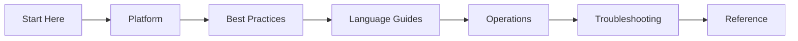

---
hide:
  - toc
---

# Azure Container Apps Practical Guide

Comprehensive, practical documentation for designing, deploying, operating, and troubleshooting containerized applications on Azure Container Apps.

This site is organized as a learning and operations guide so you can move from fundamentals to production troubleshooting with clear, repeatable workflows.

-   :material-rocket-launch:{ .lg .middle } **New to Container Apps?**

    ---

    Start with platform fundamentals, understand environments and revisions, and deploy your first container app.

    [:octicons-arrow-right-24: Start Here](start-here/overview.md)

-   :material-server:{ .lg .middle } **Running Production Workloads?**

    ---

    Apply battle-tested patterns for container design, scaling, networking, identity, and reliability.

    [:octicons-arrow-right-24: Best Practices](best-practices/index.md)

-   :material-bug:{ .lg .middle } **Investigating an Incident?**

    ---

    Jump straight to hypothesis-driven playbooks with real KQL queries and evidence patterns.

    [:octicons-arrow-right-24: Troubleshooting](troubleshooting/index.md)

## Navigate the Guide

| Section | Purpose |
|---|---|
| [Start Here](start-here/overview.md) | Orientation, learning paths, and repository map. |
| [Platform](platform/index.md) | Understand core Container Apps architecture, environments, revisions, scaling, networking, and jobs. |
| [Best Practices](best-practices/index.md) | Apply production patterns for container design, scaling, networking, identity, and reliability. |
| [Language Guides](language-guides/index.md) | Follow end-to-end implementation tracks for Python, Node.js, Java, and .NET. |
| [Operations](operations/index.md) | Run production workloads with deployment, monitoring, alerting, and recovery practices. |
| [Troubleshooting](troubleshooting/index.md) | Diagnose startup, networking, scaling, and identity issues quickly. |
| [Reference](reference/index.md) | Use quick lookups for CLI, environment variables, and platform limits. |

For orientation and study order, start with [Start Here](start-here/overview.md).

## Learning flow

## Scope and disclaimer

This is an independent community project. Not affiliated with or endorsed by Microsoft.

Primary product reference: [Azure Container Apps documentation (Microsoft Learn)](https://learn.microsoft.com/azure/container-apps/)

## See Also

- [Start Here](start-here/overview.md)
- [Platform](platform/index.md)
- [Best Practices](best-practices/index.md)
- [Language Guides](language-guides/index.md)
- [Operations](operations/index.md)
- [Troubleshooting](troubleshooting/index.md)
- [Reference](reference/index.md)

## Sources

- [Azure Container Apps overview (Microsoft Learn)](https://learn.microsoft.com/azure/container-apps/overview)
