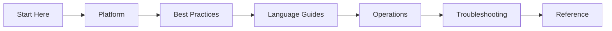

# Azure Container Apps Practical Guide

Comprehensive, practical documentation for designing, deploying, operating, and troubleshooting containerized applications on Azure Container Apps.

This site is organized as a learning and operations guide so you can move from fundamentals to production troubleshooting with clear, repeatable workflows.

## Navigate the guide

| Section | Purpose |
|---|---|
| [Start Here](start-here/overview.md) | Orientation, learning paths, and repository map. |
| [Platform](platform/index.md) | Understand core Container Apps architecture, scaling, networking, and jobs. |
| [Best Practices](best-practices/index.md) | Apply production patterns for container design, scaling, networking, identity, and reliability. |
| [Language Guides](language-guides/index.md) | Follow end-to-end implementation tracks for Python (more languages planned). |
| [Operations](operations/index.md) | Run production workloads with deployment, monitoring, alerting, and recovery practices. |
| [Troubleshooting](troubleshooting/index.md) | Diagnose startup, networking, scaling, and identity issues quickly. |
| [Reference](reference/index.md) | Use quick lookups for CLI, environment variables, and platform limits. |

For orientation and study order, start with [Start Here](start-here/overview.md).

## Learning flow

## Scope and disclaimer

This is an independent community project. Not affiliated with or endorsed by Microsoft.

Primary product reference: [Azure Container Apps overview](https://learn.microsoft.com/azure/container-apps/overview)
