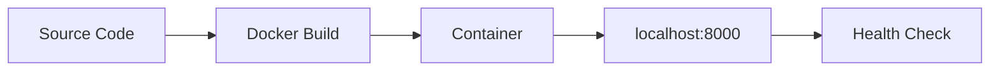

---
hide:
  - toc
content_sources:
  diagrams:
    - id: this-tutorial-assumes-a-production-ready-container
      type: flowchart
      source: mslearn-adapted
      based_on:
        - https://learn.microsoft.com/azure/container-apps/quickstart-code-to-cloud
        - https://learn.microsoft.com/dotnet/core/docker/build-container
    - id: local-development-workflow
      type: flowchart
      source: mslearn-adapted
      based_on:
        - https://learn.microsoft.com/azure/container-apps/quickstart-code-to-cloud
        - https://learn.microsoft.com/dotnet/core/docker/build-container
---

# 01 - Run Locally with Docker

Before deploying to Azure Container Apps, validate your .NET app in a container locally. This catches image, dependency, and port issues early.

!!! info "Infrastructure Context"
    **Service**: Container Apps (Consumption) | **Network**: VNet integrated | **VNet**: ✅

    This tutorial assumes a production-ready Container Apps deployment with a custom VNet, ACR with managed identity pull, and private endpoints for backend services.

    <!-- diagram-id: this-tutorial-assumes-a-production-ready-container -->
    ```mermaid
    flowchart TD
        INET[Internet] -->|HTTPS| CA["Container App\nConsumption\nLinux .NET 8"]

        subgraph VNET["VNet 10.0.0.0/16"]
            subgraph ENV_SUB["Environment Subnet 10.0.0.0/23\nDelegation: Microsoft.App/environments"]
                CAE[Container Apps Environment]
                CA
            end
            subgraph PE_SUB["Private Endpoint Subnet 10.0.2.0/24"]
                PE_ACR[PE: ACR]
                PE_KV[PE: Key Vault]
                PE_ST[PE: Storage]
            end
        end

        PE_ACR --> ACR[Azure Container Registry]
        PE_KV --> KV[Key Vault]
        PE_ST --> ST[Storage Account]

        subgraph DNS[Private DNS Zones]
            DNS_ACR[privatelink.azurecr.io]
            DNS_KV[privatelink.vaultcore.azure.net]
            DNS_ST[privatelink.blob.core.windows.net]
        end

        PE_ACR -.-> DNS_ACR
        PE_KV -.-> DNS_KV
        PE_ST -.-> DNS_ST

        CA -.->|System-Assigned MI| ENTRA[Microsoft Entra ID]
        CAE --> LOG[Log Analytics]
        CA --> AI[Application Insights]

        style CA fill:#107c10,color:#fff
        style VNET fill:#E8F5E9,stroke:#4CAF50
        style DNS fill:#E3F2FD
    ```

## Local Development Workflow

<!-- diagram-id: local-development-workflow -->


## Prerequisites

- Docker Engine or Docker Desktop
- .NET 8.0 SDK (optional for local Docker build)
- Source code with a Dockerfile

!!! tip "Aim for local-cloud parity"
    Keep local container port mapping and environment variable names aligned with your Azure deployment settings. This reduces revision failures caused by mismatched runtime assumptions.

## Step-by-step

1. **Build the container image**

   ```bash
   cd apps/dotnet-aspnetcore
   docker build --tag aca-dotnet-guide .
   ```

   ???+ example "Expected output"
       ```text
       [1/10] FROM mcr.microsoft.com/dotnet/sdk:8.0-alpine AS build
       [2/10] WORKDIR /src
       [3/10] COPY *.csproj ./
       [4/10] RUN dotnet restore
       [5/10] COPY . ./
       [6/10] RUN dotnet publish -c Release -o /app/publish
       [7/10] FROM mcr.microsoft.com/dotnet/aspnet:8.0-alpine
       [8/10] WORKDIR /app
       [9/10] COPY --from=build /app/publish .
       [10/10] EXPOSE 8000
       Successfully tagged aca-dotnet-guide:latest
       ```

2. **Run the container locally**

   ```bash
   # Copy and customize the environment file
   cp .env.example .env

   docker run --publish 8000:8000 --env-file .env aca-dotnet-guide
   ```

   ???+ example "Expected output"
       ```text
       info: Microsoft.Hosting.Lifetime[14]
             Now listening on: http://0.0.0.0:8000
       info: Microsoft.Hosting.Lifetime[0]
             Application started. Press Ctrl+C to shut down.
       info: Microsoft.Hosting.Lifetime[0]
             Hosting environment: Production
       info: Microsoft.Hosting.Lifetime[0]
             Content root path: /app
       ```

3. **Verify health endpoint**

   ```bash
   curl http://localhost:8000/health
   ```

   ???+ example "Expected output"
       ```json
       {"status":"healthy","timestamp":"2026-04-04T16:13:19.2964050Z"}
       ```

   You can also verify runtime metadata:

   ```bash
   curl http://localhost:8000/info
   ```

   ???+ example "Expected output"
       ```json
       {"app":"azure-container-apps-dotnet-guide","version":"1.0.0","runtime":{"dotnet":".NET 8.0.25","os":"Alpine Linux v3.23","arch":"X64"}}
       ```

4. **Inspect application logs**

   ```bash
   docker logs <container-id>
   ```

   ???+ example "Expected output"
       ```text
       info: Microsoft.Hosting.Lifetime[14]
             Now listening on: http://0.0.0.0:8000
       info: Microsoft.Hosting.Lifetime[0]
             Application started. Press Ctrl+C to shut down.
       ```

   To find the container ID: `docker ps`

## Local parity checklist

- Application listens on port `8000` (or your configured `PORT` environment variable)
- Required environment variables are present in `.env`
- `/health` returns HTTP 200 with JSON payload
- No startup exceptions (e.g., `DependencyInjectionException`) in container logs

!!! warning "Do not commit local secret files"
    If you create a local `.env` file for testing, keep sensitive values out of source control and use placeholder values in shared examples.

## Advanced Topics

- **Multi-stage builds**: Use the build stage for running unit tests before publishing.
- **Rootless containers**: The reference app uses `USER 1000:1000` for enhanced security.
- **OpenTelemetry**: Enable local OTLP exporters to validate telemetry before cloud deployment.

## See Also
- [02 - First Deploy to Azure Container Apps](02-first-deploy.md)
- [03 - Configuration, Secrets, and Dapr](03-configuration.md)
- [.NET Runtime Reference](dotnet-runtime.md)

## Sources
- [Quickstart: Code to Cloud (Microsoft Learn)](https://learn.microsoft.com/azure/container-apps/quickstart-code-to-cloud)
- [Dockerizing an ASP.NET Core application (Microsoft Learn)](https://learn.microsoft.com/dotnet/core/docker/build-container)
