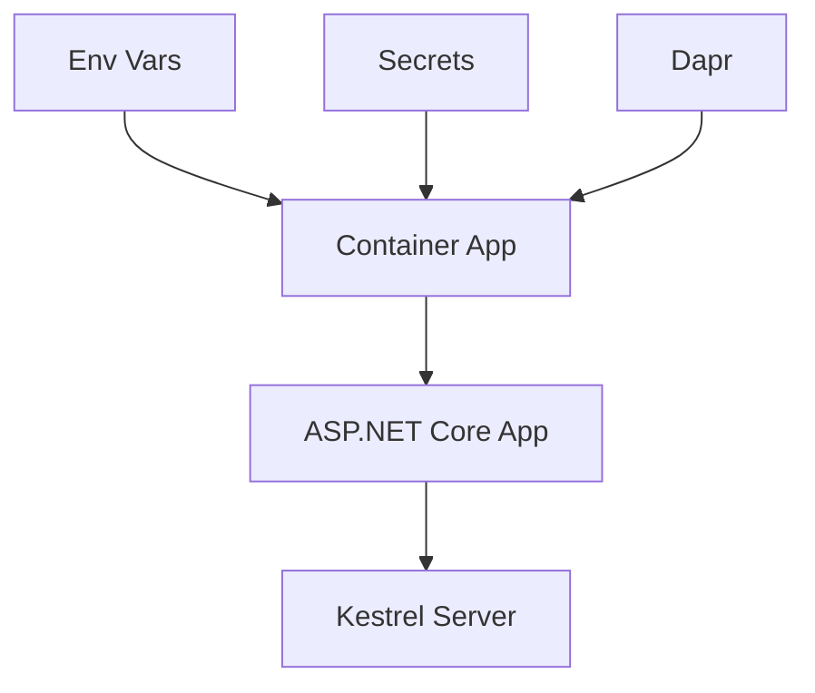

# 03 - Configuration, Secrets, and Dapr

This step configures runtime settings in Azure Container Apps for your .NET application, including environment variables, secrets, KEDA scaling rules, and Dapr sidecar options.

## Configuration Flow



## Prerequisites

- Completed [02 - First Deploy to Azure Container Apps](02-first-deploy.md)
- A running Container App (`ca-dotnet-guide`)

## Step-by-step

1. **Set standard variables (reuse Bicep outputs from Step 02)**

   ```bash
   RG="rg-dotnet-guide"
   DEPLOYMENT_NAME="main"

   APP_NAME=$(az deployment group show \
     --name "$DEPLOYMENT_NAME" \
     --resource-group "$RG" \
     --query "properties.outputs.containerAppName.value" \
     --output tsv)

   ACR_NAME=$(az deployment group show \
     --name "$DEPLOYMENT_NAME" \
     --resource-group "$RG" \
     --query "properties.outputs.containerRegistryName.value" \
     --output tsv)
   ```

2. **Set environment variables**

   ASP.NET Core automatically reads environment variables into its configuration system.

   ```bash
   az containerapp update \
     --name "$APP_NAME" \
     --resource-group "$RG" \
     --set-env-vars "Logging__LogLevel__Default=Information" "FeatureManagement__NewUI=true"
   ```

   ???+ example "Expected output"
       ```json
       {
         "name": "ca-dotnet-guide",
         "provisioningState": "Succeeded"
       }
       ```

3. **Store and reference a secret**

   ```bash
   az containerapp secret set \
     --name "$APP_NAME" \
     --resource-group "$RG" \
     --secrets "db-connection-string=Server=tcp:sql.database.windows.net;Database=mydb;"
   ```

   ???+ example "Expected output"
       ```text
       Containerapp must be restarted in order for secret changes to take effect.
       ```
       ```json
       [
         {
           "name": "db-connection-string"
         }
       ]
       ```

   Map the secret to an environment variable:

   ```bash
   az containerapp update \
     --name "$APP_NAME" \
     --resource-group "$RG" \
     --set-env-vars "ConnectionStrings__DefaultConnection=secretref:db-connection-string"
   ```

4. **Configure KEDA HTTP autoscaling**

   ```bash
   az containerapp update \
     --name "$APP_NAME" \
     --resource-group "$RG" \
     --min-replicas 0 \
     --max-replicas 10 \
     --scale-rule-name "http-scale" \
     --scale-rule-type "http" \
     --scale-rule-http-concurrency 50
   ```

   ???+ example "Expected output"
       ```json
       {
         "name": "ca-dotnet-guide",
         "provisioningState": "Succeeded"
       }
       ```

5. **Enable Dapr sidecar**

   ```bash
   az containerapp dapr enable \
     --name "$APP_NAME" \
     --resource-group "$RG" \
     --dapr-app-id "dotnet-api" \
     --dapr-app-port 8000
   ```

   ???+ example "Expected output"
       ```json
       {
         "appId": "dotnet-api",
         "appPort": 8000,
         "appProtocol": "http",
         "enabled": true
       }
       ```

## .NET example: read config safely

ASP.NET Core's `IConfiguration` makes it easy to read these values.

```csharp
// In Program.cs or a Controller
var logLevel = configuration["Logging:LogLevel:Default"];
var isNewUIEnabled = configuration.GetValue<bool>("FeatureManagement:NewUI");
var connectionString = configuration.GetConnectionString("DefaultConnection");
```

!!! tip "Environment Variable Naming"
    Use double underscores (`__`) in environment variable names to represent hierarchical configuration keys in .NET (e.g., `Logging__LogLevel__Default` maps to `Logging:LogLevel:Default`).

## Advanced Topics

- **Managed Identity**: Use `DefaultAzureCredential` from the Azure Identity SDK to access Key Vault without managing client secrets.
- **KEDA Scalers**: Explore .NET specific scalers like `azure-servicebus` or `rabbitmq` for background processing.
- **Dapr SDK**: Use the `Dapr.Client` NuGet package for advanced Dapr features like state store and pub/sub.

## See Also

- [04 - Logging, Monitoring, and Observability](04-logging-monitoring.md)
- [.NET Runtime Reference](dotnet-runtime.md)
- [Recipes Index](recipes/index.md)

## Sources
- [Configuration in ASP.NET Core (Microsoft Learn)](https://learn.microsoft.com/aspnet/core/fundamentals/configuration/)
- [Manage secrets in Azure Container Apps (Microsoft Learn)](https://learn.microsoft.com/azure/container-apps/manage-secrets)
