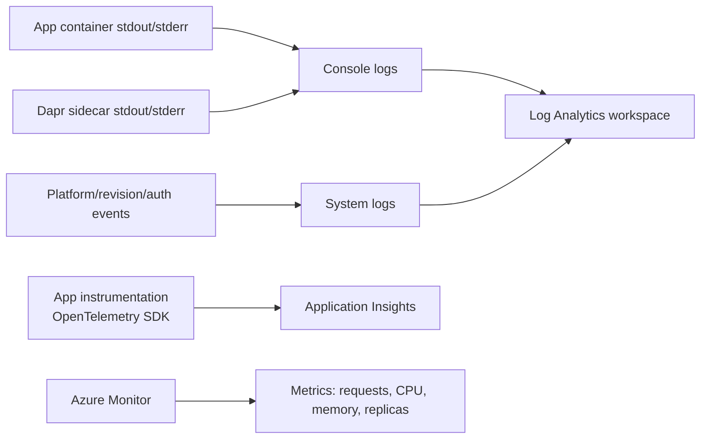

---
hide:
  - toc
content_sources:
  diagrams:
    - id: this-tutorial-assumes-a-production-ready-container
      type: flowchart
      source: mslearn-adapted
      based_on:
        - https://learn.microsoft.com/azure/container-apps/monitor
        - https://learn.microsoft.com/dotnet/core/diagnostics/distributed-tracing
    - id: how-observability-works-in-container-apps
      type: flowchart
      source: mslearn-adapted
      based_on:
        - https://learn.microsoft.com/azure/container-apps/monitor
        - https://learn.microsoft.com/dotnet/core/diagnostics/distributed-tracing
---

# 04 - Logging, Monitoring, and Observability

This tutorial step shows how to inspect console logs, query Log Analytics, and add OpenTelemetry-based observability for production .NET applications on Azure Container Apps.

!!! info "Infrastructure Context"
    **Service**: Container Apps (Consumption) | **Network**: VNet integrated | **VNet**: ✅

    This tutorial assumes a production-ready Container Apps deployment with a custom VNet, ACR with managed identity pull, and private endpoints for backend services.

    <!-- diagram-id: this-tutorial-assumes-a-production-ready-container -->
    ```mermaid
    flowchart TD
        INET[Internet] -->|HTTPS| CA["Container App\nConsumption\nLinux .NET 8"]

        subgraph VNET["VNet 10.0.0.0/16"]
            subgraph ENV_SUB["Environment Subnet 10.0.0.0/23\nDelegation: Microsoft.App/environments"]
                CAE[Container Apps Environment]
                CA
            end
            subgraph PE_SUB["Private Endpoint Subnet 10.0.2.0/24"]
                PE_ACR[PE: ACR]
                PE_KV[PE: Key Vault]
                PE_ST[PE: Storage]
            end
        end

        PE_ACR --> ACR[Azure Container Registry]
        PE_KV --> KV[Key Vault]
        PE_ST --> ST[Storage Account]

        subgraph DNS[Private DNS Zones]
            DNS_ACR[privatelink.azurecr.io]
            DNS_KV[privatelink.vaultcore.azure.net]
            DNS_ST[privatelink.blob.core.windows.net]
        end

        PE_ACR -.-> DNS_ACR
        PE_KV -.-> DNS_KV
        PE_ST -.-> DNS_ST

        CA -.->|System-Assigned MI| ENTRA[Microsoft Entra ID]
        CAE --> LOG[Log Analytics]
        CA --> AI[Application Insights]

        style CA fill:#107c10,color:#fff
        style VNET fill:#E8F5E9,stroke:#4CAF50
        style DNS fill:#E3F2FD
    ```

## How Observability Works in Container Apps

<!-- diagram-id: how-observability-works-in-container-apps -->


## Prerequisites

- Completed [03 - Configuration, Secrets, and Dapr](03-configuration.md)
- Log Analytics connected to your Container Apps environment
- (Optional) Application Insights resource for distributed tracing

## Step-by-step

1. **Set standard variables**

   ```bash
   RG="rg-dotnet-guide"
   DEPLOYMENT_NAME="main"

   APP_NAME=$(az deployment group show \
     --name "$DEPLOYMENT_NAME" \
     --resource-group "$RG" \
     --query "properties.outputs.containerAppName.value" \
     --output tsv)
   ```

2. **Stream console logs**

   ASP.NET Core logs to `stdout` by default. You can stream these directly to your terminal.

   ```bash
   az containerapp logs show \
     --name "$APP_NAME" \
     --resource-group "$RG" \
     --follow
   ```

   ???+ example "Expected output"
       ```json
       {"TimeStamp":"2026-04-04T16:15:01","Log":"Connecting to the container 'app'..."}
       {"TimeStamp":"2026-04-04T16:15:01","Log":"Successfully Connected to container: 'app'"}
       {"TimeStamp":"2026-04-04T16:15:02Z","Log":"info: Microsoft.Hosting.Lifetime[14]\n      Now listening on: http://0.0.0.0:8000"}
       {"TimeStamp":"2026-04-04T16:15:02Z","Log":"info: Microsoft.Hosting.Lifetime[0]\n      Application started. Press Ctrl+C to shut down."}
       ```

3. **Check system logs for platform events**

   System logs capture events like container crashes, scaling activities, and health probe failures.

   ```bash
   az containerapp logs show \
     --name "$APP_NAME" \
     --resource-group "$RG" \
     --type system
   ```

   ???+ example "Expected output"
       ```json
       {"TimeStamp":"2026-04-04T16:15:00Z","Type":"Normal","Msg":"Successfully connected to events server","Reason":"ConnectedToEventsServer"}
       ```

4. **Query logs via CLI (recommended for automation)**

   Get your Log Analytics workspace ID and run KQL queries directly from the command line:

   ```bash
   # Get the workspace ID
   WORKSPACE_ID=$(az monitor log-analytics workspace list \
     --resource-group "$RG" \
     --query "[0].customerId" \
     --output tsv)

   # Query console logs (use your actual app name from $APP_NAME)
   az monitor log-analytics query \
     --workspace $WORKSPACE_ID \
     --analytics-query "ContainerAppConsoleLogs_CL | where ContainerAppName_s == '$APP_NAME' | project TimeGenerated, ContainerAppName_s, Log_s | take 5" \
     --output table
   ```

   ???+ example "Expected output"
       ```text
       ContainerAppName_s    Log_s                                                                                           TimeGenerated
       --------------------  ----------------------------------------------------------------------------------------------  ----------------------------
       <your-app-name>       {"LogLevel":"Information","Message":"Now listening on: http://0.0.0.0:8000"...}                  2026-04-04T16:13:17.631Z
       <your-app-name>       {"LogLevel":"Information","Message":"Application started. Press Ctrl+C to shut down."...}        2026-04-04T16:13:17.632Z
       <your-app-name>       {"LogLevel":"Information","Message":"Application is shutting down..."...}                         2026-04-04T16:12:33.373Z
       ```

5. **Query for .NET Exceptions via CLI**

   ```bash
   az monitor log-analytics query \
     --workspace $WORKSPACE_ID \
     --analytics-query "ContainerAppConsoleLogs_CL | where ContainerAppName_s == '$APP_NAME' | where Log_s has 'Exception' or Log_s has 'Error' | project TimeGenerated, Log_s | take 10" \
     --output table
   ```

   ???+ example "Expected output"
       | TimeGenerated | Log_s |
       |---|---|
       | 2026-04-04T16:20:00Z | fail: Microsoft.AspNetCore.Server.Kestrel[13] Connection id "0HN2..." ... |

6. **Enable OpenTelemetry with Azure Monitor**

   The reference app uses the `Azure.Monitor.OpenTelemetry.AspNetCore` NuGet package.

   ```csharp
   // In Program.cs
   if (!string.IsNullOrEmpty(Environment.GetEnvironmentVariable("APPLICATIONINSIGHTS_CONNECTION_STRING")))
   {
       builder.Services.AddOpenTelemetry().UseAzureMonitor();
   }
   ```

   To enable this in your Container App:

   ```bash
   AI_CONNECTION_STRING="InstrumentationKey=...;IngestionEndpoint=..."
   
   az containerapp update \
     --name "$APP_NAME" \
     --resource-group "$RG" \
     --set-env-vars "APPLICATIONINSIGHTS_CONNECTION_STRING=$AI_CONNECTION_STRING"
   ```

6. **View Metrics in Azure Monitor**

   Navigate to the **Metrics** tab of your Container App to visualize:
   - **Requests**: Total number of HTTP requests.
   - **CPU/Memory Usage**: Resource consumption per replica.
   - **Replica Count**: Current number of running instances (scaled by KEDA).

## Observability Best Practices for .NET

- **Structured Logging**: Use `ILogger` to emit logs. Container Apps captures the output and indexes it in Log Analytics.
- **Correlation IDs**: ASP.NET Core automatically propagates `TraceId` in HTTP headers, which OpenTelemetry uses to correlate traces across services.
- **Health Checks**: Use the ASP.NET Core Health Checks middleware (`/health`) to provide the platform with accurate liveness/readiness signals.

## Advanced Topics

- **Custom Metrics**: Use `System.Diagnostics.Metrics` to emit custom business metrics like `orders-processed`.
- **Live Metrics**: Use Application Insights Live Metrics Stream for real-time monitoring of your .NET app.
- **Log Scopes**: Use `logger.BeginScope` to add contextual metadata (like `UserId`) to every log entry.

## See Also
- [03 - Configuration, Secrets, and Dapr](03-configuration.md)
- [.NET Runtime Reference](dotnet-runtime.md)
- [Troubleshooting Methodology](../../troubleshooting/methodology/index.md)

## Sources
- [Monitoring Azure Container Apps (Microsoft Learn)](https://learn.microsoft.com/azure/container-apps/monitor)
- [OpenTelemetry with ASP.NET Core (Microsoft Learn)](https://learn.microsoft.com/dotnet/core/diagnostics/distributed-tracing)
