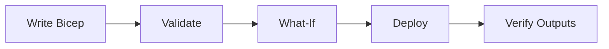

---
hide:
  - toc
---

# 05 - Infrastructure as Code with Bicep

Use Bicep to define your .NET application infrastructure consistently across environments. This step focuses on repeatable provisioning and safe updates of Azure Container Apps resources.

## Infrastructure Lifecycle



## Prerequisites

- Completed [04 - Logging, Monitoring, and Observability](04-logging-monitoring.md)
- Bicep files under `infra/` (e.g., `main.bicep`)
- Azure CLI with Bicep installed

!!! info "Naming Convention"
    The shared `infra/main.bicep` template generates unique resource names using `uniqueString(resourceGroup().id)` (e.g., `ca-dotnet-guide-abc123def`). Earlier tutorials in this guide use simplified names like `ca-dotnet-guide` for readability. When deploying via Bicep, always capture actual names from deployment outputs using `az deployment group show`.

!!! tip "Run validate and what-if before every apply"
    Treat `az deployment group validate` and `az deployment group what-if` as required safety checks to prevent accidental production-impacting infrastructure changes.

## Step-by-step

1. **Set standard variables**

   ```bash
   RG="rg-dotnet-guide"
   BASE_NAME="dotnet-guide"
   LOCATION="koreacentral"
   DEPLOYMENT_NAME="main"
   ```

2. **Validate the Bicep template**

   ```bash
   az deployment group validate \
      --resource-group "$RG" \
      --template-file infra/main.bicep \
      --parameters baseName="$BASE_NAME" location="$LOCATION"
   ```

   ???+ example "Expected output"
       ```json
       {
         "status": "Succeeded",
         "error": null
       }
       ```

3. **Preview changes with what-if**

   ```bash
   az deployment group what-if \
      --resource-group "$RG" \
      --template-file infra/main.bicep \
      --parameters baseName="$BASE_NAME" location="$LOCATION"
   ```

   ???+ example "Expected output"
       ```text
       Resource and property changes are indicated with these symbols:
         + Create
         ~ Modify

       The deployment will update the following scope:
       Scope: /subscriptions/<subscription-id>/resourceGroups/rg-dotnet-guide

         ~ Microsoft.App/containerApps/<your-app-name> [2024-03-01]
           ~ properties.template.containers[0].image: "<acr-name>.azurecr.io/dotnet-guide:latest"
       ```

4. **Deploy infrastructure**

   ```bash
   az deployment group create \
      --name "$DEPLOYMENT_NAME" \
      --resource-group "$RG" \
      --template-file infra/main.bicep \
      --parameters baseName="$BASE_NAME" location="$LOCATION"
   ```

   ???+ example "Expected output"
       ```json
       {
         "id": "/subscriptions/<subscription-id>/resourceGroups/rg-dotnet-guide/providers/Microsoft.Resources/deployments/main",
         "name": "main",
         "properties": {
           "provisioningState": "Succeeded",
           "outputs": {
             "containerAppName": { "type": "String", "value": "ca-dotnet-guide-<unique-suffix>" },
             "containerAppUrl": { "type": "String", "value": "https://ca-dotnet-guide-<unique-suffix>.<env-suffix>.koreacentral.azurecontainerapps.io" }
           }
         }
       }
       ```

       !!! note "Unique suffix"
           The `<unique-suffix>` is generated by `uniqueString(resourceGroup().id)` in Bicep to ensure globally unique resource names.

5. **Verify outputs and key resources**

   ```bash
   az deployment group show \
      --resource-group "$RG" \
      --name "$DEPLOYMENT_NAME" \
      --query properties.outputs
   ```

   ???+ example "Expected output"
       ```json
       {
         "containerAppName": {
           "type": "String",
           "value": "ca-dotnet-guide-<unique-suffix>"
         },
         "containerAppEnvName": {
           "type": "String",
           "value": "cae-dotnet-guide-<unique-suffix>"
         },
         "containerRegistryName": {
           "type": "String",
           "value": "crdotnetguide<unique-suffix>"
         },
         "containerAppUrl": {
           "type": "String",
           "value": "https://ca-dotnet-guide-<unique-suffix>.<env-suffix>.koreacentral.azurecontainerapps.io"
         }
       }
       ```

## Example Bicep snippet (.NET App with Health Probes)

```bicep
resource containerApp 'Microsoft.App/containerApps@2024-03-01' = {
  name: 'ca-${baseName}'
  location: location
  properties: {
    managedEnvironmentId: environment.id
    configuration: {
      ingress: {
        external: true
        targetPort: 8000
      }
    }
    template: {
      containers: [
        {
          name: 'app'
          image: '${acr.properties.loginServer}/${imageName}'
          probes: [
            {
              type: 'Liveness'
              httpGet: {
                path: '/health'
                port: 8000
              }
              initialDelaySeconds: 5
              periodSeconds: 10
            }
            {
              type: 'Readiness'
              httpGet: {
                path: '/health'
                port: 8000
              }
              initialDelaySeconds: 5
              periodSeconds: 10
            }
          ]
        }
      ]
    }
  }
}
```

## Advanced Topics

- **Modular Bicep**: Split your templates into reusable modules for networking, storage, and identity.
- **Deployment Scripts**: Use `Microsoft.Resources/deploymentScripts` to perform post-deployment tasks like database migrations.
- **Resource Locking**: Apply `Microsoft.Authorization/locks` to prevent accidental deletion of critical infrastructure.

!!! warning "Avoid out-of-band portal edits"
    Manual portal changes can create drift from your Bicep templates. Prefer template updates and redeployment so environments remain reproducible and auditable.

## See Also
- [02 - First Deploy to Azure Container Apps](02-first-deploy.md)
- [06 - CI/CD with GitHub Actions](06-ci-cd.md)
- [Bicep Documentation (Microsoft Learn)](https://learn.microsoft.com/azure/azure-resource-manager/bicep/)

## Sources
- [Bicep resource definition: Microsoft.App/containerApps (Microsoft Learn)](https://learn.microsoft.com/azure/templates/microsoft.app/containerapps)
- [Bicep and Azure Container Apps (Microsoft Learn)](https://learn.microsoft.com/azure/container-apps/bicep-infrastructure)
