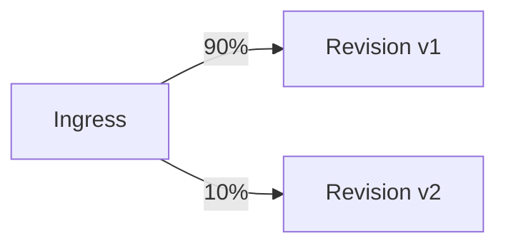

# 07 - Revisions and Traffic Splitting

Azure Container Apps revisions provide immutable deployment snapshots of your .NET application. Use them for safe releases, canary traffic, and quick rollback to a known-good state.

## Revision Traffic Splitting



## Prerequisites

- Completed [06 - CI/CD with GitHub Actions](06-ci-cd.md)
- At least two deployed images/tags in your ACR
- Container App currently running in `multiple` revision mode or ready to switch

!!! tip "Define promotion criteria before traffic split"
    Decide in advance which metrics (ASP.NET Core error rates, Kestrel request latency, CPU saturation) must stay within threshold before increasing canary traffic.

## Step-by-step

1. **Set standard variables**

   ```bash
   RG="rg-dotnet-guide"
   APP_NAME="ca-dotnet-guide"
   BASE_NAME="dotnet-guide"
   ACR_NAME="crpycontainerzxyaw4an5c742"
   ACR_LOGIN_SERVER="crpycontainerzxyaw4an5c742.azurecr.io"
   ```

2. **Switch to multiple revision mode**

   By default, Container Apps operate in `single` revision mode (100% traffic to the latest). To split traffic, you must enable `multiple` mode.

   ```bash
   az containerapp revision set-mode \
     --name "$APP_NAME" \
     --resource-group "$RG" \
     --mode multiple
   ```

   ???+ example "Expected output"
       ```
       "Multiple"
       ```

3. **Deploy a new version to create a new revision**

   ```bash
   az acr build --registry "$ACR_NAME" --image "$BASE_NAME:v3" ./apps/dotnet-aspnetcore

   az containerapp update \
     --name "$APP_NAME" \
     --resource-group "$RG" \
     --image "$ACR_LOGIN_SERVER/$BASE_NAME:v3"
   ```

   ???+ example "Expected output"
       ```json
       {
         "latestRevision": "ca-dotnet-guide--rev3",
         "name": "ca-dotnet-guide",
         "provisioningState": "Succeeded"
       }
       ```

4. **List revisions and identify target names**

   ```bash
   az containerapp revision list \
     --name "$APP_NAME" \
     --resource-group "$RG" \
     --query "[].{name:name,active:properties.active,createdTime:properties.createdTime}" \
     --output table
   ```

   ???+ example "Expected output"
        ```text
        Name                        Active    CreatedTime
        --------------------------  --------  -------------------------
        ca-dotnet-guide--rev1       True      2026-04-04T16:00:00+00:00
        ca-dotnet-guide--rev3       True      2026-04-04T16:30:00+00:00
        ```

5. **Apply canary traffic split (90/10)**

   ```bash
   az containerapp ingress traffic set \
     --name "$APP_NAME" \
     --resource-group "$RG" \
     --revision-weight "ca-dotnet-guide--rev1=90" "ca-dotnet-guide--rev3=10"
   ```

   ???+ example "Expected output"
        ```json
        [
          {
            "revisionName": "ca-dotnet-guide--rev1",
            "weight": 90
          },
          {
            "revisionName": "ca-dotnet-guide--rev3",
            "weight": 10
          }
        ]
        ```

6. **Verify applied traffic routing**

   ```bash
   az containerapp ingress show \
     --name "$APP_NAME" \
     --resource-group "$RG"
   ```

   ???+ example "Expected output"
        ```json
        {
          "fqdn": "ca-dotnet-guide.purplesand-eb76756a.koreacentral.azurecontainerapps.io",
          "traffic": [
            { "revisionName": "ca-dotnet-guide--rev1", "weight": 90 },
            { "revisionName": "ca-dotnet-guide--rev3", "weight": 10 }
          ]
        }
        ```

7. **Rollback instantly if .NET exceptions increase**

   If the canary revision (`rev3`) shows high error rates in Log Analytics, move all traffic back to the stable revision (`rev1`).

   ```bash
   az containerapp ingress traffic set \
     --name "$APP_NAME" \
     --resource-group "$RG" \
     --revision-weight "ca-dotnet-guide--rev1=100"
   ```

8. **Deactivate the bad revision**

   ```bash
   az containerapp revision deactivate \
     --name "$APP_NAME" \
     --resource-group "$RG" \
     --revision "ca-dotnet-guide--rev3"
   ```

## Operational Guidance for .NET

- **Health Probes**: Ensure your liveness and readiness probes (`/health`) are correctly configured so Container Apps doesn't route traffic to a revision that hasn't finished its .NET runtime startup.
- **Graceful Shutdown**: ASP.NET Core handles `SIGTERM` signals. When you shift traffic away from a revision, the platform waits for active connections to finish (up to the termination grace period) before stopping the container.
- **Sticky Sessions**: If your .NET app uses in-memory sessions (not recommended), traffic splitting will break session state unless you use an external provider like Redis.

## Advanced Topics

- **Blue/Green Deployment**: Use labels to route traffic to specific revisions without modifying weights until the "Green" revision is fully verified.
- **Dapr service invocation**: Dapr can be configured to respect traffic splitting or route to specific revisions using headers.
- **Automated Promotion**: Use GitHub Actions to increase traffic weight automatically if health checks and telemetry thresholds are met.

!!! warning "Cleanup Stale Revisions"
    Deactivate or delete old revisions once they are no longer needed for rollback. This simplifies your environment and reduces the risk of accidental traffic assignment.

## See Also
- [04 - Logging, Monitoring, and Observability](04-logging-monitoring.md)
- [06 - CI/CD with GitHub Actions](06-ci-cd.md)
- [Revision Management Operations](../../operations/revision-management/index.md)

## Sources
- [Revisions in Azure Container Apps (Microsoft Learn)](https://learn.microsoft.com/azure/container-apps/revisions)
- [Traffic splitting (Microsoft Learn)](https://learn.microsoft.com/azure/container-apps/traffic-splitting)
