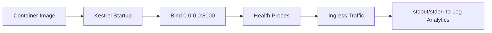

---
hide:
  - toc
content_sources:
  diagrams:
    - id: runtime-execution-model
      type: flowchart
      source: mslearn-adapted
      based_on:
        - https://learn.microsoft.com/azure/container-apps/dotnet-overview
        - https://learn.microsoft.com/aspnet/core/fundamentals/servers/kestrel/endpoints
        - https://learn.microsoft.com/dotnet/core/tools/sdk-errors/gc-heap-hard-limit
---

# .NET Runtime Reference

This reference summarizes practical runtime defaults for .NET workloads on Azure Container Apps so you can keep startup behavior, probe health, and logging predictable across revisions.

## Runtime Execution Model

<!-- diagram-id: runtime-execution-model -->


!!! tip "Treat runtime settings as deployment contracts"
    Keep port binding, process model, and logging behavior stable between revisions. Changing all three at once makes incident triage much harder.

## Runtime Baseline (This Repo)

| Item | Value |
| --- | --- |
| Base image | `mcr.microsoft.com/dotnet/aspnet:8.0-alpine` |
| Web framework | ASP.NET Core |
| Process manager | Kestrel (Native) |
| Exposed/listen port | `8000` |
| Start command | `dotnet AzureContainerApps.dll` |
| OS Architecture | Linux X64 |

## Kestrel Quick Tuning

ASP.NET Core's Kestrel server is highly optimized. You can tune it via environment variables or `appsettings.json`.

| Setting | Environment Variable | When to change |
| --- | --- | --- |
| HTTP Port | `ASPNETCORE_URLS=http://+:8000` | Match the Container App's `targetPort` |
| Request Body Size | `Kestrel__Limits__MaxRequestBodySize=30000000` | Increase for large file uploads |
| Keep-Alive Timeout | `Kestrel__Limits__KeepAliveTimeout=00:02:00` | Tune for high connection churn |
| JSON Formatter | `Logging__Console__FormatterName=json` | Recommended for Log Analytics |

## Recommended Configuration Pattern

The reference application uses the following configuration in `Program.cs` and environment variables:

```csharp
// Port binding
var port = Environment.GetEnvironmentVariable("PORT") ?? "8000";
app.Run($"http://0.0.0.0:{port}");

// Graceful shutdown
app.Lifetime.ApplicationStopping.Register(() =>
{
    app.Logger.LogInformation("Application stopping, performing graceful shutdown...");
});
```

## Container Apps Alignment Checklist

| Check | Expected |
| --- | --- |
| ACA `targetPort` | `8000` |
| Kestrel bind | `0.0.0.0:8000` or `http://+:8000` |
| Health endpoint | `GET /health` returns 200 JSON |
| Logs | stdout/stderr (Microsoft.Extensions.Logging) |
| Secrets/config | Read from `IConfiguration` (Env Vars) |
| Non-root user | `USER 1000:1000` in Dockerfile |

## Quick Diagnostics

```bash
RG="rg-dotnet-guide"
DEPLOYMENT_NAME="main"

# Get app name from Bicep deployment
APP_NAME=$(az deployment group show \
  --name "$DEPLOYMENT_NAME" \
  --resource-group "$RG" \
  --query "properties.outputs.containerAppName.value" \
  --output tsv)

# Stream logs
az containerapp logs show \
  --name "$APP_NAME" \
  --resource-group "$RG" \
  --type console --follow

# Execute command in container
az containerapp exec \
  --name "$APP_NAME" \
  --resource-group "$RG" \
  --command "/bin/sh"

# Inside container
dotnet --version
ps aux
```

## Frequent Runtime Failures

| Symptom | Root cause | Action |
| --- | --- | --- |
| Container healthy locally, failing in ACA | Port/ingress mismatch | Align `ASPNETCORE_URLS` and ACA `targetPort` |
| Revision stuck in "Provisioning" | Startup exception | Check console logs for DI or DB connection errors |
| High memory usage, restarts | .NET GC behavior in containers | Set `DOTNET_GCHeapHardLimit` for small containers |
| Missing traces in App Insights | Missing connection string | Verify `APPLICATIONINSIGHTS_CONNECTION_STRING` env var |

!!! warning "Avoid hardcoding runtime assumptions"
    If your app assumes a fixed port, writable local filesystem, or shell-only startup dependencies, revisions may pass locally but fail in Container Apps. Validate behavior with environment-driven configuration and health probes.

## See Also

- [.NET Language Guide Index](./index.md)
- [01 - Run Locally with Docker](./tutorial/01-local-development.md)
- [04 - Logging, Monitoring, and Observability](./tutorial/04-logging-monitoring.md)
- [Container Design Best Practices](../../best-practices/container-design.md)

## Sources
- [ASP.NET Core on Azure Container Apps (Microsoft Learn)](https://learn.microsoft.com/azure/container-apps/dotnet-overview)
- [Configure Kestrel (Microsoft Learn)](https://learn.microsoft.com/aspnet/core/fundamentals/servers/kestrel/endpoints)
- [.NET Garbage Collection in Containers (Microsoft Learn)](https://learn.microsoft.com/dotnet/core/tools/sdk-errors/gc-heap-hard-limit)
