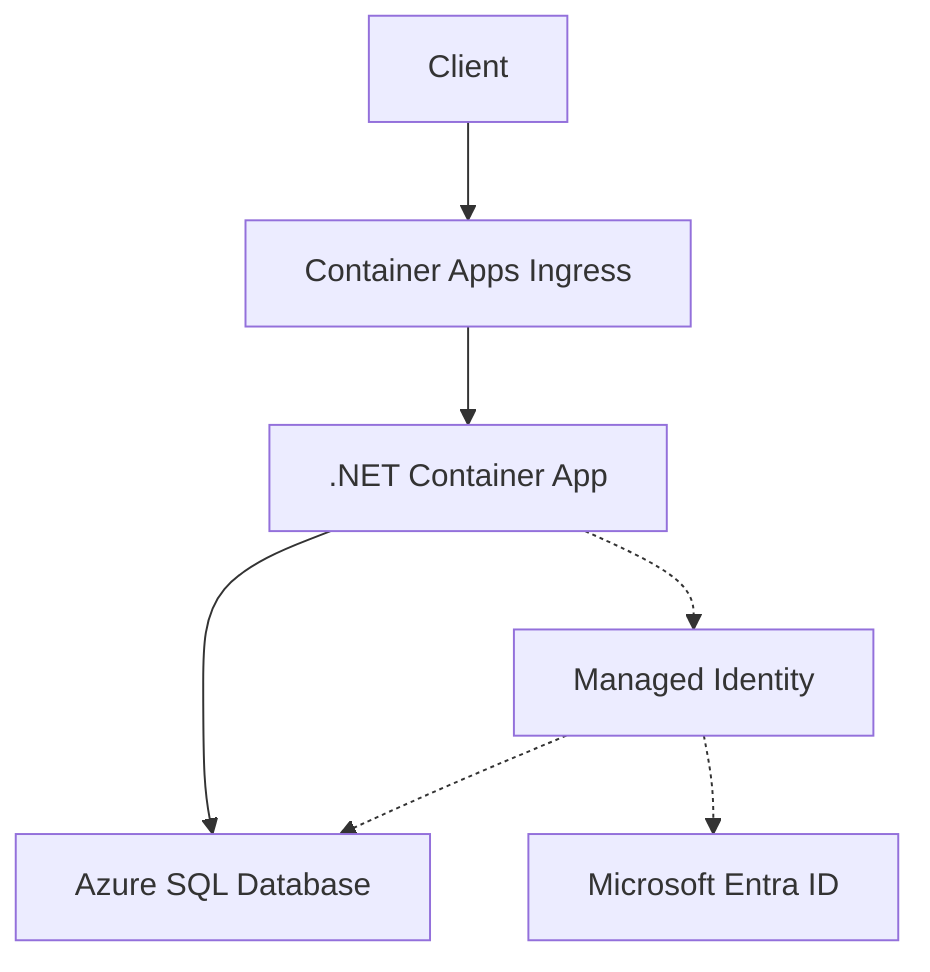

---
content_sources:
  diagrams:
  - id: architecture
    type: flowchart
    source: mslearn-adapted
    based_on:
    - https://learn.microsoft.com/azure/azure-sql/database/authentication-aad-overview
    - https://learn.microsoft.com/sql/connect/ado-net/sql/azure-active-directory-authentication
content_validation:
  status: verified
  last_reviewed: '2026-05-23'
  reviewer: agent
  core_claims:
  - claim: This page uses Microsoft Learn as the primary source basis for its Azure-specific
      guidance.
    source: https://learn.microsoft.com/azure/azure-sql/database/authentication-aad-overview
    verified: true
---
# Azure SQL Integration (Managed Identity)

Use this recipe to connect Azure Container Apps to Azure SQL Database with Microsoft Entra authentication first and SQL authentication only as a fallback.

## Architecture

<!-- diagram-id: architecture -->


Solid arrows show runtime data flow. Dashed arrows show identity and authentication.

## Prerequisites

- Existing Container App: `$APP_NAME` in `$RG`
- Existing Azure SQL logical server and database
- Azure SQL server configured with a Microsoft Entra admin
- Firewall rules, VNet integration, or Private Link already configured for your connectivity model

## Step 1: Enable managed identity on the Container App

```bash
az containerapp identity assign \
  --name "$APP_NAME" \
  --resource-group "$RG" \
  --system-assigned
```

| Command | Why it is used |
|---|---|
| `az containerapp identity assign ...` | Assigns or inspects managed identity configuration for the Container App. |

## Step 2: Grant SQL access to the app identity

From a Microsoft Entra-authenticated SQL session, create a contained user for the managed identity.

```sql
CREATE USER [<container-app-name>] FROM EXTERNAL PROVIDER;
ALTER ROLE db_datareader ADD MEMBER [<container-app-name>];
ALTER ROLE db_datawriter ADD MEMBER [<container-app-name>];
```

## Step 3: Configure non-secret settings

```bash
az containerapp update \
  --name "$APP_NAME" \
  --resource-group "$RG" \
  --set-env-vars SQL_SERVER="$SQL_SERVER.database.windows.net" SQL_DATABASE="$SQL_DATABASE"
```

| Command | Why it is used |
|---|---|
| `az containerapp update ...` | Updates the existing Container App configuration without recreating the app. |

## Step 4: .NET code (managed identity)

Add the SQL client dependency:

```bash
dotnet add package Microsoft.Data.SqlClient
```

Use `Authentication=Active Directory Default` for passwordless access:

```csharp
using Microsoft.Data.SqlClient;

var builder = new SqlConnectionStringBuilder
{
    DataSource = Environment.GetEnvironmentVariable("SQL_SERVER"),
    InitialCatalog = Environment.GetEnvironmentVariable("SQL_DATABASE"),
    Encrypt = true,
    TrustServerCertificate = false,
    Authentication = SqlAuthenticationMethod.ActiveDirectoryDefault,
};

if (!string.IsNullOrWhiteSpace(Environment.GetEnvironmentVariable("SQL_USER")) &&
    !string.IsNullOrWhiteSpace(Environment.GetEnvironmentVariable("SQL_PASSWORD")))
{
    builder.UserID = Environment.GetEnvironmentVariable("SQL_USER");
    builder.Password = Environment.GetEnvironmentVariable("SQL_PASSWORD");
    builder.Authentication = SqlAuthenticationMethod.SqlPassword;
}

await using var connection = new SqlConnection(builder.ConnectionString);
await connection.OpenAsync();

await using var command = new SqlCommand("SELECT TOP (1) name FROM sys.tables ORDER BY name", connection);
await using var reader = await command.ExecuteReaderAsync();

while (await reader.ReadAsync())
{
    Console.WriteLine(reader.GetString(0));
}
```

## Step 5: SQL authentication fallback

```bash
az containerapp secret set \
  --name "$APP_NAME" \
  --resource-group "$RG" \
  --secrets sql-password="<sql-password>"

az containerapp update \
  --name "$APP_NAME" \
  --resource-group "$RG" \
  --set-env-vars SQL_SERVER="$SQL_SERVER.database.windows.net" SQL_DATABASE="$SQL_DATABASE" SQL_USER="$SQL_USER" SQL_PASSWORD=secretref:sql-password
```

| Command | Why it is used |
|---|---|
| `az containerapp secret set ...` | Manages Container Apps secrets without exposing secret values in plain configuration. |

## Verification

1. Confirm identity assignment.
2. Confirm runtime connectivity by checking application logs.
3. Confirm Azure SQL firewall or private endpoint connectivity before blaming authentication.

## See Also

- [Managed Identity](managed-identity.md)
- [VNet Integration](../../../platform/networking/vnet-integration.md)
- [Private Endpoints](../../../platform/networking/private-endpoints.md)

## Sources

- [Azure SQL and Microsoft Entra authentication overview](https://learn.microsoft.com/azure/azure-sql/database/authentication-aad-overview)
- [Microsoft Entra authentication with SqlClient](https://learn.microsoft.com/sql/connect/ado-net/sql/azure-active-directory-authentication)
