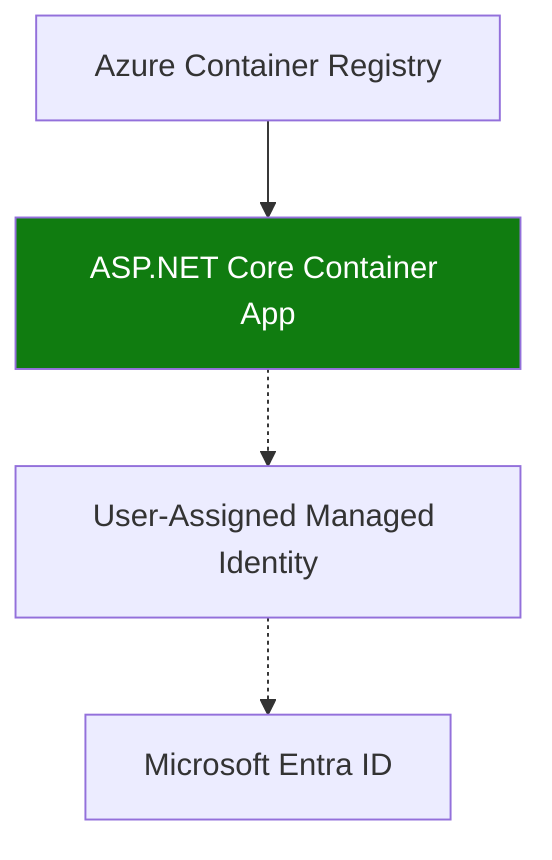

---
content_sources:
  diagrams:
  - id: deploy-asp-net-core-images-from-private
    type: flowchart
    source: mslearn-adapted
    based_on:
    - https://learn.microsoft.com/azure/container-apps/managed-identity-image-pull
    - https://learn.microsoft.com/azure/container-registry/container-registry-get-started-azure-cli
content_validation:
  status: verified
  last_reviewed: '2026-05-23'
  reviewer: agent
  core_claims:
  - claim: This page uses Microsoft Learn as the primary source basis for its Azure-specific
      guidance.
    source: https://learn.microsoft.com/azure/container-apps/managed-identity-image-pull
    verified: true
---
# Recipe: Container Registry in .NET Apps on Azure Container Apps

Deploy ASP.NET Core images from private ACR using a user-assigned managed identity for image pulls.

<!-- diagram-id: deploy-asp-net-core-images-from-private -->


## Prerequisites

- Container Apps environment (`$ENVIRONMENT_NAME`) and app name (`$APP_NAME`)
- Resource group (`$RG`), region (`$LOCATION`), registry (`$ACR_NAME`)
- Azure CLI with Container Apps extension and Docker

## Create registry and identity for image pull

```bash
az acr create \
  --name "$ACR_NAME" \
  --resource-group "$RG" \
  --location "$LOCATION" \
  --sku Standard

az identity create \
  --name "id-$APP_NAME" \
  --resource-group "$RG" \
  --location "$LOCATION"

export UAMI_ID=$(az identity show --name "id-$APP_NAME" --resource-group "$RG" --query id --output tsv)
export UAMI_PRINCIPAL_ID=$(az identity show --name "id-$APP_NAME" --resource-group "$RG" --query principalId --output tsv)
export ACR_ID=$(az acr show --name "$ACR_NAME" --resource-group "$RG" --query id --output tsv)

az role assignment create \
  --assignee-object-id "$UAMI_PRINCIPAL_ID" \
  --assignee-principal-type ServicePrincipal \
  --role "AcrPull" \
  --scope "$ACR_ID"
```

| Command | Why it is used |
|---|---|
| `az acr create ...` | Creates Azure Container Registry for container image storage. |

## Multi-stage Dockerfile for ASP.NET Core 8

```dockerfile
FROM mcr.microsoft.com/dotnet/sdk:8.0 AS build
WORKDIR /src
COPY . .
RUN dotnet restore
RUN dotnet publish --configuration Release --output /app/publish

FROM mcr.microsoft.com/dotnet/aspnet:8.0
WORKDIR /app
COPY --from=build /app/publish .
EXPOSE 8080
ENTRYPOINT ["dotnet", "MyApi.dll"]
```

```bash
az acr login --name "$ACR_NAME"
docker build --file Dockerfile --tag "$ACR_NAME.azurecr.io/dotnet-api:latest" .
docker push "$ACR_NAME.azurecr.io/dotnet-api:latest"
```

| Command | Why it is used |
|---|---|
| `az acr login --name ...` | Authenticates Docker or the CLI to Azure Container Registry. |

## Configure Container Apps to pull from ACR

```bash
az containerapp create \
  --name "$APP_NAME" \
  --resource-group "$RG" \
  --environment "$ENVIRONMENT_NAME" \
  --image "$ACR_NAME.azurecr.io/dotnet-api:latest" \
  --registry-server "$ACR_NAME.azurecr.io" \
  --registry-identity "$UAMI_ID" \
  --user-assigned "$UAMI_ID" \
  --ingress external \
  --target-port 8080
```

| Command | Why it is used |
|---|---|
| `az containerapp create ...` | Creates the Container App with the documented image, ingress, scale, and environment settings. |

## Advanced Topics

- Use immutable image tags per build and map revisions to release versions.
- Add container vulnerability scanning before push.
- Validate new revisions at 0% traffic before promotion.

## See Also

- [Managed Identity](managed-identity.md)
- [Operations: Image Pull and Registry](../../../operations/image-pull-and-registry/index.md)
- [Revision Management](../../../operations/revision-management/index.md)

## Sources

- [Managed identity image pull for Azure Container Apps](https://learn.microsoft.com/azure/container-apps/managed-identity-image-pull)
- [Create and manage Azure Container Registry](https://learn.microsoft.com/azure/container-registry/container-registry-get-started-azure-cli)
