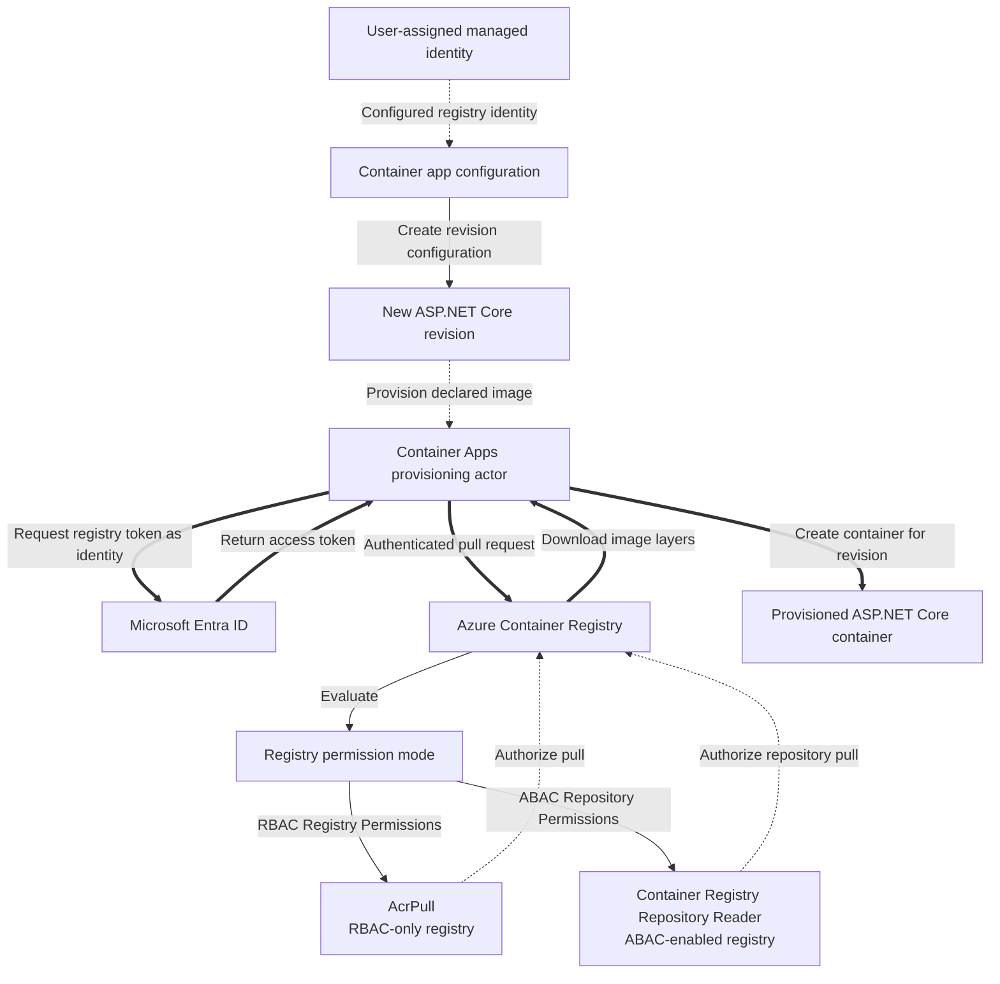

---
content_sources:
  diagrams:
    - id: deploy-asp-net-core-images-from-private
      type: flowchart
      source: mslearn-adapted
      based_on:
        - https://learn.microsoft.com/en-us/azure/container-apps/managed-identity-image-pull
        - https://learn.microsoft.com/en-us/azure/container-registry/container-registry-get-started-azure-cli
        - https://learn.microsoft.com/en-us/azure/container-registry/container-registry-rbac-abac-repository-permissions
---
# Recipe: Container Registry in .NET Apps on Azure Container Apps

Deploy ASP.NET Core images from private ACR using a user-assigned managed identity for image pulls.

<!-- diagram-id: deploy-asp-net-core-images-from-private -->

```mermaid
flowchart TD
    accTitle: Private ACR image pull with a user-assigned managed identity
    accDescr: During revision provisioning, Container Apps selects the configured user-assigned identity, obtains a registry token through Microsoft Entra ID, and asks ACR to authorize the pull with the role appropriate to the registry permission mode before downloading image layers.
    APP[Container app configuration]
    REVISION[New ASP.NET Core revision]
    PROVISIONER[Container Apps provisioning actor]
    IDENTITY[User-assigned managed identity]
    ENTRA[Microsoft Entra ID]
    ACR[Azure Container Registry]
    MODE[Registry permission mode]
    RBAC[AcrPull<br/>RBAC-only registry]
    ABAC[Container Registry Repository Reader<br/>ABAC-enabled registry]
    CONTAINER[Provisioned ASP.NET Core container]

    APP -->|"Create revision configuration"| REVISION
    REVISION -.->|"Provision declared image"| PROVISIONER
    IDENTITY -.->|"Configured registry identity"| APP
    PROVISIONER ==>|"Request registry token as identity"| ENTRA
    ENTRA ==>|"Return access token"| PROVISIONER
    PROVISIONER ==>|"Authenticated pull request"| ACR
    ACR -->|"Evaluate"| MODE
    MODE -->|"RBAC Registry Permissions"| RBAC
    MODE -->|"ABAC Repository Permissions"| ABAC
    RBAC -.->|"Authorize pull"| ACR
    ABAC -.->|"Authorize repository pull"| ACR
    ACR ==>|"Download image layers"| PROVISIONER
    PROVISIONER ==>|"Create container for revision"| CONTAINER
```

*Figure: Identity selection, token acquisition, registry authorization, and image transport are distinct. `AcrPull` applies only to RBAC-only registries; ABAC-enabled registries require `Container Registry Repository Reader`, optionally with a repository condition.*

## Prerequisites

- Container Apps environment (`$ACA_ENV_NAME`) and app name (`$APP_NAME`)
- Resource group (`$RG`), region (`$LOCATION`), registry (`$ACR_NAME`)
- Azure CLI with Container Apps extension and Docker

## Create registry and identity for image pull

```bash
az acr create \
  --name "$ACR_NAME" \
  --resource-group "$RG" \
  --location "$LOCATION" \
  --sku Standard

az identity create \
  --name "id-$APP_NAME" \
  --resource-group "$RG" \
  --location "$LOCATION"

export UAMI_ID=$(az identity show --name "id-$APP_NAME" --resource-group "$RG" --query id --output tsv)
export UAMI_PRINCIPAL_ID=$(az identity show --name "id-$APP_NAME" --resource-group "$RG" --query principalId --output tsv)
export ACR_ID=$(az acr show --name "$ACR_NAME" --resource-group "$RG" --query id --output tsv)
export ACR_ROLE_ASSIGNMENT_MODE=$(az acr show --name "$ACR_NAME" --resource-group "$RG" --query roleAssignmentMode --output tsv)

if [[ "$ACR_ROLE_ASSIGNMENT_MODE" == "AbacRepositoryPermissions" ]]; then
  az role assignment create \
    --assignee-object-id "$UAMI_PRINCIPAL_ID" \
    --assignee-principal-type ServicePrincipal \
    --role "Container Registry Repository Reader" \
    --scope "$ACR_ID"
else
  az role assignment create \
    --assignee-object-id "$UAMI_PRINCIPAL_ID" \
    --assignee-principal-type ServicePrincipal \
    --role "AcrPull" \
    --scope "$ACR_ID"
fi
```

| Command / Parameter | Purpose |
|---|---|
| `az acr create` | For private ACR image deployment, creates the Azure Container Registry that stores the application's private image. |
| `--location` | For private ACR image deployment, creates the resource in Azure region `$LOCATION`. |
| `--name` | Names the registry `$ACR_NAME` and pull identity `id-$APP_NAME`, then selects each for its later lookup. |
| `--resource-group` | For private ACR image deployment, limits the operations in this block to resource group `$RG`. |
| `--sku` | For private ACR image deployment, uses registry service tier `Standard`. |
| `az identity create` | For private ACR image deployment, creates the user-assigned identity used to pull the private registry image. |
| `az identity show` | For private ACR image deployment, reads the user-assigned identity resource ID or principal ID needed by the next command. |
| `--output` | Returns identity IDs, the registry ID, and its permission mode as unquoted `tsv`. |
| `--query` | For private ACR image deployment, extracts `id`, `principalId`, `roleAssignmentMode` from the command response for the next operation. |
| `az acr show` | For private ACR image deployment, reads the registry login server or resource ID needed by the deployment and role assignment. |
| `az role assignment create` | Grants the pull identity the role supported by the registry's RBAC or ABAC permission mode. |
| `--assignee-object-id` | For private ACR image deployment, assigns the role to managed-identity principal `$UAMI_PRINCIPAL_ID` without a Graph lookup. |
| `--assignee-principal-type` | For private ACR image deployment, declares the assignee as `ServicePrincipal` for the managed-identity role assignment. |
| `--role` | For private ACR image deployment, grants role `Container Registry Repository Reader`, `AcrPull` to the selected identity. |
| `--scope` | For private ACR image deployment, restricts the role assignment to `$ACR_ID`. |

The branch grants `AcrPull` to an ACR using **RBAC Registry Permissions** and `Container Registry Repository Reader` to an ABAC-enabled registry. Add an ABAC repository condition when you need repository-level scope. ABAC-enabled registries do not honor `AcrPull`.

## Multi-stage Dockerfile for ASP.NET Core 8

```dockerfile
FROM mcr.microsoft.com/dotnet/sdk:8.0 AS build
WORKDIR /src
COPY . .
RUN dotnet restore
RUN dotnet publish --configuration Release --output /app/publish

FROM mcr.microsoft.com/dotnet/aspnet:8.0
WORKDIR /app
COPY --from=build /app/publish .
EXPOSE 8080
ENTRYPOINT ["dotnet", "MyApi.dll"]
```

```bash
az acr login --name "$ACR_NAME"
docker build --file Dockerfile --tag "$ACR_NAME.azurecr.io/dotnet-api:latest" .
docker push "$ACR_NAME.azurecr.io/dotnet-api:latest"
```

| Command / Parameter | Purpose |
|---|---|
| `az acr login` | For private ACR image deployment, authenticates Docker to the registry before pushing the application image. |
| `--name` | Authenticates Docker to registry `$ACR_NAME`. |

## Configure Container Apps to pull from ACR

```bash
az containerapp create \
  --name "$APP_NAME" \
  --resource-group "$RG" \
  --environment "$ACA_ENV_NAME" \
  --image "$ACR_NAME.azurecr.io/dotnet-api:latest" \
  --registry-server "$ACR_NAME.azurecr.io" \
  --registry-identity "$UAMI_ID" \
  --user-assigned "$UAMI_ID" \
  --ingress external \
  --target-port 8080
```

| Command / Parameter | Purpose |
|---|---|
| `az containerapp create` | For private ACR image deployment, creates the Container App from the private registry image and configures its registry identity. |
| `--environment` | Creates the private-image app in Container Apps environment `$ACA_ENV_NAME`. |
| `--image` | For private ACR image deployment, deploys container image `$ACR_NAME.azurecr.io/dotnet-api:latest`. |
| `--ingress` | For private ACR image deployment, exposes the Container App with `external` ingress. |
| `--name` | Names the new Container App `$APP_NAME`. |
| `--registry-identity` | For private ACR image deployment, authenticates the image pull with managed identity `$UAMI_ID`. |
| `--registry-server` | For private ACR image deployment, pulls the image from registry login server `$ACR_NAME.azurecr.io`. |
| `--resource-group` | For private ACR image deployment, limits the operations in this block to resource group `$RG`. |
| `--target-port` | For private ACR image deployment, routes ingress traffic to container port `8080`. |
| `--user-assigned` | For private ACR image deployment, attaches user-assigned identity `$UAMI_ID` to the Container App. |

## Advanced Topics

- Use immutable image tags per build and map revisions to release versions.
- Add container vulnerability scanning before push.
- Validate new revisions at 0% traffic before promotion.

## See Also

- [Managed Identity](managed-identity.md)
- [Operations: Image Pull and Registry](../../../operations/image-pull-and-registry/index.md)
- [Revision Management](../../../operations/revision-management/index.md)

## Sources

- [Managed identity image pull for Azure Container Apps](https://learn.microsoft.com/en-us/azure/container-apps/managed-identity-image-pull)
- [Create and manage Azure Container Registry](https://learn.microsoft.com/en-us/azure/container-registry/container-registry-get-started-azure-cli)
- [Azure Container Registry RBAC and ABAC repository permissions](https://learn.microsoft.com/en-us/azure/container-registry/container-registry-rbac-abac-repository-permissions)
