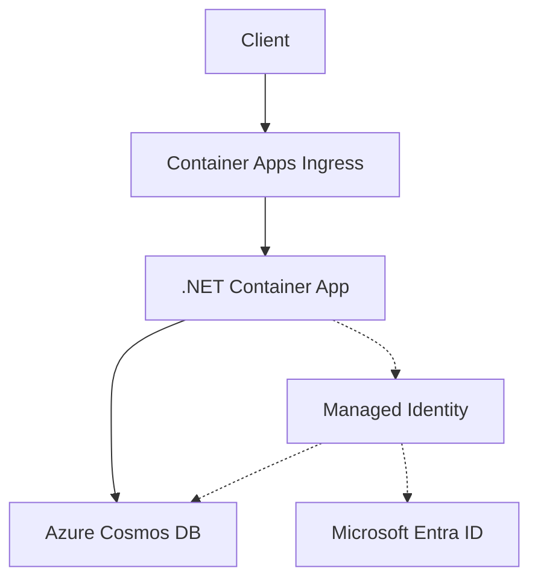

---
content_sources:
  diagrams:
    - id: architecture
      type: flowchart
      source: mslearn-adapted
      based_on:
        - https://learn.microsoft.com/azure/cosmos-db/nosql/how-to-connect-role-based-access-control
        - https://learn.microsoft.com/azure/cosmos-db/nosql/quickstart-dotnet
---

# Cosmos DB Integration (Managed Identity)

Use this recipe to connect a .NET Container App to Azure Cosmos DB for NoSQL with managed identity first and a connection string fallback only when you cannot use RBAC yet.

## Architecture

<!-- diagram-id: architecture -->


Solid arrows show runtime data flow. Dashed arrows show identity and authentication.

## Prerequisites

- Existing Container App: `$APP_NAME` in resource group `$RG`
- Existing Azure Cosmos DB account, SQL database, and container
- Azure CLI with Container Apps and Cosmos extensions

```bash
az extension add --name containerapp --upgrade
az extension add --name cosmosdb-preview --upgrade
```

## Step 1: Enable managed identity on the Container App

```bash
az containerapp identity assign \
  --name "$APP_NAME" \
  --resource-group "$RG" \
  --system-assigned

export PRINCIPAL_ID=$(az containerapp show \
  --name "$APP_NAME" \
  --resource-group "$RG" \
  --query "identity.principalId" \
  --output tsv)
```

## Step 2: Grant Cosmos DB data-plane access

```bash
export COSMOS_ACCOUNT_ID=$(az cosmosdb show \
  --name "$COSMOS_ACCOUNT" \
  --resource-group "$RG" \
  --query "id" \
  --output tsv)

az role assignment create \
  --assignee-object-id "$PRINCIPAL_ID" \
  --assignee-principal-type ServicePrincipal \
  --role "Cosmos DB Built-in Data Contributor" \
  --scope "$COSMOS_ACCOUNT_ID"
```

## Step 3: Configure non-secret settings in Container Apps

Azure Container Apps does **not** inject Cosmos DB connection settings automatically. Store non-secret values as environment variables, and store fallback secrets in `secrets[]` with `secretref:`.

```bash
az containerapp update \
  --name "$APP_NAME" \
  --resource-group "$RG" \
  --set-env-vars COSMOS_ENDPOINT="https://$COSMOS_ACCOUNT.documents.azure.com:443/" COSMOS_DATABASE="$COSMOS_DATABASE" COSMOS_CONTAINER="$COSMOS_CONTAINER"
```

## Step 4: .NET code (managed identity)

Add dependencies:

```bash
dotnet add package Microsoft.Azure.Cosmos
dotnet add package Azure.Identity
```

Use `DefaultAzureCredential` when `COSMOS_CONNECTION_STRING` is not present:

```csharp
using Azure.Core;
using Azure.Identity;
using Microsoft.Azure.Cosmos;

record OrderDocument(string id, string partitionKey, string type, string status);

static CosmosClient CreateClient()
{
    var connectionString = Environment.GetEnvironmentVariable("COSMOS_CONNECTION_STRING");
    if (!string.IsNullOrWhiteSpace(connectionString))
    {
        return new CosmosClient(connectionString);
    }

    var endpoint = Environment.GetEnvironmentVariable("COSMOS_ENDPOINT")!;
    TokenCredential credential = new DefaultAzureCredential();
    return new CosmosClient(endpoint, credential);
}

using var client = CreateClient();
var container = client.GetContainer(
    Environment.GetEnvironmentVariable("COSMOS_DATABASE"),
    Environment.GetEnvironmentVariable("COSMOS_CONTAINER"));

var item = new OrderDocument("order-1001", "order-1001", "order", "created");
await container.UpsertItemAsync(item, new PartitionKey(item.partitionKey));
var response = await container.ReadItemAsync<OrderDocument>(item.id, new PartitionKey(item.partitionKey));

Console.WriteLine(response.Resource);
```

## Step 5: Connection string fallback

```bash
az containerapp secret set \
  --name "$APP_NAME" \
  --resource-group "$RG" \
  --secrets cosmos-connection-string="AccountEndpoint=https://$COSMOS_ACCOUNT.documents.azure.com:443/;AccountKey=<cosmos-account-key>;"

az containerapp update \
  --name "$APP_NAME" \
  --resource-group "$RG" \
  --set-env-vars COSMOS_CONNECTION_STRING=secretref:cosmos-connection-string COSMOS_DATABASE="$COSMOS_DATABASE" COSMOS_CONTAINER="$COSMOS_CONTAINER"
```

## Verification

1. Confirm identity assignment.
2. Confirm the Cosmos DB role assignment exists.
3. Check app logs for successful upsert and read operations.

## See Also

- [Managed Identity](managed-identity.md)
- [Key Vault Reference](key-vault-reference.md)
- [Private Endpoints](../../../platform/networking/private-endpoints.md)

## Sources

- [Azure Cosmos DB for NoSQL RBAC](https://learn.microsoft.com/azure/cosmos-db/nosql/how-to-connect-role-based-access-control)
- [Azure Cosmos DB for NoSQL .NET quickstart](https://learn.microsoft.com/azure/cosmos-db/nosql/quickstart-dotnet)
